# AcadAI Complete AI System Design Interview Handbook

Source basis: full repository inspection on 2026-07-09. This handbook is grounded in implemented files, especially `acadai_app_final_mistral_faiss.py`, `requirements.txt`, `.gitignore`, `.env.local`, `AcadAI_FAISS_STORE/index.faiss`, `AcadAI_FAISS_STORE/index.pkl`, screenshots, documentation files, and git history.

Important truth table:

| Topic | Implemented in code? | Evidence |
|---|---:|---|
| Streamlit | Yes | `import streamlit as st`; tabs, sidebar, widgets, CSS |
| Mistral API | Yes | `call_llm()` posts to `https://api.mistral.ai/v1/chat/completions` |
| FAISS | Yes, optional at runtime | `faiss.read_index(index.faiss)` |
| Persisted FAISS store | Yes | `AcadAI_FAISS_STORE/index.faiss` and `index.pkl` |
| SentenceTransformer embeddings | Yes, optional | `SentenceTransformer(model_name)` |
| CrossEncoder reranking | Yes, optional | `CrossEncoder(model_name)` |
| TF-IDF fallback retrieval | Yes | `TfidfVectorizer` and cosine similarity |
| RAG | Yes | retrieved evidence is passed into Tutor Agent prompts |
| Multi-agent architecture | Yes, function-based | router, reasoning, tutor, critic, viva, roadmap, flashcard, revision functions |
| LangChain runtime chains | No | no `langchain` import or dependency; only LangChain-style pickle support |
| LangGraph | No | no import or dependency |
| ChromaDB | No | no import, dependency, or storage code |
| MongoDB | No | no import, dependency, URI, or collection code |
| Authentication | No | no login/session identity implementation |
| Long-term database memory | No | Streamlit session state only |
| DOCX/TXT upload | No | uploader accepts `type=["pdf"]` only |

Repository facts:

- Main app: `acadai_app_final_mistral_faiss.py`, about 2,484 lines.
- Tracked app dependency file: `requirements.txt`.
- Persisted vector files: `AcadAI_FAISS_STORE/index.faiss` and `index.pkl`.
- Inspected pickle metadata: 12,263 documents and 12,263 index IDs.
- `index.pkl` was created with LangChain community/core classes; the current requirements do not include `langchain` or `langchain_community`.
- `.env.local` contains a `MISTRAL_API_KEY` value and should be rotated and removed from source control.
- Git history shows initial README/workflow, v1 app launch, deployment preparation, UI fixes, and later interview-guide docs.

---

## SECTION 1: Project Overview

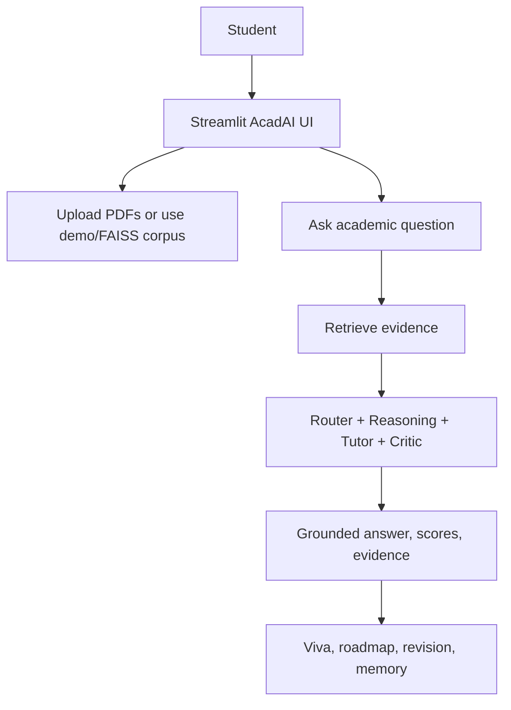
```mermaid
flowchart TD
    Student[Student] --> UI[Streamlit AcadAI UI]
    UI --> Upload[Upload PDFs or use demo/FAISS corpus]
    UI --> Ask[Ask academic question]
    Ask --> Retrieve[Retrieve evidence]
    Retrieve --> Agents[Router + Reasoning + Tutor + Critic]
    Agents --> Answer[Grounded answer, scores, evidence]
    Answer --> Learn[Viva, roadmap, revision, memory]
```

Line by line: the student uses a Streamlit browser UI; the app chooses uploaded PDFs, a persisted FAISS corpus, or demo chunks; questions go through retrieval and function-based agents; the answer is displayed with evidence, quality scores, and learning tools.

What problem it solves: students need course-aware answers, viva practice, revision material, and evidence visibility instead of generic chatbot responses.

Why it was built: the code is built as an academic AI learning workspace that combines retrieval, answer generation, critique, memory, and study tools in one Streamlit app.

Users: B.Tech/CSE/AIML students are the primary intended users based on labels, default profile, demo corpus, and prompts.

Core workflow: configure sources in sidebar, ask question, retrieve context, generate answer, inspect evidence and scores, continue with viva/roadmap/revision.

Alternatives: a pure chatbot, a traditional LMS, or a notebook-only retrieval demo. AcadAI chooses Streamlit to make the workflow interactive.

Advantages: fast local prototype, visible evidence, configurable retrieval, multi-tab learning workflow.

Disadvantages: single-file architecture, session-only state, no auth, no persistent uploaded-document database.

Likely interview follow-up: "What is the product in one sentence?" Ideal answer: "AcadAI is a Streamlit-based AI learning platform that retrieves academic evidence and uses Mistral-backed agents to generate, critique, and personalize study support."

Common mistake: claiming enterprise LMS, MongoDB, ChromaDB, or LangGraph support. Those are not implemented.

Interview Summary: AcadAI is an evidence-grounded academic tutoring workspace built in Streamlit with optional FAISS retrieval and function-based AI agents.

---

## SECTION 2: Business Requirements

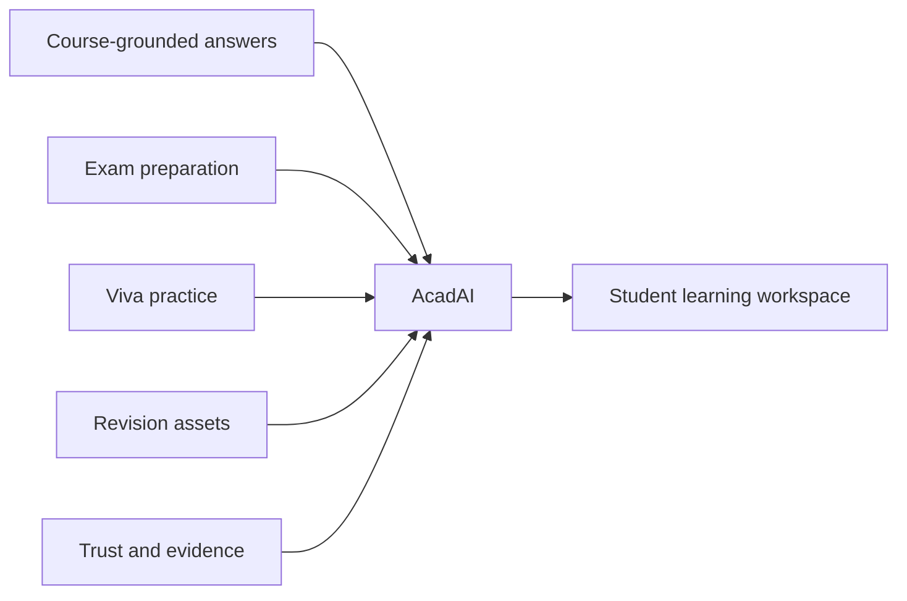
```mermaid
flowchart LR
    Need1[Course-grounded answers] --> Product[AcadAI]
    Need2[Exam preparation] --> Product
    Need3[Viva practice] --> Product
    Need4[Revision assets] --> Product
    Need5[Trust and evidence] --> Product
    Product --> Outcome[Student learning workspace]
```

Requirements from implementation: answer questions from notes, expose evidence, evaluate answer quality, support quiz/viva, create roadmaps, create revision material, remember recent learning context, and evaluate retrieval quality.

Why designed this way: the app treats learning as a workflow, not just Q&A.

Alternative: build only a RAG chatbot. That is simpler but misses assessment, revision, and personalization.

Advantages: broader student value; better interview story around AI product design.

Disadvantages: larger UI surface and more state to maintain.

Interviewer may ask: "Who pays or benefits?" Ideal answer: "Students benefit directly; institutions or edtech platforms could use this pattern for course-specific tutoring, but the implemented code is a prototype, not a monetized platform."

Common mistake: inventing business metrics. The repository does not implement revenue, subscriptions, or analytics beyond session metrics.

Interview Summary: The business goal is a trusted academic copilot that combines Q&A, evidence, evaluation, and study material generation.

---

## SECTION 3: Functional Requirements

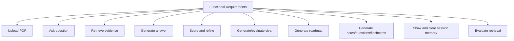
```mermaid
flowchart TD
    FR[Functional Requirements] --> Upload[Upload PDF]
    FR --> Ask[Ask question]
    FR --> Retrieve[Retrieve evidence]
    FR --> Generate[Generate answer]
    FR --> Critique[Score and refine]
    FR --> Viva[Generate/evaluate viva]
    FR --> Roadmap[Generate roadmap]
    FR --> Revision[Generate notes/questions/flashcards]
    FR --> Memory[Show and clear session memory]
    FR --> Eval[Evaluate retrieval]
```

Implemented functions map directly to requirements:

- `read_pdf_uploads`: PDF ingestion.
- `retrieve` and `retrieve_faiss`: retrieval.
- `call_llm`: Mistral LLM access.
- `router_agent`, `reasoning_agent`, `tutor_agent`, `critic_agent`: multi-agent answer flow.
- `generate_quiz`, `evaluate_quiz_answer`: viva mode.
- `generate_learning_roadmap`: roadmap.
- `generate_revision_notes`, `generate_exam_questions`, `generate_flashcards`: revision suite.
- `calculate_grounding_report`: grounding score.

Alternatives: split features into separate services or pages. Current code keeps them in one Streamlit script.

Advantages: direct control and easier demo.

Disadvantages: harder testing and modular ownership.

Interviewer may ask: "What is not supported?" Ideal answer: "DOCX/TXT upload, auth, MongoDB, ChromaDB, LangGraph, and persistent user profiles are not implemented."

Common mistake: saying every document type is supported because the handbook prompt listed them.

Interview Summary: AcadAI implements PDF-backed Q&A, retrieval, agent critique, viva, roadmaps, revision tools, evaluation, and session memory.

---

## SECTION 4: Non Functional Requirements

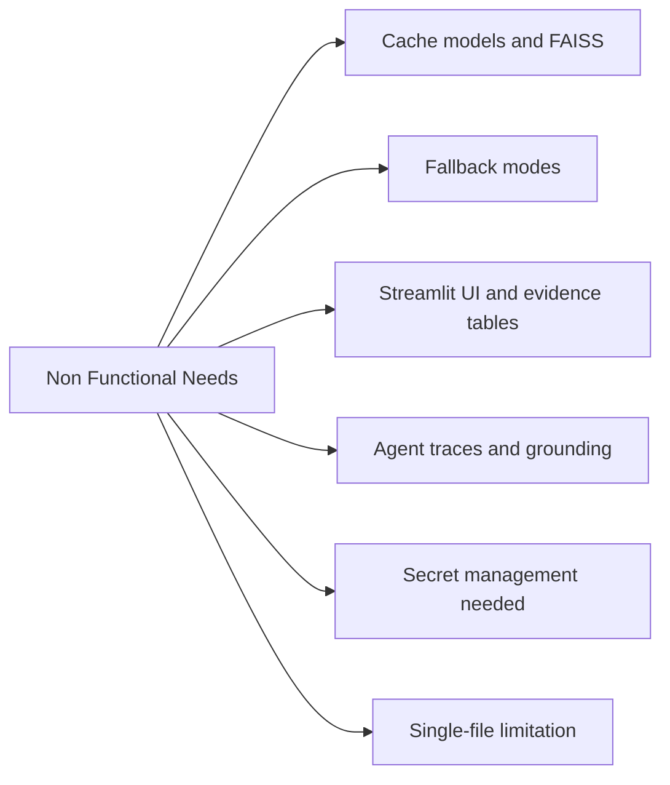
```mermaid
flowchart LR
    NFR[Non Functional Needs] --> Performance[Cache models and FAISS]
    NFR --> Reliability[Fallback modes]
    NFR --> Usability[Streamlit UI and evidence tables]
    NFR --> Explainability[Agent traces and grounding]
    NFR --> Security[Secret management needed]
    NFR --> Maintainability[Single-file limitation]
```

Implemented NFR support:

- Performance: `@st.cache_resource` caches embedding model, CrossEncoder, and FAISS loading.
- Reliability: missing dependency and API failures return fallback messages rather than crashing.
- Explainability: traces, metrics, grounding, and evidence debug views.
- Usability: tabs, sidebar controls, custom CSS, cards, charts.

Not fully implemented:

- Authentication and authorization.
- Secure secret management in repo state.
- Structured logging.
- Persistent database-backed user data.
- Automated tests.

Alternatives: FastAPI backend, React frontend, Redis cache, managed vector DB, observability stack.

Interview Summary: The app has demo-friendly reliability and explainability, but production NFRs need hardening.

---

## SECTION 5: Complete High-Level Architecture

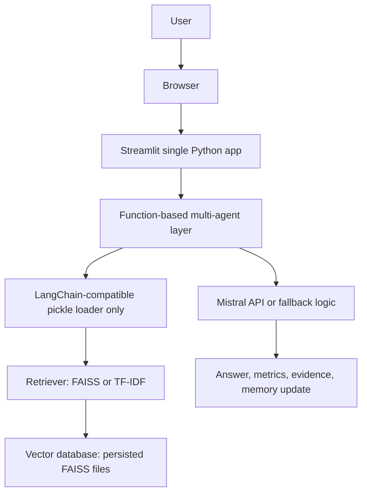
```mermaid
flowchart TD
    User[User] --> Browser[Browser]
    Browser --> Streamlit[Streamlit single Python app]
    Streamlit --> MultiAgent[Function-based multi-agent layer]
    MultiAgent --> LCCompat[LangChain-compatible pickle loader only]
    LCCompat --> Retriever[Retriever: FAISS or TF-IDF]
    Retriever --> VectorDB[Vector database: persisted FAISS files]
    MultiAgent --> LLM[Mistral API or fallback logic]
    LLM --> Response[Answer, metrics, evidence, memory update]
```

Component explanation:

- User/Browser: Streamlit runs the interactive app.
- Streamlit: owns layout, widgets, session state, and event flow.
- Multi-agent layer: Python functions coordinate routing, planning, tutoring, critique, and generation tools.
- LangChain: not a runtime layer. The code only understands LangChain-style FAISS `index.pkl`.
- Retriever: either FAISS dense/hybrid retrieval or TF-IDF fallback.
- Vector database: local FAISS index plus pickle metadata.
- LLM: Mistral chat completions API.
- Response: formatted Streamlit markdown, tables, cards, traces, and session updates.

Why designed this way: direct Python orchestration is simpler for a Streamlit prototype.

Alternative: LangGraph or LangChain agents could represent each step as nodes/tools.

Advantages: transparent flow and easy debugging.

Disadvantages: agents are not reusable services and orchestration is embedded in UI script.

Interview Summary: The high-level architecture is browser -> Streamlit -> retrieval/agents -> Mistral -> UI response, with FAISS as optional local vector storage.

---

## SECTION 6: Complete Low-Level Architecture

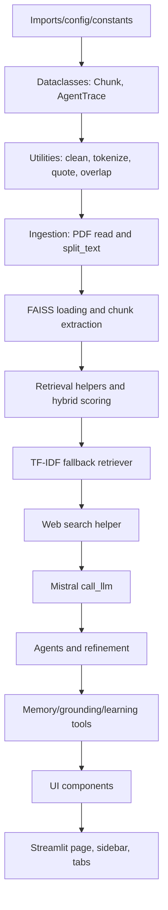
```mermaid
flowchart TD
    A[Imports/config/constants] --> B[Dataclasses: Chunk, AgentTrace]
    B --> C[Utilities: clean, tokenize, quote, overlap]
    C --> D[Ingestion: PDF read and split_text]
    D --> E[FAISS loading and chunk extraction]
    E --> F[Retrieval helpers and hybrid scoring]
    F --> G[TF-IDF fallback retriever]
    G --> H[Web search helper]
    H --> I[Mistral call_llm]
    I --> J[Agents and refinement]
    J --> K[Memory/grounding/learning tools]
    K --> L[UI components]
    L --> M[Streamlit page, sidebar, tabs]
```

Every module in the single file:

- Configuration: default top-k, FAISS dir, embedding model, thresholds, subject dictionaries.
- Data model: `Chunk`, `AgentTrace`.
- Utility: text cleaning, tokenization, quoting, keyword overlap.
- Ingestion: `read_pdf_uploads`, `split_text`.
- FAISS: `load_faiss_store`, `_extract_chunks_from_pickle`.
- Retrieval: dense retrieval, TF-IDF, hybrid ranking, filtering, fallback, neighbor expansion.
- LLM: Mistral API wrapper.
- Agents: router, reasoning, tutor, critic, refinement.
- Learning: quiz, evaluation, profile, weak topics, roadmap, flashcards, revision.
- UI: reusable HTML/CSS renderers and Streamlit tab handlers.

Interview Summary: Low-level design is a vertical single-file stack; the logical modules are clear even though file boundaries are not separated.

---

## SECTION 7: Folder Structure

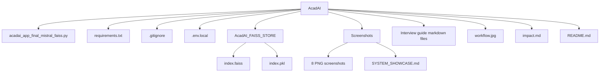
```mermaid
flowchart TD
    Root[AcadAI] --> App[acadai_app_final_mistral_faiss.py]
    Root --> Req[requirements.txt]
    Root --> Gitignore[.gitignore]
    Root --> Env[.env.local]
    Root --> Store[AcadAI_FAISS_STORE]
    Store --> Faiss[index.faiss]
    Store --> Pkl[index.pkl]
    Root --> Screens[Screenshots]
    Screens --> Pngs[8 PNG screenshots]
    Screens --> Showcase[SYSTEM_SHOWCASE.md]
    Root --> Docs[Interview guide markdown files]
    Root --> Workflow[workflow.jpg]
    Root --> Impact[impact.md]
    Root --> Readme[README.md]
```

Complete tree, excluding `.git`, `.venv`, and `__pycache__` generated/runtime folders:

```text
AcadAI/
  .env.local
  .gitignore
  README.md
  requirements.txt
  acadai_app_final_mistral_faiss.py
  workflow.jpg
  impact.md
  ACADAI_INTERVIEW_GUIDE_SECTION_1.md
  ACADAI_INTERVIEW_GUIDE_SECTION_2_ARCHITECTURE.md
  ACADAI_INTERVIEW_GUIDE_SECTION_3_RAG.md
  ACADAI_INTERVIEW_GUIDE_SECTION_4_EMBEDDINGS.md
  ACADAI_INTERVIEW_GUIDE_SECTION_5_FAISS.md
  ACADAI_INTERVIEW_GUIDE_SECTION_6_HYBRID_RETRIEVAL.md
  ACADAI_INTERVIEW_GUIDE_SECTION_7_MULTI_AGENT_DESIGN.md
  ACADAI_INTERVIEW_GUIDE_SECTION_8_MEMORY_SYSTEM.md
  ACADAI_INTERVIEW_GUIDE_SECTION_9_TUTOR_AGENT.md
  ACADAI_INTERVIEW_GUIDE_SECTION_10_CRITIC_AGENT.md
  ACADAI_INTERVIEW_GUIDE_SECTION_11_GROUNDING_HALLUCINATION.md
  ACADAI_INTERVIEW_GUIDE_SECTION_12_EVALUATION.md
  ACADAI_INTERVIEW_GUIDE_SECTION_13_STREAMLIT.md
  ACADAI_INTERVIEW_GUIDE_SECTION_14_DEPLOYMENT.md
  ACADAI_INTERVIEW_GUIDE_SECTION_15_DATABASE_STORAGE.md
  ACADAI_INTERVIEW_GUIDE_SECTION_16_ADVANCED_CROSS_QUESTIONS.md
  AcadAI_FAISS_STORE/
    index.faiss
    index.pkl
  Screenshots/
    SYSTEM_SHOWCASE.md
    Screenshot 2026-06-08 205805.png
    Screenshot 2026-06-08 205919.png
    Screenshot 2026-06-08 205934.png
    Screenshot 2026-06-08 212240.png
    Screenshot 2026-06-08 212405.png
    Screenshot 2026-06-08 212558.png
    Screenshot 2026-06-08 212636.png
    Screenshot 2026-06-08 212644.png
```

Why each exists:

- Python app: entire implemented product.
- FAISS store: persisted vector index and text metadata.
- Screenshots/workflow/docs: demonstration and interview documentation, not runtime dependencies.
- Requirements: package install list.
- `.env.local`: local secret file; risky because it contains an API key.

Interview Summary: The repository is runtime-small but documentation-heavy; the actual app is a single Streamlit script plus local FAISS assets.

---

## SECTION 8: Streamlit Frontend Architecture

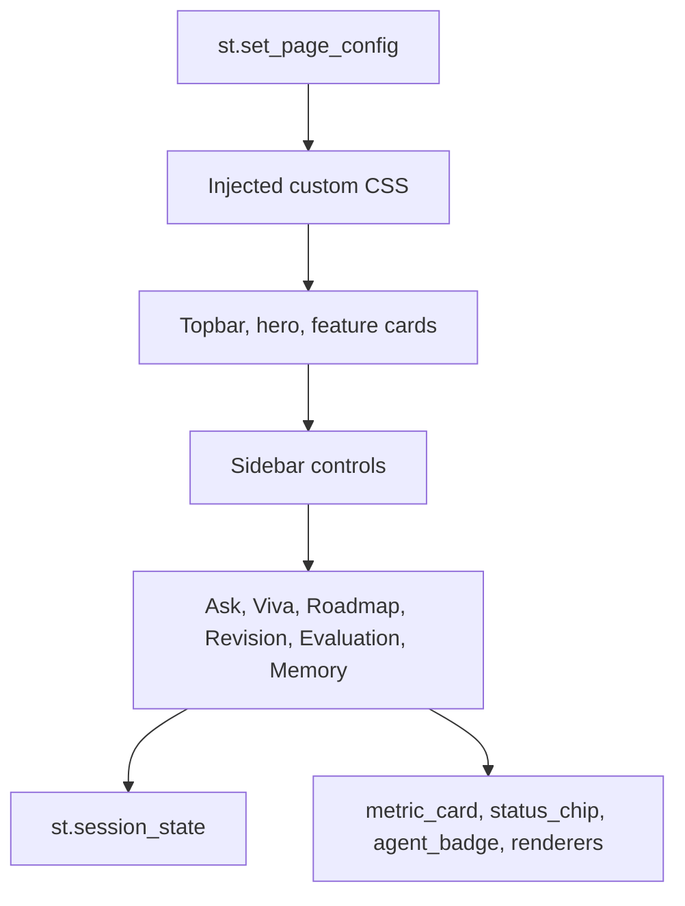
```mermaid
flowchart TD
    PageConfig[st.set_page_config] --> CSS[Injected custom CSS]
    CSS --> Hero[Topbar, hero, feature cards]
    Hero --> Sidebar[Sidebar controls]
    Sidebar --> Tabs[Ask, Viva, Roadmap, Revision, Evaluation, Memory]
    Tabs --> State[st.session_state]
    Tabs --> Components[metric_card, status_chip, agent_badge, renderers]
```

Pages: implemented as `st.tabs`, not separate files. Tabs are Ask, Viva Studio, Roadmap, Revision Suite, Evaluation, Memory.

Components: helper functions render cards, chips, headers, agent traces, flashcards, roadmaps, revision panels, and questions.

Session state: stores chat history, quiz questions, quiz rows, student profile, weak topics, quiz attempts, saved flashcards, saved roadmaps, and history metrics.

Callbacks/forms: no formal `on_change` callbacks or `st.form`; buttons trigger logic during Streamlit reruns.

Navigation: tab navigation with a global sidebar.

Advantages: quick, cohesive, low frontend overhead.

Disadvantages: Streamlit reruns the script; heavy tab content can rerun unless gated.

Interview Summary: The frontend is a Streamlit tabbed application with custom CSS and reusable markdown/HTML components.

---

## SECTION 9: Document Upload Flow

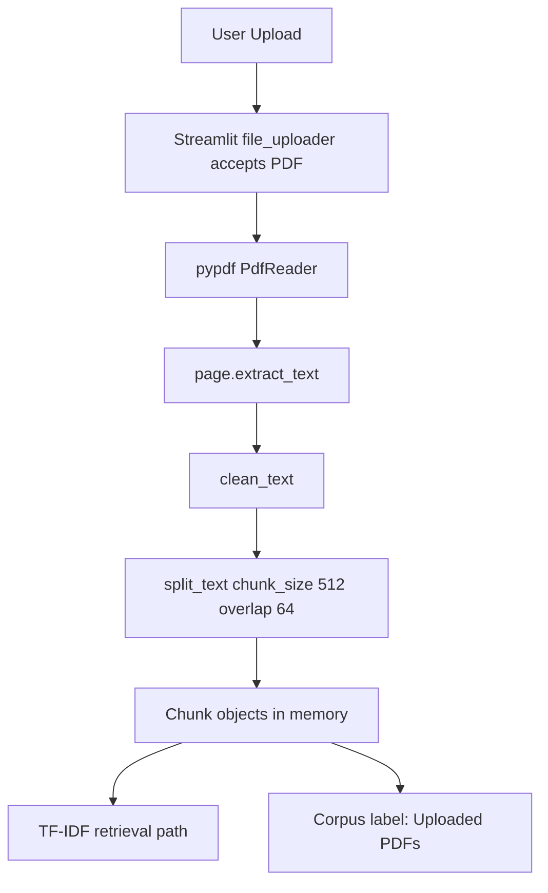
```mermaid
flowchart TD
    U[User Upload] --> V[Streamlit file_uploader accepts PDF]
    V --> P[pypdf PdfReader]
    P --> T[page.extract_text]
    T --> C[clean_text]
    C --> S[split_text chunk_size 512 overlap 64]
    S --> Chunks[Chunk objects in memory]
    Chunks --> Retrieval[TF-IDF retrieval path]
    Chunks --> Success[Corpus label: Uploaded PDFs]
```

Line by line:

- `st.file_uploader("Upload academic PDFs", type=["pdf"], accept_multiple_files=True)` accepts PDFs only.
- `read_pdf_uploads()` imports `PdfReader`.
- Each upload is written to a temporary `.pdf`.
- `PdfReader(path)` reads pages.
- `page.extract_text()` extracts raw text.
- `split_text()` cleans text and creates overlapping chunks.
- Uploaded chunks are used if FAISS is not selected and upload succeeded.

Important: uploaded PDFs are not embedded into FAISS in the implemented app. They go through TF-IDF retrieval unless a separate FAISS store is enabled.

Alternative: embed uploads dynamically and append to FAISS/ChromaDB. Not implemented.

Interview Summary: Upload flow parses PDFs into in-memory text chunks; it does not persist files or build a new vector index.

---

## SECTION 10: Document Parsing Pipeline

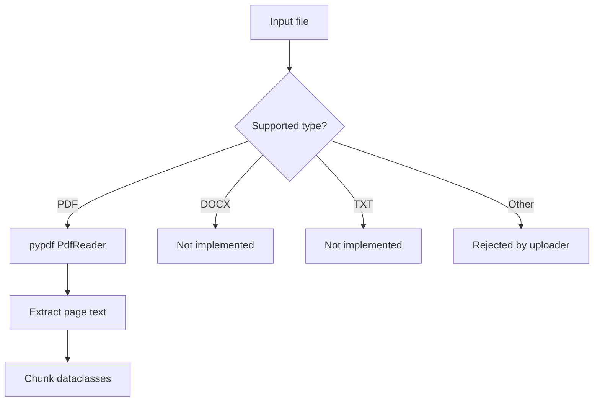
```mermaid
flowchart TD
    Input[Input file] --> Type{Supported type?}
    Type -->|PDF| Pdf[pypdf PdfReader]
    Type -->|DOCX| NoDocx[Not implemented]
    Type -->|TXT| NoTxt[Not implemented]
    Type -->|Other| Reject[Rejected by uploader]
    Pdf --> Pages[Extract page text]
    Pages --> Chunks[Chunk dataclasses]
```

PDF: implemented through `pypdf`.

DOCX: not implemented; no `python-docx` dependency and uploader excludes DOCX.

TXT: not implemented; uploader excludes TXT.

Other formats: rejected by Streamlit uploader config.

Metadata extraction: upload parsing stores source filename and page number; FAISS pickle extraction tries to read source/page metadata from stored documents.

Interview Summary: The document parser is PDF-only for uploads, with simple page text extraction and chunk metadata.

---

## SECTION 11: Text Cleaning Pipeline

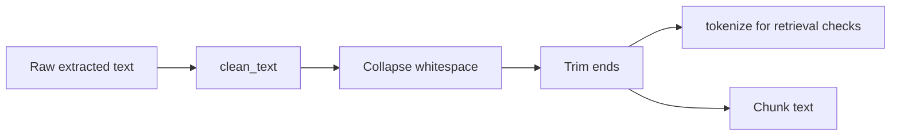
```mermaid
flowchart LR
    Raw[Raw extracted text] --> Clean[clean_text]
    Clean --> Normalize[Collapse whitespace]
    Normalize --> Strip[Trim ends]
    Strip --> Tokenize[tokenize for retrieval checks]
    Strip --> Chunk[Chunk text]
```

Normalization: `re.sub(r"\s+", " ", text or "").strip()`.

Whitespace removal: repeated whitespace becomes one space.

Metadata extraction: source filename and page number are attached separately in `Chunk`; FAISS pickle metadata is read when possible.

Filtering: `split_text` ignores chunks shorter than about 60 characters.

Advantages: simple and predictable.

Disadvantages: no layout preservation, table parsing, OCR, heading extraction, or recursive semantic splitting.

Interview Summary: Text cleaning is intentionally lightweight: normalize whitespace, keep source/page metadata, and filter tiny chunks.

---

## SECTION 12: Chunking Strategy

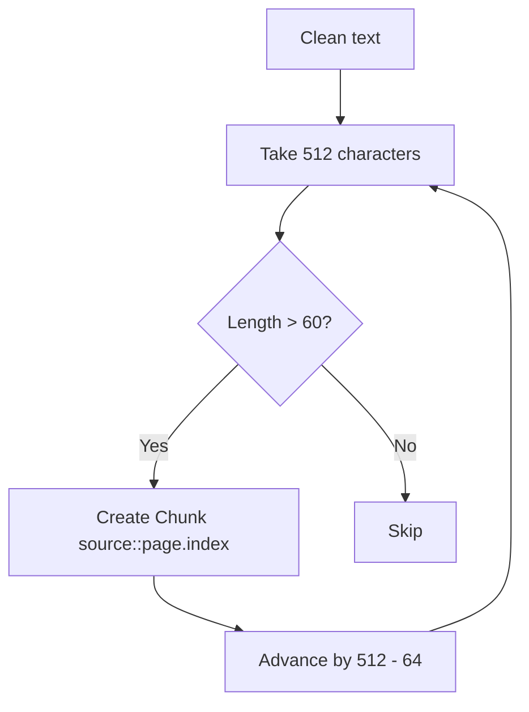
```mermaid
flowchart TD
    Text[Clean text] --> Window[Take 512 characters]
    Window --> Keep{Length > 60?}
    Keep -->|Yes| Chunk[Create Chunk source::page.index]
    Keep -->|No| Skip[Skip]
    Chunk --> Advance[Advance by 512 - 64]
    Advance --> Window
```

Chunk size: 512 characters.

Overlap: 64 characters.

Recursive splitting: not implemented.

Tradeoffs: character chunks are fast and dependency-light, but can cut sentences and tables.

Advantages: predictable memory use, fast local processing, easy metadata.

Disadvantages: weaker semantic boundaries, possible context fragmentation.

Alternative: LangChain `RecursiveCharacterTextSplitter`, token-based splitters, heading-aware splitters.

Interview Summary: AcadAI uses simple overlapping character chunks for uploads; the persisted FAISS store was generated externally.

---

## SECTION 13: Embedding Generation Flow

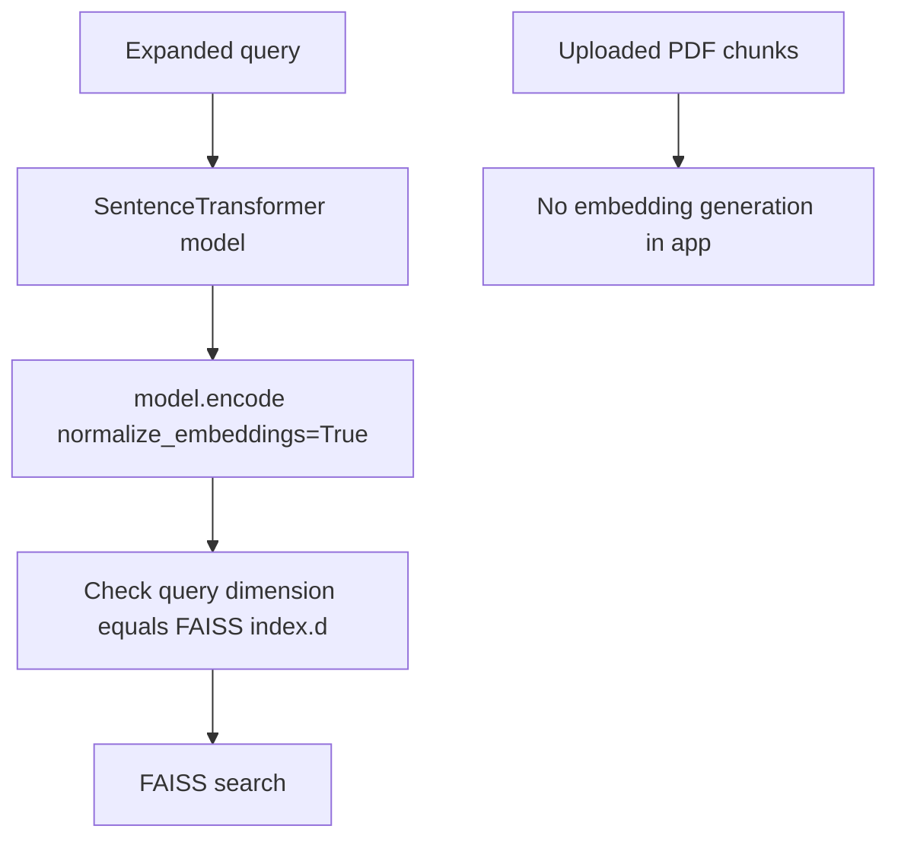
```mermaid
flowchart TD
    Query[Expanded query] --> Model[SentenceTransformer model]
    Model --> Encode[model.encode normalize_embeddings=True]
    Encode --> DimCheck[Check query dimension equals FAISS index.d]
    DimCheck --> Search[FAISS search]
    Upload[Uploaded PDF chunks] --> NoEmbed[No embedding generation in app]
```

Embedding model: default `BAAI/bge-large-en-v1.5`, configurable by env var or sidebar.

Embedding API: local `sentence_transformers`, not remote embedding API.

Storage: query embeddings are not stored; persisted document embeddings already live in `index.faiss`.

Metadata: stored in `index.pkl`; inspected count is 12,263 docs.

Important: the app does not create document embeddings for uploads.

Interview Summary: Embeddings are generated at query time for FAISS search; document embeddings are prebuilt in the local FAISS store.

---

## SECTION 14: Vector Database Architecture

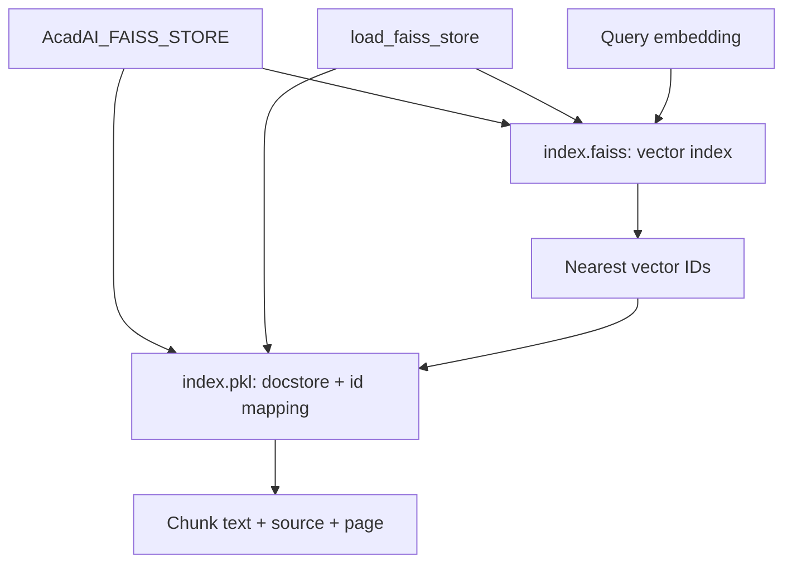
```mermaid
flowchart TD
    Store[AcadAI_FAISS_STORE] --> Index[index.faiss: vector index]
    Store --> Pkl[index.pkl: docstore + id mapping]
    App[load_faiss_store] --> Index
    App --> Pkl
    QueryEmbedding[Query embedding] --> Index
    Index --> IDs[Nearest vector IDs]
    IDs --> Pkl
    Pkl --> Chunks[Chunk text + source + page]
```

Collections: no named collections; local folder contains one FAISS index and one metadata pickle.

Indexes: FAISS index loaded with `faiss.read_index`.

Similarity search: `index.search(q_emb, search_k)`.

Metadata: source/page/doc text extracted from pickle.

Storage: local filesystem.

ChromaDB: not implemented.

MongoDB: not implemented.

Interview Summary: The vector database is a local FAISS store, not a server database.

---

## SECTION 15: FAISS vs ChromaDB

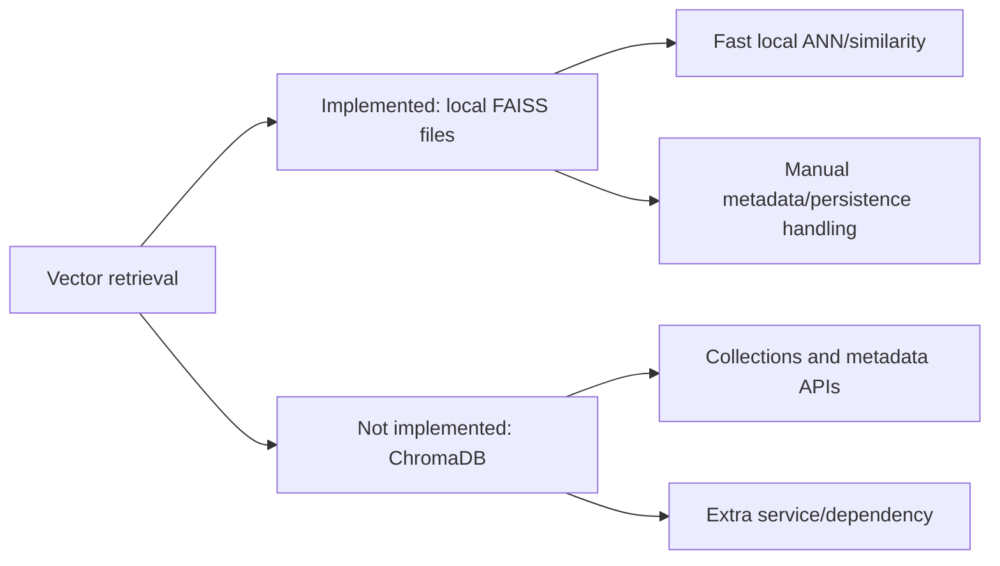
```mermaid
flowchart LR
    Need[Vector retrieval] --> FAISS[Implemented: local FAISS files]
    Need --> Chroma[Not implemented: ChromaDB]
    FAISS --> Pros1[Fast local ANN/similarity]
    FAISS --> Cons1[Manual metadata/persistence handling]
    Chroma --> Pros2[Collections and metadata APIs]
    Chroma --> Cons2[Extra service/dependency]
```

Why chosen: the implemented repository includes `faiss-cpu`, `index.faiss`, and `index.pkl`; no ChromaDB dependency exists.

Alternatives: ChromaDB, Pinecone, Weaviate, Qdrant, pgvector, Elasticsearch/OpenSearch hybrid search.

Pros of FAISS: lightweight local files, fast similarity search, good for demos and offline prototypes.

Cons of FAISS: no built-in user/document collection model, metadata handled separately, harder multi-tenant operations.

Interview questions:

- "Why FAISS?" Answer: "The app needed a local vector index and already had prebuilt embeddings; FAISS gives efficient local nearest-neighbor search."
- "Why not ChromaDB?" Answer: "ChromaDB would simplify collections and metadata, but it is not implemented in this repo."
- "How would you migrate?" Answer: "Create collections, embed documents consistently, upsert metadata, and replace `retrieve_faiss` with a Chroma query adapter."

Interview Summary: FAISS is the implemented vector store; ChromaDB is an architectural alternative, not current code.

---

## SECTION 16: RAG Pipeline

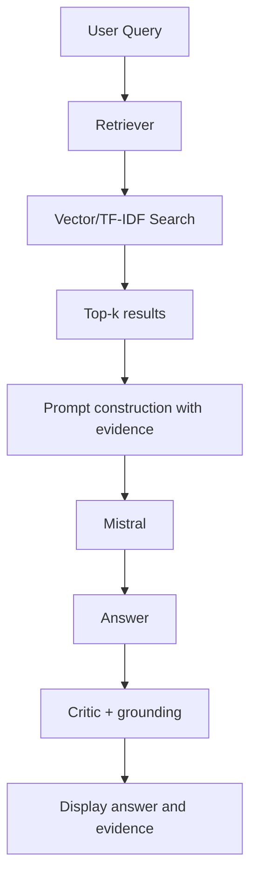
```mermaid
flowchart TD
    Q[User Query] --> R[Retriever]
    R --> VS[Vector/TF-IDF Search]
    VS --> TopK[Top-k results]
    TopK --> Prompt[Prompt construction with evidence]
    Prompt --> LLM[Mistral]
    LLM --> A[Answer]
    A --> Critic[Critic + grounding]
    Critic --> UI[Display answer and evidence]
```

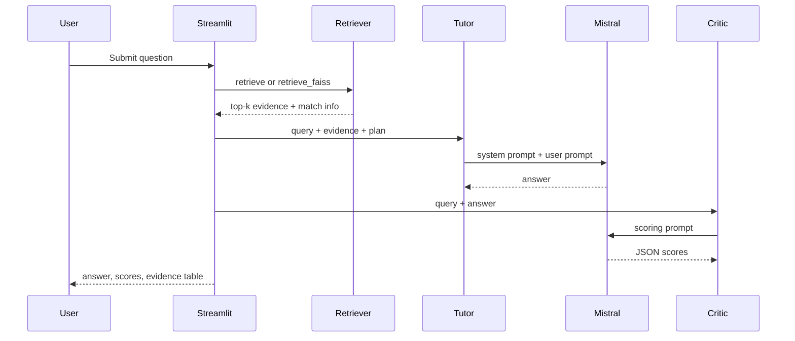
```mermaid
sequenceDiagram
    participant User
    participant Streamlit
    participant Retriever
    participant Tutor
    participant Mistral
    participant Critic
    User->>Streamlit: Submit question
    Streamlit->>Retriever: retrieve or retrieve_faiss
    Retriever-->>Streamlit: top-k evidence + match info
    Streamlit->>Tutor: query + evidence + plan
    Tutor->>Mistral: system prompt + user prompt
    Mistral-->>Tutor: answer
    Streamlit->>Critic: query + answer
    Critic->>Mistral: scoring prompt
    Mistral-->>Critic: JSON scores
    Streamlit-->>User: answer, scores, evidence table
```

Every step:

1. User submits text.
2. Active corpus is selected.
3. Retrieval returns candidate evidence.
4. Router decides RAG/web/direct path.
5. Reasoning Agent creates concepts and plan.
6. Tutor Agent builds evidence-grounded prompt.
7. Mistral returns answer or fallback answer is used.
8. Critic scores answer and may refine.
9. Grounding report compares answer to evidence.
10. UI displays final output.

Interview Summary: AcadAI's RAG is explicit: retrieve evidence, put it into the Tutor prompt, generate, critique, and show sources.

---

## SECTION 17: Retriever Architecture

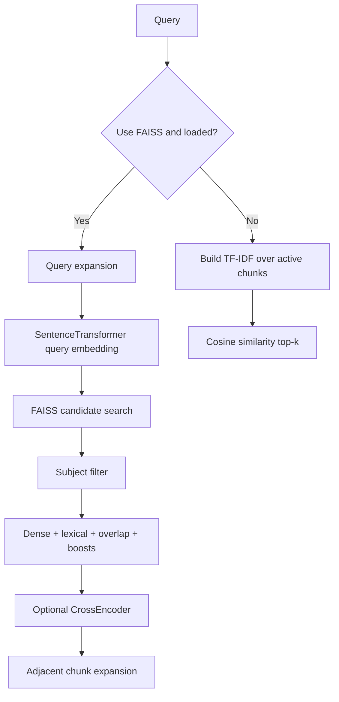
```mermaid
flowchart TD
    Query --> Mode{Use FAISS and loaded?}
    Mode -->|Yes| Expand[Query expansion]
    Expand --> Embed[SentenceTransformer query embedding]
    Embed --> FAISS[FAISS candidate search]
    FAISS --> Filter[Subject filter]
    Filter --> Hybrid[Dense + lexical + overlap + boosts]
    Hybrid --> OptionalCE[Optional CrossEncoder]
    OptionalCE --> Context[Adjacent chunk expansion]
    Mode -->|No| TFIDF[Build TF-IDF over active chunks]
    TFIDF --> Cosine[Cosine similarity top-k]
```

Architecture details:

- FAISS path: dense retrieval plus hybrid reranking.
- Fallback path: TF-IDF vectorizer and cosine similarity.
- Safety path: lexical subject scan and keyword fallback.
- Domain boosts: subject aliases and subnetting/CN keywords.

Interview Summary: Retriever is hybrid and defensive: dense search first, lexical filters and fallbacks when semantic results are weak.

---

## SECTION 18: Similarity Search Flow

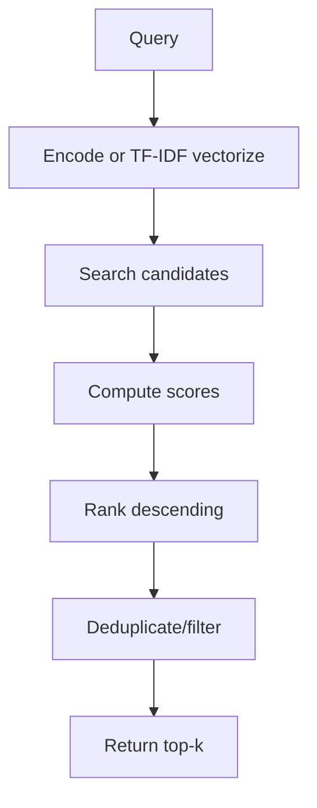
```mermaid
flowchart TD
    Query --> Vectorize[Encode or TF-IDF vectorize]
    Vectorize --> Search[Search candidates]
    Search --> Score[Compute scores]
    Score --> Rank[Rank descending]
    Rank --> Filter[Deduplicate/filter]
    Filter --> TopK[Return top-k]
```

Cosine similarity: used in TF-IDF fallback through `cosine_similarity`.

Top-k: final evidence slider ranges from 4 to 12; default is 8.

Ranking:

- FAISS raw scores are normalized.
- Lexical scores use TF-IDF over candidates.
- Overlap uses token overlap.
- Hybrid score defaults to `0.45*dense + 0.40*lexical + 0.15*overlap`, then applies boosts.

Filtering: subject detection can auto/manual/off filter candidates.

Interview Summary: Similarity search combines vector similarity and lexical matching to improve course-topic relevance.

---

## SECTION 19: Prompt Construction

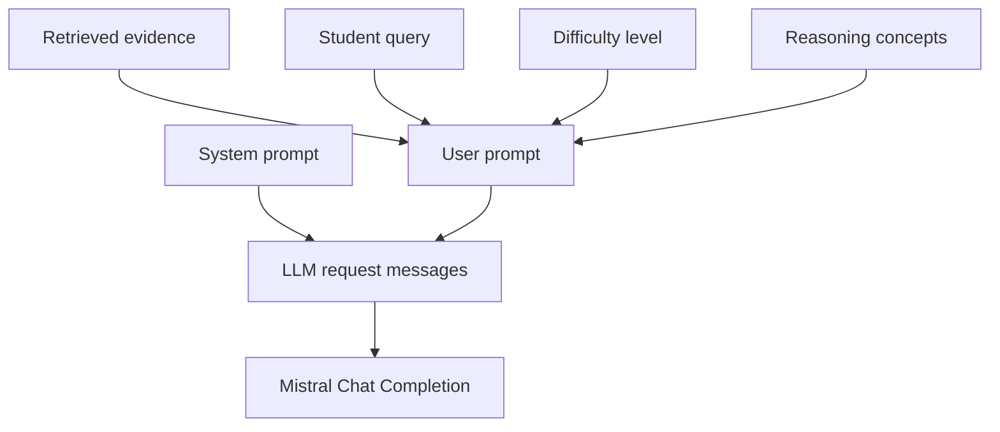
```mermaid
flowchart TD
    System[System prompt] --> Request[LLM request messages]
    Context[Retrieved evidence] --> UserPrompt[User prompt]
    Query[Student query] --> UserPrompt
    Difficulty[Difficulty level] --> UserPrompt
    Plan[Reasoning concepts] --> UserPrompt
    UserPrompt --> Request
    Request --> Mistral[Mistral Chat Completion]
```

System prompt: hard-coded strings inside each agent function.

Retrieved context: RAG evidence rows formatted as `[doc_id] evidence`.

User prompt: includes difficulty, key concepts, student query, and evidence.

Final prompt: `messages` list with optional system role plus user role.

LLM request: JSON POST to Mistral with model from `MISTRAL_MODEL` or `mistral-large-latest`.

Interview Summary: Prompt construction is function-local and explicit; no external prompt template files are implemented.

---

## SECTION 20: LangChain Architecture

```mermaid
flowchart TD
    LC[LangChain runtime] --> No[Not implemented]
    Pickle[LangChain-style FAISS index.pkl] --> Loader[_extract_chunks_from_pickle]
    Loader --> Chunk[AcadAI Chunk dataclass]
    No --> Python[Custom Python orchestration replaces chains]
```

Every chain: no LangChain chains are implemented.

Every runnable: no LangChain runnables are implemented.

Every node: no LangChain/LangGraph nodes are implemented.

What exists: support for common LangChain FAISS pickle structure `(docstore, index_to_docstore_id)`.

Why architecture was designed this way: custom Python functions are easier to inspect and control in a Streamlit prototype.

Alternative: LangChain RetrievalQA, LCEL runnables, or LangGraph state machines.

Interview Summary: Be honest: AcadAI is LangChain-compatible for loading a FAISS pickle, but not a LangChain application.

---

## SECTION 21: Multi-Agent Architecture

```mermaid
flowchart TD
    Query --> Router[Router Agent]
    Router --> Reasoning[Reasoning Agent]
    Reasoning --> Tutor[Tutor Agent]
    Tutor --> Critic[Critic Agent]
    Critic --> Refine{Needs refinement?}
    Refine -->|Yes| Tutor
    Refine -->|No| Final[Final answer]
    Memory[Session memory] --> Tutor
    Retriever[Retriever evidence] --> Tutor
```

Supervisor: no separate supervisor class; the Streamlit Ask tab orchestrates agents.

Planner: `reasoning_agent`.

Research Agent: no separate research agent; retrieval is a function and web search is a helper.

QA Agent: `tutor_agent`.

Retriever: `retrieve` or `retrieve_faiss`.

Memory: `build_memory_context` injects recent conversation into generation.

Tool calling: no OpenAI/Mistral function-calling tool loop; tools are Python functions.

Routing: `router_agent` returns `RAG`, `Web Search`, or `Direct LLM`.

Agent communication: function outputs passed as Python variables and `AgentTrace`.

Interview Summary: AcadAI uses explicit function-based agents, not autonomous tool-calling agents.

---

## SECTION 22: Memory Architecture

```mermaid
flowchart TD
    Session[st.session_state] --> Chat[chat_history last 30]
    Session --> Quiz[quiz_questions, quiz_rows, quiz_attempts]
    Session --> Profile[student_profile]
    Session --> Weak[weak_topics]
    Session --> Saved[saved_flashcards, saved_roadmaps]
    Chat --> MemoryContext[build_memory_context last N turns]
    MemoryContext --> TutorPrompt[Tutor prompt context]
```

Short-term memory: recent chat history in Streamlit session state.

Long-term memory: not implemented; data disappears when session resets.

Conversation memory: last `memory_turns` turns injected into generation, not retrieval.

Session memory: profile, weak topics, attempts, saved material.

Interview Summary: Memory is session-scoped and lightweight, useful for demos but not persistent production memory.

---

## SECTION 23: LLM Request Lifecycle

```mermaid
sequenceDiagram
    participant User
    participant Prompt
    participant LLM as Mistral API
    participant Formatter
    User->>Prompt: query, evidence, difficulty, plan
    Prompt->>LLM: POST /v1/chat/completions
    LLM-->>Prompt: message content
    Prompt-->>Formatter: raw answer or empty fallback
    Formatter-->>User: Markdown answer in Streamlit
```

Lifecycle:

- `call_llm(prompt, system)` reads `MISTRAL_API_KEY` from env or `st.secrets`.
- Builds messages list.
- Sends POST request with temperature 0.1.
- Returns assistant content.
- On missing key or failure, returns empty string.
- Agents implement fallback text when empty.

Interview Summary: Mistral calls are centralized in one helper with graceful empty-string failure behavior.

---

## SECTION 24: Complete Query Processing Flow

```mermaid
flowchart TD
    Type[User types question] --> Button[Generate Answer clicked]
    Button --> Retrieval[Run selected retrieval]
    Retrieval --> Route[Router Agent]
    Route --> Plan[Reasoning Agent]
    Plan --> Web{Web route?}
    Web -->|Yes| WebSearch[DuckDuckGo/Wikipedia]
    Web -->|No| Evidence[RAG rows or direct]
    Evidence --> Memory[Optional memory injection]
    WebSearch --> Tutor
    Memory --> Tutor[Tutor Agent]
    Tutor --> Critic[Critic Agent]
    Critic --> Refine[Optional refinement loop]
    Refine --> Grounding[Grounding report]
    Grounding --> Save[Save history/session state]
    Save --> Render[Render answer, scores, trace, evidence]
```

Every step is implemented inside the Ask tab block.

Why designed this way: all state needed for display is available immediately in the rerun cycle.

Alternative: asynchronous job queue with streaming output.

Interview Summary: The query flow is synchronous and transparent, suitable for local demos and interviews.

---

## SECTION 25: End-to-End User Journey

```mermaid
journey
    title AcadAI user journey
    section Setup
      Open app: 5: Student
      Upload PDFs or enable FAISS: 4: Student
      Configure retrieval and memory: 4: Student
    section Ask
      Ask question: 5: Student
      Inspect answer and evidence: 5: Student
    section Learn
      Generate viva: 4: Student
      Build roadmap: 4: Student
      Create revision material: 4: Student
    section Reflect
      Review memory and weak topics: 4: Student
      Evaluate retrieval quality: 3: Student
```

The app supports a full loop: ingest, ask, verify, practice, plan, revise, and reflect.

Interview Summary: AcadAI is not just RAG; it wraps RAG in a learning journey.

---

## SECTION 26: Error Handling Flow

```mermaid
flowchart TD
    Error[Failure] --> Type{Failure type}
    Type --> API[Mistral/API failure]
    API --> Empty[call_llm returns empty]
    Empty --> Fallback[Agent fallback response]
    Type --> Emb[Embedding model failure]
    Emb --> Msg[Return retrieval reason]
    Type --> Parse[PDF parse failure]
    Parse --> Skipped[Append skipped file warning]
    Type --> Ret[Retrieval failure]
    Ret --> Reason[Return match false/reason]
    Type --> Timeout[Request timeout]
    Timeout --> Fallback
```

API failure: Mistral exceptions are caught and empty string is returned.

Embedding failure: model loader returns `None`; retrieval returns a user-visible reason.

Parsing failure: skipped list records filename and error type.

Retrieval failure: FAISS exceptions are caught with reason text.

LLM timeout: request timeout is caught by broad exception and handled as API failure.

Interview Summary: Errors are handled with graceful UI fallbacks, but no structured logging or retry system exists.

---

## SECTION 27: Backend Architecture

```mermaid
flowchart TD
    UI[Streamlit handlers] --> Controller[Inline tab controllers]
    Controller --> Services[Python service functions]
    Services --> Retrieval[Retrieval service]
    Services --> LLM[LLM service]
    Services --> Memory[Session state service]
    Services --> Render[UI render helpers]
```

Services: no separate backend server; backend logic is Python functions in the Streamlit app.

Utilities: clean/tokenize/quote/overlap, parsing, retrieval helpers, prompt agents, learning generators.

Controllers: tab blocks act as controllers.

Pipeline: synchronous function calls triggered by Streamlit buttons.

Interview Summary: Backend architecture is embedded in Streamlit, which is acceptable for prototype/demo but should be modularized for production.

---

## SECTION 28: Database Architecture

```mermaid
erDiagram
    FAISS_INDEX ||--|| PICKLE_DOCSTORE : maps_vector_ids_to_documents
    STREAMLIT_SESSION ||--o{ CHAT_TURN : stores
    STREAMLIT_SESSION ||--o{ QUIZ_ATTEMPT : stores
    STREAMLIT_SESSION ||--o{ WEAK_TOPIC : stores
    STREAMLIT_SESSION ||--o{ SAVED_FLASHCARD_SET : stores
    STREAMLIT_SESSION ||--o{ SAVED_ROADMAP : stores
```

Collections: no MongoDB collections or relational tables are implemented.

Relationships:

- FAISS vector IDs map to pickle docstore entries.
- Session state maps one browser session to memory objects.

Current storage objects:

- `index.faiss`: vector index.
- `index.pkl`: docstore/id map.
- `st.session_state`: volatile session data.

Interview Summary: Database architecture is local-file FAISS plus in-memory Streamlit session state; MongoDB is not implemented.

---

## SECTION 29: Configuration Architecture

```mermaid
flowchart TD
    Env[Environment variables] --> Defaults[DEFAULT_* constants]
    Secrets[st.secrets] --> LLM[Mistral key/model fallback]
    Sidebar[Sidebar controls] --> Runtime[Runtime settings]
    Runtime --> Retrieval[Retrieval behavior]
```

Environment variables:

- `FAISS_STORE_DIR`
- `EMBEDDING_MODEL`
- `FAISS_CANDIDATE_K`
- `MIN_HYBRID_SCORE`
- `CROSS_ENCODER_MODEL`
- `MISTRAL_API_KEY`
- `MISTRAL_MODEL`

Secrets: `st.secrets` fallback for Mistral key/model.

API keys: `.env.local` contains a key value; rotate it.

Interview Summary: Config is environment/sidebar driven, but secret hygiene needs production hardening.

---

## SECTION 30: Deployment Architecture

```mermaid
flowchart TD
    Browser --> Hosting[Streamlit host or local machine]
    Hosting --> App[acadai_app_final_mistral_faiss.py]
    App --> LocalStore[Local FAISS files]
    App --> Session[In-memory session state]
    App --> Mistral[Mistral API]
    App --> Web[DuckDuckGo/Wikipedia]
```

Implemented deployment configuration: `requirements.txt` exists; no Dockerfile, Procfile, CI workflow, or Streamlit config file is implemented.

Browser -> Hosting -> Backend -> Database -> LLM APIs: Streamlit acts as both frontend and backend; database is local FAISS/session state; LLM API is Mistral.

Interview Summary: Deployment is Streamlit-style dependency installation plus app run; production deployment files are minimal.

---

## SECTION 31: Performance Optimization

```mermaid
flowchart LR
    Performance --> Cache[st.cache_resource]
    Cache --> Models[Embedding/CrossEncoder]
    Cache --> FAISS[FAISS store]
    Performance --> TopK[Configurable top-k/candidate-k]
    Performance --> Optional[CrossEncoder off by default]
    Performance --> Fallback[TF-IDF fallback]
```

Caching: implemented for model loaders and FAISS loading.

Batching: query embedding encodes one query; CrossEncoder predicts pairs as a batch over selected rows.

Lazy loading: FAISS and models load only if toggles/settings need them.

Streaming: not implemented.

Interview Summary: Performance is optimized for local demo by caching heavy resources and keeping expensive reranking optional.

---

## SECTION 32: Security Architecture

```mermaid
flowchart TD
    Input[User input/PDFs] --> Validation[File type limited to PDF]
    Validation --> Parsing[pypdf parsing]
    Prompt[Prompt input] --> LLM[Mistral]
    Secrets[API key] --> Risk[.env.local contains key]
    Auth[Authentication] --> Missing[Not implemented]
    Injection[Prompt injection defense] --> Partial[Prompt says use evidence only]
```

Input validation: uploader restricts PDFs; no file size limits or malware scanning.

Prompt injection protection: Tutor prompt instructs evidence-only behavior; no robust injection classifier or policy layer.

Secret management: reads env and `st.secrets`; current `.env.local` exposes a key in repository workspace.

Authentication/authorization: not implemented.

Interview Summary: Security is prototype-level; rotate secrets, remove `.env.local`, add auth, validation, scanning, and prompt-injection defenses for production.

---

## SECTION 33: Scalability

```mermaid
flowchart TD
    U100[100 users] --> Single[Single Streamlit instance may work]
    U1000[1000 users] --> Multi[Multiple replicas + shared vector DB]
    U10000[10000 users] --> Services[Separate API, workers, cache, DB]
    U100000[100000 users] --> Platform[Cloud-native multi-region architecture]
```

100 users: possible if host has enough memory and LLM/API limits permit.

1000 users: split Streamlit UI from backend API; use shared vector DB and Redis/session store.

10000 users: add queues, async generation, observability, rate limiting, autoscaling.

100000 users: multi-region, managed vector DB, centralized auth, tenant isolation, monitoring.

Current limitation: Streamlit session state and local FAISS files do not scale horizontally without redesign.

Interview Summary: The current app is a prototype; scaling requires service separation, shared storage, and managed infrastructure.

---

## SECTION 34: Possible Bottlenecks

```mermaid
flowchart LR
    Bottlenecks --> CPU[PDF parsing/TF-IDF]
    Bottlenecks --> Memory[FAISS, models, CrossEncoder]
    Bottlenecks --> Embedding[SentenceTransformer load/encode]
    Bottlenecks --> Search[Large candidate search]
    Bottlenecks --> LLM[Mistral latency/rate limits]
```

CPU: PDF parsing and TF-IDF rebuilds can cost time.

Memory: BGE-large and CrossEncoder consume RAM; FAISS index occupies memory.

Embedding: first load is slow; query encoding depends on local model performance.

Vector search: FAISS is fast, but candidate reranking and lexical fallbacks add work.

LLM: external API latency and failure.

Interview Summary: The biggest bottlenecks are model loading, reranking, LLM latency, and Streamlit rerun behavior.

---

## SECTION 35: Future Improvements

```mermaid
flowchart TD
    Future --> Modular[Split app into modules/services]
    Future --> Retrieval[Better retrieval and eval metrics]
    Future --> UploadEmb[Embed uploaded docs into vector DB]
    Future --> Persistence[Mongo/Postgres/Redis for users]
    Future --> Orchestration[LangGraph or explicit workflow engine]
    Future --> Security[Auth, secret hygiene, injection defenses]
```

Horizontal scaling: separate frontend/backend and use shared vector/session stores.

Better retrieval: token-aware chunking, BM25 + dense hybrid, learned reranker, query classifier.

Hybrid search: current hybrid exists; improve with BM25 and calibrated scoring.

Fine-tuning: possible for domain style, but retrieval quality should be improved first.

Agent orchestration: LangGraph could formalize state transitions and retries.

Interview Summary: Best next steps are modularization, persistent user/document storage, upload embeddings, stronger evaluation, and production security.

---

## SECTION 36: Technology Decisions

```mermaid
flowchart TD
    Python --> Streamlit
    Python --> FAISS
    Python --> Sklearn[scikit-learn TF-IDF]
    Python --> SentenceTransformers
    Python --> MistralAPI[Mistral API]
    NotUsed[Not implemented] --> LangChain
    NotUsed --> ChromaDB
    NotUsed --> MongoDB
```

Why Streamlit: fastest way to build Python-first interactive AI app with widgets, tabs, and session state.

Why Python: rich AI, retrieval, PDF, and data ecosystem.

Why FAISS: implemented local vector index and fast nearest-neighbor search.

Why LangChain: not used as runtime; only pickle compatibility exists. If asked "why LangChain," answer that the implemented app intentionally uses direct Python orchestration.

Why ChromaDB: not used. It would be an alternative for managed collections/metadata.

Why MongoDB: not used. It would be an alternative for user profiles, chat history, and uploaded document metadata.

Alternatives: React/FastAPI, Next.js, Qdrant, pgvector, Redis, LangGraph, Celery/RQ.

Interview Summary: The implemented choices favor speed and transparency over production modularity.

---

## SECTION 37: Project Explanation

```mermaid
flowchart LR
    Short[30 sec] --> Medium[2 min]
    Medium --> Deep[5 min]
    Deep --> System[10 min]
```

30 second version:

AcadAI is a Streamlit AI learning platform that answers academic questions using retrieved evidence from PDFs or a FAISS store, then shows answer quality, grounding, source evidence, viva practice, roadmaps, and revision tools.

2 minute version:

The app lets a student upload academic PDFs or use a prebuilt FAISS corpus. When the user asks a question, the app retrieves relevant chunks using FAISS hybrid retrieval or TF-IDF fallback. A Router Agent chooses RAG, web, or direct LLM behavior. A Reasoning Agent plans concepts, a Tutor Agent asks Mistral to produce an evidence-grounded answer, and a Critic Agent scores and optionally refines the response. The UI shows metrics, evidence, agent traces, and grounding. Additional tabs generate viva questions, roadmaps, revision notes, likely exam questions, flashcards, and retrieval evaluation.

5 minute version:

AcadAI is a vertical AI education prototype. The frontend and backend are both in one Streamlit file. The ingestion layer parses uploaded PDFs with `pypdf`, cleans text, and splits it into overlapping chunks. Retrieval has two paths: local FAISS retrieval over a persisted index or TF-IDF fallback over active chunks. The FAISS path expands queries, embeds them with SentenceTransformer, searches candidates, filters by inferred subject, computes dense/lexical/overlap hybrid scores, optionally reranks with CrossEncoder, and expands adjacent context. The generation layer uses Mistral via a central `call_llm` helper. The agent layer is function-based: Router, Reasoning, Tutor, Critic, plus learning material generators. Memory is stored in `st.session_state`, so it is useful for the current session but not persistent.

10 minute version:

Start from the user journey: a B.Tech student opens AcadAI, uploads notes or toggles a local FAISS store, configures retrieval, and asks a question. The app selects the active corpus. For uploaded PDFs, text is parsed page-by-page and chunked into 512-character windows with 64-character overlap. For FAISS, it loads `index.faiss` and `index.pkl`; the inspected pickle has 12,263 document entries and uses a LangChain-style structure, though LangChain is not a runtime dependency. Retrieval returns evidence with source/page metadata. Router chooses the answering path. Reasoning produces a JSON-like learning plan. Tutor constructs a system prompt requiring evidence-grounded teaching with examples and citations. Critic evaluates relevance, completeness, accuracy, clarity, and can trigger refinement. A grounding report compares answer sentences to evidence. The same retrieval core powers viva, roadmap, revision, flashcard, exam-question, and evaluation tabs. The main production gaps are modularity, persistence, auth, secret hygiene, dynamic vectorization of uploads, and robust observability.

Interview Summary: Explain AcadAI as a learning workflow powered by retrieval, Mistral, critique, grounding, and Streamlit state.

---

## SECTION 38: 50 Interview Questions

```mermaid
flowchart TD
    Q[Interview Questions] --> Architecture
    Q --> Retrieval
    Q --> Agents
    Q --> Frontend
    Q --> Production
```

| # | Question | Ideal Answer | Why Asked | Common Mistake | Better Answer |
|---:|---|---|---|---|---|
| 1 | What is AcadAI? | A Streamlit academic AI tutor with retrieval, agents, grounding, and study tools. | Checks product clarity. | Calling it only a chatbot. | It is a learning workflow app. |
| 2 | What problem does it solve? | It grounds academic answers in course material and helps revision/viva preparation. | Checks user focus. | Inventing business metrics. | Explain student pain points. |
| 3 | What is the main architecture? | Browser to Streamlit to retrieval/agents to Mistral to UI. | Checks system thinking. | Claiming microservices. | Say it is single-file Streamlit. |
| 4 | Is LangChain implemented? | No runtime chains; only LangChain-style FAISS pickle support. | Checks honesty. | Saying yes because pickle is LangChain-style. | Distinguish compatibility from runtime. |
| 5 | Is LangGraph implemented? | No. | Checks repo accuracy. | Inventing graph nodes. | Say future improvement. |
| 6 | Is ChromaDB used? | No, FAISS is used. | Checks vector DB knowledge. | Saying both are used. | Compare as alternative. |
| 7 | Is MongoDB used? | No. Session state and FAISS files are used. | Checks database accuracy. | Inventing collections. | Say what would be stored in Mongo. |
| 8 | How are PDFs parsed? | Uploaded PDFs are read with pypdf page extraction. | Checks ingestion. | Claiming OCR. | Mention text-only extraction. |
| 9 | What formats are supported? | Upload supports PDF only. | Checks assumptions. | Claiming DOCX/TXT. | Be explicit. |
| 10 | How are chunks created? | 512-character chunks with 64-character overlap, skipping tiny chunks. | Checks implementation. | Saying recursive splitter. | Mention exact strategy. |
| 11 | Are uploads embedded? | No, uploads use TF-IDF fallback unless separate FAISS is enabled. | Checks RAG accuracy. | Saying upload goes to FAISS. | Explain current limitation. |
| 12 | What is the default embedding model? | BAAI/bge-large-en-v1.5. | Checks config. | Confusing reranker and embedder. | Mention sidebar override. |
| 13 | How does FAISS retrieval work? | Query expansion, embedding, FAISS search, subject filter, hybrid rerank, optional CrossEncoder. | Checks retrieval depth. | Saying raw top-k only. | Explain hybrid path. |
| 14 | What is hybrid score? | Weighted dense, lexical, and overlap score plus boosts. | Checks ranking. | Ignoring lexical signals. | Mention weights. |
| 15 | Why use lexical fallback? | It catches exact academic terms when dense retrieval misses. | Checks retrieval quality. | Saying embeddings solve everything. | Explain subnetting/CN examples. |
| 16 | What does Router Agent do? | Chooses RAG, Web Search, or Direct LLM. | Checks agent responsibility. | Calling it an LLM agent. | It is heuristic logic. |
| 17 | What does Reasoning Agent do? | Produces concepts, plan, tools, difficulty via Mistral or fallback. | Checks planning. | Claiming chain-of-thought exposure. | It returns structured plan. |
| 18 | What does Tutor Agent do? | Builds evidence prompt and generates teaching answer. | Checks generation. | Saying it searches. | Retriever searches; Tutor explains. |
| 19 | What does Critic Agent do? | Scores relevance, completeness, accuracy, clarity, overall. | Checks quality loop. | Treating it as ground truth. | Scores are model/heuristic estimates. |
| 20 | How is grounding measured? | Sentence support via token overlap against evidence. | Checks hallucination logic. | Claiming factual verification. | It is lexical grounding, not truth proof. |
| 21 | How is memory stored? | `st.session_state` arrays/dicts. | Checks state. | Claiming database memory. | Session-only. |
| 22 | Is memory persistent? | No. | Checks production readiness. | Saying saved permanently. | Recommend DB for persistence. |
| 23 | How does web fallback work? | DuckDuckGo HTML first, then Wikipedia API fallback. | Checks external services. | Saying web is always used. | It depends on router and toggle. |
| 24 | What happens if Mistral fails? | `call_llm` returns empty and agents use fallbacks. | Checks reliability. | Saying app crashes. | Explain graceful degradation. |
| 25 | What does `@st.cache_resource` do here? | Caches models and FAISS loading. | Checks performance. | Using it for user state. | State uses session_state. |
| 26 | Why Streamlit? | Fast Python UI for AI demos and controls. | Checks technology choice. | Claiming enterprise frontend. | Mention tradeoff. |
| 27 | What are UI components? | Cards, chips, headers, agent badges, flashcards, roadmaps, exam cards. | Checks frontend ownership. | Only naming tabs. | Discuss reusable renderers. |
| 28 | How are retrieval settings controlled? | Sidebar sliders/toggles/text inputs. | Checks UX. | Hardcoded only. | Mention runtime configurability. |
| 29 | What is the evaluation dashboard? | Runs query/expected subject tests and shows hit rate and chart. | Checks evaluation. | Claiming offline benchmark suite. | It is interactive in-app eval. |
| 30 | What is the biggest security issue? | Committed `.env.local` with API key. | Checks security maturity. | Ignoring secrets. | Rotate and remove. |
| 31 | Is there auth? | No. | Checks security. | Inventing login. | Future: OAuth/session auth. |
| 32 | Is there logging? | No structured logging. | Checks observability. | Pointing to UI history. | UI history is not logging. |
| 33 | How does Critic refinement loop stop? | Stops when satisfactory, no feedback, or max_refine reached. | Checks control flow. | Saying infinite loop risk. | Bound by slider. |
| 34 | How is weak topic tracking updated? | Low grounding or low quiz score increments weak topic counts. | Checks personalization. | Calling it ML model. | It is rule-based state. |
| 35 | What powers viva mode? | Retrieval plus Mistral quiz prompt and answer evaluation prompt. | Checks feature flow. | Saying separate model. | Same LLM helper. |
| 36 | What powers roadmaps? | Profile + retrieved evidence + Mistral roadmap prompt. | Checks personalization. | Claiming scheduling engine. | Prompt-based generation. |
| 37 | What powers flashcards? | Retrieved evidence and Mistral Q/A prompt with parser/rendering. | Checks feature detail. | Claiming spaced repetition. | No spaced repetition implemented. |
| 38 | What is direct LLM route? | Router can choose it, Tutor prompt says general knowledge, but Tutor still uses Mistral. | Checks route nuance. | Saying no LLM. | Distinguish route from provider. |
| 39 | What is source_subject_boost? | Filename/folder alias boost for expected subjects. | Checks ranking details. | Ignoring metadata. | Explain soft boosting. |
| 40 | How does dimension mismatch get handled? | It returns a clear reason if query embedding dimension differs from FAISS index.d. | Checks defensive code. | Allowing crash. | Mention same embedding model requirement. |
| 41 | What does `index.pkl` store? | Docstore and index-to-docstore ID mapping. | Checks FAISS metadata. | Saying vectors only. | Metadata is separate. |
| 42 | How many docs were inspected in FAISS pickle? | 12,263 document entries. | Checks evidence. | Fabricating if unsure. | Say inspected with compatibility shim. |
| 43 | What is not production-ready? | Secrets, auth, persistence, modularity, tests, observability. | Checks judgment. | Overselling. | Be honest. |
| 44 | How would you modularize it? | Split UI, ingestion, retrieval, agents, memory, config, tests. | Checks engineering. | Big rewrite without boundaries. | Use current function groups. |
| 45 | How would you support DOCX? | Add uploader type, parser, metadata, chunker, tests. | Checks extension design. | Just add extension string. | Need parser dependency. |
| 46 | How would you persist user data? | Add database tables/collections for users, sessions, docs, chunks, attempts. | Checks backend design. | Store in session_state. | Use DB plus auth. |
| 47 | How would you scale retrieval? | Use managed vector DB or shared FAISS service with caching and sharding. | Checks scalability. | Copy FAISS per user. | Centralize storage. |
| 48 | How would you reduce hallucination? | Better retrieval, citations, grounding, prompt constraints, critic, eval. | Checks AI safety. | Saying RAG eliminates hallucination. | RAG reduces, not eliminates. |
| 49 | How would you test this? | Unit tests for chunking/retrieval, integration tests for prompts, UI smoke tests. | Checks quality. | Manual demo only. | Add deterministic tests. |
| 50 | What is your strongest design decision? | Explicit, inspectable retrieval-agent flow with evidence and fallback handling. | Checks ownership. | Naming a library. | Discuss system behavior. |

Interview Summary: The strongest answers are honest, code-grounded, and clear about implemented versus future architecture.

---

## SECTION 39: 50 Difficult Follow-up Questions

```mermaid
flowchart TD
    Followups[Difficult Follow-ups] --> Truth[Implemented truth]
    Followups --> Tradeoffs[Tradeoffs]
    Followups --> Scale[Scale]
    Followups --> Safety[Safety]
```

1. Why did you not embed uploaded PDFs into FAISS at runtime?
2. How would you prevent reranking from overfitting to lexical overlap?
3. What happens if FAISS candidate IDs do not match pickle metadata?
4. How would you migrate the local FAISS store to Qdrant or pgvector?
5. How would you handle multi-tenant document isolation?
6. How would you validate that retrieved evidence is actually sufficient?
7. How would you measure answer factuality beyond lexical grounding?
8. What failure mode occurs when `langchain_community` is missing for pickle loading?
9. Why is a pickle file risky in production?
10. How would you avoid arbitrary code execution risk from untrusted pickle files?
11. How would you make uploaded PDF parsing asynchronous?
12. What if a PDF is scanned and has no extractable text?
13. What if page extraction preserves text in the wrong order?
14. How would you add OCR?
15. How would you add table extraction?
16. Why is character chunking weaker than token-aware splitting?
17. How would you choose chunk size empirically?
18. How would you tune hybrid score weights?
19. How would you benchmark retrieval beyond hit rate?
20. How would you add Precision@K, Recall@K, MRR, and nDCG in code?
21. How would you handle prompt injection inside retrieved PDFs?
22. How would you separate system instructions from untrusted evidence?
23. How would you rate-limit Mistral calls?
24. How would you cache LLM responses safely?
25. How would you stream answers in Streamlit?
26. How would you handle 1,000 concurrent users?
27. How would you share session state across replicas?
28. Why is `st.session_state` not long-term memory?
29. How would you design persistent memory schemas?
30. How would you add user authentication?
31. How would you secure uploaded files?
32. How would you rotate the exposed Mistral key?
33. How would you remove secrets from git history?
34. How would you introduce structured logging?
35. What metrics would you monitor in production?
36. How would you detect retrieval drift?
37. How would you handle embedding model upgrades?
38. What happens if FAISS index dimension differs from the selected model?
39. Why is CrossEncoder off by default?
40. How would you decide when to enable CrossEncoder?
41. How would you redesign the single-file app into services?
42. What module boundaries would you create first?
43. How would you test agent prompts deterministically?
44. What is the difference between Critic score and grounding score?
45. Why can a fluent answer still be weakly grounded?
46. Why can a grounded answer still be incomplete?
47. How would you add LangGraph without overengineering?
48. What would a supervisor node actually do?
49. What would be your first production hardening task?
50. What would you remove from the resume if asked to prove every claim?

Recommended answer pattern for all follow-ups:

```text
1. State the implemented truth.
2. Explain the tradeoff.
3. Name the failure mode.
4. Propose the production-grade improvement.
5. Avoid claiming unimplemented tools.
```

Interview Summary: Difficult follow-ups are mostly traps for overclaiming; win by being precise and systems-minded.

---

## SECTION 40: Explain Every Important Python File

```mermaid
flowchart TD
    Py[acadai_app_final_mistral_faiss.py] --> UI[Streamlit UI]
    Py --> Ingestion[PDF ingestion]
    Py --> Retrieval[FAISS/TF-IDF retrieval]
    Py --> LLM[Mistral calls]
    Py --> Agents[Agents]
    Py --> Memory[Session state]
    Py --> Learning[Quiz/roadmap/revision tools]
```

Only important Python source file: `acadai_app_final_mistral_faiss.py`.

Purpose: runs the complete AcadAI application.

Responsibility:

- Imports and environment loading.
- Configuration constants.
- Subject dictionaries and query expansion maps.
- `Chunk` and `AgentTrace` dataclasses.
- Demo corpus.
- Text utilities.
- PDF upload parsing.
- FAISS loading and pickle extraction.
- Subject detection and retrieval helper logic.
- FAISS retrieval and TF-IDF fallback retrieval.
- Web search fallback.
- Mistral LLM wrapper.
- Multi-agent functions.
- Metrics and history.
- Memory, grounding, quiz, roadmap, flashcards, revision, exam question generation.
- Reusable UI renderers.
- Streamlit page, sidebar, and tabs.

Interactions:

- Reads `requirements.txt` dependencies at install time.
- Reads `.env.local`/environment/st.secrets at runtime.
- Optionally reads `AcadAI_FAISS_STORE/index.faiss` and `index.pkl`.
- Calls external Mistral, DuckDuckGo, and Wikipedia endpoints.
- Uses `st.session_state` to preserve session data.

Important config files:

- `requirements.txt`: declares runtime dependencies.
- `.gitignore`: ignores env files, venvs, pycache.
- `.env.local`: local secret file; security issue.

Important data files:

- `index.faiss`: local vector index.
- `index.pkl`: docstore metadata; inspected as 12,263 documents.

Important documentation/image files:

- README and interview guide markdown files document the system but are not runtime code.
- Screenshots and workflow image are visual evidence/demo assets.

Interview Summary: The codebase is currently a single Streamlit application file with local FAISS assets and extensive documentation; explain logical modules, not imaginary file boundaries.

---

## SECTION 41: Resume Defense Pack for Current Resume Bullets

Use this section when an interviewer points directly at the resume project entry. The goal is simple: every resume word should map to one code-backed explanation you can say naturally.

Current resume entry:

```latex
\resumeProjectHeading
{\textbf{AcadAI -- AI-Powered Study Assistant} \hspace{6pt}
\href{https://github.com/Naina-Coder123/AcadAI}{ GitHub }
\hspace{6pt} \href{https://acadai-2sgceocfpzdikyjhj2wgrf.streamlit.app/}{ Live }}{March 2026 -- Jun 2026}
\vspace{-6pt}
\begin{itemize}[leftmargin=0.25in]
\small{
\item \textbf{Tech:} Python, Streamlit, FAISS, SentenceTransformers, scikit-learn, Mistral API, RAG
\item Built a Streamlit academic assistant for Q\&A, viva practice, revision notes, roadmaps, and flashcards.
\item Implemented RAG workflows using FAISS retrieval, TF-IDF fallback search, citations, and grounded answer generation.
\item Designed multi-agent flows for routing, reasoning, tutoring, critique, refinement, and response validation.
\item Developed dashboards for retrieval testing, answer scores, evidence review, and session-based learning memory.
}
\end{itemize}
```

### 41.1 One-Minute Resume Explanation

```mermaid
flowchart TD
    Resume[Resume Project: AcadAI] --> UI[Streamlit study assistant]
    UI --> RAG[RAG retrieval]
    RAG --> Agents[Multi-agent answer flow]
    Agents --> Trust[Critic scores + grounding + evidence]
    Trust --> Tools[Viva, revision, roadmap, flashcards]
```

Say this:

```text
AcadAI is a Streamlit-based academic study assistant. A student can ask questions, upload PDFs, or use a prebuilt FAISS store. The app retrieves relevant evidence, builds a grounded prompt for Mistral, and shows the final answer with citations, critic scores, grounding checks, and evidence tables. I also built learning tools like viva practice, revision notes, roadmaps, flashcards, retrieval testing, and session-based memory.
```

Do not say:

```text
I used MongoDB, ChromaDB, LangGraph, or LangChain chains.
```

Those are not implemented in the current code.

Interview Summary: AcadAI is easiest to explain as "Streamlit UI + retrieval + Mistral agents + evidence/quality dashboard."

---

### 41.2 Resume Bullet 1: Tech Stack

Resume line:

```text
Tech: Python, Streamlit, FAISS, SentenceTransformers, scikit-learn, Mistral API, RAG
```

```mermaid
flowchart LR
    Python --> Streamlit
    Python --> FAISS
    Python --> SentenceTransformers
    Python --> Sklearn[scikit-learn]
    Python --> Mistral[Mistral API]
    FAISS --> RAG
    Mistral --> RAG
```

Simple explanation:

```text
Python is the main language. Streamlit builds the UI. FAISS stores and searches vector embeddings. SentenceTransformers creates query embeddings. scikit-learn provides TF-IDF fallback retrieval. Mistral generates and evaluates answers. RAG combines retrieved evidence with LLM generation.
```

Code proof:

```python
import streamlit as st
from sklearn.feature_extraction.text import TfidfVectorizer
from sklearn.metrics.pairwise import cosine_similarity

import faiss
from sentence_transformers import SentenceTransformer, CrossEncoder
```

Important nuance:

- `faiss` and `sentence_transformers` are optional in code because imports are wrapped in `try/except`.
- If unavailable, the app falls back to TF-IDF retrieval or shows a clear message.

Possible interviewer questions:

| Question | Easy Answer |
|---|---|
| Why Python? | It has strong AI, PDF, vector search, and Streamlit support. |
| Why Streamlit? | It let me build a complete interactive AI workflow quickly in Python. |
| Why FAISS? | It supports fast local vector similarity search over the prebuilt academic corpus. |
| Why SentenceTransformers? | It generates semantic embeddings for FAISS query search. |
| Why scikit-learn? | I used TF-IDF and cosine similarity as a lightweight fallback retriever. |
| Why Mistral? | It powers answer generation, reasoning, critique, and study-material generation. |
| What is RAG here? | Retrieve academic evidence first, then generate an answer using that evidence. |

Common mistake:

```text
Saying "I used LangChain, ChromaDB, and MongoDB" because they sound impressive.
```

Better answer:

```text
I kept the stack honest and focused: Streamlit, FAISS, SentenceTransformers, scikit-learn, Mistral, and explicit Python orchestration.
```

Interview Summary: This tech stack is simple, defensible, and exactly matches the implementation.

---

### 41.3 Resume Bullet 2: Streamlit Academic Assistant

Resume line:

```text
Built a Streamlit academic assistant for Q&A, viva practice, revision notes, roadmaps, and flashcards.
```

```mermaid
flowchart TD
    Streamlit[Streamlit App] --> Ask[Ask Tab: Q&A]
    Streamlit --> Viva[Viva Studio]
    Streamlit --> Roadmap[Roadmap]
    Streamlit --> Revision[Revision Suite]
    Revision --> Notes[Revision Notes]
    Revision --> Questions[Likely Questions]
    Revision --> Flashcards[Flashcards]
```

Simple explanation:

```text
The app is organized into Streamlit tabs. The Ask tab handles academic Q&A. Viva Studio creates and evaluates viva questions. Roadmap generates a day-wise study plan. Revision Suite creates notes, likely exam questions, and flashcards.
```

Code proof:

```python
tab_ask, tab_viva, tab_roadmap, tab_revision, tab_eval, tab_memory = st.tabs([
    "Ask", "Viva Studio", "Roadmap", "Revision Suite", "Evaluation", "Memory"
])
```

Feature-to-function map:

| Resume Feature | Implemented Function/Area |
|---|---|
| Q&A | Ask tab, `retrieve_faiss`, `retrieve`, `tutor_agent` |
| Viva practice | `generate_quiz`, `evaluate_quiz_answer` |
| Revision notes | `generate_revision_notes` |
| Roadmaps | `generate_learning_roadmap` |
| Flashcards | `generate_flashcards`, `render_flashcards_professional` |

Possible interviewer questions:

| Question | Easy Answer |
|---|---|
| Is it a multi-page app? | No, it is one Streamlit file using tabs. |
| Why tabs? | Tabs make the workflow easy: ask, practice, plan, revise, evaluate, remember. |
| Are flashcards stored permanently? | No, they are stored in Streamlit session state for the current session. |
| Are roadmaps personalized? | They use the session profile, difficulty level, weak topics, and retrieved evidence. |
| Is viva evaluation automatic? | Yes, Mistral evaluates the answer when available; otherwise fallback text is shown. |

Common mistake:

```text
Calling it a full LMS with persistent accounts.
```

Better answer:

```text
It is an AI learning assistant prototype, not a full LMS. It supports study workflows but does not implement accounts or persistent user storage.
```

Interview Summary: Say "I built one Streamlit workspace with multiple learning tabs."

---

### 41.4 Resume Bullet 3: RAG Workflows

Resume line:

```text
Implemented RAG workflows using FAISS retrieval, TF-IDF fallback search, citations, and grounded answer generation.
```

```mermaid
flowchart TD
    Query[Student Query] --> Retrieve{Retrieval Mode}
    Retrieve -->|FAISS enabled| FAISS[FAISS vector retrieval]
    Retrieve -->|FAISS off/unavailable| TFIDF[TF-IDF fallback search]
    FAISS --> Evidence[Evidence chunks]
    TFIDF --> Evidence
    Evidence --> Prompt[Prompt with citations]
    Prompt --> Mistral[Mistral answer generation]
    Mistral --> Grounding[Grounding check]
    Grounding --> UI[Answer + evidence table]
```

Simple explanation:

```text
RAG means the app retrieves source evidence before generating an answer. If FAISS is enabled, it uses vector search. If FAISS is unavailable or uploads are used, it can use TF-IDF fallback search. The Tutor Agent receives retrieved evidence and asks Mistral to answer with citations.
```

Code proof: FAISS loading.

```python
def load_faiss_store(store_dir: str):
    index_path = os.path.join(store_dir, "index.faiss")
    pkl_path = os.path.join(store_dir, "index.pkl")
    index = faiss.read_index(index_path)
```

Code proof: TF-IDF fallback.

```python
def build_index(chunks: List[Chunk]):
    corpus = [c.text for c in chunks]
    vec = TfidfVectorizer(stop_words="english", ngram_range=(1, 2), max_features=12000)
    mat = vec.fit_transform(corpus)
    return vec, mat
```

Code proof: evidence in prompt.

```python
evidence = "\n\n".join(f"[{r['doc_id']}] {r['evidence']}" for r in context_rows)
prompt = (
    f"Difficulty: {difficulty}\n"
    f"Key concepts: {concepts}\n"
    f"Student query: {query}\n\n"
    f"Evidence:\n{evidence}"
)
```

Important nuance:

- Uploaded PDFs are parsed into chunks but are not embedded into FAISS at runtime.
- Uploaded PDFs use the TF-IDF route unless the user separately enables an existing FAISS store.

Possible interviewer questions:

| Question | Easy Answer |
|---|---|
| What is RAG? | Retrieve relevant evidence first, then generate an answer using that context. |
| Why not pure LLM? | Pure LLM can hallucinate; retrieval provides course-specific grounding. |
| What is FAISS doing? | It searches nearest document vectors for the query embedding. |
| What is TF-IDF fallback? | A keyword-based retrieval fallback using scikit-learn cosine similarity. |
| What are citations? | The answer context includes document IDs like `[doc_id]` from retrieved chunks. |
| Does RAG eliminate hallucinations? | No, it reduces them; grounding checks still matter. |

Common mistake:

```text
Saying uploaded PDFs are embedded and inserted into FAISS automatically.
```

Better answer:

```text
In the current implementation, uploaded PDFs are chunked and searched with TF-IDF. FAISS is used when the existing vector store is enabled.
```

Interview Summary: Say "FAISS when available, TF-IDF as fallback, evidence goes into the Mistral prompt."

---

### 41.5 Resume Bullet 4: Multi-Agent Flow

Resume line:

```text
Designed multi-agent flows for routing, reasoning, tutoring, critique, refinement, and response validation.
```

```mermaid
flowchart TD
    Query[User Query] --> Router[Router Agent]
    Router --> Reasoning[Reasoning Agent]
    Reasoning --> Tutor[Tutor Agent]
    Tutor --> Critic[Critic Agent]
    Critic --> Decision{Satisfactory?}
    Decision -->|No| Refine[Refinement Pass]
    Refine --> Critic
    Decision -->|Yes| Grounding[Grounding Validation]
    Grounding --> Final[Final UI Response]
```

Simple explanation:

```text
The agents are Python functions with separate responsibilities. Router chooses the route. Reasoning extracts key concepts and a plan. Tutor generates the answer. Critic scores the answer. If needed, refinement improves it. Grounding validation checks whether answer sentences are supported by evidence.
```

Code proof: route choices.

```python
def router_agent(query: str, db_match: bool, use_web: bool) -> Tuple[str, AgentTrace]:
    if any(p in q_lower for p in realtime_kw) and use_web:
        route = "Web Search"
    elif db_match:
        route = "RAG"
    elif any(p in q_lower for p in general_kw):
        route = "Direct LLM"
```

Code proof: critic dimensions.

```python
"Return ONLY valid JSON with keys: relevance (0-10), completeness (0-10), "
"accuracy (0-10), clarity (0-10), overall (0-10), "
"satisfactory (true if overall>=7 else false)"
```

Code proof: refinement loop.

```python
while (not scores.get("satisfactory")
       and refine_count < max_refine
       and scores.get("feedback")):
    answer = refine_answer(query, answer, scores["feedback"], difficulty)
```

Important nuance:

- These are not autonomous LangChain agents.
- There is no LangGraph state machine.
- The Streamlit Ask tab orchestrates function calls.

Possible interviewer questions:

| Question | Easy Answer |
|---|---|
| What is multi-agent here? | Separate Python functions play agent roles in a fixed pipeline. |
| Is there a supervisor agent? | Not as a class; Streamlit orchestration acts as the controller. |
| Is there tool calling? | No formal tool-calling loop; functions call retrieval, web, and LLM helpers directly. |
| Why split into agents? | Separation of concerns: route, plan, teach, critique, validate. |
| What does Critic validate? | It scores quality, while grounding separately checks evidence support. |
| Is response validation the same as truth verification? | No. It is a lexical grounding check plus critic scoring. |

Common mistake:

```text
Saying "I built autonomous agents with LangGraph."
```

Better answer:

```text
I built a deterministic, function-based multi-agent flow. It is easier to debug and explain than autonomous tool-calling agents.
```

Interview Summary: Say "agent roles are implemented as explicit Python functions, not a black-box agent framework."

---

### 41.6 Resume Bullet 5: Dashboards, Scores, Evidence, Memory

Resume line:

```text
Developed dashboards for retrieval testing, answer scores, evidence review, and session-based learning memory.
```

```mermaid
flowchart TD
    Dashboard[Streamlit Dashboards] --> Eval[Retrieval Evaluation]
    Dashboard --> Scores[Answer Quality Scores]
    Dashboard --> Evidence[Evidence Review Table]
    Dashboard --> Memory[Session Memory Tab]
    Eval --> HitRate[Hit Rate + chart]
    Scores --> Critic[Relevance, Completeness, Accuracy, Clarity]
    Memory --> Chat[Chat history]
    Memory --> Profile[Student profile]
    Memory --> Weak[Weak topics]
```

Simple explanation:

```text
The app has dashboards that make the AI pipeline visible. The Evaluation tab tests retrieval against expected subjects. The Ask tab shows answer scores, grounding score, agent trace, and retrieved evidence. The Memory tab shows chat history, student profile, quiz attempts, weak topics, and saved flashcards.
```

Code proof: session state initialization.

```python
def init_learning_state():
    st.session_state.setdefault("chat_history", [])
    st.session_state.setdefault("quiz_questions", "")
    st.session_state.setdefault("student_profile", {...})
    st.session_state.setdefault("weak_topics", {})
    st.session_state.setdefault("quiz_attempts", [])
    st.session_state.setdefault("saved_flashcards", [])
```

Code proof: grounding score.

```python
score = round((supported / max(1, len(sents))) * 100, 1)
status = "Strongly grounded" if score >= 75 else "Partially grounded" if score >= 45 else "Weakly grounded"
```

Code proof: retrieval hit rate.

```python
hit_rate = round((df_eval["Hit"] == "Yes").mean() * 100, 1)
st.bar_chart(chart_df, x="Query", y="HitValue")
```

Possible interviewer questions:

| Question | Easy Answer |
|---|---|
| What dashboards did you build? | Evaluation, answer scores, evidence review, agent trace, memory/profile views. |
| What retrieval metric is implemented? | The dashboard calculates hit rate from expected subject matches. |
| What answer scores are shown? | Relevance, completeness, accuracy, clarity, overall quality. |
| What is evidence review? | A dataframe and debug expander show retrieved chunks, source, page, scores, and text. |
| What is session memory? | Streamlit session state storing current-session history and learning data. |
| Is memory persistent? | No, it is session-based only. |

Common mistake:

```text
Claiming production analytics or persistent user analytics.
```

Better answer:

```text
The dashboards are in-app debugging and learning views, not a production analytics platform.
```

Interview Summary: Say "I made the AI pipeline inspectable through Streamlit dashboards."

---

### 41.7 The Safest 10 Answers to Memorize

```mermaid
flowchart TD
    Safe[Safe Interview Answers] --> Honest[Be honest about implementation]
    Safe --> Simple[Use simple wording]
    Safe --> Evidence[Point to code feature]
    Safe --> Limit[State limitations clearly]
```

You only need these:

1. AcadAI is a Streamlit AI study assistant for academic Q&A and study workflows.
2. It uses RAG by retrieving evidence before asking Mistral to generate an answer.
3. FAISS is used for the existing vector store; TF-IDF is the fallback search path.
4. Uploaded PDFs are parsed and chunked, but not embedded into FAISS at runtime.
5. Multi-agent means separate Python functions for routing, reasoning, tutoring, critique, and validation.
6. It does not use LangChain chains, LangGraph, ChromaDB, or MongoDB in the current code.
7. Session memory is stored in `st.session_state`, so it is not long-term persistent memory.
8. Grounding score is a lexical evidence-support check, not a perfect factuality guarantee.
9. The dashboards expose retrieval tests, answer scores, evidence, agent traces, and memory.
10. For production, I would add auth, persistent storage, safer secrets, modular services, tests, and observability.

Interview Summary: If stuck, return to "implemented truth + limitation + production improvement."

---

### 41.8 Simple Architecture Diagram to Draw on a Whiteboard

```mermaid
flowchart TD
    User[Student] --> UI[Streamlit UI]
    UI --> Source{Source}
    Source --> PDFs[Uploaded PDFs -> TF-IDF chunks]
    Source --> FAISS[Existing FAISS store]
    PDFs --> Retriever[Retriever]
    FAISS --> Retriever
    Retriever --> Agents[Router -> Reasoning -> Tutor -> Critic]
    Agents --> Mistral[Mistral API]
    Mistral --> Grounding[Grounding + scores]
    Grounding --> Output[Answer, citations, evidence, memory]
```

How to explain line by line:

1. The student interacts with Streamlit.
2. The corpus comes from uploaded PDFs, demo chunks, or an existing FAISS store.
3. Retrieval finds evidence using FAISS or TF-IDF.
4. Agents decide the route, plan the answer, generate it, and critique it.
5. Mistral powers generation when the API key is available.
6. The app shows answer, citations, evidence, scores, and updates session memory.

Interview Summary: This diagram is enough for most interviews.

---

### 41.9 Questions Directly Triggered by Each Resume Word

```mermaid
flowchart LR
    ResumeWords[Resume Words] --> Questions[Likely Questions]
    Questions --> Answers[Prepared Answers]
```

| Resume Word | What They May Ask | Prepared Answer |
|---|---|---|
| Python | What did Python handle? | UI logic, retrieval, parsing, agents, LLM calls, session state. |
| Streamlit | What did you build in Streamlit? | Sidebar, tabs, controls, cards, dashboards, evidence tables. |
| FAISS | Why FAISS? | Local vector search over a prebuilt academic corpus. |
| SentenceTransformers | Where used? | To encode user queries for FAISS search. |
| scikit-learn | Where used? | TF-IDF vectorizer and cosine similarity fallback retrieval. |
| Mistral API | What did it do? | Generated answers, quiz feedback, roadmaps, flashcards, and critic scores. |
| RAG | Explain in one line. | Retrieve evidence first, then generate grounded answer from that evidence. |
| Q&A | How does answer flow work? | Query -> retrieval -> agents -> Mistral -> scores/evidence UI. |
| Viva practice | What is generated? | Five viva-style questions and feedback on student answers. |
| Revision notes | How generated? | Retrieved evidence plus revision prompt sent to Mistral. |
| Roadmaps | What inputs used? | Topic, days, difficulty, student profile, weak topics, evidence. |
| Flashcards | What format? | Q/A format parsed and rendered as flashcard cards. |
| FAISS retrieval | Is it always used? | No, only when enabled and loaded successfully. |
| TF-IDF fallback | Why needed? | Keeps retrieval working without FAISS or embedding model. |
| Citations | What are citations? | Document IDs included with evidence chunks in the answer context. |
| Grounded generation | How enforced? | Tutor system prompt says use only evidence; grounding checks support later. |
| Multi-agent | Which agents? | Router, Reasoning, Tutor, Critic, plus learning generators. |
| Routing | Route options? | RAG, Web Search, or Direct LLM. |
| Reasoning | Output? | Key concepts, solution plan, tools, difficulty estimate. |
| Tutoring | Responsibility? | Generate educational answer from evidence. |
| Critique | Metrics? | Relevance, completeness, accuracy, clarity, overall. |
| Refinement | When triggered? | If critic says unsatisfactory and max refinement not reached. |
| Response validation | What validation? | Critic score plus grounding/evidence support check. |
| Dashboards | Which dashboards? | Evaluation, scores, evidence, agent trace, memory. |
| Retrieval testing | How works? | Query plus expected subject, compare top subject, compute hit rate. |
| Answer scores | Source? | Mistral JSON critic or heuristic fallback. |
| Evidence review | How shown? | Dataframe and expander with source/page/scores/evidence text. |
| Session memory | Stored where? | `st.session_state`. |

Interview Summary: Every resume word has a short, safe answer. Do not expand beyond this unless asked.

---

### 41.10 "If They Ask for Code" Snippets

```mermaid
flowchart TD
    CodeAsk[If interviewer asks for code] --> Show1[Tabs]
    CodeAsk --> Show2[Retrieval]
    CodeAsk --> Show3[LLM]
    CodeAsk --> Show4[Agents]
    CodeAsk --> Show5[Memory]
```

Tabs:

```python
tab_ask, tab_viva, tab_roadmap, tab_revision, tab_eval, tab_memory = st.tabs([
    "Ask", "Viva Studio", "Roadmap", "Revision Suite", "Evaluation", "Memory"
])
```

FAISS retrieval entry:

```python
db_rows, match = retrieve_faiss(
    query, faiss_index, chunks, embedding_model_name,
    top_k=retrieval_top_k, candidate_k=candidate_k,
    use_hybrid_rerank=use_hybrid_rerank,
    use_cross_encoder=use_cross_encoder
)
```

TF-IDF fallback:

```python
vec, mat = build_index(chunks)
q_vec = vec.transform([query])
sims = cosine_similarity(q_vec, mat).ravel()
```

Mistral call:

```python
r = requests.post(
    "https://api.mistral.ai/v1/chat/completions",
    headers={"Authorization": f"Bearer {mistral_key}"},
    json={"model": "mistral-large-latest", "temperature": 0.1, "messages": messages}
)
```

Memory:

```python
st.session_state.setdefault("chat_history", [])
st.session_state.setdefault("weak_topics", {})
st.session_state.setdefault("quiz_attempts", [])
```

Grounding:

```python
score = round((supported / max(1, len(sents))) * 100, 1)
```

Interview Summary: You do not need to memorize all code. Remember one snippet per concept.

---

### 41.11 Things You Should Never Claim

```mermaid
flowchart TD
    Never[Never Claim] --> Mongo[MongoDB implemented]
    Never --> Chroma[ChromaDB implemented]
    Never --> LangGraph[LangGraph implemented]
    Never --> LC[LangChain chains implemented]
    Never --> Auth[Authentication implemented]
    Never --> Persistent[Long-term persistent memory implemented]
    Never --> RuntimeUploadFAISS[Uploaded PDFs are embedded into FAISS at runtime]
```

Safe replacement statements:

| Unsafe Claim | Safe Claim |
|---|---|
| I used MongoDB. | MongoDB is a future improvement; current memory is Streamlit session state. |
| I used ChromaDB. | Current vector store is local FAISS. |
| I used LangGraph. | Current orchestration is explicit Python functions. |
| I used LangChain chains. | The loader supports LangChain-style FAISS pickle metadata, but no LangChain runtime chains are used. |
| I built authentication. | Authentication is not implemented. |
| Memory is permanent. | Memory is session-based. |
| Uploaded PDFs go into FAISS. | Uploaded PDFs are chunked and searched through TF-IDF in the current app. |

Interview Summary: Strong candidates do not overclaim; they explain current state and future direction.

---

### 41.12 Ultra-Easy Story for Non-AI Interviewers

```mermaid
flowchart LR
    Notes[Student notes] --> Search[Find relevant parts]
    Search --> Explain[AI explains]
    Explain --> Check[App checks evidence]
    Check --> Study[Student studies better]
```

Say this:

```text
Think of AcadAI like a smart study desk. First it searches the student's notes. Then it asks the AI to explain using those notes. After that it shows where the answer came from and gives study tools like quizzes, flashcards, and revision plans.
```

Interview Summary: If the interviewer is not deep in AI, explain it as "search notes, explain answer, show proof, create study tools."

