# AcadAI Interview Guide: Section 1 - Project Overview

This guide is based on the actual repository, application source, persisted FAISS store, screenshots, and project documentation.

## Verified Project Facts

| Item | Verified value |
|---|---|
| Application | Python + Streamlit |
| Main source file | `acadai_app_final_mistral_faiss.py` |
| LLM | Mistral chat-completions API, default `mistral-large-latest` |
| Embeddings | `BAAI/bge-large-en-v1.5` |
| Vector index | FAISS `IndexFlatL2` |
| Vector dimension | 1,024 |
| Indexed chunks | 12,263 |
| Distinct source paths | 323 |
| Average chunk length in stored corpus | About 490 characters |
| Retrieval | Dense FAISS + TF-IDF lexical score + keyword overlap + subject/source boosts |
| Main UI modules | Ask, Viva Studio, Roadmap, Revision Suite, Evaluation, Memory |
| Main agents | Router, Reasoning, Tutor, Critic, plus grounding, memory, viva, roadmap, and revision helpers |

> Interview honesty note: `impact.md` documents Precision@1 = 1.00, Recall@4 = 1.00, MRR = 1.00, nDCG@4 = 0.9277, and F1@4 = 0.7937. The current application dashboard itself computes a subject-level hit rate over 12 default queries; it does not currently calculate those five ranking metrics. Present the five values as documented experiment results, not as metrics continuously calculated by the live app.

---

## 1. What Is AcadAI?

### Interview answer

AcadAI is a personalized academic intelligence platform that lets students learn from their own course material instead of depending only on a general-purpose chatbot's internal knowledge.

At its core, it is a multi-agent Retrieval-Augmented Generation, or RAG, system. A student can upload academic PDFs or use a prebuilt FAISS knowledge base. AcadAI retrieves the most relevant evidence, plans the response, generates a structured tutor-style answer, critiques that answer, checks how strongly it is grounded in the retrieved material, and remembers the interaction for future personalization.

It is broader than a question-answering bot. The same evidence layer also powers viva practice, weak-topic tracking, study roadmaps, revision notes, likely exam questions, and flashcards.

### One-line definition

> "AcadAI is an evidence-grounded, multi-agent AI tutor that converts a student's own academic notes into answers, viva practice, revision material, and personalized learning guidance."

### System diagram

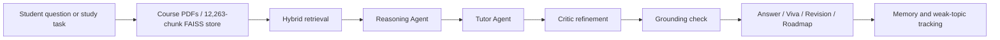

### Evidence from the implementation

- The six user-facing modules are created as Streamlit tabs at line 2315.
- The main Ask pipeline runs from retrieval through routing, reasoning, tutoring, critique, grounding, and memory at lines 2319-2427.
- The persisted FAISS index contains 12,263 vectors with 1,024 dimensions.

---

## 2. What Problem Does AcadAI Solve?

### Interview answer

AcadAI solves a trust and personalization problem in academic use of generative AI.

Generic chatbots can explain a topic, but they may not follow a university's exact syllabus, lecture notes, terminology, or expected exam style. They can also produce confident but unsupported information. On the other side, students often have hundreds of pages of notes but no fast way to search, connect, revise, or practice them.

AcadAI bridges that gap by making the student's course material the primary evidence source. It retrieves relevant passages before generation, displays the evidence used, scores the response, detects weakly supported statements, and turns the same knowledge into different learning activities.

### Problem-to-solution map

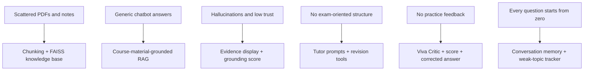

### Concrete example

If a student asks, "Explain deadlock and all four necessary conditions," AcadAI first retrieves operating-system chunks. The Tutor Agent is instructed to use only that evidence, provide a step-by-step explanation and citations, and explicitly state when evidence is missing. After generation, the Critic Agent scores relevance, completeness, accuracy, and clarity. Finally, the grounding function checks each answer sentence against the evidence.

---

## 3. Why Did You Build AcadAI?

### Interview answer

I built AcadAI because the difficult part of using AI in education is not merely generating fluent text. The difficult part is making the output syllabus-aware, trustworthy, pedagogically useful, and adaptive to the student.

I wanted to test whether multiple practical AI ideas could work together in one deployable learning system:

1. RAG for grounding answers in course notes.
2. Hybrid retrieval for both semantic meaning and exact academic terminology.
3. Specialized agents for planning, teaching, critique, and assessment.
4. Grounding checks for transparency.
5. Learning memory for continuity and personalization.

The result is a platform designed around the student's complete learning loop: ask, understand, practice, receive feedback, identify weakness, and revise.

### Motivation diagram

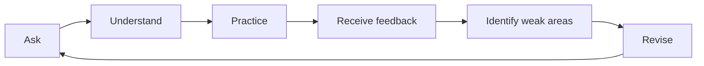

### Strong follow-up answer

> "The project began as a grounded academic Q&A system, but I realized that retrieval alone does not create a tutor. That led me to add a reasoning plan, critic loop, viva evaluation, memory, and revision workflows around the same evidence base."

---

## 4. What Makes AcadAI Different From ChatGPT?

### Interview answer

ChatGPT is a broad, general-purpose conversational model. AcadAI is a purpose-built academic workflow around an LLM.

The difference is not that AcadAI has a larger language model. Its value comes from orchestration, evidence, and learning-specific behavior.

| General-purpose ChatGPT use | AcadAI |
|---|---|
| Primarily answers from model knowledge and supplied chat context | Retrieves from uploaded notes or a 12,263-chunk academic store |
| Usually single-response generation | Reasoning, tutoring, critique, optional refinement, and grounding stages |
| Generic response style | Exam-oriented explanation, worked examples, tips, and citations |
| Limited visibility into evidence | Displays source, page, subject, score, and evidence preview |
| No built-in course retrieval evaluation | Includes a retrieval evaluation dashboard |
| No project-specific weak-topic workflow | Updates weak topics from low grounding and low viva scores |
| General conversation | Ask, Viva, Roadmap, Revision, Evaluation, and Memory workspaces |

### Architectural difference

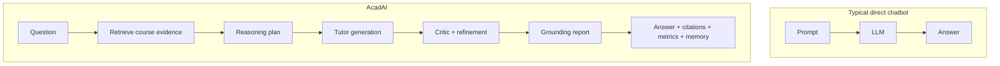

### Important nuance

AcadAI still uses an LLM, so it does not eliminate all model risk. Its contribution is to constrain, inspect, and improve the model's behavior through retrieval and verification layers.

---

## 5. What Are the Major Components of AcadAI?

### Interview answer

I divide AcadAI into six major layers:

1. **Interaction layer:** Streamlit UI with Ask, Viva Studio, Roadmap, Revision Suite, Evaluation, and Memory.
2. **Knowledge ingestion layer:** PDF extraction with `pypdf`, cleaning, and overlapping text chunking.
3. **Retrieval layer:** BGE embeddings, FAISS dense search, TF-IDF lexical scoring, keyword overlap, subject filtering, source boosts, fallbacks, optional cross-encoder reranking, and adjacent-context expansion.
4. **Agent layer:** Router, Reasoning, Tutor, Critic, and refinement loop.
5. **Trust layer:** citations, evidence inspection, per-answer quality scores, and sentence-level grounding estimation.
6. **Personalization layer:** conversation memory, student profile, quiz attempts, adaptive difficulty, weak topics, saved flashcards, and roadmaps.

### Component architecture

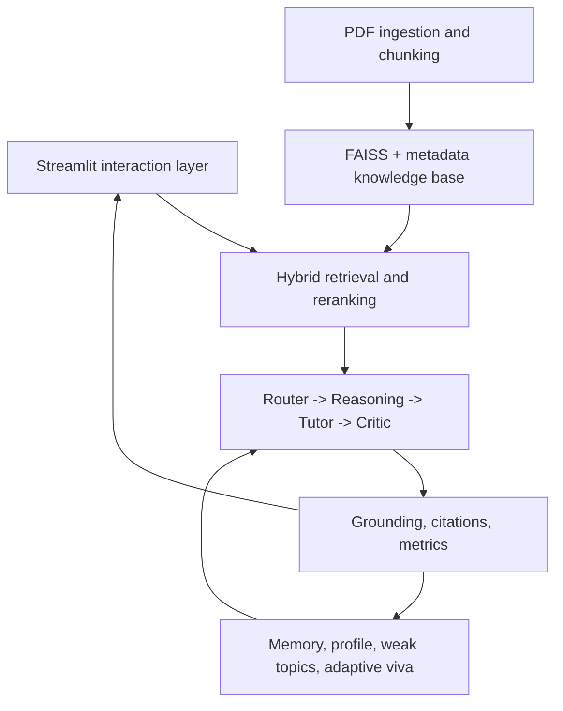

### Real ingestion code

```python
def split_text(text: str, source: str, page: int,
               chunk_size: int = 512, overlap: int = 64) -> List[Chunk]:
    text = clean_text(text)
    if not text:
        return []
    chunks, start, idx = [], 0, 1
    while start < len(text):
        part = text[start: start + chunk_size]
        if len(part) > 60:
            chunks.append(Chunk(f"{source}::{page}.{idx}", source, page, part))
        start += max(1, chunk_size - overlap)
        idx += 1
    return chunks
```

This creates overlapping 512-character chunks so concepts split near a chunk boundary still retain nearby context.

---

## 6. Explain AcadAI in 30 Seconds

### Interview script

> "AcadAI is a multi-agent AI tutor that answers from a student's own notes. When a student asks a question, AcadAI searches a FAISS knowledge base using hybrid semantic and lexical retrieval, then a Reasoning Agent plans the answer, a Tutor Agent explains it, a Critic Agent evaluates and can refine it, and a grounding layer checks support against the retrieved evidence. The same platform also provides viva practice, revision notes, flashcards, roadmaps, conversation memory, and weak-topic tracking."

### 30-second visual

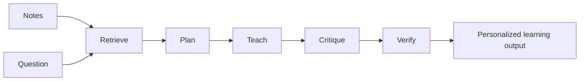

---

## 7. Explain AcadAI in 2 Minutes

### Interview script

> "AcadAI is a personalized academic learning platform built with Python, Streamlit, Mistral, Sentence Transformers, and FAISS. The goal is to make AI answers useful and trustworthy for university students by grounding them in the student's own notes.
>
> The application begins with a knowledge layer. Uploaded PDFs are parsed page by page and split into overlapping chunks. For the prepared corpus, I built a FAISS IndexFlatL2 containing 12,263 chunks from 323 source paths, using 1,024-dimensional BGE-large embeddings.
>
> When a student asks a question, AcadAI expands the query, detects the likely subject, retrieves a larger candidate set from FAISS, and reranks it using a weighted hybrid score: 45 percent dense similarity, 40 percent TF-IDF lexical similarity, and 15 percent keyword overlap. It can also apply source and subject boosts, keyword fallbacks, optional cross-encoder reranking, and adjacent-context expansion.
>
> The retrieved evidence then enters a multi-agent workflow. The Router decides between RAG, direct LLM, or web fallback. The Reasoning Agent identifies key concepts and builds a solution plan. The Tutor Agent creates an exam-oriented answer with examples and citations. The Critic scores relevance, completeness, accuracy, and clarity, and can send feedback for another refinement pass. A grounding function then estimates how many answer statements are supported by the evidence.
>
> Beyond Q&A, the same retrieval system powers viva questions and answer evaluation, adaptive difficulty, weak-topic tracking, personalized roadmaps, revision notes, exam questions, flashcards, and conversation memory. So the main contribution is not just a chatbot; it is an integrated academic learning workflow built around evidence and feedback."

### End-to-end sequence

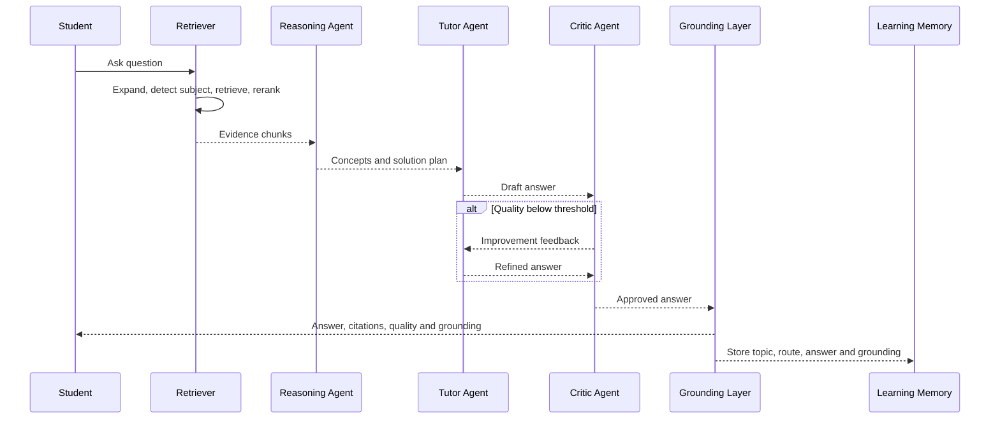

---

## 8. Who Are the Target Users?

### Interview answer

The primary target users are B.Tech and computer-science students who have subject notes, PDFs, or institutional learning material and need faster, more structured exam and viva preparation.

Secondary users are:

- Faculty members who want an assistant grounded in their own course material.
- Universities that want an institution-specific academic copilot.
- EdTech platforms that want course-specific tutoring and assessment workflows.
- Interview candidates who want technical viva practice and revision support.

### Persona map

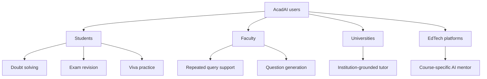

### Scope honesty

The current subject detection map is strongest for computer-science and B.Tech topics such as CN, OS, DBMS, DSA, Python, Web, Software Engineering, ML, Data Warehousing, Data Analytics, and Human Values. The corpus includes wider B.Tech material, but the explicit routing heuristics are currently CS-heavy.

---

## 9. What Are the Key Features of AcadAI?

### Interview answer

The key features are:

1. **Notes-based Q&A:** answers from uploaded PDFs, a prebuilt FAISS store, or a small demo corpus.
2. **Advanced hybrid retrieval:** semantic, lexical, keyword, source, and subject signals.
3. **Multi-agent answer pipeline:** Router, Reasoning, Tutor, Critic, and refinement.
4. **Grounding and hallucination visibility:** sentence-support ratio, unsupported statement list, status, and citations.
5. **Conversation memory:** recent turns are added to generation context for follow-up questions.
6. **Viva Studio:** generates five viva questions and evaluates student answers.
7. **Adaptive learning:** quiz scores affect recommended difficulty; low scores and low grounding update weak topics.
8. **Revision Suite:** revision notes, likely exam questions, and flashcards.
9. **Personalized Roadmap:** uses student profile, goals, evidence, and weak topics.
10. **Evaluation dashboard:** measures live subject-level retrieval hit rate across configurable queries.
11. **Fallback behavior:** TF-IDF retrieval and deterministic study outputs keep the app usable when optional AI services are unavailable.

### Feature map

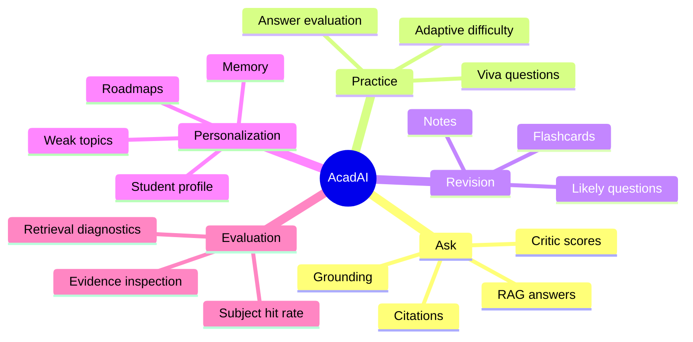

---

## 10. What Technologies Were Used?

### Interview answer

AcadAI is a Python application with Streamlit as the UI and orchestration layer. It calls the Mistral chat-completions API for generation and agent behavior. It uses Sentence Transformers with `BAAI/bge-large-en-v1.5` for 1,024-dimensional embeddings and FAISS for vector search. TF-IDF and cosine similarity from scikit-learn provide lexical reranking and a non-FAISS fallback. `pypdf` handles PDF extraction, while NumPy and Pandas support scoring and dashboards. Requests and BeautifulSoup implement optional DuckDuckGo and Wikipedia web fallback.

### Stack by layer

| Layer | Technology | Why it is used |
|---|---|---|
| UI and workflow | Streamlit | Rapid interactive academic dashboard |
| Language | Python | AI/ML ecosystem and simple orchestration |
| LLM | Mistral API | Reasoning, tutoring, critique, quiz, and revision generation |
| Embeddings | Sentence Transformers, BGE-large | Semantic representation of questions and chunks |
| Vector retrieval | FAISS `IndexFlatL2` | Fast nearest-neighbor search over 12,263 vectors |
| Lexical retrieval | scikit-learn TF-IDF + cosine similarity | Exact-term relevance and fallback retrieval |
| Optional reranker | CrossEncoder MiniLM | More precise query-document ranking |
| PDF parsing | `pypdf` | Extract page text from uploads |
| Data and scoring | NumPy, Pandas | Ranking calculations and evaluation tables |
| Web fallback | Requests, BeautifulSoup, DuckDuckGo, Wikipedia | Current or missing-information fallback |
| Configuration | `.env`, Streamlit secrets | API key and model settings |

### Real LLM call

```python
r = requests.post(
    "https://api.mistral.ai/v1/chat/completions",
    headers={
        "Authorization": f"Bearer {mistral_key}",
        "Content-Type": "application/json",
    },
    json={
        "model": os.getenv("MISTRAL_MODEL") or "mistral-large-latest",
        "temperature": 0.1,
        "messages": messages,
    },
    timeout=30,
)
```

Low temperature is used because academic answers should be stable and evidence-focused rather than highly creative.

---

## 11. What Was Your Role in the Project?

### Interview answer

Use this wording only if it accurately reflects your contribution:

> "I worked as the end-to-end developer and system designer. I designed the multi-agent learning workflow, implemented PDF ingestion and hybrid retrieval, integrated the Mistral API and FAISS store, built the grounding and evaluation logic, created the Streamlit learning modules, and prepared the project documentation and impact analysis. I also iterated on the retrieval behavior and UI based on failure cases such as cross-subject retrieval and weak evidence."

### Evidence-backed responsibility map

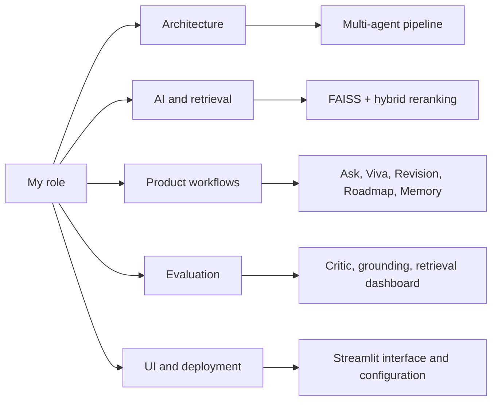

### Strong technical follow-up

> "The hardest part of my role was not calling the LLM. It was defining the contracts between retrieval, generation, critique, verification, and learning memory so the overall experience remained useful even when one component was weak or unavailable."

---

## 12. What Was the Biggest Challenge?

### Interview answer

The biggest challenge was reliable retrieval from a large, mixed academic corpus.

The stored knowledge base has 12,263 chunks from 323 source paths. Many B.Tech subjects share vocabulary. For example, "process," "network," "model," or "classification" can appear in multiple subjects. Pure semantic similarity can therefore retrieve a broadly related but academically wrong chunk. Exact keyword search has the opposite problem: it can miss paraphrases and conceptual similarity.

I addressed this with a layered retrieval strategy:

1. Expand academic acronyms and subject terms.
2. Detect likely subject from the query.
3. Retrieve a large candidate pool from FAISS.
4. Normalize dense scores.
5. Compute TF-IDF lexical scores and keyword overlap.
6. Combine the three signals.
7. Apply source and subject boosts.
8. Reject weak cross-subject candidates.
9. Mix in keyword fallback when dense results are weak.
10. Expand adjacent chunks for fuller context.

### Real hybrid scoring code

```python
if use_hybrid_rerank:
    hybrid = (
        0.45 * float(dense_norm[i])
        + 0.40 * float(lex[i])
        + 0.15 * float(overlaps[i])
    )
else:
    hybrid = float(dense_norm[i])

hybrid += source_subject_boost(c_for_boost.source, required_subjects_for_boost)
if is_subnetting_query(query):
    hybrid += 0.25 * cn_keyword_score(candidate_texts[i])
```

### Retrieval flow

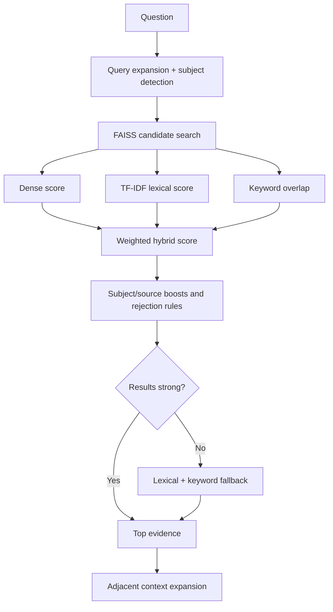

### Honest limitation

The current subject classifier is heuristic and keyword-based. It is effective for known B.Tech domains, but a learned classifier or richer metadata pipeline would scale better.

---

## 13. What Was the Most Innovative Part?

### Interview answer

The most innovative part is the integration of trust and learning adaptation around RAG.

Many RAG systems stop after "retrieve and generate." AcadAI continues through critique, optional refinement, grounding estimation, memory storage, weak-topic updates, and reuse of the same evidence for viva and revision workflows.

This means a weak answer is not only displayed. It can be identified by the Critic, refined, checked for evidence support, and used as a signal that the student may need more practice on that topic.

### Feedback-loop architecture

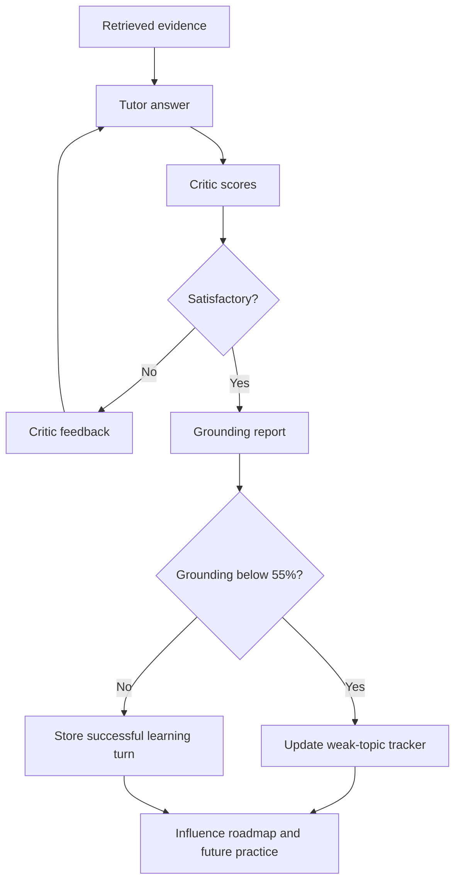

### Real grounding code

```python
for sent in sents:
    overlap = keyword_overlap(sent, evidence_text)
    sent_terms = [t for t in tokenize(sent) if len(t) > 3]
    evidence_hits = sum(1 for t in set(sent_terms)
                        if t in evidence_text.lower())
    support_ratio = evidence_hits / max(1, len(set(sent_terms)))
    if overlap >= 0.18 or support_ratio >= 0.28:
        supported += 1
    else:
        unsupported.append(sent)

score = round((supported / max(1, len(sents))) * 100, 1)
```

### Important nuance

This grounding method is a transparent lexical support heuristic, not a formal factual-verification model. Its strength is interpretability and low cost; its limitation is that paraphrased support or subtly incorrect claims may be misclassified.

---

## 14. What Metrics Did You Use to Evaluate Success?

### Interview answer

I evaluated AcadAI at three levels: retrieval quality, answer quality, and learning-system behavior.

### 1. Retrieval metrics

The project documentation records:

| Metric | Documented result | Meaning |
|---|---:|---|
| Precision@1 | 1.00 | Top result was relevant in the experiment |
| Recall@4 | 1.00 | All relevant items were found within the top four |
| MRR | 1.00 | First relevant result appeared at rank one |
| nDCG@4 | 0.9277 | Relevant results were ranked near the top |
| F1@4 | 0.7937 | Balance of precision and recall at four |

The live Evaluation tab currently performs a 12-query, subject-labelled benchmark and displays subject-level hit rate, top source, page, hybrid score, overlap, evidence preview, and retrieval reason.

### 2. Answer metrics

Every answer is scored on:

- Relevance
- Completeness
- Accuracy
- Clarity
- Overall quality
- Evidence count
- Whether review is needed
- Response time
- Grounding score
- Supported versus unsupported statements

### 3. Learning metrics

- Viva score out of 10
- Recent average score for adaptive difficulty
- Weak-topic counts
- Conversation and grounding history

### Evaluation pyramid

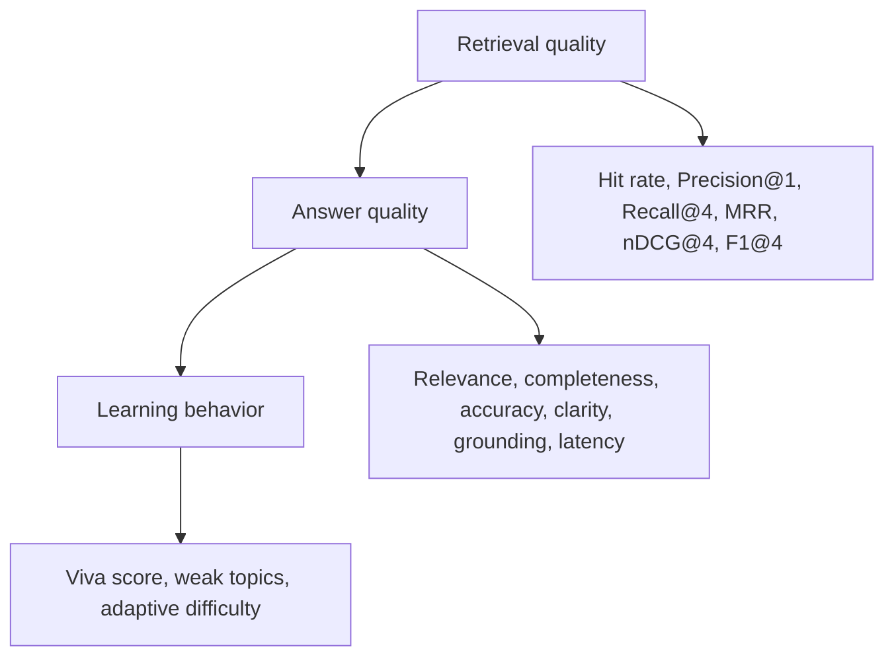

### Critical interview honesty

The Critic's fallback "accuracy" score is a heuristic default of 7.5 when Mistral is unavailable; it is not an external factual accuracy measurement. Similarly, the live dashboard computes hit rate, while the ranking metrics above are documented separately. A stronger next version should implement a reproducible labelled evaluation script and human assessment.

---

## 15. If Given Six More Months, What Would You Improve?

### Interview answer

I would focus on moving AcadAI from a strong prototype to a measurable, persistent, and scalable learning platform.

### Priority 1: Build a rigorous evaluation harness

I would create a versioned benchmark dataset containing queries, relevant chunk IDs, ideal answers, and human ratings. The system would automatically compute Precision@k, Recall@k, MRR, nDCG, answer faithfulness, citation precision, latency, and cost. This would turn documented results into reproducible CI metrics.

### Priority 2: Improve grounding and retrieval intelligence

I would replace the keyword-only grounding heuristic with a claim-evidence verification model, add learned reranking, and introduce richer metadata and knowledge-graph relationships. This would improve paraphrase handling and reduce cross-subject confusion.

### Priority 3: Add persistent multi-user learning profiles

Current learning state is stored in Streamlit session state, so it is temporary and browser-session-specific. I would add authentication and a database for long-term profiles, spaced-repetition scheduling, mastery estimates, and progress dashboards.

### Priority 4: Add multimodal and voice learning

I would add OCR for scanned or handwritten notes, diagram understanding, image-grounded explanations, and a voice-based viva mode.

### Priority 5: Production engineering

I would split the single large Streamlit file into services and modules, add tests, background ingestion jobs, observability, API-level security, rate limiting, caching, and deployment automation.

### Six-month roadmap

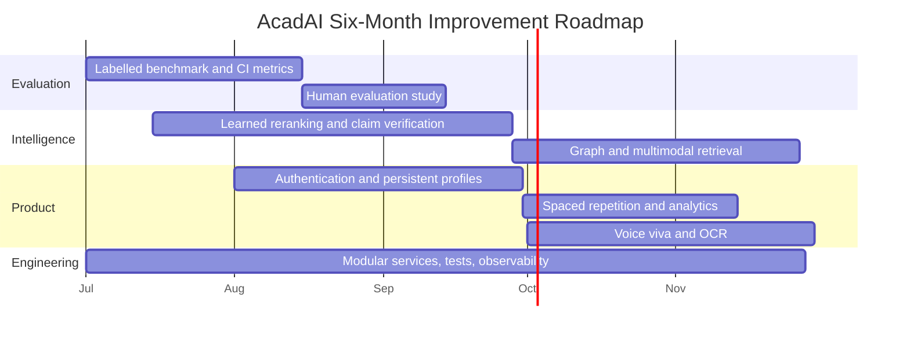

### Strong closing sentence

> "My six-month goal would be to preserve AcadAI's evidence-grounded learning experience while making every quality claim reproducible, every student profile persistent, and every subsystem production-ready."

---

## Real Ask-Pipeline Code to Explain on a Whiteboard

This simplified excerpt follows the actual source flow:

```python
# 1. Retrieve evidence
db_rows, match = retrieve_faiss(query, faiss_index, chunks, embedding_model_name)

# 2. Route and plan
route, tr_router = router_agent(query, match["match"], use_web)
plan, tr_reasoning = reasoning_agent(query)

# 3. Add recent learning context only to generation
memory_context = build_memory_context(memory_turns) if use_memory else ""
query_for_generation = query
if memory_context:
    query_for_generation = (
        f"Current student question: {query}\n\n"
        f"Recent conversation memory for context:\n{memory_context}"
    )

# 4. Generate, critique, and refine
answer, tr_tutor = tutor_agent(
    query_for_generation, difficulty, db_rows, [], route, plan
)
scores, tr_critic = critic_agent(query, answer)

while not scores.get("satisfactory") and refine_count < max_refine:
    answer = refine_answer(query, answer, scores["feedback"], difficulty)
    scores, tr_critic = critic_agent(query, answer)

# 5. Verify grounding and store learning state
grounding_report = calculate_grounding_report(answer, db_rows)
store_conversation_turn(query, answer, route, db_rows, grounding_report["score"])
```

The most important design decision here is that retrieval, generation, evaluation, verification, and memory are separate responsibilities. That makes the workflow easier to inspect, improve, and explain than a single large prompt.

---

## Likely Interview Follow-Ups and Honest Answers

### Is this truly a multi-agent system?

Yes, in the practical orchestration sense: specialized functions use different system prompts, responsibilities, outputs, and a critique-refinement loop. It is not currently implemented with an autonomous-agent framework such as LangGraph, and the agents execute sequentially inside one Streamlit application.

### Does grounding guarantee factual correctness?

No. It estimates lexical support against retrieved evidence. It improves transparency and flags weak support, but a stronger verifier and human evaluation are still needed.

### Is memory permanent?

No. Current memory uses `st.session_state`, keeps the last 30 chat turns, and lasts for the current session. Persistent profiles are future work.

### Does PDF upload update the persisted FAISS index?

No. Uploaded PDFs are parsed into temporary chunks and searched using TF-IDF in the current session. The existing persisted FAISS store is loaded separately. A production version should asynchronously embed uploads and update a user-specific vector store.

### What happens without Mistral or FAISS?

The app degrades gracefully. Without Mistral, it uses deterministic fallback plans, scores, answers, quizzes, roadmaps, and revision templates. Without FAISS, it searches the active chunks with TF-IDF cosine similarity.

### What is the main current architectural limitation?

Most logic and UI live in one large Python file. That made rapid prototyping efficient, but production development should separate ingestion, retrieval, agents, evaluation, persistence, and UI into tested modules or services.

---

## Source Reference Map

All references below point to `acadai_app_final_mistral_faiss.py`.

| Topic | Lines |
|---|---:|
| Core configuration and subject maps | 34-94 |
| Demo corpus | 112-150 |
| PDF chunking and ingestion | 176-214 |
| FAISS metadata loading | 238-312 |
| Query expansion and subject detection | 318-516 |
| Hybrid FAISS retrieval | 617-797 |
| TF-IDF fallback retrieval | 801-832 |
| Web fallback | 836-882 |
| Mistral API call | 884-920 |
| Router, Reasoning, Tutor, Critic agents | 923-1098 |
| Answer metrics | 1100-1121 |
| Memory and grounding | 1124-1195 |
| Viva and adaptive difficulty | 1198-1271 |
| Roadmap, flashcards, and revision | 1274-1340 |
| UI configuration and corpus selection | 2231-2315 |
| End-to-end Ask flow | 2319-2427 |
| Viva Studio | 2509-2573 |
| Roadmap and weak-topic tracker | 2576-2618 |
| Revision Suite | 2620-2649 |
| Retrieval Evaluation dashboard | 2652-2730 |
