# AcadAI Interview Guide: Section 10 - Critic Agent

This section answers questions 131-140 using AcadAI's actual Critic Agent, deterministic fallback formulas, Tutor refinement loop, grounding detector, UI metrics, project documentation, and cited research.

## Verified Critic Facts

| Item | Actual implementation |
|---|---|
| Critic input | Original query and first 1,500 characters of the answer |
| Primary evaluator | Mistral prompted to return JSON scores |
| Evaluated dimensions | Relevance, completeness, accuracy, clarity |
| Score range requested | 0-10 |
| Overall score | Requested from Mistral; fallback uses equal arithmetic mean |
| Acceptance threshold | `overall >= 7` is requested; fallback enforces it |
| Maximum refinement loops | Configurable 0-3; default 1 |
| Fallback relevance | Query-term overlap with answer |
| Fallback completeness | Answer word count |
| Fallback accuracy | Fixed at `7.5` |
| Fallback clarity | Base score plus example/citation markers |
| Separate grounding check | Runs after the Critic loop |
| Final behavior after rejection limit | Latest answer is still displayed and marked as needing review |

> Interview precision: AcadAI's Critic is an LLM-as-judge with a lightweight heuristic fallback. It is a useful quality-control mechanism, but it is not a formal factual verifier, human grader, or trained reward model.

---

## Critic Architecture

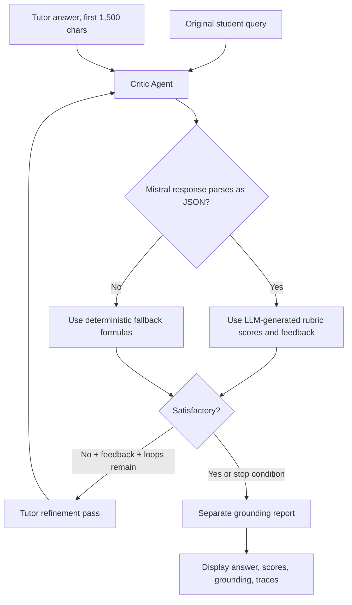

---

## 131. What Metrics Does the Critic Agent Evaluate?

### Interview answer

AcadAI's Critic evaluates four answer-quality dimensions:

1. **Relevance:** Does the answer address the student's question?
2. **Completeness:** Does it cover enough of the requested topic?
3. **Accuracy:** Is the answer factually correct?
4. **Clarity:** Is the explanation understandable and well presented?

It also returns:

- An overall score.
- A `satisfactory` boolean.
- Written improvement feedback when the answer is unsatisfactory.

### Real Critic contract

```python
system = (
    "You are AcadAI's Critic Agent. Evaluate strictly on four dimensions. "
    "Return ONLY valid JSON with keys: relevance (0-10), completeness (0-10), "
    "accuracy (0-10), clarity (0-10), overall (0-10), "
    "satisfactory (true if overall>=7 else false), "
    "feedback (improvement note if not satisfactory, else empty string). No markdown."
)
```

### Metric relationship

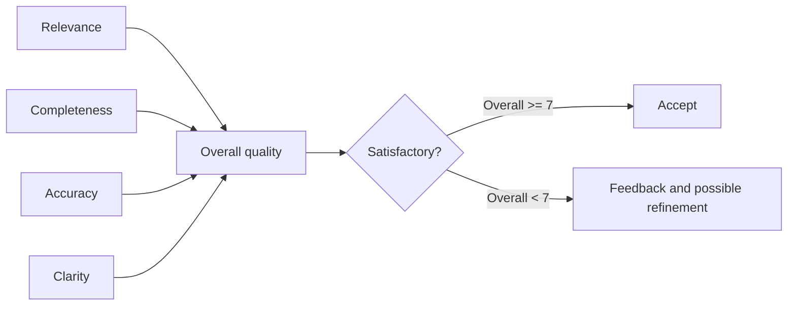

### Important distinction

The grounding score is not one of the four Critic scores. It is calculated separately after refinement by comparing answer sentences with retrieved evidence.

---

## 132. How Are Relevance Scores Computed?

### Interview answer

There are two paths.

**Normal Mistral path:** the Critic prompt asks Mistral to judge relevance from the original query and generated answer. The code does not define a numeric relevance rubric beyond the requested 0-10 range.

**Fallback path:** relevance is computed from keyword overlap between query terms and answer terms.

### Fallback formula

Let:

- `Q` be the unique query tokens longer than two characters.
- `A` be all answer tokens.
- `O = |Q intersection A| / |Q|`.

Then:

```text
relevance = min(10, 5 + 10 * O)
```

### Real code

```python
def keyword_overlap(query: str, text: str) -> float:
    query_terms = {t for t in tokenize(query) if len(t) > 2}
    if not query_terms:
        return 0.0
    return len(query_terms & set(tokenize(text))) / len(query_terms)

rel = min(10.0, 5 + keyword_overlap(query, answer) * 10)
```

### Example

For the query `"Explain deadlock prevention"`:

- Query terms: `{explain, deadlock, prevention}`
- If the answer includes `deadlock` and `prevention`, overlap is `2/3`.
- Fallback relevance is `5 + 10(2/3) = 11.67`, capped at `10`.

### Relevance flow

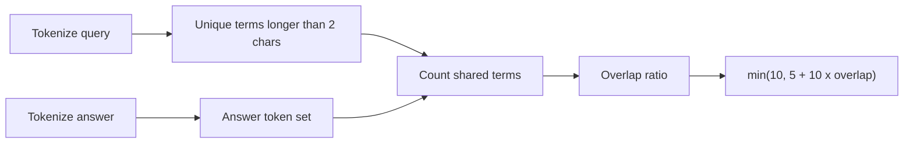

### Limitation

Keyword overlap can reward an answer that repeats the question without answering it. It can also underrate a correct answer that uses synonyms. This fallback is a relevance signal, not semantic understanding.

---

## 133. How Are Completeness Scores Computed?

### Interview answer

**Normal Mistral path:** Mistral judges whether the response sufficiently covers the query. However, it sees only the query and answer, not an explicit checklist of required concepts or the Reasoning Agent's plan.

**Fallback path:** completeness is estimated entirely from answer word count.

### Fallback formula

```text
completeness = min(10, 4 + word_count / 80)
```

### Real code

```python
words = len(answer.split())
comp = min(10.0, 4 + words / 80)
```

### Example values

| Answer length | Fallback completeness |
|---:|---:|
| 80 words | 5.0 |
| 160 words | 6.0 |
| 240 words | 7.0 |
| 480 words | 10.0 |

### Completeness flow

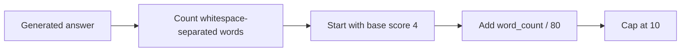

### Limitation

Length is not true completeness. A long repetitive answer can score highly, while a short but fully sufficient answer can score poorly. A stronger implementation would compare the answer against the Reasoning Agent's required concepts and evidence coverage.

---

## 134. How Are Clarity Scores Computed?

### Interview answer

**Normal Mistral path:** Mistral judges clarity as part of the rubric, but no detailed sub-rubric is enforced in code.

**Fallback path:** clarity starts at `7.0`, gains `1.0` when the answer contains an example marker, and gains `0.5` when bracket-like citation markers appear.

### Fallback formula

```text
clarity = 7.0
        + 1.0 if an example marker exists
        + 0.5 if citation brackets exist
```

### Real code

```python
has_example = any(
    kw in answer.lower()
    for kw in ["example", "e.g.", "for instance", "such as"]
)
has_cite = "[" in answer and "]" in answer
cla = 7.0 + (1.0 if has_example else 0) + (0.5 if has_cite else 0)
```

### Clarity scoring map

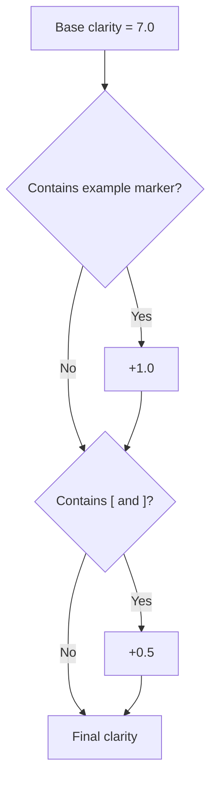

### Limitation

This does not measure sentence complexity, organization, ambiguity, grammar, readability, or whether the example is helpful. It checks surface markers. The maximum fallback clarity is `8.5`.

---

## 135. How Are Accuracy Scores Computed?

### Interview answer

Accuracy is the weakest Critic dimension in the current implementation.

**Normal Mistral path:** Mistral assigns an accuracy score after seeing only the query and the first 1,500 characters of the answer. The Critic does not receive retrieved evidence, citations, or a reference answer. Therefore, it is an LLM judgment, not evidence-based verification.

**Fallback path:** accuracy is always fixed at `7.5`.

### Real code

```python
acc = 7.5
```

### Accuracy versus grounding

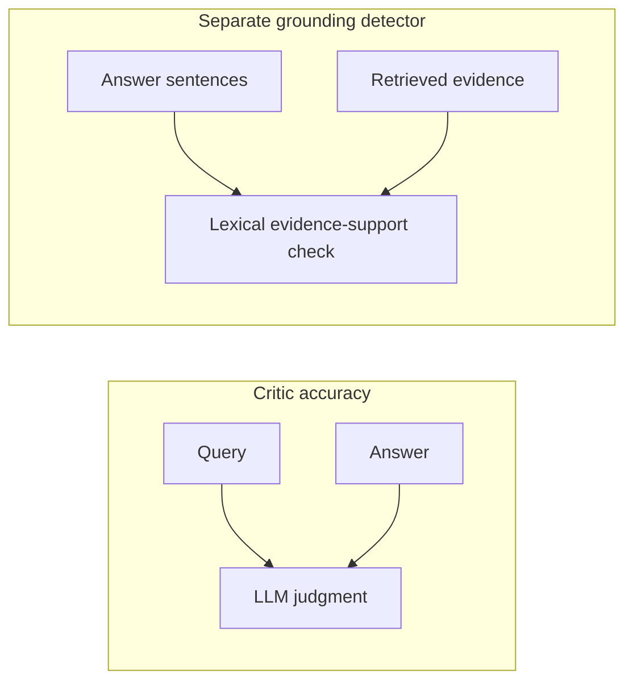

### Separate grounding formula

After the Critic loop, AcadAI checks each sufficiently long answer sentence. It marks a sentence supported when either:

```text
keyword_overlap(sentence, evidence) >= 0.18
OR
support_ratio >= 0.28
```

The final grounding score is:

```text
supported_sentences / total_sentences * 100
```

### Interview-safe statement

> "The Critic's accuracy score is an LLM judgment and becomes a fixed heuristic in fallback mode. Real evidence support is approximated separately by the grounding detector. I would not claim that either mechanism proves factual correctness."

---

## 136. Why Use a Critic Agent?

### Interview answer

A single generation pass can be incomplete, unclear, overly generic, or poorly structured. The Critic creates a deliberate review stage before final display.

It provides four practical benefits:

- Converts vague quality concerns into explicit scores.
- Generates targeted improvement feedback.
- Triggers a bounded revision pass.
- Exposes answer-quality metrics to the user.

### Generator versus evaluator separation

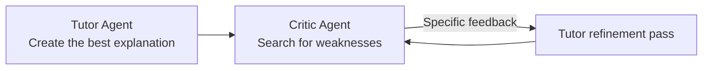

The Tutor and Critic use different prompts even though they normally use the same underlying Mistral model. This role separation can focus the second call on evaluation rather than generation.

### Why the loop is bounded

More refinement is not always better. Repeated calls increase latency and cost, and later revisions can introduce new mistakes or optimize for the rubric rather than the student's need. AcadAI therefore allows only 0-3 refinement loops.

---

## 137. What Research Inspired This Design?

### Interview answer

The project's documented research basis for the Critic Agent is:

- **Wang et al., "Unleashing the Emergent Cognitive Synergy in Large Language Models: A Task-Solving Agent through Multi-Persona Self-Collaboration."** The project connects its separate Tutor/Critic roles and iterative critique to multi-persona collaboration.

The implementation is also conceptually similar to two important feedback-loop approaches, although the repository does not explicitly name them as direct inspirations:

- **Self-Refine:** generate an initial response, obtain language feedback, and iteratively refine the response.
- **Reflexion:** use verbal feedback and reflection to improve later attempts without updating model weights.

### Research-to-implementation map

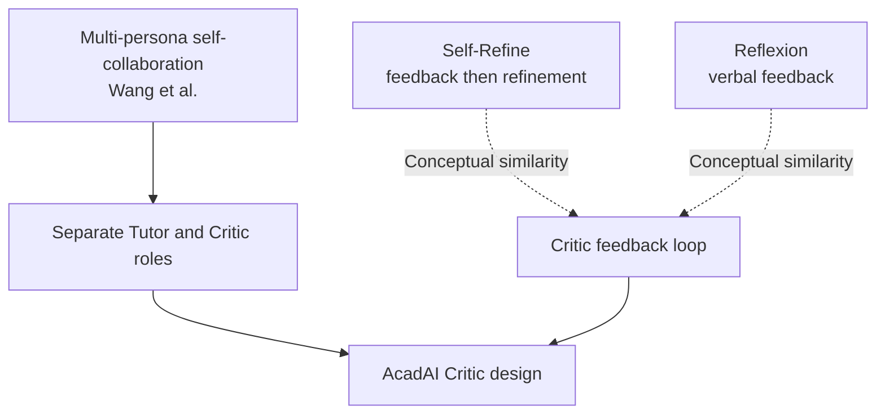

### Honest distinction

AcadAI is not a faithful implementation of any of these complete research systems:

- It uses a fixed central orchestration loop.
- It does not train or update model weights.
- It does not keep Critic reflections in long-term episodic memory.
- It does not dynamically create multiple personas.
- It does not reproduce the papers' benchmark evaluations.

### Primary research links

- [Wang et al. - Multi-Persona Self-Collaboration](https://arxiv.org/abs/2307.05300)
- [Madaan et al. - Self-Refine](https://arxiv.org/abs/2303.17651)
- [Shinn et al. - Reflexion](https://arxiv.org/abs/2303.11366)

---

## 138. How Does the Feedback Loop Work?

### Interview answer

After the Tutor generates a draft, the orchestrator sends the original query and draft answer to the Critic. The Critic returns scores, a satisfactory flag, and feedback.

Refinement runs only while all three conditions are true:

1. The answer is not satisfactory.
2. The configured refinement limit has not been reached.
3. The Critic supplied non-empty feedback.

The Tutor refinement pass receives the original answer, feedback, query, and difficulty. It is instructed to retain correct content and address only the weaknesses. The revised answer is then scored again.

### Real orchestration code

```python
scores, tr_critic = critic_agent(query, answer)
refine_count = 0

while (
    not scores.get("satisfactory")
    and refine_count < max_refine
    and scores.get("feedback")
):
    answer = refine_answer(query, answer, scores["feedback"], difficulty)
    scores, tr_critic2 = critic_agent(query, answer)
    refine_count += 1
```

### Sequence diagram

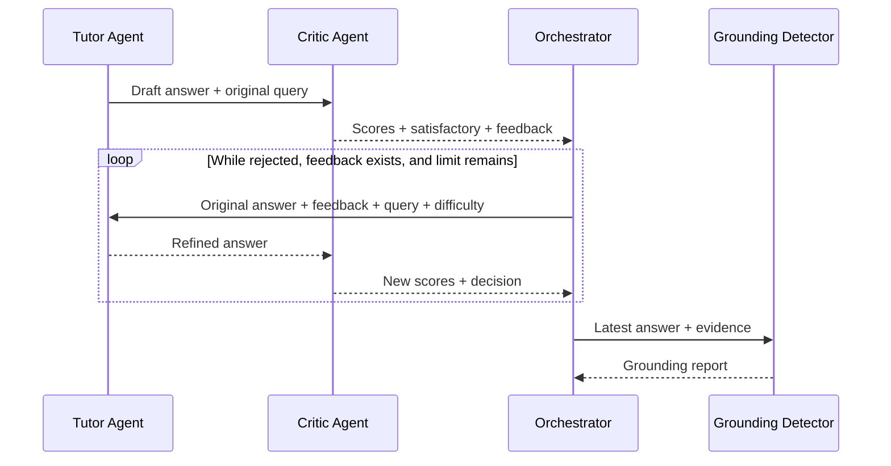

### Important implementation truth

Grounding is calculated after the Critic loop. Low grounding updates the weak-topic tracker, but the current code does not send unsupported sentences back through another Tutor correction loop.

---

## 139. What Happens When Scores Are Low?

### Interview answer

Low individual scores matter only through the Critic's returned `satisfactory` flag and feedback. In fallback mode, the overall score is the equal average of the four dimensions:

```text
overall = (relevance + completeness + accuracy + clarity) / 4
```

The fallback marks the answer satisfactory when overall is at least `7.0`.

### Real fallback decision

```python
overall = round((rel + comp + acc + cla) / 4, 1)
scores = {
    "overall": overall,
    "satisfactory": overall >= 7.0,
    "feedback": "" if overall >= 7.0
                else "Add more examples and explicit source citations."
}
```

### Low-score control flow

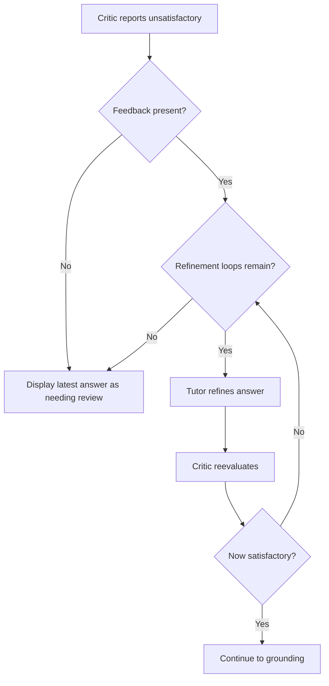

### What the user sees

- The latest answer is displayed even if it remains unsatisfactory.
- `Needs review` becomes `Yes`.
- Final Critic scores are shown.
- The number of refinement passes is visible in traces/history.
- Grounding is reported separately.

### Edge cases

- If maximum refinement is `0`, no correction is attempted.
- If feedback is empty, the loop stops even when unsatisfactory.
- If refinement's Mistral call fails, AcadAI appends a refinement note instead of producing a corrected answer.
- In the Mistral path, the code does not independently validate score bounds or enforce that `satisfactory` agrees with `overall >= 7`.

---

## 140. How Does the Critic Improve Final Quality?

### Interview answer

The Critic improves final quality by making a second pass focus specifically on weaknesses and then converting those weaknesses into instructions for revision.

For example:

- Low relevance feedback can push the Tutor back toward the actual question.
- Low completeness feedback can request missing concepts.
- Low clarity feedback can request simpler structure or examples.
- Low accuracy feedback can request corrections, although the current Critic lacks evidence for rigorous factual verification.

### Quality-improvement mechanism

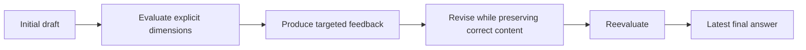

### Real refinement prompt

```python
system = (
    "You are AcadAI's Tutor Agent in a refinement pass. "
    "Improve the answer based on the Critic Agent's feedback. "
    "Keep all correct content; address only the stated weaknesses."
)
```

### What can genuinely be claimed

The loop gives AcadAI a mechanism that can improve answers, especially structure, coverage, examples, and citations. The project documentation reports expected and observed benefits, but the source repository does not contain an ablation dataset comparing identical answers with and without the Critic. Therefore, an interviewer-safe claim is:

> "The Critic provides targeted iterative quality control, and the architecture is supported by feedback-refinement research. To quantify its actual benefit in AcadAI, I would run an ablation study using human-rated answers and evidence-based metrics."

### Recommended ablation experiment

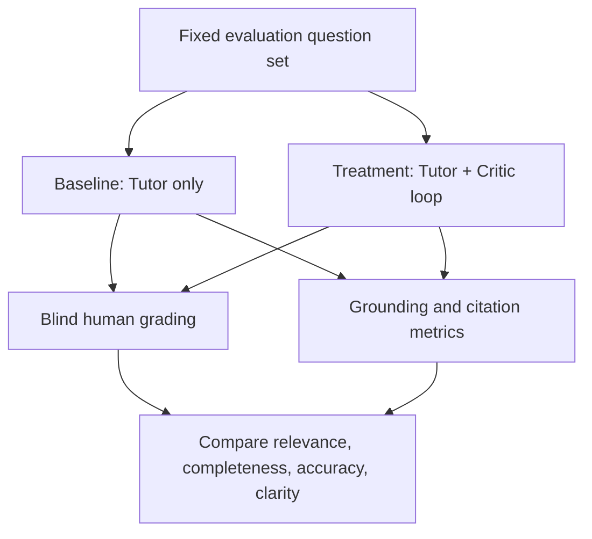

---

## Worked Fallback-Score Example

Assume:

- Query overlap is `0.30`.
- Answer length is `240` words.
- The answer contains an example.
- The answer contains bracket citations.

Then:

```text
Relevance    = min(10, 5 + 10 * 0.30) = 8.0
Completeness = min(10, 4 + 240 / 80)   = 7.0
Accuracy     = 7.5
Clarity      = 7.0 + 1.0 + 0.5         = 8.5
Overall      = (8.0 + 7.0 + 7.5 + 8.5) / 4 = 7.75, rounded to 7.8
Satisfactory = True
```

This example also reveals the fallback's limitations: the answer can pass without any factual accuracy check.

---

## Critic Versus Grounding Detector

| Property | Critic Agent | Grounding detector |
|---|---|---|
| Main purpose | General answer-quality review | Evidence-support approximation |
| Inputs | Query + first 1,500 answer characters | Full answer sentences + evidence rows |
| Output | Four scores, overall, decision, feedback | Support percentage, unsupported sentences, status |
| Can trigger refinement | Yes | No, in current source |
| Mistral-backed | Usually | No |
| Fallback behavior | Explicit heuristic score formulas | Lexical support thresholds |
| Proves factual correctness | No | No |

---

## Risks and Production Improvements

1. Give the Critic retrieved evidence, citations, and the Reasoning Agent's required-concept plan.
2. Define explicit scoring rubrics with anchors for scores 1, 5, 7, and 10.
3. Validate JSON types, score ranges, required keys, and threshold consistency.
4. Replace fixed fallback accuracy with claim-level evidence verification.
5. Use semantic entailment or an independent verifier instead of lexical support alone.
6. Evaluate the full answer instead of truncating it to 1,500 characters.
7. Use a different evaluator model to reduce correlated Tutor/Critic errors.
8. Let grounding veto or trigger correction of unsupported claims.
9. Log scores before and after refinement to measure actual gains.
10. Run blinded human-rated ablation studies and calibrate Critic scores against them.

---

## Source Reference Map

All application references point to `acadai_app_final_mistral_faiss.py`.

| Behavior | Source location |
|---|---|
| Tokenization and keyword overlap | Lines 153-170 |
| Critic Agent prompt and LLM call | Lines 1046-1055 |
| Critic JSON parsing | Lines 1056-1063 |
| Deterministic fallback formulas | Lines 1064-1076 |
| Critic trace | Lines 1077-1083 |
| Tutor refinement pass | Lines 1086-1098 |
| Metrics formatting | Lines 1103-1115 |
| Sentence-level grounding detector | Lines 1170-1195 |
| Maximum refinement slider | Line 2253 |
| Critic and refinement orchestration | Lines 2394-2405 |
| Grounding after Critic loop | Lines 2407-2418 |
| Critic score and grounding UI | Lines 2439-2465 |
| Refinement trace display | Lines 2467-2476 |
| Saved refinement count | Lines 2421-2428 |
| Documented Critic research basis | `impact.md`, Section 3 |
| Documented refinement behavior | `README.md`, Multi-Agent Refinement Loop |

---

## Final Interview Summary

> "AcadAI's Critic Agent is a post-generation quality-control component. It evaluates relevance, completeness, accuracy, and clarity, returns an overall score and improvement feedback, and can trigger up to three Tutor refinement passes. With Mistral available, the scores are LLM judgments from the query and first 1,500 answer characters. If that call fails, AcadAI uses transparent heuristic formulas: keyword overlap for relevance, word count for completeness, a fixed 7.5 for accuracy, and example/citation markers for clarity. The final grounding detector separately estimates evidence support. The design is documented as inspired by multi-persona collaboration research and is conceptually similar to Self-Refine and Reflexion, but its current metrics remain lightweight proxies. The strongest next step is evidence-aware Critic scoring plus a human-rated ablation study."
