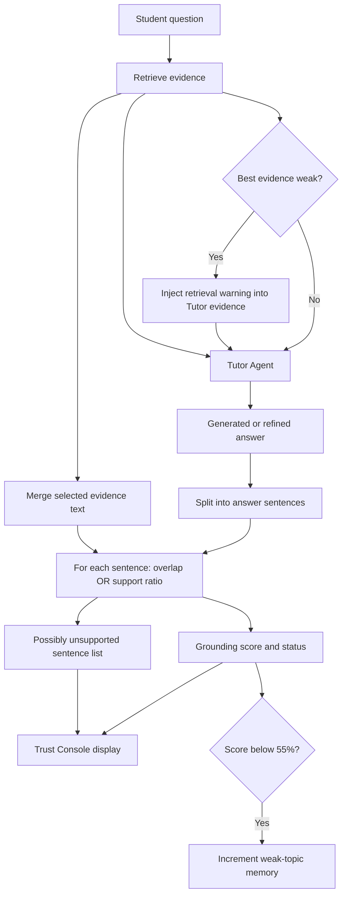
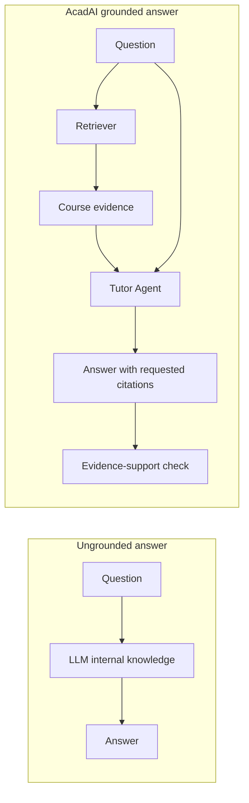
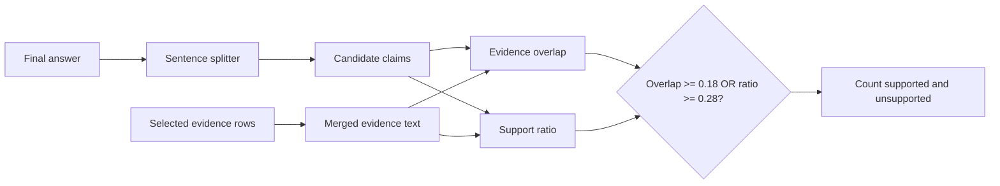
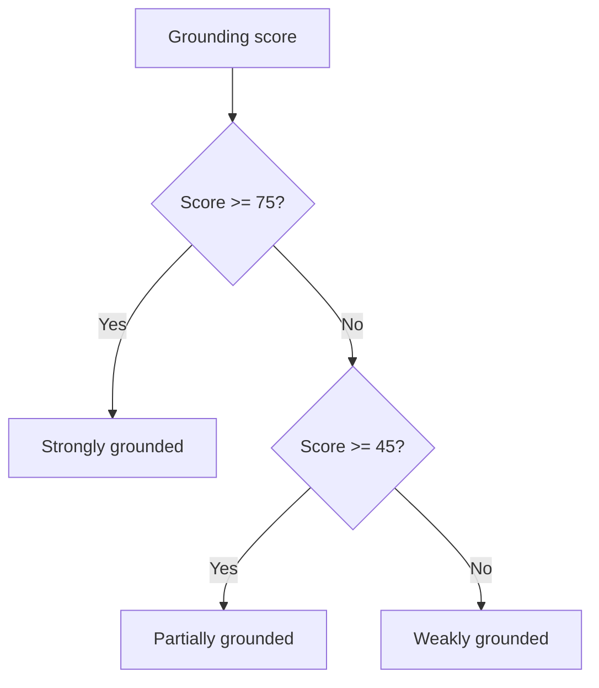
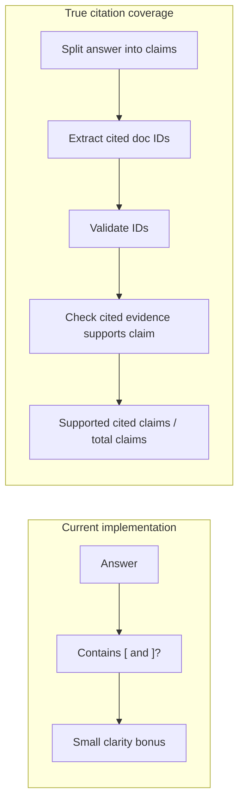
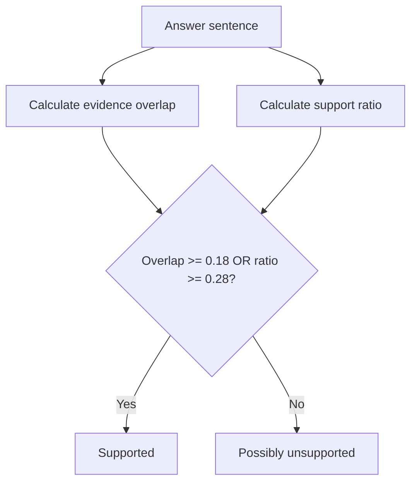
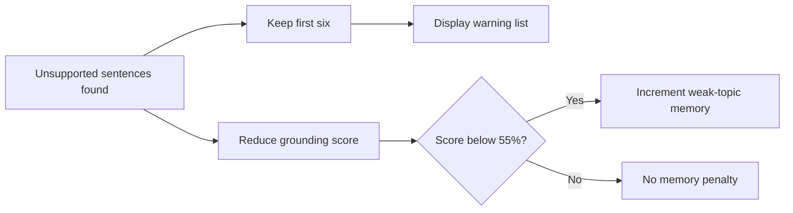
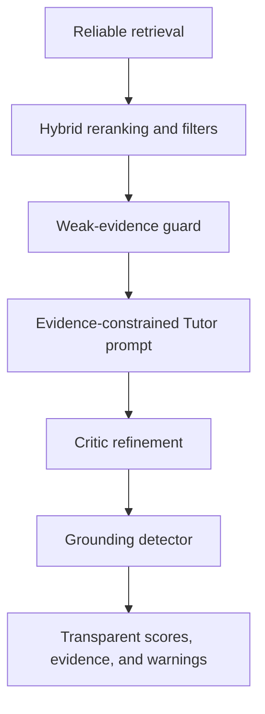
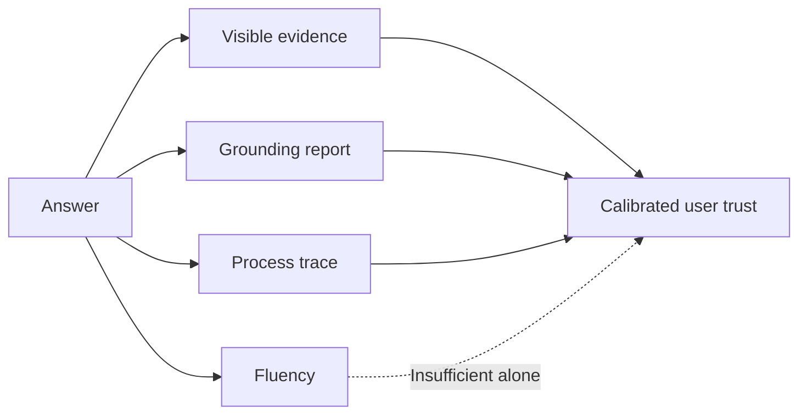
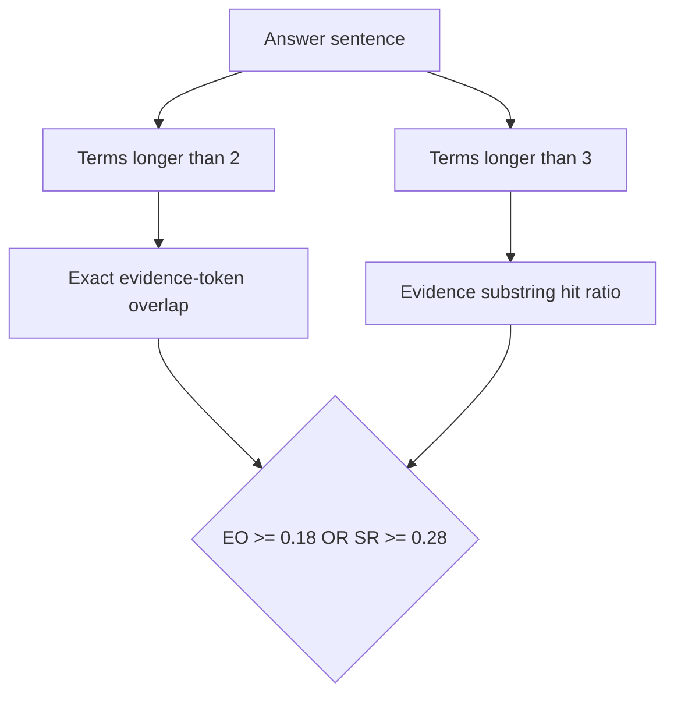

# AcadAI Interview Guide: Section 11 - Grounding and Hallucination

This section answers questions 141-150 using AcadAI's actual evidence construction, retrieval guard, Tutor prompt, sentence splitter, grounding formulas, unsupported-sentence display, weak-topic update, and trust UI.

## Verified Grounding Facts

| Item | Actual implementation |
|---|---|
| Grounding unit | Answer sentence containing at least five words |
| Evidence input | Combined `text` or `evidence` fields from selected rows |
| Sentence support rule | Evidence overlap at least `0.18` OR support ratio at least `0.28` |
| Grounding score | Supported sentences divided by total evaluated sentences, multiplied by 100 |
| Strongly grounded | Score at least 75% |
| Partially grounded | Score from 45% to below 75% |
| Weakly grounded | Score below 45% |
| No evidence behavior | Score 0%, status `No evidence` |
| Unsupported sentences retained | First six |
| Low-grounding memory action | Add `+1` weak-topic count when score is below 55% |
| Citation coverage metric | Claimed in documentation, but not implemented as a metric |
| Automatic correction after grounding | Not implemented in the current source |

> Interview precision: AcadAI's grounding detector is a lexical evidence-support approximation. It flags potentially unsupported sentences; it does not semantically prove that a claim is true or false.

---

## Complete Grounding Flow



---

## 141. What Is Grounding?

### Interview answer

Grounding means connecting a generated answer to an external source of evidence. Instead of trusting the language model solely because its response sounds confident, the system checks whether the answer is supported by the retrieved course notes or web evidence supplied during generation.

In AcadAI, grounding has two layers:

1. **Grounded generation:** the Tutor receives retrieved evidence and is instructed to use only that evidence.
2. **Post-generation grounding check:** answer sentences are compared with the selected evidence using lexical overlap.

### Grounded versus ungrounded generation



### Real Tutor instruction

```python
system = (
    "You are AcadAI's Tutor Agent - a pedagogically expert AI tutor. "
    "Generate a well-structured academic answer using ONLY the evidence provided. "
    "If evidence is weak or partially relevant, clearly say what is missing instead of guessing. "
    "Structure: (1) Concept explanation, (2) Step-by-step breakdown with worked "
    "examples, (3) Exam-oriented tips, (4) Explicit source citations."
)
```

### Strong interview statement

> "Grounding is the connection between an answer and verifiable external evidence. AcadAI first constrains the Tutor with retrieved evidence and then estimates how much of the final answer is lexically supported by that evidence."

---

## 142. How Do You Measure Grounding?

### Interview answer

AcadAI measures grounding at the sentence level.

The process is:

1. Merge the selected evidence rows into one normalized evidence string.
2. Split the answer into evaluable sentences.
3. Ignore sentence fragments with fewer than five words.
4. Calculate evidence overlap and support ratio for each sentence.
5. Mark a sentence supported if either threshold passes.
6. Divide supported sentences by all evaluated sentences.

### Real implementation

```python
def calculate_grounding_report(answer: str, evidence_rows: List[Dict]) -> Dict:
    evidence_text = " ".join(
        str(r.get("text") or r.get("evidence") or "")
        for r in evidence_rows
    )
    evidence_text = clean_text(evidence_text)
    sents = answer_sentences(answer)

    supported, unsupported = 0, []
    for sent in sents:
        overlap = keyword_overlap(sent, evidence_text)
        sent_terms = [t for t in tokenize(sent) if len(t) > 3]
        evidence_hits = sum(
            1 for t in set(sent_terms)
            if t in evidence_text.lower()
        )
        support_ratio = evidence_hits / max(1, len(set(sent_terms)))
        if overlap >= 0.18 or support_ratio >= 0.28:
            supported += 1
        else:
            unsupported.append(sent)
```

### Measurement pipeline



---

## 143. What Is Grounding Score?

### Interview answer

The grounding score is the percentage of evaluated answer sentences classified as supported by the available evidence.

### Formula

```text
Grounding Score = supported_sentences / total_evaluated_sentences * 100
```

### Real code

```python
score = round((supported / max(1, len(sents))) * 100, 1)
status = (
    "Strongly grounded" if score >= 75
    else "Partially grounded" if score >= 45
    else "Weakly grounded"
)
```

### Worked example

Suppose an answer contains five evaluable sentences:

| Sentence | Result |
|---|---|
| Sentence 1 | Supported |
| Sentence 2 | Supported |
| Sentence 3 | Unsupported |
| Sentence 4 | Supported |
| Sentence 5 | Unsupported |

```text
Grounding Score = 3 / 5 * 100 = 60%
Status = Partially grounded
```

### Status flow



### Limitation

A high grounding score means the answer shares enough terms with evidence. It does not prove correct interpretation, correct numbers, valid reasoning, or lack of contradiction.

---

## 144. How Is Citation Coverage Measured?

### Interview answer

Citation coverage is **not currently measured** by the grounding engine.

The project documentation describes citation coverage as a generated metric, and the Tutor is asked to provide explicit source citations. However, the application has no function that:

- Extracts citations from each answer claim.
- Checks whether cited document IDs exist.
- Measures the percentage of claims with citations.
- Verifies that the cited source supports the claim.

### What is implemented

```python
evidence = "\n\n".join(
    f"[{r['doc_id']}] {r['evidence']}"
    for r in context_rows
)
```

The evidence contains document identifiers, giving the Tutor something it can cite.

The Critic fallback only checks for bracket characters:

```python
has_cite = "[" in answer and "]" in answer
```

That boolean affects fallback clarity; it is not citation coverage or citation correctness.

### Current versus desired design



### Suggested true metric

```text
Citation Coverage = claims_with_valid_citations / total_factual_claims * 100
```

An additional citation correctness metric should check whether each cited source actually supports its claim.

---

## 145. What Is Support Ratio?

### Interview answer

Support ratio measures how many unique meaningful terms from an answer sentence appear somewhere in the merged evidence text.

AcadAI keeps sentence terms longer than three characters, removes duplicates, counts evidence hits, and divides by the number of unique sentence terms.

### Formula

```text
Support Ratio =
unique sentence terms found in evidence
/
total unique sentence terms longer than 3 characters
```

### Real code

```python
sent_terms = [t for t in tokenize(sent) if len(t) > 3]
evidence_hits = sum(
    1 for t in set(sent_terms)
    if t in evidence_text.lower()
)
support_ratio = evidence_hits / max(1, len(set(sent_terms)))
```

### Worked example

Sentence:

```text
Deadlock prevention breaks one necessary condition.
```

Meaningful unique terms longer than three characters:

```text
deadlock, prevention, breaks, necessary, condition
```

If evidence contains `deadlock`, `prevention`, `necessary`, and `condition`, then:

```text
Support Ratio = 4 / 5 = 0.80
```

The sentence passes because `0.80 >= 0.28`.

### Important technical limitation

The implementation uses substring membership against the full lowercase evidence string, not exact token membership. It also ignores negation and word relationships. Evidence saying "deadlock prevention does not break the condition" may still lexically support the opposite claim.

---

## 146. How Do You Detect Hallucinations?

### Interview answer

AcadAI detects **potential hallucination risk** by finding answer sentences that fail both lexical support tests:

```text
evidence_overlap < 0.18
AND
support_ratio < 0.28
```

These sentences are placed in the unsupported list. The UI labels them "Possibly unsupported sentences," which is the correct cautious wording.

### Hallucination-detection logic



### Real unsupported-claim code

```python
if overlap >= 0.18 or support_ratio >= 0.28:
    supported += 1
else:
    unsupported.append(sent)
```

### Why it is not definitive hallucination detection

- A true statement using synonyms may be flagged.
- A false statement copying evidence vocabulary may pass.
- Contradictions and negation are not understood.
- Numeric consistency is not checked.
- Citations are not validated.
- Only sentences of at least five words are evaluated.

Therefore, the detector should be described as a lexical unsupported-claim detector, not a truth engine.

---

## 147. What Happens When Unsupported Claims Are Found?

### Interview answer

The current source takes four actions:

1. Adds unsupported sentences to the grounding report.
2. Shows up to six of them in a UI expander.
3. Lowers the overall grounding score.
4. If the score is below 55%, increments the query topic's weak-topic counter by one.

### Real UI and memory actions

```python
if grounding_report.get("unsupported"):
    with st.expander("Possibly unsupported sentences"):
        for s in grounding_report.get("unsupported", []):
            st.write("- " + s)

if show_grounding and float(grounding_report.get("score", 0.0)) < 55:
    detected = detect_query_subjects(query)
    update_weak_topic(query if not detected else detected[0], 1)
```

### Actual unsupported-claim flow



### Documentation-versus-code clarification

The README diagrams say unsupported claims go back to the Tutor for correction. That automatic grounding-to-Tutor refinement loop is not present in the current application code. The latest answer is displayed with warnings instead.

---

## 148. How Do You Increase Factual Consistency?

### Interview answer

AcadAI uses several layers to increase factual consistency:

1. Retrieve relevant evidence before generation.
2. Rerank evidence using semantic and lexical signals.
3. Inject a warning when the best RAG evidence appears weak.
4. Tell the Tutor to use only supplied evidence and admit missing information.
5. Request explicit citations.
6. Run the Critic quality loop.
7. Calculate and expose grounding after generation.
8. Show evidence and possibly unsupported sentences to the user.

### Defense-in-depth view



### Real weak-evidence guard

```python
best_overlap_guard = float(db_rows[0].get("overlap", 0))
best_hybrid_guard = float(db_rows[0].get("hybrid_score", 0))

if best_overlap_guard < 0.08 and best_hybrid_guard < min_hybrid_score:
    db_rows = [{
        "doc_id": "retrieval_warning",
        "evidence": (
            "WARNING: Retrieved evidence appears weak or partially unrelated. "
            "Answer only what is supported and clearly mention missing evidence."
        ),
        ...
    }] + db_rows
```

### Stronger production improvements

- Use claim-level natural-language inference against evidence.
- Validate citations and quoted source spans.
- Detect numeric, date, and negation contradictions.
- Make low grounding trigger a constrained correction pass.
- Require abstention when retrieval confidence is too low.
- Use human-reviewed factual evaluation sets.

---

## 149. Why Is Trust Important?

### Interview answer

Trust is especially important in educational AI because students may learn, memorize, submit, or repeat the generated content. A fluent but incorrect answer can create misconceptions that persist into exams, interviews, and later coursework.

Trust should not mean asking students to believe the model. It should mean giving them enough evidence and transparency to verify the answer.

AcadAI supports trust by showing:

- Retrieved evidence.
- Source and page metadata for RAG rows.
- Critic scores.
- Grounding score and status.
- Possibly unsupported sentences.
- Agent traces and route decisions.

### Trust model



### Honest trust statement

> "The goal is calibrated trust, not blind trust. AcadAI exposes why an answer was generated and where support may be weak, while acknowledging that lexical grounding cannot guarantee truth."

---

## 150. What Is Evidence Overlap?

### Interview answer

Evidence overlap is the fraction of unique answer-sentence terms longer than two characters that also appear as tokens in the combined evidence.

The same `keyword_overlap` function is reused in retrieval, fallback Critic relevance, and grounding.

### Formula

Let `S` be the set of unique sentence terms longer than two characters and `E` be the set of evidence tokens:

```text
Evidence Overlap = |S intersection E| / |S|
```

### Real code

```python
def keyword_overlap(query: str, text: str) -> float:
    query_terms = {t for t in tokenize(query) if len(t) > 2}
    if not query_terms:
        return 0.0
    return len(query_terms & set(tokenize(text))) / len(query_terms)

overlap = keyword_overlap(sent, evidence_text)
```

### Evidence overlap versus support ratio

| Property | Evidence overlap | Support ratio |
|---|---|---|
| Sentence-term length filter | Greater than 2 characters | Greater than 3 characters |
| Evidence matching | Exact token-set intersection | Substring membership in evidence string |
| Threshold | `0.18` | `0.28` |
| Sentence passes when | Either metric reaches its threshold | Either metric reaches its threshold |

### Comparison flow



### Limitation

Evidence overlap measures shared vocabulary, not logical entailment. It is fast and explainable, but a production factuality layer should add semantic claim verification.

---

## Important Edge Cases

### Direct LLM route

For a Direct LLM answer, the grounding function receives no evidence rows. Its score becomes `0.0` with status `No evidence`. If grounding is enabled, that can also increment weak-topic memory.

### Web Search route

Web rows store content under `title` and `snippet`, while the grounding function reads `text` or `evidence`. Therefore, current web-fallback answers normally receive `No evidence` during grounding even though snippets were supplied to the Tutor.

### Sentence splitting

The splitter expects punctuation followed by an uppercase letter or digit and excludes fragments shorter than five words. Markdown-heavy or poorly punctuated answers may be evaluated inaccurately.

### Unsupported list size

Only the first six unsupported sentences are returned, so the UI does not necessarily show every unsupported sentence.

---

## What I Would Improve Next

1. Normalize RAG and web rows into one evidence schema before grounding.
2. Implement true citation coverage and citation correctness.
3. Use a claim extractor instead of punctuation-based sentence splitting.
4. Add semantic entailment and contradiction detection.
5. Check formulas, dates, quantities, and named entities separately.
6. Trigger an evidence-constrained correction pass for unsupported claims.
7. Add abstention when no reliable evidence exists.
8. Prevent `No evidence` Direct LLM/Web cases from incorrectly updating weak-topic memory.
9. Calibrate thresholds using a human-labelled hallucination dataset.
10. Measure precision and recall of unsupported-claim detection.

---

## Source Reference Map

All application references point to `acadai_app_final_mistral_faiss.py`.

| Behavior | Source location |
|---|---|
| Tokenization and evidence-overlap function | Lines 153-173 |
| Web-result schema | Lines 840-880 |
| Tutor evidence construction and grounding prompt | Lines 989-1015 |
| Fallback source citations | Lines 1018-1025 |
| Critic citation-marker check | Lines 1064-1076 |
| Conversation grounding storage | Lines 1154-1166 |
| Answer sentence splitter | Lines 1169-1173 |
| Grounding report and support thresholds | Lines 1175-1195 |
| Weak-topic update function | Lines 1243-1246 |
| Grounding UI toggle | Line 2250 |
| Weak-retrieval warning injection | Lines 2361-2376 |
| Grounding execution after Critic | Lines 2407-2409 |
| Low-grounding weak-topic action | Lines 2416-2418 |
| Grounding Trust Console UI | Lines 2456-2465 |
| Viva-feedback grounding | Lines 2568-2569 |
| Documentation claims | `README.md`, Grounding and Hallucination Detection Flow |
| Impact claims | `impact.md`, Impact of Grounding Verification Layer |

---

## Final Interview Summary

> "AcadAI grounds answers by retrieving evidence, instructing the Tutor to use only that evidence, and then checking the final answer sentence by sentence. A sentence is considered supported when its evidence overlap reaches 0.18 or its support ratio reaches 0.28. The grounding score is the percentage of evaluated sentences that pass, with strong, partial, and weak status thresholds. Unsupported sentences are shown to the user, and scores below 55% update weak-topic memory. The design improves transparency, but it is a lexical support detector rather than proof of truth. Citation coverage and automatic grounding-based correction are described in project documentation but are not yet implemented. My next step would be claim-level semantic verification, citation validation, and an evidence-constrained correction loop."
