# AcadAI Interview Guide: Section 12 - Evaluation

This section answers questions 151-165 using AcadAI's actual Evaluation tab, twelve default test queries, FAISS retrieval settings, documented research-evaluation results, and available project artifacts.

## Verified Evaluation Facts

| Item | Actual project state |
|---|---|
| Live Evaluation tab purpose | Tests retrieval before answer generation |
| Default live evaluation queries | 12 |
| Live query label | Expected subject |
| Subjects in current default query set | CN, OS, DBMS, DSA, SE, WEB, ML, DWM |
| Live success condition | Top retrieved row's subject equals expected subject |
| Live metric calculated | Subject-level top-1 hit rate |
| Live result documented in showcase | 100% hit rate on 12 queries |
| Documented Precision@1 | 1.00 |
| Documented Recall@4 | 1.00 |
| Documented MRR | 1.00 |
| Documented nDCG@4 | 0.9277 |
| Documented F1@4 | 0.7937 |
| Ranking-metric implementation in app | Not present |
| Saved qrels or relevance-grade file | Not present |
| Saved metric-calculation script | Not present |

> Interview precision: the live application directly computes subject-level hit rate, not Precision@K, Recall@K, MRR, nDCG, or F1. The five ranking metrics are documented experiment results in `impact.md` and `Screenshots/SYSTEM_SHOWCASE.md`, but the repository does not preserve the relevance judgments or script needed to reproduce them exactly.

---

## Evaluation Architecture

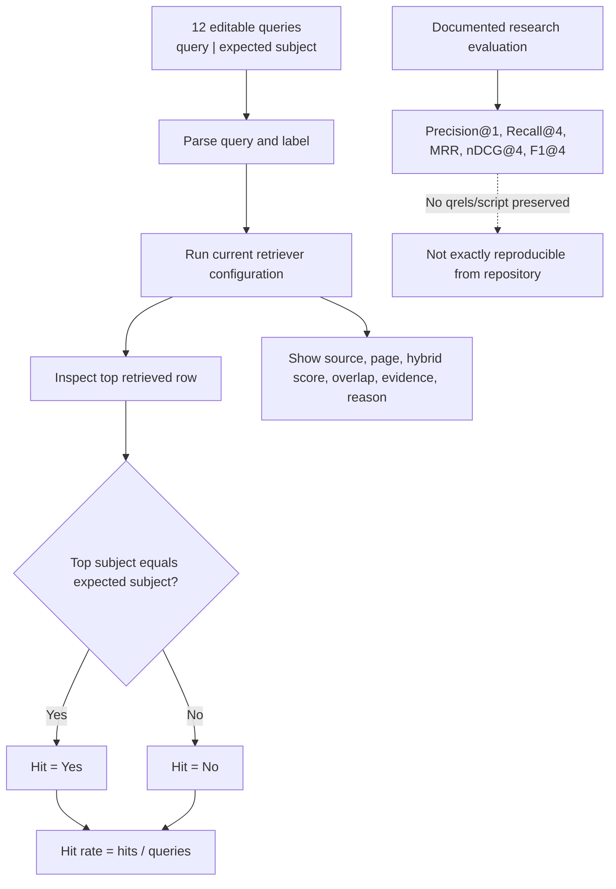

---

## 151. What Is Precision@K?

### Interview answer

Precision@K measures how much of the first `K` retrieved results is relevant.

It answers:

> "Of the chunks the retriever returned in the top K, how many were actually useful?"

### Formula

```text
Precision@K = number of relevant results in top K / K
```

### Example

If the top four results contain three relevant chunks:

```text
Precision@4 = 3 / 4 = 0.75
```

### Diagram

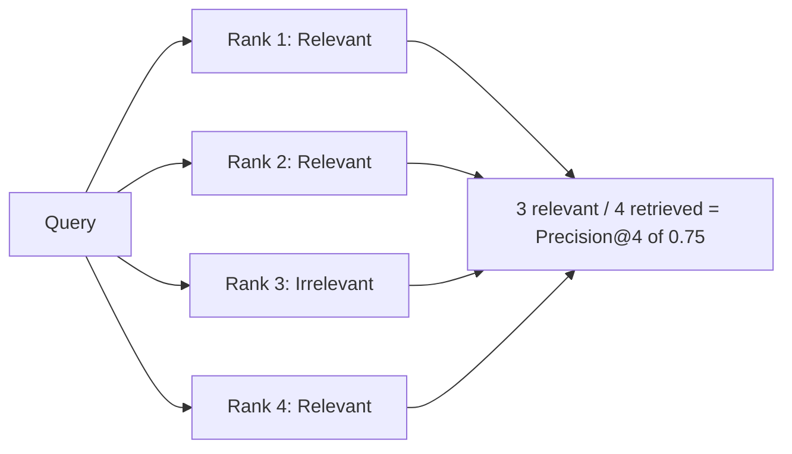

### AcadAI result

The project documents `Precision@1 = 1.00`. This means the first retrieved result was judged relevant for every evaluated query in that experiment.

### Important distinction

The live dashboard's hit rate resembles subject-level Precision@1, but it only checks whether the top result belongs to the expected subject. A DBMS chunk can have the correct subject label while still being irrelevant to the exact DBMS question.

---

## 152. What Is Recall@K?

### Interview answer

Recall@K measures how much of all known relevant evidence was recovered in the first `K` results.

It answers:

> "Of everything that should have been retrieved, how much did the top K contain?"

### Formula

```text
Recall@K =
number of relevant results in top K
/
total number of relevant results for the query
```

### Example

Suppose a benchmark marks five chunks relevant and the top four retrieval results contain four of them:

```text
Recall@4 = 4 / 5 = 0.80
```

### Precision versus recall

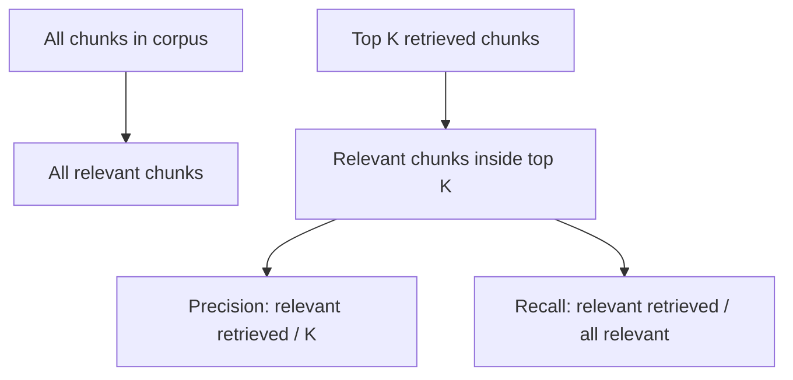

### AcadAI result

The project documents `Recall@4 = 1.00`, meaning all chunks labelled relevant for each evaluated query were found within the first four results.

### Requirement

True recall cannot be calculated from subject labels alone. It requires a complete relevance set, often called qrels, identifying all relevant chunks for every query.

---

## 153. What Is MRR?

### Interview answer

MRR means Mean Reciprocal Rank. It measures how early the **first relevant result** appears.

For each query:

```text
Reciprocal Rank = 1 / rank of first relevant result
```

Across all queries:

```text
MRR = mean of reciprocal ranks
```

### Example

| Query | First relevant rank | Reciprocal rank |
|---|---:|---:|
| Q1 | 1 | 1.00 |
| Q2 | 2 | 0.50 |
| Q3 | 4 | 0.25 |

```text
MRR = (1.00 + 0.50 + 0.25) / 3 = 0.5833
```

### Diagram

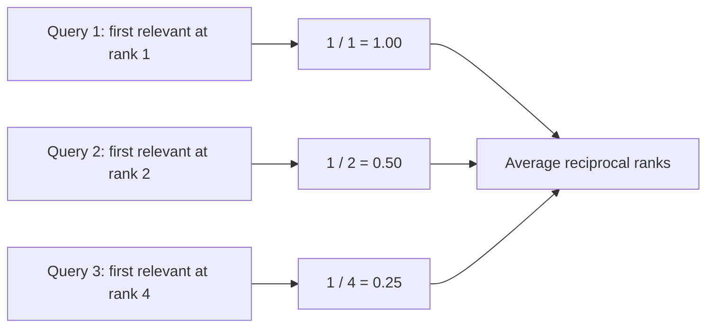

MRR rewards systems that place at least one useful result very near the top. It does not measure whether later relevant results are well ranked.

---

## 154. What Is nDCG?

### Interview answer

nDCG means Normalized Discounted Cumulative Gain. It evaluates ranking quality when results can have different relevance levels, such as:

- `3`: highly relevant.
- `2`: relevant.
- `1`: partially relevant.
- `0`: irrelevant.

It rewards relevant results near the top and discounts relevant results placed lower.

### Formula

One common definition is:

```text
DCG@K = sum from rank i=1 to K of (2^relevance_i - 1) / log2(i + 1)

nDCG@K = DCG@K / IDCG@K
```

`IDCG` is the DCG of the ideal ordering.

### Ranking example

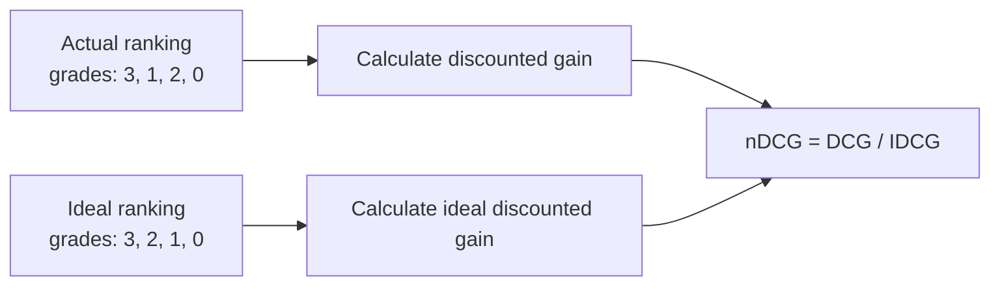

### AcadAI result

The project documents `nDCG@4 = 0.9277`. This suggests the first four results were ordered close to the ideal relevance order, but not perfectly.

### Requirement

Reproducing `0.9277` requires per-query relevance grades and the exact nDCG formula variant. Those artifacts are not present in the repository.

---

## 155. What Is F1 Score?

### Interview answer

F1 is the harmonic mean of precision and recall. It rewards systems that balance both metrics.

### Formula

```text
F1 = 2 * Precision * Recall / (Precision + Recall)
```

### Example

If:

```text
Precision@4 = 0.67
Recall@4 = 1.00
```

Then:

```text
F1@4 = 2 * 0.67 * 1.00 / (0.67 + 1.00) = approximately 0.80
```

### Why harmonic mean?

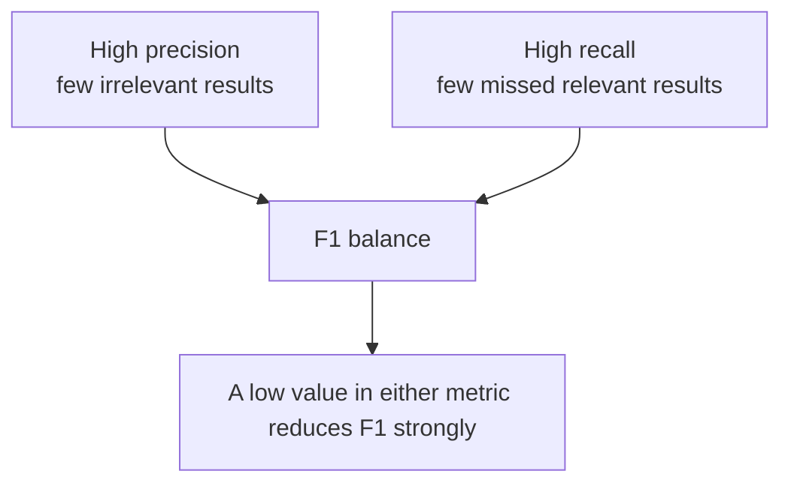

### AcadAI result

The project documents `F1@4 = 0.7937`. However, the repository does not state whether this is macro-averaged per query, micro-averaged over chunks, or calculated another way.

---

## 156. Why Use These Metrics?

### Interview answer

No single retrieval metric describes every failure mode.

| Metric | Question it answers |
|---|---|
| Precision@K | Are the returned chunks mostly relevant? |
| Recall@K | Did retrieval find all required evidence? |
| MRR | How quickly does the first useful result appear? |
| nDCG@K | Are highly relevant results ranked above weaker results? |
| F1@K | Is there a useful balance between precision and recall? |

### Multi-metric view

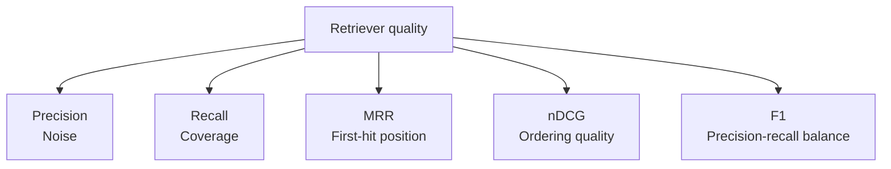

For RAG, retrieval errors propagate into generation:

- Low precision adds distracting context.
- Low recall omits facts needed for a complete answer.
- Low MRR wastes limited context space.
- Low nDCG places weaker evidence ahead of stronger evidence.

---

## 157. What Were Your Evaluation Results?

### Interview answer

AcadAI has two sets of evaluation results.

### Live dashboard result

The showcase documents:

| Live metric | Result |
|---|---:|
| Subject-level top-1 hit rate | 100% |
| Queries tested | 12 |

### Documented research-evaluation results

| Metric | Documented result | Interpretation |
|---|---:|---|
| Precision@1 | 1.00 | Every query's first result was judged relevant |
| Recall@4 | 1.00 | All labelled relevant evidence appeared by rank four |
| MRR | 1.00 | First relevant result was always at rank one |
| nDCG@4 | 0.9277 | Top-four ordering was close to ideal |
| F1@4 | 0.7937 | Documented precision-recall balance at four |

### Result interpretation

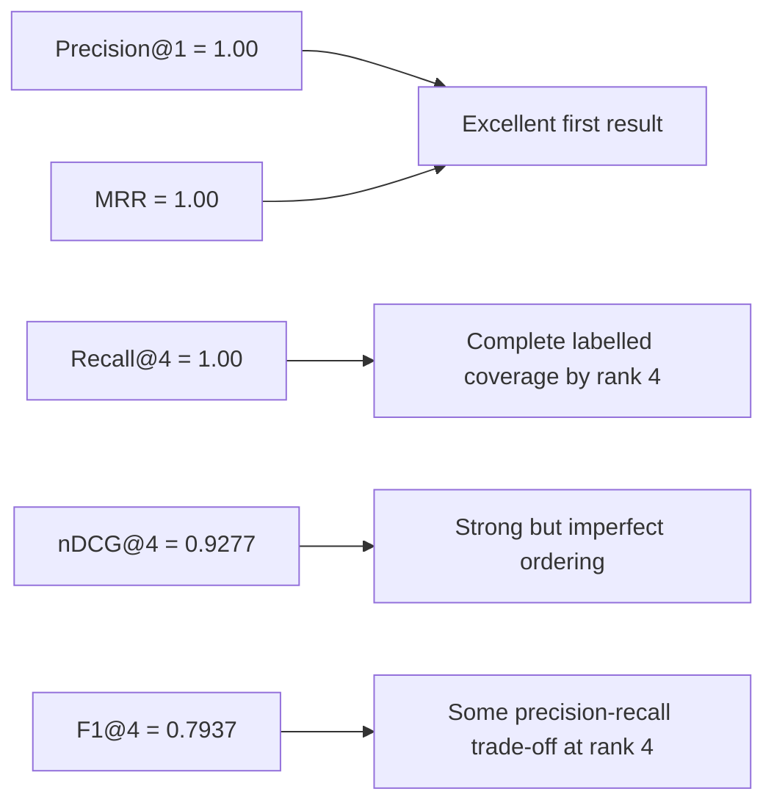

### Interview honesty

These values are recorded in `impact.md` and `Screenshots/SYSTEM_SHOWCASE.md`. The current repository does not include the qrels or script needed to independently recalculate the five ranking metrics. Present them as documented experiment results, not continuously verified live metrics.

---

## 158. How Did You Create Evaluation Queries?

### Interview answer

The current live evaluation queries are manually authored academic questions in the source code. Each line contains a natural-language query and an expected subject separated by `|`.

They cover:

- Direct definitions.
- Explanations.
- Applied/numerical requests.
- Examples.
- Multiple computing subjects.

### Real query set

```python
default_eval = "\n".join([
    "Give me most important subnetting numericals, include all patterns | CN",
    "What is Quality of Service (QoS)? | CN",
    "What is Segmentation in Operating Systems? | OS",
    "Explain normalization in DBMS | DBMS",
    "What is deadlock in operating systems? | OS",
    "Explain recursion with an example | DSA",
    "What is paging in memory management? | OS",
    "Explain primary key and foreign key | DBMS",
    "Explain SDLC models in Software Engineering | SE",
    "Explain HTML CSS and JavaScript in Web Technology | WEB",
    "Explain clustering in machine learning | ML",
    "Explain star schema in data warehousing | DWM",
])
```

### Query creation process

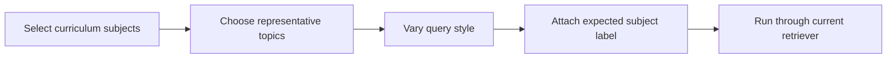

### Limitation

The query set is hand-written and visible in the same application source used during development. It is not a hidden test set, does not include typo-heavy or adversarial queries, and labels only the subject rather than exact relevant chunks.

---

## 159. How Many Test Queries Were Used?

### Interview answer

The current live Evaluation tab contains **12 default queries**.

### Subject distribution

| Subject | Query count |
|---|---:|
| OS | 3 |
| CN | 2 |
| DBMS | 2 |
| DSA | 1 |
| SE | 1 |
| WEB | 1 |
| ML | 1 |
| DWM | 1 |
| **Total** | **12** |

### Important caveat

The showcase associates the documented ranking metrics with 12 tested queries, but no separate evaluation dataset proves that exactly the same twelve queries and relevance labels produced every reported ranking value.

---

## 160. What Does MRR = 1 Mean?

### Interview answer

`MRR = 1.00` means the first relevant result appeared at rank one for every evaluated query.

Because reciprocal rank cannot exceed one:

```text
rank 1 -> reciprocal rank 1.00
rank 2 -> reciprocal rank 0.50
rank 3 -> reciprocal rank 0.33
```

An average of exactly one is possible only when every query has its first relevant result at rank one.

### Diagram

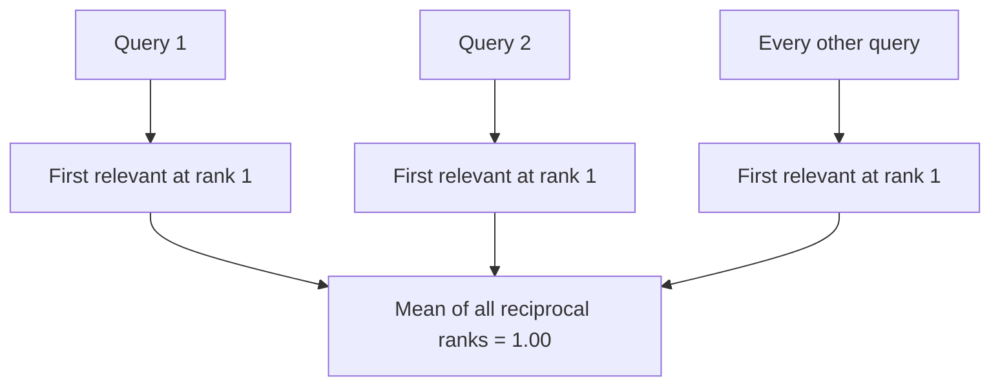

It does not mean every retrieved result is relevant or that the generated answer is correct.

---

## 161. What Does Recall@4 = 1 Mean?

### Interview answer

`Recall@4 = 1.00` means the first four retrieved results contained all chunks that the benchmark labelled relevant for each query.

### Example

If a query has three relevant chunks and all three occur within ranks one to four:

```text
Recall@4 = 3 / 3 = 1.00
```

### Diagram

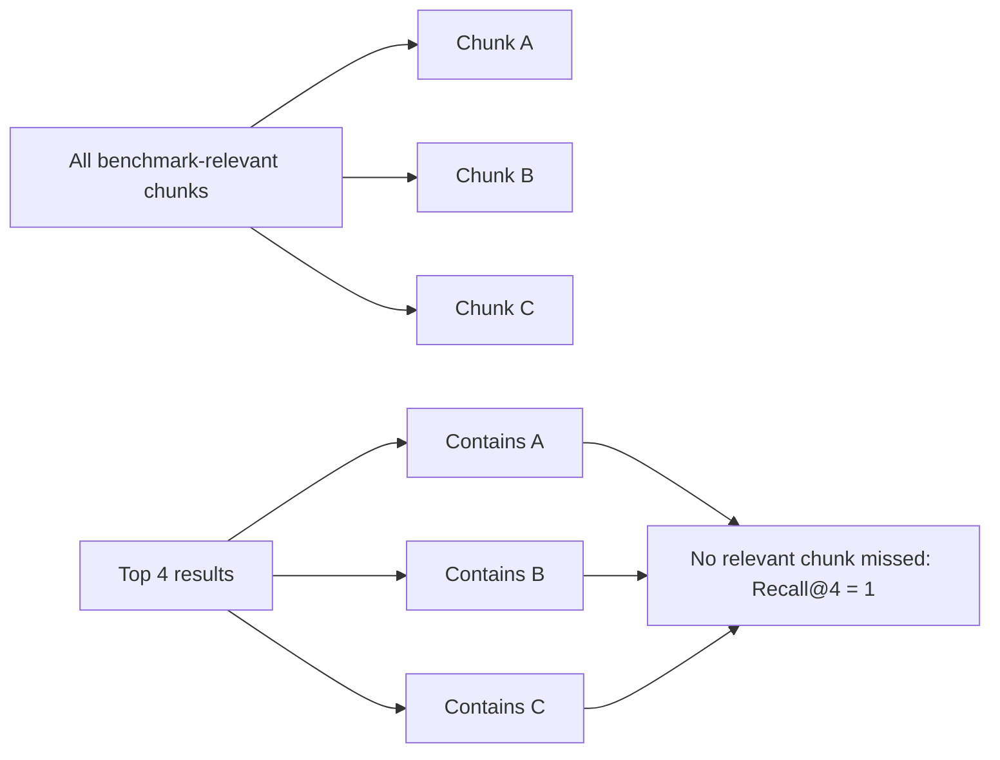

Recall@4 can be perfect even if one of the top-four results is irrelevant. That is why F1 and precision are also useful.

---

## 162. What Does nDCG Measure?

### Interview answer

nDCG measures whether results are ordered according to their usefulness, with stronger penalties for placing important evidence lower in the ranking.

Unlike MRR, which considers only the first relevant item, nDCG evaluates the quality of the entire top-K ordering and supports graded relevance.

### Comparison

| Scenario | MRR | nDCG |
|---|---|---|
| First relevant result is rank one, later results badly ordered | Can still be 1.00 | Decreases |
| Highly relevant chunk placed below partially relevant chunks | May not notice | Penalizes |
| Perfect ideal ordering | 1.00 if first is relevant | 1.00 |

### AcadAI interpretation

`nDCG@4 = 0.9277` means the top-four ordering was approximately 92.77% as good as the ideal ranking under the experiment's relevance grades and formula.

---

## 163. How Reliable Are Your Metrics?

### Interview answer

The live hit-rate metric is transparent and reproducible from the application's current query list and retrieval configuration. However, it is a coarse measure because it checks subject classification rather than exact evidence relevance.

The five documented ranking metrics are promising but have limited auditability because the repository lacks:

- Exact relevant chunk IDs per query.
- Graded relevance judgments.
- Metric implementation code.
- Per-query outputs.
- Retriever configuration snapshot.
- Random seeds and model-version lock.
- Independent human annotation.

### Reliability layers

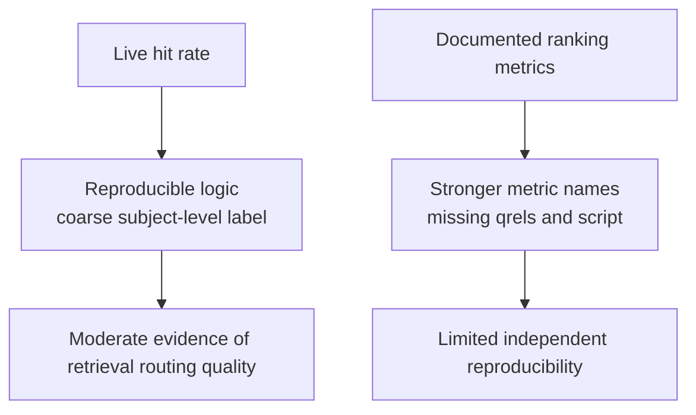

### Strong interview statement

> "The results demonstrate a useful prototype benchmark, but I would not call them production-grade evidence. The 12-query subject hit rate is small and coarse, and the reported ranking metrics need a versioned qrels dataset and reproducible script."

---

## 164. What Evaluation Limitations Exist?

### Interview answer

The main limitations are:

1. Only 12 default queries.
2. Hand-written development-visible queries.
3. Uneven subject distribution.
4. No exact chunk-level qrels in the repository.
5. Live hit rate checks subject only.
6. No negative, ambiguous, typo-heavy, multi-hop, or out-of-domain queries.
7. No statistical confidence intervals.
8. No repeated runs across model and index versions.
9. No latency, cost, or memory-quality benchmark integrated with retrieval metrics.
10. No end-to-end human evaluation of answer correctness and learning value.
11. No ablation comparing dense-only, lexical-only, hybrid, and reranked retrieval.
12. No direct baseline comparison against ChatGPT or another RAG system.

### Evaluation gap map

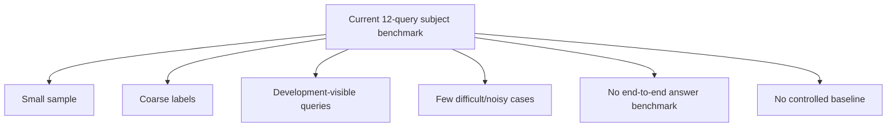

---

## 165. How Would You Benchmark Against ChatGPT?

### Interview answer

A fair comparison must define what ChatGPT is allowed to access.

I would run two baselines:

1. **ChatGPT without course documents:** measures the benefit of external course evidence.
2. **ChatGPT with the same retrieved evidence:** isolates the benefit of AcadAI's Tutor, Critic, grounding, memory, and workflow design.

### Fair benchmark design

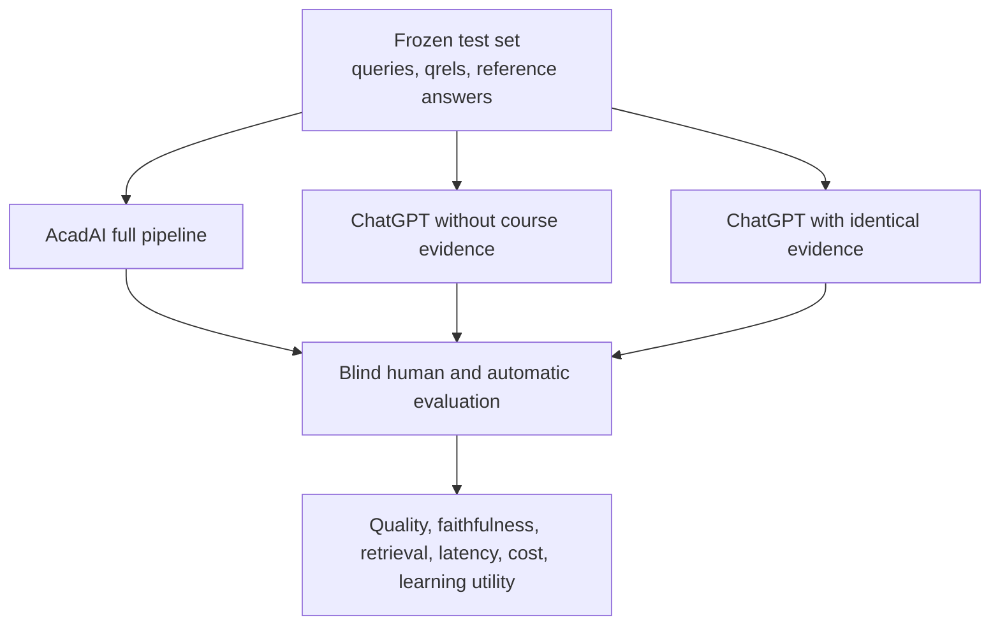

### Evaluation dimensions

| Dimension | Measurement |
|---|---|
| Retrieval | Precision@K, Recall@K, MRR, nDCG |
| Answer correctness | Blind expert rubric and reference-answer checks |
| Faithfulness | Claim-level evidence support and citation correctness |
| Completeness | Required-concept coverage |
| Pedagogy | Clarity, examples, exam usefulness, difficulty fit |
| Robustness | Typos, ambiguous questions, missing evidence, adversarial prompts |
| Efficiency | Latency, model calls, token usage, monetary cost |
| Learning outcome | Pre-test/post-test and delayed-retention scores |

### Experimental controls

- Use identical queries and evidence.
- Freeze model versions and prompts.
- Randomize answer order for human graders.
- Hide system identity from graders.
- Use multiple graders and measure agreement.
- Report mean, variance, confidence intervals, and significance tests.
- Publish qrels, outputs, prompts, and evaluation code.

### Interview-safe conclusion

> "I would compare AcadAI against both unaided ChatGPT and ChatGPT given the same evidence. That separates the value of retrieval from the value of AcadAI's tutoring, critique, grounding, and personalization workflow."

---

## Real Live-Dashboard Code

The application parses each query and expected subject:

```python
for line in eval_text.splitlines():
    line = clean_text(line)
    if not line:
        continue
    if "|" in line:
        q, expected = [x.strip() for x in line.split("|", 1)]
    else:
        q, expected = line, ""
    parsed.append((q, expected))
```

It then evaluates only the top result's subject:

```python
top_subject = found[0].get("subject", "") if found else ""
hit = bool(found) and (not expected or top_subject == expected)
```

Finally, it calculates hit rate:

```python
hit_rate = round((df_eval["Hit"] == "Yes").mean() * 100, 1)
```

This is useful, real evaluation code, but it is not an implementation of the five documented ranking metrics.

---

## Proposed Reproducible Ranking-Metric Code

The following is an example of what should be added to the project. It is not current AcadAI source code.

```python
import math

def precision_at_k(ranked_ids, relevant_ids, k):
    top = ranked_ids[:k]
    return sum(doc_id in relevant_ids for doc_id in top) / max(1, k)

def recall_at_k(ranked_ids, relevant_ids, k):
    top = ranked_ids[:k]
    return sum(doc_id in relevant_ids for doc_id in top) / max(1, len(relevant_ids))

def reciprocal_rank(ranked_ids, relevant_ids):
    for rank, doc_id in enumerate(ranked_ids, 1):
        if doc_id in relevant_ids:
            return 1.0 / rank
    return 0.0

def dcg_at_k(ranked_ids, relevance_grades, k):
    return sum(
        (2 ** relevance_grades.get(doc_id, 0) - 1) / math.log2(rank + 1)
        for rank, doc_id in enumerate(ranked_ids[:k], 1)
    )

def ndcg_at_k(ranked_ids, relevance_grades, k):
    actual = dcg_at_k(ranked_ids, relevance_grades, k)
    ideal_grades = sorted(relevance_grades.values(), reverse=True)[:k]
    ideal = sum(
        (2 ** grade - 1) / math.log2(rank + 1)
        for rank, grade in enumerate(ideal_grades, 1)
    )
    return actual / ideal if ideal else 0.0
```

---

## What I Would Improve Next

1. Store a versioned JSONL benchmark with query IDs, expected subjects, exact relevant chunk IDs, and relevance grades.
2. Add Precision@K, Recall@K, MRR, nDCG, and F1 calculations to the Evaluation tab.
3. Save per-query rankings and configuration snapshots.
4. Expand to hundreds of hidden test queries across all supported subjects.
5. Add difficult negatives, typos, vague follow-ups, and multi-hop questions.
6. Run dense-only, lexical-only, hybrid, cross-encoder, and parent-context ablations.
7. Add bootstrap confidence intervals and significance testing.
8. Evaluate answers separately from retrieval.
9. Add citation correctness and factual-consistency metrics.
10. Publish a controlled AcadAI-versus-ChatGPT benchmark.

---

## Source Reference Map

All application references point to `acadai_app_final_mistral_faiss.py`.

| Behavior | Source location |
|---|---|
| Default top-K and candidate settings | Lines 37-42 |
| Retrieval Evaluation tab | Lines 2652-2731 |
| Twelve default evaluation queries | Lines 2657-2670 |
| Query and expected-subject parsing | Lines 2671-2688 |
| Retrieval under current settings | Lines 2689-2703 |
| Subject-level hit decision | Lines 2704-2705 |
| Debug fields stored per query | Lines 2706-2718 |
| Hit-rate calculation and display | Lines 2720-2728 |
| Documented ranking results | `impact.md`, Section 1 |
| Documented 12-query showcase | `Screenshots/SYSTEM_SHOWCASE.md`, Screenshot 2 |

---

## Final Interview Summary

> "AcadAI's live Evaluation tab runs twelve manually authored academic queries through the current retrieval configuration and checks whether the top result's inferred subject matches the expected subject. It reports a subject-level hit rate, documented as 100% in the showcase. Separately, project documentation reports Precision@1 of 1.00, Recall@4 of 1.00, MRR of 1.00, nDCG@4 of 0.9277, and F1@4 of 0.7937. Those metrics describe first-result relevance, evidence coverage, first-relevant rank, ordering quality, and precision-recall balance. However, the repository does not preserve chunk-level qrels or the calculation script, so I present them as documented experiment results rather than fully reproducible live metrics. My next step would be a versioned hidden benchmark with exact relevance judgments, automatic ranking metrics, ablations, confidence intervals, and a controlled comparison against ChatGPT."
