# AcadAI Interview Guide: Section 13 - Streamlit

This section answers questions 166-175 using AcadAI's actual Streamlit application, widgets, session-state design, caching, PDF-upload path, tab structure, rerun behavior, responsiveness controls, requirements, secrets handling, and deployment documentation.

## Verified Streamlit Facts

| Item | Actual AcadAI implementation |
|---|---|
| UI framework | Streamlit |
| Installed local Streamlit version | `1.58.0` |
| Application structure | One large Python script |
| Page layout | Wide layout with expanded sidebar |
| Main tabs | Ask, Viva Studio, Roadmap, Revision Suite, Evaluation, Memory |
| Persistent per-session state | `st.session_state` |
| Cached resources | Embedding model, cross-encoder, FAISS store |
| Cached PDF parsing | No |
| Forms or fragments | No |
| Explicit rerun | Used after clearing conversation memory |
| Upload types | Multiple PDF files |
| Deployment secrets support | Reads `st.secrets` for Mistral settings |
| Deployment configuration files | No `.streamlit/config.toml`, `secrets.toml`, Dockerfile, Procfile, or runtime file |
| Dependency versions | Unpinned in `requirements.txt` |

> Interview precision: Streamlit makes AcadAI fast to build and demonstrate, but the application currently inherits Streamlit's full-script rerun model. Expensive resources are cached, while PDF parsing and several tab computations can repeat on widget interactions.

---

## Complete Streamlit Execution Model

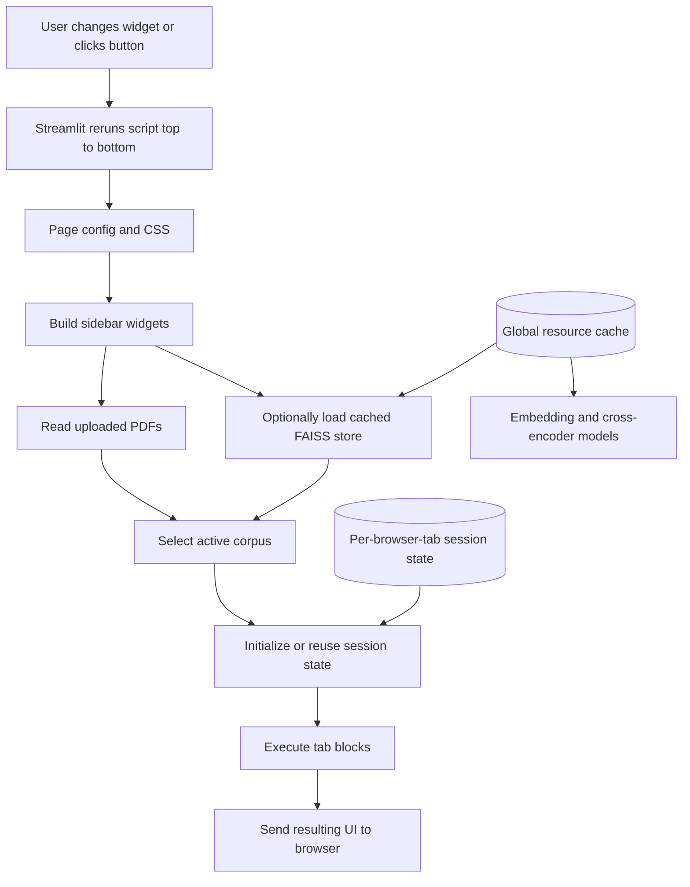

---

## 166. Why Streamlit?

### Interview answer

Streamlit was chosen because AcadAI is a Python-first AI prototype that needs many interactive controls, data views, and model outputs without requiring a separate frontend codebase.

Streamlit fits this project because:

- The retrieval, FAISS, embeddings, agents, and PDF-processing logic are already Python.
- Interactive widgets can directly control Python variables.
- Pandas dataframes, charts, JSON, Markdown, and generated answers are easy to display.
- Session state supports a lightweight learner-memory prototype.
- The application can be run locally with one command.
- It is effective for demonstrations, experiments, and rapid iteration.

### Development trade-off

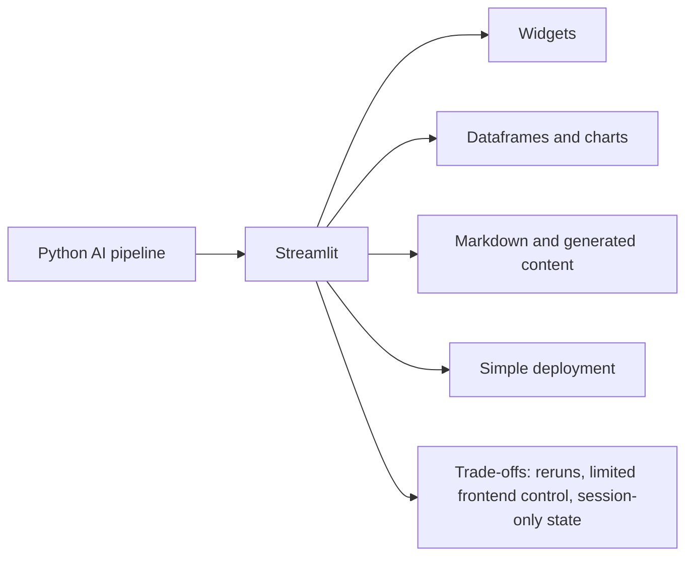

### Real page setup

```python
st.set_page_config(
    page_title="AcadAI - AI Learning Platform",
    page_icon="🎓",
    layout="wide",
    initial_sidebar_state="expanded",
    menu_items={
        "About": "AcadAI is a multi-agent AI learning platform..."
    },
)
```

### Strong interview statement

> "I chose Streamlit because it let me connect the Python RAG and multi-agent backend directly to an interactive academic workspace. It reduced frontend development time and made the system easy to demonstrate, while I accepted rerun behavior and limited production-state management as trade-offs."

---

## 167. How Does Streamlit Work?

### Interview answer

Streamlit executes a normal Python script to build a web interface. When a user interacts with most widgets, Streamlit reruns the script from top to bottom and sends the updated interface to the browser.

Normal local Python variables are recreated on each rerun. Streamlit provides:

- Widget state for user controls.
- `st.session_state` for per-session values across reruns.
- Caching for expensive reusable calculations and resources.
- Layout primitives that determine where output is displayed.

### Rerun lifecycle

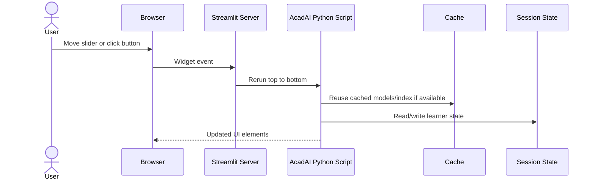

### AcadAI consequence

Changing `retrieval_top_k`, for example, does not call only the retrieval function. It causes the entire script to rerun. Button-gated code runs only when the button returns `True`, but unconditional code outside those guards runs again.

### Official behavior

Streamlit's official documentation states that each interaction reruns the script top to bottom and that session state preserves per-session variables across those reruns.

---

## 168. How Are Session States Used?

### Interview answer

AcadAI uses `st.session_state` as per-browser-tab application memory. It stores data that must survive Streamlit reruns but does not need to be globally shared.

### Stored state

| Key | Purpose |
|---|---|
| `chat_history` | Recent questions and answers |
| `history` | Session-level answer metrics |
| `quiz_questions` | Current viva questions |
| `quiz_topic` | Current viva topic |
| `quiz_rows` | Evidence used by current viva |
| `student_profile` | Name, semester, branch, preferred level, goal |
| `weak_topics` | Topic weakness counters |
| `quiz_attempts` | Scored viva attempts |
| `saved_flashcards` | Generated flashcard sets |
| `saved_roadmaps` | Generated roadmaps |

### Real initialization

```python
def init_learning_state():
    st.session_state.setdefault("chat_history", [])
    st.session_state.setdefault("quiz_questions", "")
    st.session_state.setdefault("quiz_topic", "")
    st.session_state.setdefault("quiz_rows", [])
    st.session_state.setdefault("student_profile", {
        "name": "Student",
        "semester": "B.Tech",
        "branch": "CSE / AIML",
        "preferred_level": "intermediate",
        "goal": "exam + interview preparation",
    })
    st.session_state.setdefault("weak_topics", {})
    st.session_state.setdefault("quiz_attempts", [])
    st.session_state.setdefault("saved_flashcards", [])
    st.session_state.setdefault("saved_roadmaps", [])
```

### State ownership

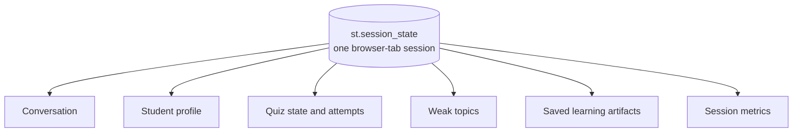

### Limitation

Session state is not durable storage. Closing the browser tab, losing the connection, or restarting the server can remove it. It is also not a substitute for authentication, a database, or cross-device student profiles.

---

## 169. How Do Tabs Work?

### Interview answer

AcadAI creates six tab container objects and places each feature's UI inside its matching context block.

### Real code

```python
tab_ask, tab_viva, tab_roadmap, tab_revision, tab_eval, tab_memory = st.tabs([
    "Ask",
    "Viva Studio",
    "Roadmap",
    "Revision Suite",
    "Evaluation",
    "Memory",
])

with tab_ask:
    ...

with tab_viva:
    ...
```

### Tab organization

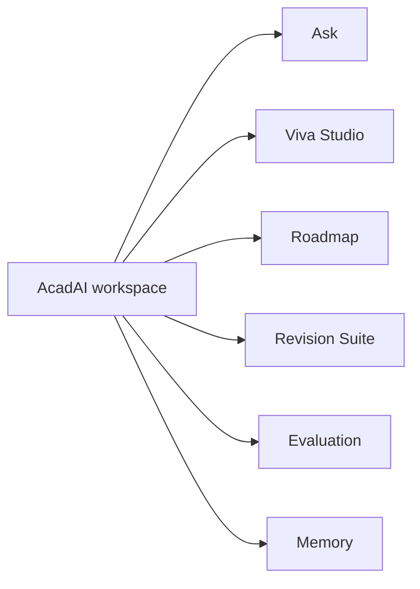

### Critical execution detail

With AcadAI's current default `st.tabs(...)` usage, all tab content is computed and sent to the frontend on every rerun, regardless of the visible tab.

This matters because the Evaluation tab runs its twelve retrieval queries unconditionally. Changing a sidebar slider can therefore rerun the evaluation workload even while the user is on the Ask tab.

### Improvement

Current Streamlit supports keyed tabs with rerun-based selection handling and conditional rendering. Alternatively, expensive tab operations should be placed behind buttons, forms, or fragments.

---

## 170. How Do Sliders Work?

### Interview answer

A Streamlit slider displays a bounded numeric control and returns the selected value as a Python variable. Changing it normally triggers a script rerun.

AcadAI uses sliders to expose operational and learning parameters.

### Examples

```python
memory_turns = st.slider("Memory turns used", 1, 8, 4)
max_refine = st.slider("Max Critic refinement loops", 0, 3, 1)
retrieval_top_k = st.slider("Final evidence chunks (top k)", 4, 12, DEFAULT_TOP_K)
candidate_k = st.slider("FAISS candidates to rerank", 10, 200, DEFAULT_CANDIDATE_K, step=5)
parent_context_chars = st.slider("Parent/adjacent context chars", 0, 2500, 1200, step=100)
min_hybrid_score = st.slider("Minimum hybrid confidence", 0.00, 0.60, DEFAULT_MIN_HYBRID_SCORE, step=0.01)
```

### Slider-to-pipeline flow

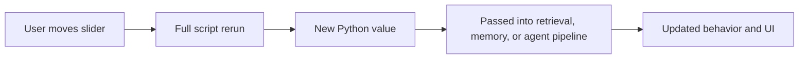

### Practical examples

- Increasing `candidate_k` searches and reranks more candidates, potentially improving recall but increasing latency.
- Increasing `retrieval_top_k` supplies more evidence but consumes more context.
- Increasing `max_refine` allows more Critic loops but adds API calls.
- Increasing `memory_turns` adds more recent conversation context.

### Current limitation

The sidebar controls are not inside a form. Multiple slider adjustments cause multiple reruns. A configuration form with an Apply button would batch changes.

---

## 171. How Does File Upload Work?

### Interview answer

AcadAI uses a multiple-file PDF uploader in the sidebar. Streamlit returns uploaded-file objects. On every relevant rerun, AcadAI reads each file, writes it to a temporary PDF path, extracts page text with `pypdf`, and splits the text into overlapping chunks.

### Real uploader

```python
uploads = st.file_uploader(
    "Upload academic PDFs",
    type=["pdf"],
    accept_multiple_files=True,
)
```

### Real ingestion path

```python
for file in files:
    with tempfile.NamedTemporaryFile(delete=False, suffix=".pdf") as tmp:
        tmp.write(file.read())
        path = tmp.name

    reader = PdfReader(path)
    for page_num, page in enumerate(reader.pages, start=1):
        text = page.extract_text() or ""
        chunks.extend(split_text(text, file.name, page_num))
```

### Upload lifecycle

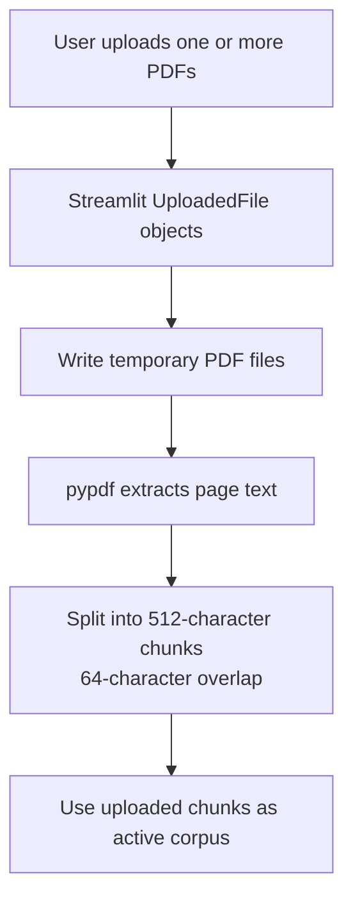

### Corpus precedence

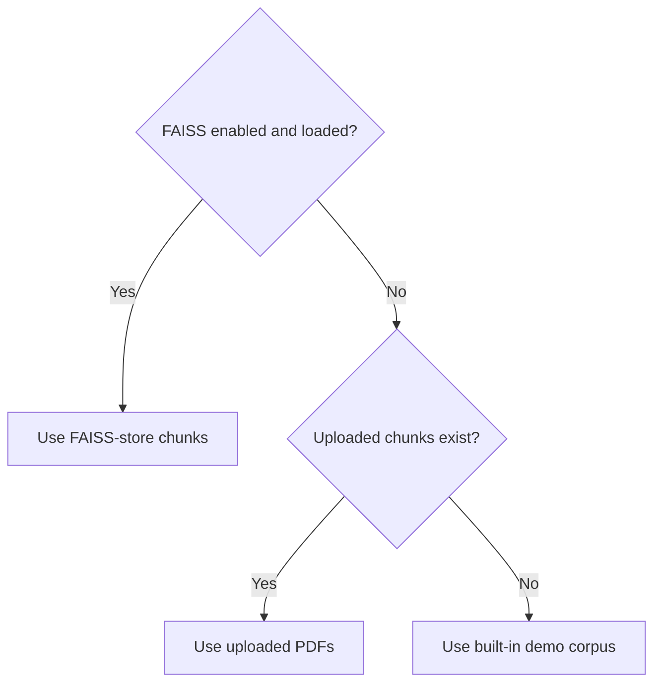

### Limitations

- PDF parsing is not cached.
- Files are rewritten and reparsed on reruns.
- Temporary files use `delete=False` and are not explicitly deleted.
- Scanned/image-only PDFs have no OCR pipeline.
- Upload size limits depend on Streamlit/server configuration.
- Uploaded documents are session inputs, not stored in a user document library.

---

## 172. How Do You Manage Application State?

### Interview answer

AcadAI divides state into three categories.

### State layers

| State layer | Examples | Lifetime |
|---|---|---|
| Local rerun variables | Sliders, current query, selected route, retrieved rows | Current script rerun |
| Session state | Chat history, profile, weak topics, quiz attempts, artifacts | Current browser-tab session |
| Cached global resources | Embedding model, cross-encoder, loaded FAISS index/chunks | Shared across reruns and sessions |

### State architecture

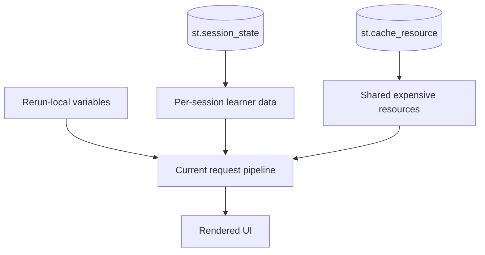

### Real cache usage

```python
@st.cache_resource(show_spinner=False)
def get_embedding_model(model_name: str):
    return SentenceTransformer(model_name)

@st.cache_resource(show_spinner=False)
def get_cross_encoder(model_name: str):
    return CrossEncoder(model_name)

@st.cache_resource(show_spinner=False)
def load_faiss_store(store_dir: str):
    index = faiss.read_index(index_path)
    ...
    return index, chunks, ""
```

### Clear-memory action

```python
if st.button("Clear Conversation Memory", use_container_width=True):
    st.session_state["chat_history"] = []
    st.session_state["history"] = []
    st.rerun()
```

### Important cache distinction

`st.cache_resource` resources are shared across users. Session state is per user session. Mutable cached resources must therefore be treated carefully to avoid cross-user interference.

---

## 173. What Are Streamlit Limitations?

### Interview answer

Streamlit is excellent for prototypes and internal AI tools, but AcadAI exposes several limitations.

1. **Full-script reruns:** widget changes rerun the application top to bottom.
2. **Eager tab execution:** all current tab blocks compute by default.
3. **Session-only state:** learner memory is lost when the session ends.
4. **No built-in durable backend:** authentication, database persistence, and job queues require additional systems.
5. **Long synchronous tasks:** Mistral calls, PDF parsing, embedding, and reranking block the current request.
6. **Limited fine-grained frontend control:** custom CSS can be fragile across Streamlit versions.
7. **Shared resource cache:** globally cached mutable objects require care.
8. **Scaling:** each connected session consumes server resources.
9. **Upload handling:** temporary files and large PDFs need lifecycle and size management.
10. **Single-script maintainability:** the current 2,700+ line app is harder to test and evolve.

### Limitation map

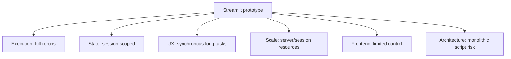

### AcadAI-specific issue

The custom CSS targets Streamlit-generated interface elements. Framework DOM changes can break these overrides after a Streamlit upgrade, especially because dependency versions are not pinned.

---

## 174. How Do You Improve Responsiveness?

### Interview answer

AcadAI already applies some responsiveness techniques:

- Uses `st.cache_resource` for expensive models and FAISS loading.
- Keeps the optional cross-encoder off by default.
- Uses a lightweight MiniLM reranker recommendation.
- Limits retrieval candidates and final evidence through sliders.
- Limits Critic refinement loops.
- Gates Ask, Viva, Roadmap, and Revision generation behind buttons.

### Existing responsiveness controls

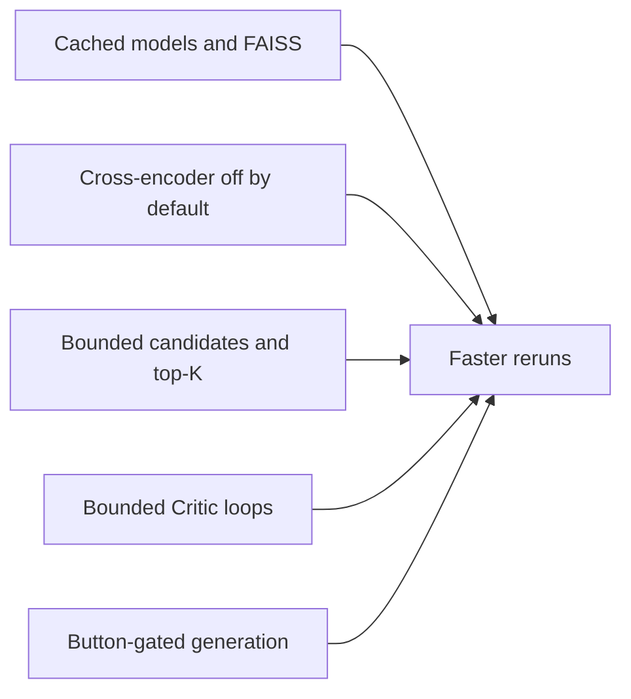

### Highest-impact improvements

1. Make expensive tabs lazy or put Evaluation retrieval behind a Run Evaluation button.
2. Cache PDF parsing by file hash.
3. Use `st.form` to batch sidebar configuration changes.
4. Use `st.fragment` for independently rerunnable UI regions.
5. Add spinners/status elements around PDF parsing, retrieval, and agent calls.
6. Move long jobs to background workers for production.
7. Cache deterministic retrieval preprocessing and evaluation outputs.
8. Paginate or limit large evidence tables.
9. Split the monolith into testable service and UI modules.
10. Pin Streamlit and model-library versions.

### Example improvement: cache PDF parsing

```python
@st.cache_data(show_spinner=False)
def parse_pdf_bytes(file_name: str, file_bytes: bytes):
    # Parse bytes and return serializable chunk dictionaries.
    ...
```

### Example improvement: batch controls

```python
with st.form("retrieval_settings"):
    top_k = st.slider("Top K", 4, 12, 8)
    candidate_k = st.slider("Candidates", 10, 200, 100)
    apply = st.form_submit_button("Apply settings")
```

These examples are recommendations, not current AcadAI source.

---

## 175. How Do You Deploy Streamlit Apps?

### Interview answer

Locally, Streamlit runs the Python entrypoint with:

```powershell
streamlit run acadai_app_final_mistral_faiss.py
```

For Streamlit Community Cloud, the normal workflow is:

1. Push the application to a GitHub repository.
2. Ensure the actual entrypoint and `requirements.txt` are committed.
3. Create a Community Cloud app and select the repository, branch, and entrypoint.
4. Add `MISTRAL_API_KEY` and optional model settings through deployment secrets.
5. Ensure the FAISS store is available in the deployed filesystem or external storage.
6. Deploy and verify logs, memory use, and model downloads.

### Deployment flow

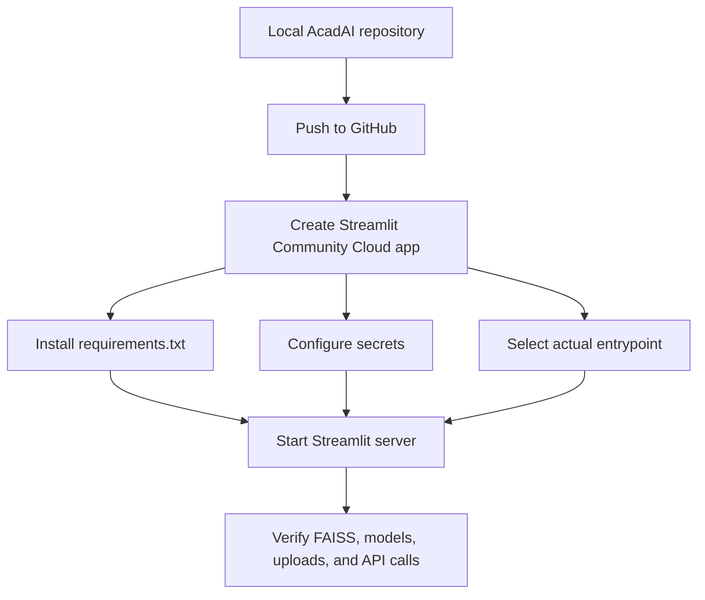

### Secrets support already present

```python
if not mistral_key:
    try:
        mistral_key = st.secrets.get("MISTRAL_API_KEY", "")
    except Exception:
        mistral_key = ""
```

### Current deployment gaps

- README says `streamlit run acadai_app.py`, but that file does not exist. The actual entrypoint is `acadai_app_final_mistral_faiss.py`.
- `requirements.txt` contains package names without version pins.
- No deployment-specific configuration is committed.
- The FAISS files total roughly 59 MB and must be shipped or downloaded.
- BGE-Large and optional reranker models require memory, startup time, and network access.
- Session state is not durable across restarts.
- Temporary upload cleanup is missing.

### Production deployment

For heavier usage, I would containerize AcadAI, move persistent data to a database/object store, place long-running jobs behind a worker queue, use managed secrets, add authentication, and deploy behind a reverse proxy or managed container platform.

---

## Current Rerun Cost Map

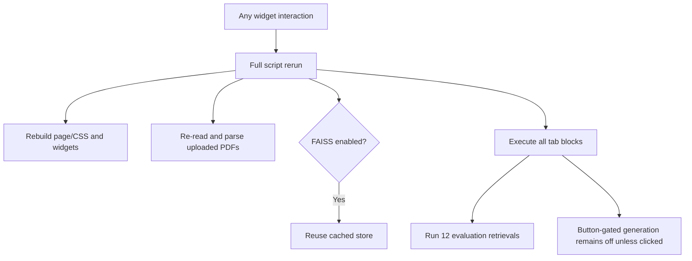

This diagram explains why caching alone does not solve every responsiveness issue.

---

## What I Would Improve Next

1. Fix the README entrypoint and pin dependency versions.
2. Put retrieval controls inside a form.
3. Add lazy tab execution or button-gate the Evaluation tab.
4. Cache uploaded-PDF parsing by content hash.
5. Delete temporary upload files after parsing.
6. Separate UI, state, retrieval, agents, and renderers into modules.
7. Add persistent authenticated student storage.
8. Add background jobs and progress/status UI for long operations.
9. Add deployment health checks and structured logs.
10. Test the deployed app with multiple concurrent sessions.

---

## Source Reference Map

All application references point to `acadai_app_final_mistral_faiss.py`.

| Behavior | Source location |
|---|---|
| Streamlit import | Line 13 |
| PDF splitting and upload ingestion | Lines 178-213 |
| Cached embedding model | Lines 218-225 |
| Cached cross-encoder | Lines 228-235 |
| Cached FAISS store | Lines 292-315 |
| Streamlit deployment secrets | Lines 886-915 |
| Session-state initialization | Lines 1124-1139 |
| Conversation-state cap | Lines 1154-1166 |
| Page configuration | Lines 1541-1549 |
| Sidebar and main controls | Lines 2233-2277 |
| Corpus selection | Lines 2279-2292 |
| Six main tabs | Line 2315 |
| Button-gated Ask pipeline | Lines 2320-2428 |
| Viva-state writes | Lines 2539-2541 |
| Roadmap and artifact state | Lines 2581-2605 |
| Revision controls | Lines 2622-2652 |
| Unconditional Evaluation-tab work | Lines 2652-2731 |
| Clear-memory rerun | Lines 2743-2746 |
| Dependencies | `requirements.txt` |
| Local run instructions | `README.md`, Installation section |

---

## Official Streamlit References

- [Run a Streamlit app](https://docs.streamlit.io/develop/concepts/architecture/run-your-app)
- [Session State](https://docs.streamlit.io/develop/concepts/architecture/session-state)
- [Caching](https://docs.streamlit.io/develop/concepts/architecture/caching)
- [Tabs](https://docs.streamlit.io/develop/api-reference/layout/st.tabs)
- [Deploy on Streamlit Community Cloud](https://docs.streamlit.io/deploy/streamlit-community-cloud/deploy-your-app/deploy)

---

## Final Interview Summary

> "AcadAI uses Streamlit because it provides a fast Python-native interface for the RAG, agent, memory, evaluation, and learning-tool pipelines. Streamlit reruns the script top to bottom after widget interactions, so AcadAI stores learner-specific data in session state and caches expensive global resources such as the embedding model, cross-encoder, and FAISS store. Six tabs organize the workspace, sliders expose retrieval and agent settings, and uploaded PDFs are parsed into chunks. The main limitations are eager tab execution, repeated PDF parsing, session-only persistence, synchronous long-running calls, and a monolithic script. For responsiveness, I would add lazy or button-gated evaluation, forms, fragments, PDF caching, cleanup, and background jobs. For deployment, I would use the actual entrypoint, pin dependencies, configure secrets, package the FAISS store and models carefully, and add durable state for production use."
