# AcadAI Interview Guide: Section 14 - Deployment

This section answers questions 176-185 using AcadAI's actual Git repository configuration, Streamlit entrypoint, dependency manifest, ignored files, secret-loading code, environment-variable configuration, FAISS artifacts, and current official Streamlit Community Cloud deployment model.

## Verified Deployment Facts

| Item | Actual project state |
|---|---|
| Git remote | `https://github.com/Naina-Coder123/AcadAI.git` |
| Current branch | `main` |
| Actual Streamlit entrypoint | `acadai_app_final_mistral_faiss.py` |
| README run command | References nonexistent `acadai_app.py` |
| Verified public `streamlit.app` URL | None found in source, README, screenshots, or local Git metadata |
| Current verified execution | Local Streamlit application |
| Python dependency file | `requirements.txt` |
| Dependency versions | Unpinned |
| Secret files ignored | `.env` and `.env.local` |
| Local secret currently present | `.env.local`, ignored by Git |
| Cloud secret support | `st.secrets` fallback for Mistral API key/model |
| FAISS files committed | `index.faiss` and `index.pkl` |
| Combined FAISS artifact size | About 59 MB |
| Git LFS configuration | None |
| Container/cloud configuration | No Dockerfile, Procfile, runtime file, or `.streamlit/config.toml` |

> Interview precision: AcadAI is hosted as source code on GitHub and is runnable locally. The repository contains Streamlit Cloud-compatible pieces, but an active public Streamlit deployment cannot be verified from the available evidence.

---

## Current Deployment View

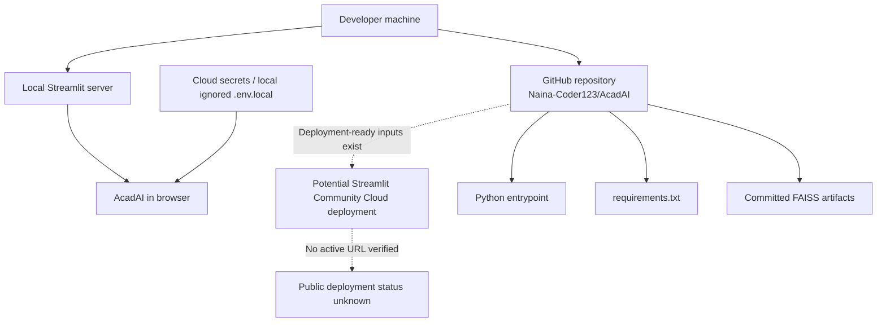

---

## 176. Where Is AcadAI Deployed?

### Interview answer

AcadAI is currently verified in two places:

1. The source code is hosted in the GitHub repository:
   `https://github.com/Naina-Coder123/AcadAI.git`
2. The application is runnable locally through Streamlit using:

```powershell
streamlit run acadai_app_final_mistral_faiss.py
```

I cannot honestly claim that it is currently deployed to Streamlit Community Cloud because the repository and documentation do not contain a live `streamlit.app` URL, deployment badge, or deployment configuration proving that.

### Evidence-based deployment status

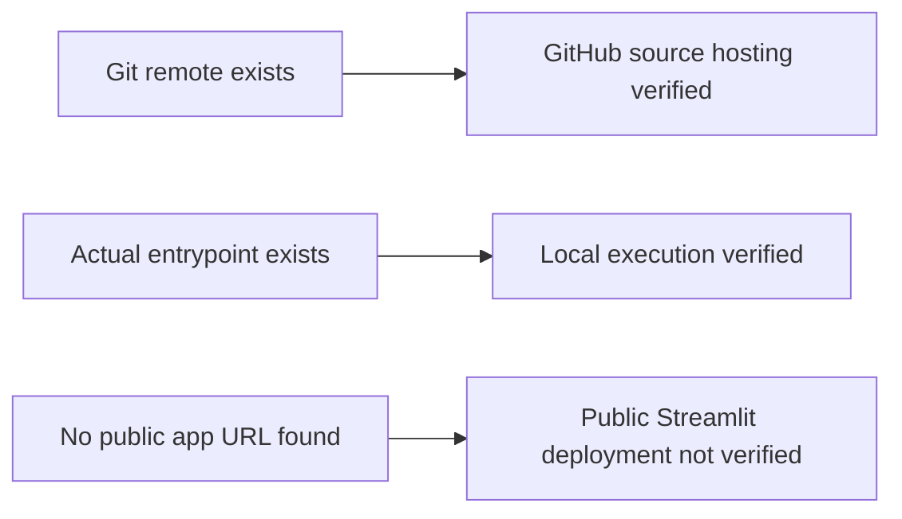

### Strong interview statement

> "AcadAI is currently hosted on GitHub and runs locally as a Streamlit application. It is structured so it can be deployed to Streamlit Community Cloud, but I would not claim an active public deployment until I can provide and verify the live URL."

---

## 177. How Does Streamlit Cloud Deployment Work?

### Interview answer

Streamlit Community Cloud connects to a GitHub repository, installs dependencies in a new environment, starts a selected Python entrypoint with Streamlit, injects configured secrets, and provides a public `streamlit.app` URL.

The deployment workflow is:

1. Push the application and required files to GitHub.
2. Open the Community Cloud workspace.
3. Select the repository, branch, and exact entrypoint file.
4. Optionally select Python version and configure secrets.
5. Deploy.
6. Community Cloud clones the repository and installs dependencies.
7. It runs the app and exposes logs plus a public URL.
8. Later GitHub code changes trigger application updates.

### Deployment sequence

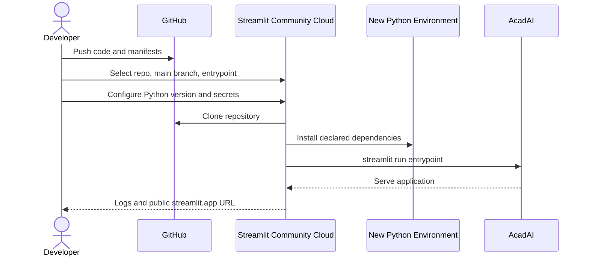

### AcadAI-specific selection

The entrypoint must be:

```text
acadai_app_final_mistral_faiss.py
```

Selecting the README's `acadai_app.py` path would fail because that file does not exist.

---

## 178. What Files Are Required for Deployment?

### Interview answer

For AcadAI's current architecture, the minimum deployment inputs are:

| File or setting | Why it is needed |
|---|---|
| `acadai_app_final_mistral_faiss.py` | Streamlit entrypoint and all application logic |
| `requirements.txt` | Installs Python dependencies |
| `AcadAI_FAISS_STORE/index.faiss` | Existing vector index when FAISS mode is enabled |
| `AcadAI_FAISS_STORE/index.pkl` | Text/document metadata corresponding to the index |
| Deployment secrets | Supplies Mistral credentials without committing them |

Optional files:

| Optional file | Purpose |
|---|---|
| `.streamlit/config.toml` | Theme and server configuration |
| `packages.txt` | Linux system packages required by the app |
| `README.md` | Documentation, not runtime-critical |
| Dockerfile | Needed only for container deployment |

### Required-file flow

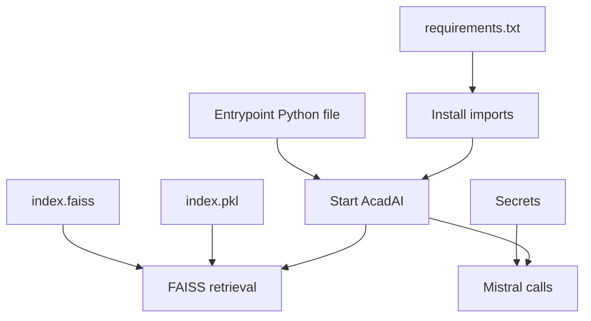

### Current repository concern

The two FAISS files are committed directly and total roughly 59 MB. That works at the current size, but a growing index should move to object storage, a vector database, or Git LFS.

---

## 179. Why Use `requirements.txt`?

### Interview answer

`requirements.txt` tells a clean deployment environment which Python packages AcadAI needs. A cloud server does not inherit packages installed in the developer's local virtual environment.

AcadAI's file currently declares:

```text
streamlit
numpy
pandas
requests
beautifulsoup4
scikit-learn
pypdf
faiss-cpu
sentence-transformers
python-dotenv
```

### Dependency installation flow

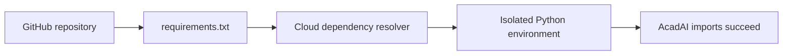

### Why it matters

Without the manifest, imports such as `faiss`, `sentence_transformers`, `pypdf`, and `sklearn` would fail in a clean cloud environment.

### Current weakness

Versions are not pinned. A future deployment may install newer incompatible releases, causing builds or behavior to change.

Recommended production pattern:

```text
streamlit==1.58.0
faiss-cpu==<tested-version>
sentence-transformers==<tested-version>
...
```

Version pins should come from a tested environment rather than arbitrary numbers.

---

## 180. Why Use `.gitignore`?

### Interview answer

`.gitignore` prevents local-only, sensitive, or generated files from being committed to Git.

AcadAI currently ignores:

```gitignore
.env
.env.local
.venv/
.venv-1/
__pycache__/
```

### Protection flow

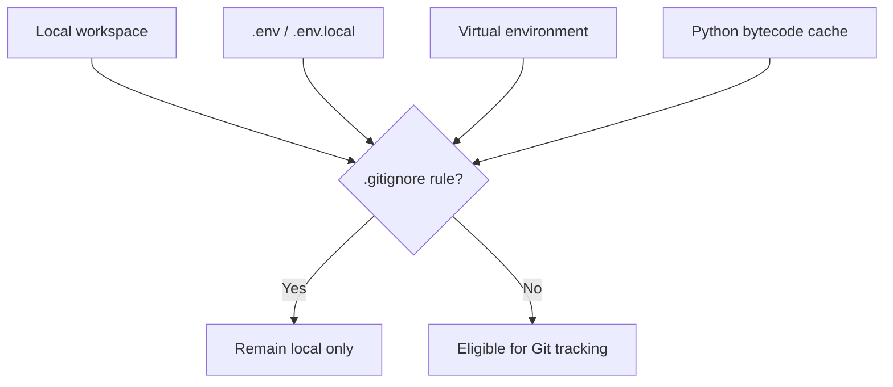

### Why each rule matters

- `.env` and `.env.local` may contain API keys.
- `.venv` folders are large, platform-specific, and reproducible from dependencies.
- `__pycache__` contains generated bytecode.

### Verified behavior

The local `.env.local` exists and is ignored rather than tracked. Its secret value was not included in this guide.

### Improvement

Also ignore:

```gitignore
.streamlit/secrets.toml
*.log
.pytest_cache/
```

Never rely on `.gitignore` after a secret has already been committed; rotate the secret and remove it from history.

---

## 181. How Are Secrets Managed?

### Interview answer

AcadAI supports two secret-loading paths:

1. **Local development:** `python-dotenv` loads values from ignored environment files.
2. **Streamlit Cloud:** the code falls back to `st.secrets`.

### Real local loading code

```python
try:
    from dotenv import load_dotenv
    load_dotenv()
except Exception:
    pass
```

### Real Mistral secret fallback

```python
mistral_key = os.getenv("MISTRAL_API_KEY")

if not mistral_key:
    try:
        mistral_key = st.secrets.get("MISTRAL_API_KEY", "")
    except Exception:
        mistral_key = ""
```

### Secret-management flow

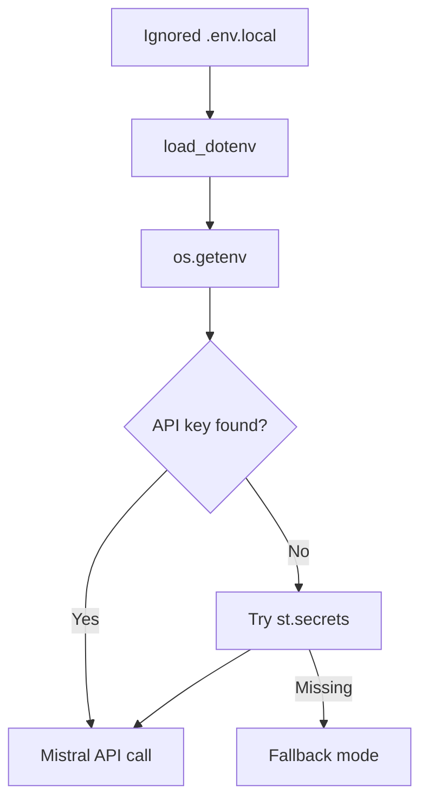

### Cloud procedure

In Community Cloud, secret values should be entered through the app's Advanced settings. They should not be committed in `.streamlit/secrets.toml` or any source file.

### Current UI inconsistency

The LLM caller correctly checks `st.secrets`, but sidebar status uses only:

```python
llm_label = "Mistral" if os.getenv("MISTRAL_API_KEY") else "Fallback mode"
```

On Community Cloud, the app may successfully use `st.secrets` while the UI incorrectly displays `Fallback mode`.

---

## 182. How Do Environment Variables Work?

### Interview answer

Environment variables are key-value configuration values supplied outside the source code. Python reads them with `os.getenv`, usually with a safe default.

AcadAI reads:

| Environment variable | Purpose | Default |
|---|---|---|
| `MISTRAL_API_KEY` | Mistral authentication | None |
| `MISTRAL_MODEL` | Mistral model selection | `mistral-large-latest` |
| `FAISS_STORE_DIR` | FAISS folder path | `./AcadAI_FAISS_STORE` |
| `EMBEDDING_MODEL` | Embedding model | `BAAI/bge-large-en-v1.5` |
| `FAISS_CANDIDATE_K` | Candidate retrieval count | `100` |
| `MIN_HYBRID_SCORE` | Retrieval confidence threshold | `0.25` |
| `CROSS_ENCODER_MODEL` | Optional reranker model | MiniLM cross-encoder |

### Real configuration code

```python
DEFAULT_FAISS_DIR = os.getenv("FAISS_STORE_DIR", "./AcadAI_FAISS_STORE")
DEFAULT_EMBEDDING_MODEL = os.getenv("EMBEDDING_MODEL", "BAAI/bge-large-en-v1.5")
DEFAULT_CANDIDATE_K = int(os.getenv("FAISS_CANDIDATE_K", "100"))
DEFAULT_MIN_HYBRID_SCORE = float(os.getenv("MIN_HYBRID_SCORE", "0.25"))
```

### Configuration precedence

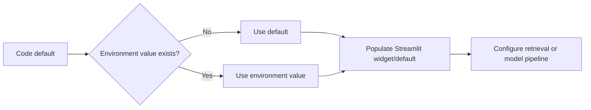

### Benefits

- Same code can run in development and production.
- Secrets are not hardcoded.
- Deployment-specific paths and thresholds can change without editing source.

### Risks

Invalid numeric values for `FAISS_CANDIDATE_K` or `MIN_HYBRID_SCORE` can raise an exception during application startup because they are converted immediately with `int` or `float`.

---

## 183. What Deployment Issues Did You Face?

### Interview answer

The repository does not contain a deployment incident log, so I should not invent past outages. What I can identify from the actual project are concrete deployment issues and risks:

1. **Entrypoint mismatch:** README tells users to run `acadai_app.py`, which does not exist.
2. **Unpinned dependencies:** fresh deployments can receive incompatible package versions.
3. **Large model downloads:** BGE-Large and optional cross-encoder models increase cold-start time, memory use, and network requirements.
4. **Large committed artifacts:** the FAISS store is approximately 59 MB and has no Git LFS configuration.
5. **Cloud secret status bug:** `st.secrets` may work while the UI says fallback mode.
6. **Session-only memory:** student state disappears on restart or lost session.
7. **Temporary PDF cleanup:** uploads are written with `delete=False` and not explicitly removed.
8. **Platform-specific FAISS installation:** `faiss-cpu` wheels and Python versions must be compatible.
9. **External network dependencies:** Mistral, Hugging Face model downloads, DuckDuckGo, Wikipedia, and Google Fonts may fail or be restricted.
10. **Resource limits:** embedding models, FAISS, six eager tabs, and repeated evaluation can pressure memory and CPU.

### Deployment-risk map

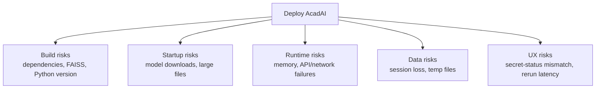

### Strong interview statement

> "There is no formal incident log, so I describe verified deployment risks rather than claiming specific failures. The highest-priority fixes are correcting the entrypoint, pinning dependencies, testing FAISS on the target Python version, and moving large models and persistent state out of the Streamlit process."

---

## 184. How Do You Monitor Deployments?

### Interview answer

The current AcadAI application has user-visible runtime traces and metrics, but it does not have production observability.

### Existing application-level visibility

- Agent latency traces.
- Total response time.
- Route selection.
- Evidence count.
- Critic scores.
- Grounding score.
- Retrieval Evaluation tab.
- Session metrics table.
- Streamlit warnings and errors.

### Monitoring layers

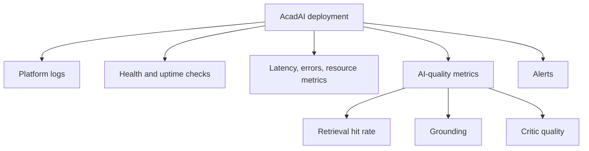

### Streamlit Community Cloud monitoring

Community Cloud exposes deployment logs to users with repository write access. Those logs help diagnose build failures and runtime exceptions.

### Production monitoring plan

I would add:

- Structured JSON logs with request IDs.
- Exception tracking such as Sentry.
- Uptime checks against a health endpoint.
- CPU, RAM, disk, cold-start, and concurrency monitoring.
- Mistral latency, error rate, token use, and cost metrics.
- Retrieval-quality and grounding dashboards.
- Alerts for repeated API failures, low grounding, and memory pressure.
- Privacy-safe logging that excludes uploaded document text and secrets.

### Current limitation

The app swallows several exceptions and returns fallback output. That improves user experience, but without logging the exception, operational failures can be invisible.

---

## 185. How Do You Scale Deployment?

### Interview answer

The current single-process Streamlit architecture is appropriate for a project demonstration, but scaling requires separating UI, compute, storage, and asynchronous work.

### Current architecture

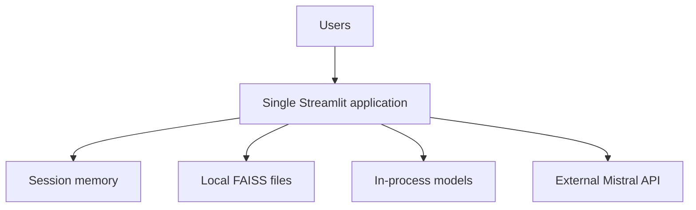

### Scaled architecture

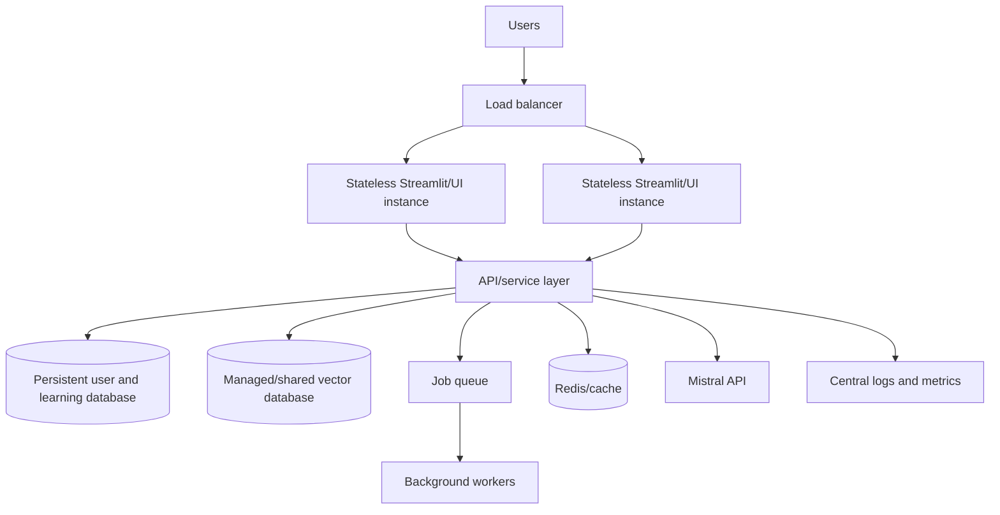

### Scaling steps

1. Make Streamlit instances stateless by moving learner state to a database.
2. Replace local FAISS with a shared vector service or retrieval API.
3. Store uploaded documents in object storage.
4. Move PDF parsing, embedding, and long generation tasks to background workers.
5. Add authentication and tenant isolation.
6. Use Redis or another shared cache.
7. Containerize services and deploy multiple replicas behind a load balancer.
8. Add rate limits, quotas, retries, and circuit breakers for external APIs.
9. Autoscale using CPU, memory, queue depth, and request latency.
10. Centralize logs, metrics, traces, and alerts.

### Why local FAISS limits horizontal scaling

Each Streamlit replica would need the same index and metadata. Updating the index consistently across replicas becomes difficult. A shared retrieval service or managed vector database provides one source of truth.

### Cost-aware scaling

The multi-agent path can make three Mistral calls normally and up to two additional calls per refinement. Scaling must track API cost and use caching, routing, loop limits, and fallback policies.

---

## Deployment Readiness Checklist

| Area | Current state | Recommended action |
|---|---|---|
| Entrypoint | Exists, README mismatch | Correct README and deployment path |
| Dependencies | Present, unpinned | Pin tested versions |
| Secrets | Local ignore and Cloud fallback | Add `.streamlit/secrets.toml` to ignore rules; fix status detection |
| FAISS artifacts | Committed directly | Consider LFS/object storage/vector service |
| Models | Downloaded at runtime | Pre-package or use managed inference |
| State | Session-only | Add persistent database |
| Uploads | Temporary files not deleted | Add cleanup and object storage |
| Monitoring | UI metrics only | Add structured logs, metrics, alerts |
| Scaling | Single process | Separate services and horizontal replicas |
| Deployment proof | No verified public URL | Deploy and document health-checked URL |

---

## Source Reference Map

All application references point to `acadai_app_final_mistral_faiss.py`.

| Behavior | Source location |
|---|---|
| `python-dotenv` loading | Lines 16-20 |
| Environment-configured defaults | Lines 38-42 |
| FAISS store loading | Lines 292-315 |
| Mistral environment and Cloud-secret handling | Lines 886-915 |
| Sidebar LLM status check | Lines 2272-2277 |
| Local source repository | Git remote `origin` |
| Required Python dependencies | `requirements.txt` |
| Ignored local files | `.gitignore` |
| Local run/deployment instructions | `README.md`, Installation section |
| Committed vector-store files | `AcadAI_FAISS_STORE/index.faiss`, `AcadAI_FAISS_STORE/index.pkl` |

---

## Official Streamlit Deployment References

- [Deploy on Streamlit Community Cloud](https://docs.streamlit.io/deploy/streamlit-community-cloud/deploy-your-app/deploy)
- [Community Cloud file organization](https://docs.streamlit.io/deploy/streamlit-community-cloud/deploy-your-app/file-organization)
- [Community Cloud app dependencies](https://docs.streamlit.io/deploy/streamlit-community-cloud/deploy-your-app/app-dependencies)
- [Community Cloud secrets management](https://docs.streamlit.io/deploy/streamlit-community-cloud/deploy-your-app/secrets-management)

---

## Final Interview Summary

> "AcadAI is currently verified as a GitHub-hosted project that runs locally through Streamlit; I cannot verify an active public Streamlit Cloud URL from the repository. Community Cloud deployment would clone the GitHub repository, install `requirements.txt`, run `acadai_app_final_mistral_faiss.py`, inject secrets, and expose logs plus a public URL. AcadAI keeps local secrets out of Git with `.gitignore`, reads configuration through environment variables, and falls back to `st.secrets` for Mistral credentials. The main deployment risks are an incorrect README entrypoint, unpinned dependencies, runtime model downloads, approximately 59 MB of committed FAISS artifacts, session-only state, and missing production monitoring. To scale, I would make the UI stateless, move learner data and documents to persistent storage, expose retrieval as a shared service, use background workers, deploy multiple containers, and add centralized observability."
