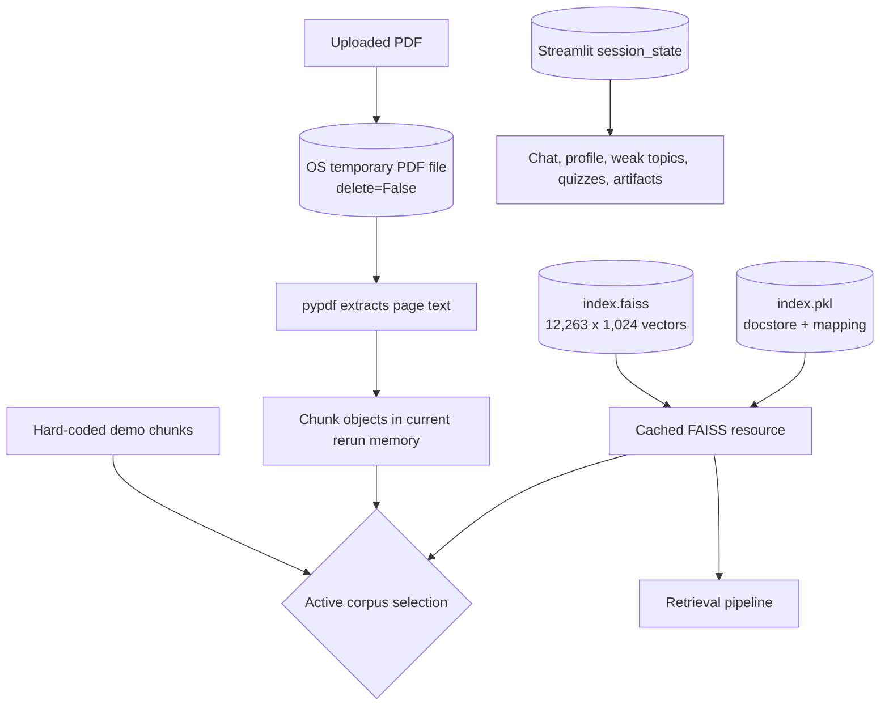
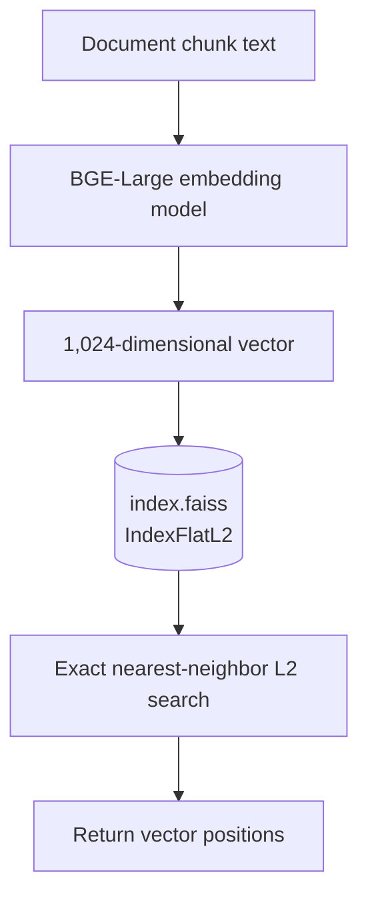
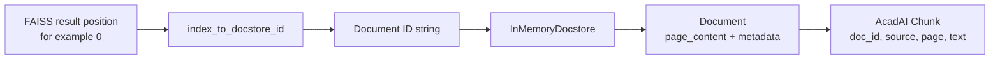
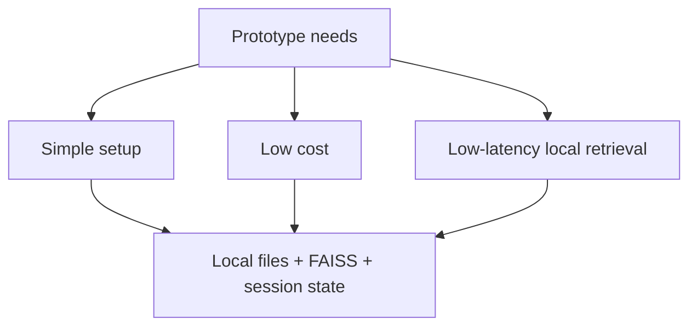
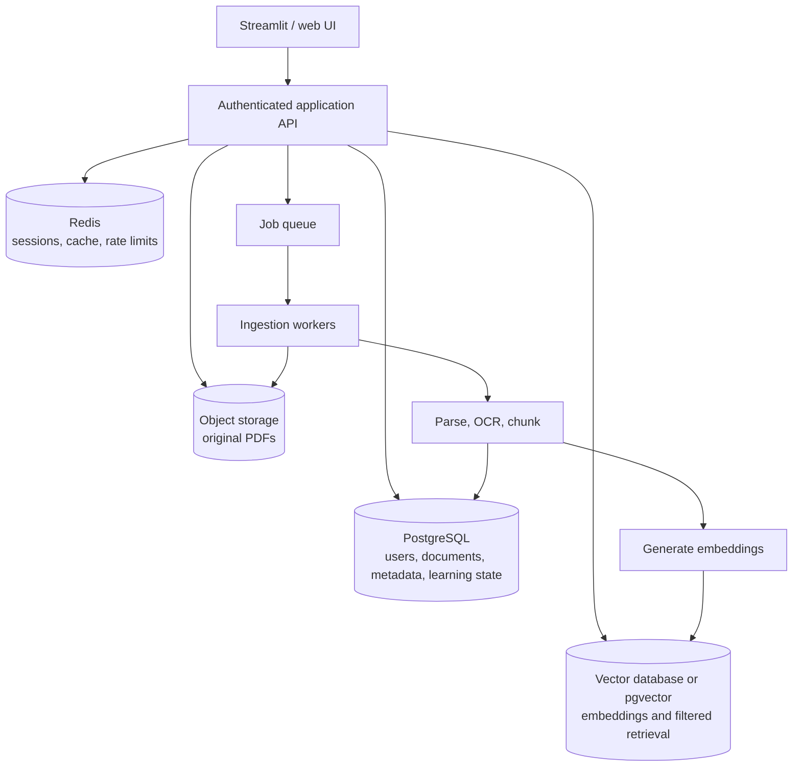
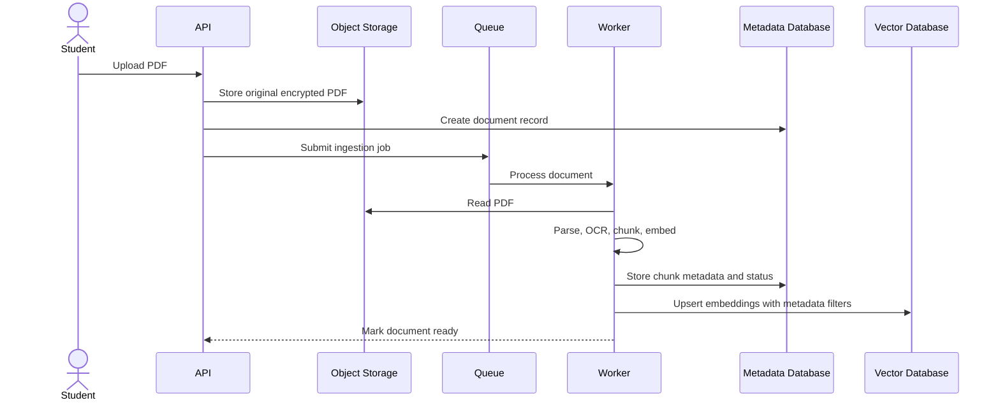

# AcadAI Interview Guide: Section 15 - Database and Storage

This section answers questions 186-190 using AcadAI's actual PDF-upload lifecycle, temporary files, in-memory chunks, committed FAISS index, LangChain pickle metadata, Streamlit session state, repository artifacts, and a production cloud-migration design.

## Verified Storage Facts

| Item | Actual implementation |
|---|---|
| Application database | None |
| Uploaded PDF storage | OS temporary files created with `delete=False` |
| Uploaded PDF cleanup | Not implemented |
| Uploaded PDF extracted chunks | Python `Chunk` objects in rerun-local memory |
| Persistent vector file | `AcadAI_FAISS_STORE/index.faiss` |
| FAISS index type | `IndexFlatL2` |
| Stored vectors | 12,263 |
| Vector dimension | 1,024 |
| Vector-file size | 50,229,293 bytes |
| Persistent metadata/text file | `AcadAI_FAISS_STORE/index.pkl` |
| Pickle root format | `(InMemoryDocstore, index_to_docstore_id)` tuple |
| Pickled documents | 12,263 |
| Pickle-file size | 9,009,635 bytes |
| Learner/profile storage | Streamlit `session_state` only |
| FAISS artifacts committed to Git | Yes |

> Interview precision: AcadAI does not currently use SQL, NoSQL, object storage, or a managed vector database. It combines local files, Python memory, Streamlit session memory, and OS temporary files.

---

## Complete Current Storage Architecture



---

## 186. How Are PDFs Stored?

### Interview answer

AcadAI has two different PDF-related storage paths.

### Uploaded PDFs

When a student uploads PDFs through Streamlit, AcadAI writes each uploaded file to an operating-system temporary file:

```python
with tempfile.NamedTemporaryFile(delete=False, suffix=".pdf") as tmp:
    tmp.write(file.read())
    path = tmp.name
```

It then reads the temporary file with `pypdf`, extracts each page's text, and converts that text into overlapping `Chunk` objects.

```python
reader = PdfReader(path)
for page_num, page in enumerate(reader.pages, start=1):
    text = page.extract_text() or ""
    chunks.extend(split_text(text, file.name, page_num))
```

### Uploaded-PDF lifecycle


### Real chunk structure

```python
@dataclass
class Chunk:
    doc_id: str
    source: str
    page: int
    text: str
```

The chunk ID for uploaded PDFs is generated as:

```python
Chunk(f"{source}::{page}.{idx}", source, page, part)
```

### Persistent course corpus

The repository does not contain the original PDFs used to create the existing FAISS store. It contains their extracted chunk text and metadata in `index.pkl`, plus vectors in `index.faiss`.

### Important storage issue

Temporary files are created with `delete=False` and are never explicitly removed. Inspection of the machine's temporary directory found multiple repeated PDF copies of approximately 37.6 MB each. Therefore, repeated uploads/reruns can leak disk space.

### Strong interview statement

> "Uploaded PDFs are temporarily written to the operating system, parsed page by page, and represented as in-memory chunks. They are not stored in a document database or user library. The current implementation needs explicit temporary-file cleanup."

---

## 187. How Are Vectors Stored?

### Interview answer

The persistent vectors are stored in:

```text
AcadAI_FAISS_STORE/index.faiss
```

The application loads the file with:

```python
index = faiss.read_index(index_path)
```

### Actual inspected index

| Property | Actual value |
|---|---:|
| FAISS class | `IndexFlatL2` |
| Number of vectors | 12,263 |
| Vector dimension | 1,024 |
| Distance metric | L2 distance |
| Trained | Yes |
| File size | 50,229,293 bytes |

### Vector storage model



### Why a separate metadata file is needed

FAISS primarily stores and searches numeric vectors. A returned vector position does not itself contain the original chunk text, PDF source, or page number. AcadAI therefore uses `index.pkl` to map FAISS positions back to document records.

### Real loading code

```python
index_path = os.path.join(store_dir, "index.faiss")
pkl_path = os.path.join(store_dir, "index.pkl")

index = faiss.read_index(index_path)
with open(pkl_path, "rb") as f:
    obj = pickle.load(f)
```

### Important distinction

The uploaded-PDF path does not generate or persist vectors into this FAISS index. Uploaded chunks are searched with the application's lexical TF-IDF retriever unless an existing FAISS store is enabled. The current app is a FAISS reader, not an index-building or incremental-update service.

---

## 188. How Is Metadata Stored?

### Interview answer

Metadata exists in several forms.

### Persistent FAISS corpus metadata

The `index.pkl` file is a LangChain-style tuple:

```text
(
    InMemoryDocstore,
    index_to_docstore_id dictionary
)
```

The mapping connects each FAISS integer position to a document ID. The in-memory docstore maps that ID to a LangChain `Document` containing:

- `page_content`: extracted chunk text.
- `metadata`: PDF/source metadata.

### Actual inspected metadata example

The first stored document contains metadata fields such as:

```python
{
    "producer": "Microsoft Word 2016",
    "creator": "Microsoft Word 2016",
    "creationdate": "...",
    "author": "S K SONI",
    "moddate": "...",
    "source": "/content/drive/MyDrive/BTECH_NOTES/OLT-3 C Programming (BCS-101).pdf",
    "total_pages": 8,
    "page": 0,
    "page_label": "1",
}
```

### Position-to-document mapping



### Real conversion code

```python
def _doc_to_chunk(doc, fallback_id: str, source: str = "faiss_store") -> Chunk:
    text = getattr(doc, "page_content", None) or getattr(doc, "text", None) or str(doc)
    meta = getattr(doc, "metadata", {}) or {}
    return Chunk(
        str(meta.get("doc_id", fallback_id)),
        str(meta.get("source", source)),
        int(meta.get("page", 0) or 0),
        clean_text(text),
    )
```

### Metadata loss during conversion

AcadAI reduces the rich document metadata to four `Chunk` fields:

- `doc_id`
- `source`
- `page`
- `text`

Fields such as author, creation date, total pages, and page label are not preserved in the runtime `Chunk`.

### Other metadata/state storage

Student profile, chat history, weak topics, quiz attempts, saved flashcards, and roadmaps live only in `st.session_state`. They are not stored in `index.pkl` or a database.

### Security concern

The application uses `pickle.load` on `index.pkl`. Pickle can execute malicious code when loading an untrusted or tampered file. The local store must be treated as trusted.

---

## 189. Why Use Local Storage?

### Interview answer

Local storage is appropriate for AcadAI's current prototype stage because it minimizes infrastructure and makes the project easy to run and demonstrate.

### Benefits

- No managed database account or vector-service subscription.
- No network round trip for vector retrieval.
- Simple offline/local demonstrations.
- FAISS offers fast exact vector search for the current 12,263-vector corpus.
- Easy inspection of files and debugging.
- Lower operational cost.
- The repository can include a ready-to-use corpus.

### Local-storage decision



### Current local storage categories

| Storage | Role |
|---|---|
| `index.faiss` | Vector search |
| `index.pkl` | Chunk text and source metadata |
| OS temporary directory | Uploaded PDF copies |
| Python process memory | Active chunks and retrieval results |
| Streamlit session memory | Learner/profile state |
| Git repository | Application files and committed FAISS artifacts |

### Drawbacks

- No durable user accounts or cross-device memory.
- No concurrent multi-user document ownership.
- Every server replica needs its own index files.
- Updating vectors consistently is difficult.
- Temporary files can accumulate.
- Local disk may be ephemeral in cloud deployments.
- No transactions, backups, access control, audit logs, or retention policies.
- Pickle is not a safe cross-trust-boundary storage format.

### Interview-safe conclusion

> "I chose local storage because it matches the scale and goals of the prototype. It makes the system cheap, fast, and easy to demonstrate. For a multi-user production system, I would separate documents, metadata, vectors, and learner state into managed services."

---

## 190. How Would You Migrate to Cloud Storage?

### Interview answer

I would not move every type of data into one cloud database. Each storage type has different requirements.

### Recommended target architecture



### Storage responsibility map

| Data | Recommended cloud storage |
|---|---|
| Original PDFs | S3, Azure Blob Storage, or Google Cloud Storage |
| Document/chunk metadata | PostgreSQL or another transactional database |
| Embeddings | Managed vector database or PostgreSQL with `pgvector` |
| Student profiles and memory | PostgreSQL |
| Session/cache data | Redis |
| Generated exports | Object storage |
| Secrets | Managed secret manager |
| Logs and metrics | Central observability platform |

### Cloud ingestion flow



### Migration plan

1. Define stable IDs for users, documents, chunks, and vector records.
2. Create database tables and access-control rules.
3. Upload original course PDFs to encrypted object storage.
4. Export each `index.pkl` document into normalized chunk records.
5. Reuse or regenerate vectors with a versioned embedding model.
6. Upsert vectors and metadata into the target vector store.
7. Validate vector counts, dimensions, sample nearest neighbors, and metadata.
8. Dual-read from local FAISS and cloud retrieval during migration.
9. Compare retrieval metrics and latency.
10. Switch traffic to cloud storage and retain a rollback snapshot.

### Example target schema

```sql
CREATE TABLE documents (
    document_id UUID PRIMARY KEY,
    owner_id UUID NOT NULL,
    object_uri TEXT NOT NULL,
    original_name TEXT NOT NULL,
    status TEXT NOT NULL,
    created_at TIMESTAMPTZ NOT NULL
);

CREATE TABLE chunks (
    chunk_id UUID PRIMARY KEY,
    document_id UUID REFERENCES documents(document_id),
    page_number INTEGER,
    chunk_index INTEGER,
    text TEXT NOT NULL,
    embedding_model TEXT NOT NULL
);
```

### Example vector upsert

```python
vector_store.upsert(
    id=chunk_id,
    vector=embedding,
    metadata={
        "owner_id": owner_id,
        "document_id": document_id,
        "page": page_number,
        "subject": subject,
    },
)
```

These schema and upsert examples are recommended production designs, not current AcadAI source.

### Security and reliability requirements

- Encrypt PDFs, metadata, and backups.
- Enforce per-user/tenant filters during every retrieval.
- Use signed upload/download URLs.
- Scan uploaded files.
- Avoid pickle for untrusted cloud artifacts.
- Track embedding and chunking versions.
- Implement deletion across object, metadata, and vector stores.
- Add backups, retention policies, audits, and disaster recovery.

---

## Current Versus Cloud Storage

| Concern | Current AcadAI | Cloud migration target |
|---|---|---|
| PDFs | Undeleted temporary files | Encrypted object storage |
| Chunks | Python memory / pickle documents | Database chunk records |
| Vectors | Local `IndexFlatL2` file | Shared vector service or `pgvector` |
| Metadata | Pickled LangChain documents | Queryable relational metadata |
| Learner state | Streamlit session state | Authenticated persistent database |
| Updates | Manual file replacement | Versioned asynchronous ingestion |
| Multi-tenancy | None | Owner/tenant access filters |
| Backups | Git/local files | Managed snapshots and backups |
| Scaling | Each instance needs files | Shared storage services |

---

## Storage Risks and Improvements

1. Delete temporary uploaded PDFs in a `finally` block.
2. Cache PDF parsing by content hash.
3. Stop loading untrusted pickle files.
4. Preserve richer metadata in runtime chunks.
5. Add document IDs independent of file paths.
6. Track embedding model and chunking version.
7. Add incremental indexing and deletion.
8. Store learner data in an authenticated database.
9. Move original documents to encrypted object storage.
10. Add tenant-aware metadata filters to every vector query.

### Immediate temporary-file fix

```python
path = None
try:
    with tempfile.NamedTemporaryFile(delete=False, suffix=".pdf") as tmp:
        tmp.write(file.read())
        path = tmp.name
    reader = PdfReader(path)
    ...
finally:
    if path and os.path.exists(path):
        os.remove(path)
```

This is a recommended fix, not current source code.

---

## Source Reference Map

All application references point to `acadai_app_final_mistral_faiss.py`.

| Behavior | Source location |
|---|---|
| `Chunk` data structure | Lines 96-101 |
| Chunking logic | Lines 178-190 |
| Uploaded-PDF temporary storage and parsing | Lines 193-213 |
| LangChain Document-to-Chunk conversion | Lines 238-247 |
| Supported `index.pkl` formats | Lines 250-289 |
| Cached local FAISS/pickle loading | Lines 292-315 |
| Metadata/subject inference | Lines 318-328 |
| Runtime retrieval-row metadata | Lines 568-574 and 712-723 |
| Session-state learner storage | Lines 1124-1139 |
| Conversation-turn storage | Lines 1154-1166 |
| Active-corpus selection | Lines 2279-2292 |
| Local FAISS path configuration | Line 38 |
| FAISS files | `AcadAI_FAISS_STORE/index.faiss`, `AcadAI_FAISS_STORE/index.pkl` |

---

## Final Interview Summary

> "AcadAI currently uses no database. Uploaded PDFs are written to operating-system temporary files, parsed with pypdf, and converted into in-memory chunks; because cleanup is missing, repeated temporary copies can remain on disk. Persistent vectors are stored in a local FAISS `IndexFlatL2` file containing 12,263 vectors of dimension 1,024. The companion `index.pkl` is a LangChain tuple containing an in-memory document store and a position-to-document-ID mapping, with chunk text and rich source metadata. Learner state lives only in Streamlit session memory. Local storage was chosen because it is simple, fast, offline-friendly, and inexpensive for a prototype. For production, I would store original PDFs in encrypted object storage, metadata and learner state in PostgreSQL, embeddings in a shared vector database or pgvector, caches in Redis, and ingestion in asynchronous workers with strict tenant access controls."
