# AcadAI Interview Guide: Section 16 - Advanced Cross Questions

This section answers questions 191-200 using AcadAI's actual orchestration, local FAISS store, Mistral call pattern, Streamlit state model, retrieval pipeline, deployment limitations, and current primary documentation for alternative frameworks and platforms.

## Verified Decision Context

| Area | Current AcadAI reality |
|---|---|
| Agent orchestration | Explicit Python functions and a fixed central workflow |
| Normal Ask-path LLM calls | Reasoning, Tutor, Critic |
| One refinement | Adds Refiner and second Critic |
| Optional extra LLM call | Mistral query expansion |
| LLM call timeout | 30 seconds each |
| Vector layer | Local FAISS `IndexFlatL2`, 12,263 vectors |
| Metadata | Local LangChain pickle plus runtime inference |
| User state | Streamlit session state |
| PDF processing | Synchronous and rerun-local |
| Application architecture | Single Streamlit process and one large Python script |
| Production authentication/tenancy | Not implemented |
| Durable database/object storage | Not implemented |

> Interview principle: technology choices should be evaluated against current requirements, operational cost, control, and complexity. “Not used” does not mean “bad”; it means the tool did not yet provide enough value to justify its abstraction or operating cost.

---

## Decision Framework

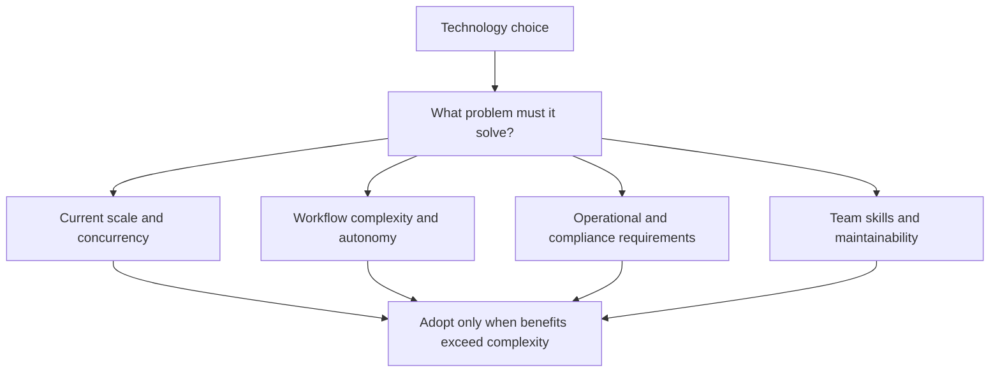

---

## 191. Why Not LangChain Agents?

### Interview answer

I did not use LangChain Agents because AcadAI's Ask workflow is a small, known, mostly deterministic pipeline:

```text
Retrieve → Route → Reason → Tutor → Critic → Optional refinement → Grounding
```

LangChain Agents are designed around a model selecting and calling tools in a loop until a task is complete. AcadAI does not currently need an open-ended tool-selection loop. Its route choices and refinement stop conditions are explicit application rules.

### Real current orchestration

```python
route, tr_router = router_agent(query, match["match"], use_web)
plan, tr_reasoning = reasoning_agent(query)

answer, tr_tutor = tutor_agent(
    query_for_generation,
    difficulty,
    db_rows if route == "RAG" else [],
    web_rows,
    route,
    plan,
)

scores, tr_critic = critic_agent(query, answer)

while (
    not scores.get("satisfactory")
    and refine_count < max_refine
    and scores.get("feedback")
):
    answer = refine_answer(query, answer, scores["feedback"], difficulty)
    scores, tr_critic2 = critic_agent(query, answer)
```

### Explicit workflow versus tool-calling agent

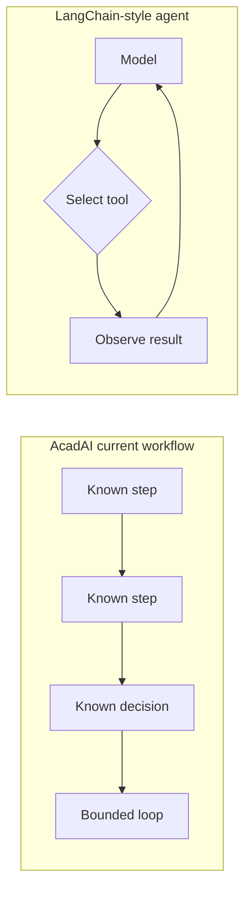

### Why explicit Python was appropriate

- Easier to explain in an interview.
- Full visibility into every call and condition.
- Lower framework dependency and migration risk.
- Deterministic route and loop limits.
- Easier to isolate whether an error came from retrieval, prompting, or orchestration.

### When I would adopt LangChain/LangGraph

For a production version, I would seriously evaluate LangGraph-backed orchestration or LangChain agents when AcadAI needs:

- Durable checkpoints and resumable workflows.
- Tool retries and standardized middleware.
- Human approval steps.
- Dynamic tool selection.
- Streaming execution.
- Long-term memory.
- Formal agent traces and observability.

### Strong answer

> "I avoided an agent framework for the prototype because the workflow was fixed and small enough to express directly. At enterprise scale, durable state, retries, guardrails, and observability would justify adopting a workflow framework."

---

## 192. Why Not CrewAI?

### Interview answer

CrewAI models a collaborative crew of agents assigned to tasks, commonly executed through sequential or hierarchical processes. AcadAI already has named roles, but they are not autonomous workers negotiating tasks. They are mostly prompt-specialized functions coordinated by one deterministic Streamlit block.

### Current roles are functions, not an autonomous crew

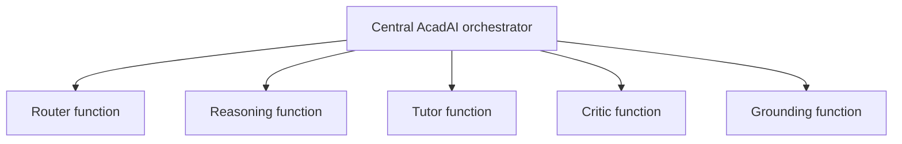

### Why CrewAI was unnecessary

- The task order is known.
- There is no need for a manager agent to delegate.
- Agent communication is ordinary Python return values.
- The Router and Grounding stages are deterministic.
- A crew abstraction would add configuration and another dependency without changing the core behavior.

### What CrewAI could add

Current CrewAI documentation supports crews, tasks, sequential/hierarchical processes, memory, caching, rate limits, checkpointing, hooks, asynchronous kickoff, and tracing integrations. These become useful when the workflow contains many independent specialists or business processes.

### Adoption trigger

I would consider CrewAI if AcadAI expanded into autonomous teams such as:

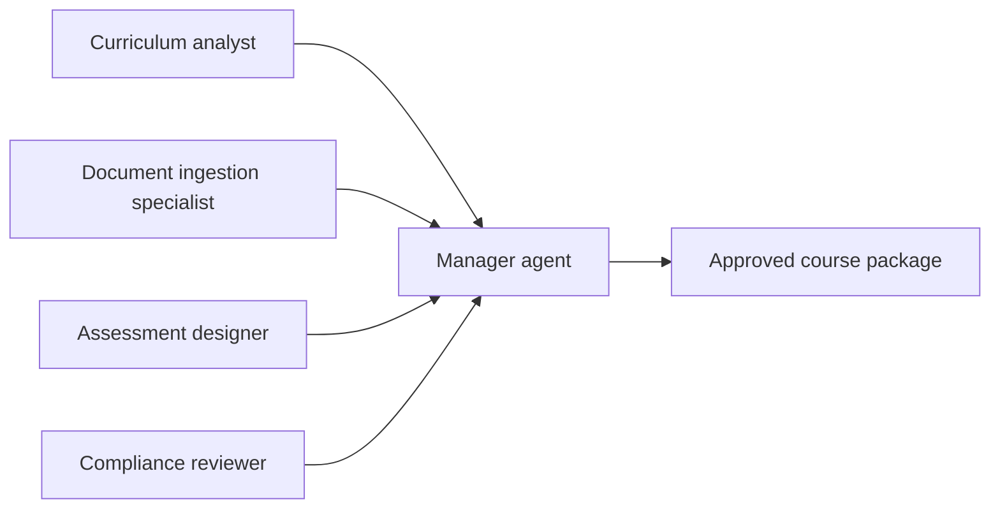

For a single student question, that would be unnecessary overhead. For course-authoring or enterprise-content operations, it could be appropriate.

---

## 193. Why Not AutoGen?

### Interview answer

AutoGen AgentChat is a high-level API for multi-agent applications with agents, teams, shared-context patterns, GraphFlow workflows, memory, human-in-the-loop support, logging, and serialization.

I did not use it because AcadAI does not currently need free-form multi-agent conversation. The core task is a bounded RAG answer pipeline, not an open-ended group chat or event-driven agent system.

### Communication comparison

| AcadAI current design | AutoGen-oriented design |
|---|---|
| Python function calls | Agent messages and teams |
| Central explicit orchestration | Team pattern or graph workflow |
| Small bounded loop | Potential multi-turn coordination |
| Streamlit session state | Agent/team state management |
| Simple traces | Framework logging and observability |

### Why not now

- More moving parts than required.
- More complex debugging of message-based interactions.
- Potentially higher token use from agent conversations.
- Current deterministic controls are easier to audit.
- The prototype has no requirement for distributed/event-driven agents.

### When AutoGen would help

AutoGen would become attractive for:

- Multiple collaborating research agents.
- Long-running enterprise investigations.
- Human approvals during a workflow.
- Agent-to-agent debate.
- Event-driven or graph-based workflows.
- Persisted and serialized agent teams.

### Decision diagram

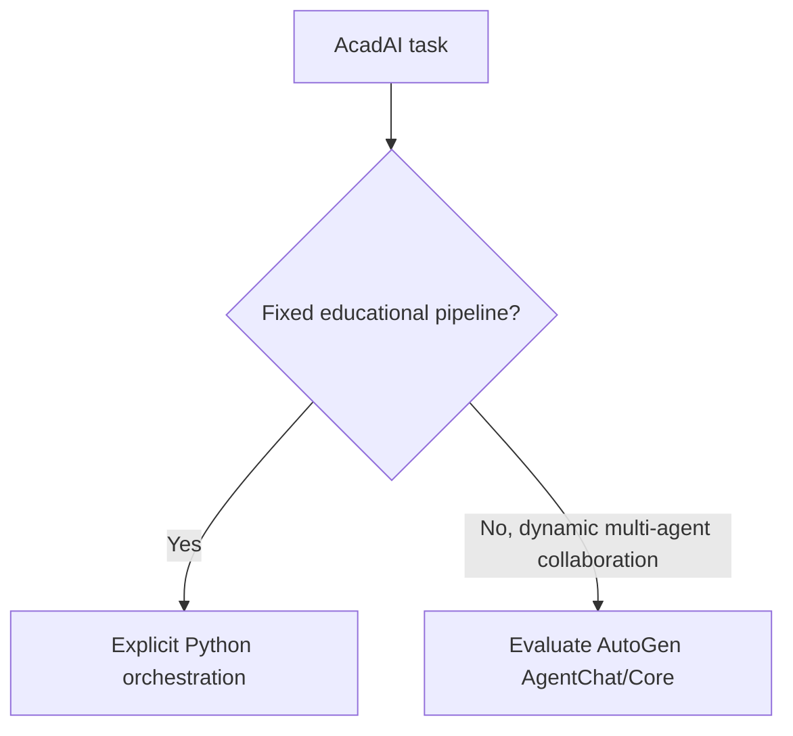

---

## 194. Why Not Pinecone?

### Interview answer

Pinecone is a managed vector database built for production-scale semantic search. It supports managed indexes, namespaces, metadata filters, updates, deletion, monitoring, and multitenant isolation.

For AcadAI's current corpus of only 12,263 vectors, local FAISS is simpler and cheaper:

- Exact local search is fast enough.
- No vector-service network latency.
- No service account or managed-service bill.
- Vectors remain local.
- The implementation is transparent.

### FAISS versus Pinecone

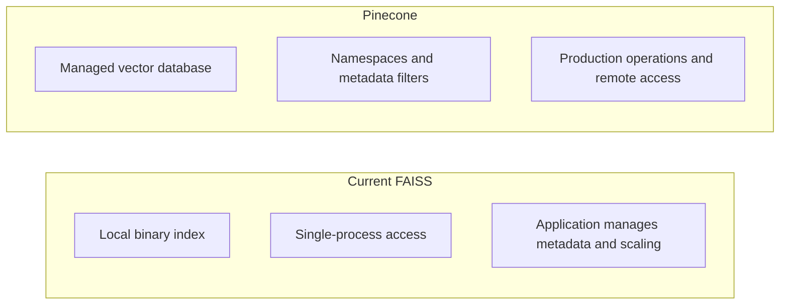

### Current code expects local files

```python
index = faiss.read_index(index_path)
with open(pkl_path, "rb") as f:
    obj = pickle.load(f)
```

### When Pinecone becomes justified

- Many institutions or customers.
- Tenant-isolated namespaces.
- Frequent vector updates and deletions.
- Horizontally scaled application instances.
- Managed backups, monitoring, and availability.
- High-concurrency retrieval.

At 100,000 students, I would benchmark Pinecone against alternatives such as `pgvector`, OpenSearch, managed Chroma, or a dedicated FAISS service rather than selecting it by brand alone.

---

## 195. Why Not ChromaDB?

### Interview answer

Chroma is an open-source AI data infrastructure that stores documents, embeddings, and metadata and supports dense, sparse, hybrid, full-text, and metadata-filtered retrieval. It can run locally, self-hosted, or in Chroma Cloud.

Chroma would solve a real weakness in AcadAI: today vectors are in `index.faiss`, while documents and metadata are separately stored in `index.pkl`.

### Current split versus Chroma collection

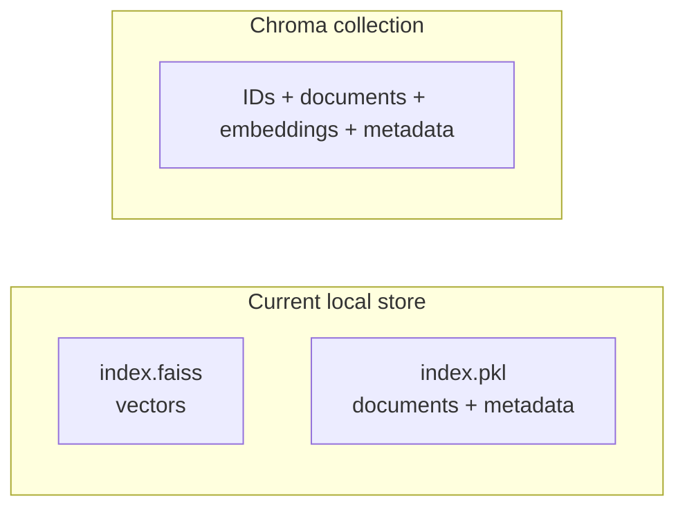

### Why FAISS was retained

- The existing vector store was already built in FAISS format.
- The application only needed to load and search it.
- `IndexFlatL2` behavior is easy to inspect.
- Migrating storage would not automatically improve answer quality.
- Chroma adds another database abstraction and migration task.

### When Chroma would be a better fit

- Incremental document add/update/delete.
- Queryable metadata filters.
- Unified documents and vectors.
- A self-hosted client-server retrieval service.
- A simpler transition from local development to managed cloud.

### Strong answer

> "Chroma is a credible alternative and may be more convenient for document lifecycle management. I kept FAISS because the existing corpus was already indexed and the prototype prioritized retrieval transparency over database features."

---

## 196. Why Not Fine-Tune Mistral?

### Interview answer

Fine-tuning and RAG solve different problems.

- **RAG** supplies changing, source-specific facts at query time.
- **Fine-tuning** changes model behavior, style, format, or domain patterns through training.

AcadAI's main requirement is answering from uploaded course notes with evidence and citations. Fine-tuning course content into a model would make updates, deletions, citations, and per-student document isolation much harder.

### RAG versus fine-tuning

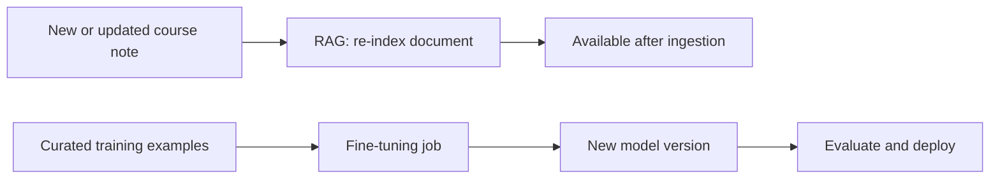

### Why prompting/RAG came first

Mistral's documentation recommends starting with prompting because it is faster and less resource-intensive. Fine-tuning requires quality training data, evaluation, versioning, cost, and governance.

### Fine-tuning limitations for AcadAI

- Does not replace retrieval or citations.
- Facts become difficult to remove.
- Per-customer/private knowledge cannot safely share one tuned model.
- Training data quality determines behavior.
- Requires benchmark evidence that prompting/RAG is insufficient.
- Adds model lifecycle and rollback complexity.

### When I would fine-tune

I would consider fine-tuning a smaller model for stable behavior, such as:

- Consistent exam-answer formatting.
- Difficulty-level adaptation.
- Critic scoring calibrated to human graders.
- Subject or intent classification.
- Distilling expensive Tutor behavior into a cheaper model.

I would still keep RAG for factual course content.

---

## 197. How Would AcadAI Support 100,000 Students?

### Interview answer

The current Streamlit process cannot support 100,000 students directly. I would redesign it as a multi-tenant platform with stateless APIs, persistent storage, shared retrieval, asynchronous ingestion, caching, rate limits, and observability.

### Target architecture

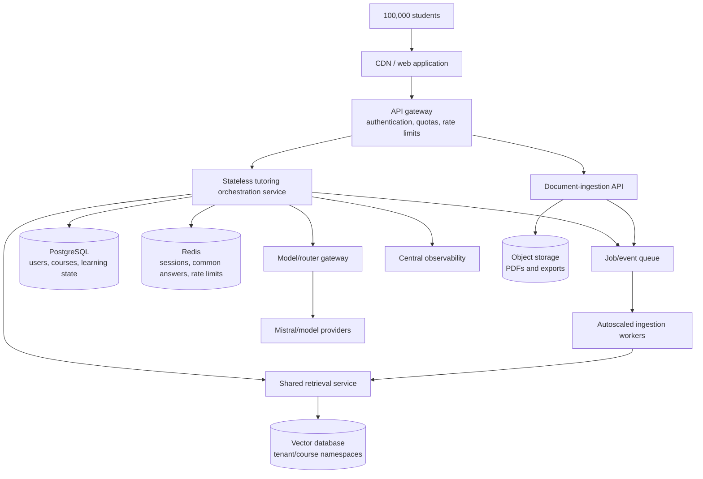

### Key design changes

1. Replace Streamlit session state with authenticated persistent learner state.
2. Store PDFs in object storage.
3. Use asynchronous workers for parsing, OCR, chunking, and embedding.
4. Replace local FAISS files with a shared vector service.
5. Partition retrieval by institution, course, and access permissions.
6. Use a model gateway with retries, timeouts, budgets, and fallbacks.
7. Cache repeated queries and reusable learning materials.
8. Use smaller models or deterministic logic for simple requests.
9. Autoscale stateless services and workers independently.
10. Measure SLOs, cost per answer, grounding, and learning outcomes.

### Load estimation example

If 5% of 100,000 students are active concurrently and each sends one question every two minutes:

```text
5,000 active students / 120 seconds ≈ 42 questions per second
```

With three normal sequential LLM calls per question:

```text
Approximately 125 LLM requests per second before refinements
```

This makes model-provider quotas and cost a first-class architecture concern.

---

## 198. What Would Break First Under Heavy Load?

### Interview answer

The first practical bottleneck would probably be the synchronous request path and external Mistral API capacity, not the 12,263-vector FAISS search.

### Likely failure order

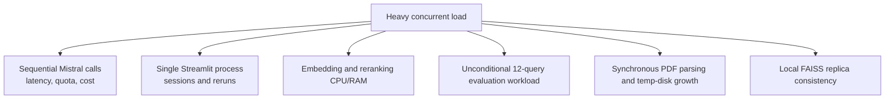

### Why the LLM path breaks early

A normal Ask request calls:

1. Reasoning.
2. Tutor.
3. Critic.

One refinement adds Refiner and another Critic call. Each request has a 30-second timeout. These calls are sequential and exceptions are silently converted to fallback output.

### Other early bottlenecks

- Streamlit session memory grows per connected user.
- Every rerun executes all tab blocks by default.
- The Evaluation tab performs twelve retrievals unconditionally.
- Query embeddings and optional cross-encoder work consume local resources.
- Uploaded PDFs are repeatedly parsed and not cleaned up.
- Local FAISS and pickle files are not a shared mutable multi-replica service.

### What probably does not break first

Exact search across 12,263 vectors is relatively small. FAISS becomes a larger concern when the corpus, tenant count, update rate, or replica consistency requirements grow substantially.

---

## 199. What Is the Biggest Weakness of AcadAI?

### Interview answer

The biggest weakness is that AcadAI presents production-style features on top of prototype-grade infrastructure and evaluation.

The interface includes multiple agents, memory, grounding, evaluation, and adaptive learning, but:

- The workflow is one monolithic Streamlit script.
- User state is temporary.
- There is no authentication or tenant isolation.
- Retrieval artifacts are local files.
- Uploaded PDFs are not persistently or safely managed.
- Critic accuracy is not evidence-based.
- Grounding is lexical and does not automatically correct claims.
- Citation coverage is not truly measured.
- Reported ranking metrics are not fully reproducible from saved qrels/scripts.
- There is no controlled proof of learning improvement or multi-agent advantage.

### Weakness map

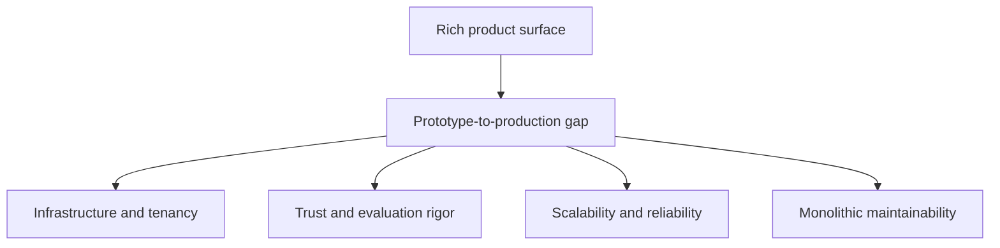

### Why this is the biggest weakness

A weak individual heuristic can be replaced. The more fundamental problem is that correctness, persistence, security, and scalability are not yet enforced by the architecture.

### Strong interview statement

> "AcadAI's biggest weakness is not one model or retrieval parameter; it is the gap between a compelling prototype and a production-grade trusted learning platform. My priority would be to make evaluation, state, security, and observability as strong as the feature set."

---

## 200. If Caelius Consulting Adopts AcadAI Internally, How Would You Redesign It for Enterprise Scale?

### Interview answer

Caelius Consulting publicly positions itself around Salesforce, MuleSoft, AI, automation, data analytics and management, managed services, Agentforce, Data Cloud, Informatica, Slack, and Tableau. An internal AcadAI should therefore become an enterprise knowledge and enablement platform integrated with that ecosystem, not merely a larger student chatbot.

### Enterprise use cases

- Consultant onboarding and certification preparation.
- Search across Salesforce, MuleSoft, Informatica, Agentforce, and internal delivery knowledge.
- Project playbook and reusable-asset discovery.
- Secure client-specific knowledge assistants.
- Proposal, architecture, and implementation-review support.
- Skills-gap tracking and personalized learning roadmaps.
- Managed-services runbook assistance.

### Caelius-aligned architecture

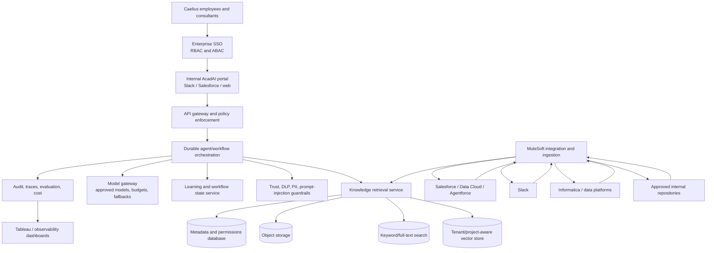

### Core redesign decisions

#### 1. Identity and access

- Enterprise SSO.
- Role, project, client, geography, and data-classification permissions.
- Retrieval-time access filters, not only UI filtering.
- Separate client/project knowledge boundaries.

#### 2. Integration

- Use MuleSoft APIs/events to ingest approved enterprise systems.
- Surface AcadAI through Slack, Salesforce, and an internal web portal.
- Connect Salesforce/Data Cloud records only through governed APIs.
- Preserve source ownership and permission metadata.

#### 3. Knowledge lifecycle

- Object storage for originals.
- Metadata database for ownership, retention, and access.
- Shared vector/full-text retrieval service.
- Incremental ingestion, deletion, versioning, and re-indexing.
- Human approval for high-impact or client-facing generated content.

#### 4. Agent platform

The fixed Python workflow should become a durable, testable workflow graph. LangGraph, AutoGen GraphFlow, CrewAI Flows, or an internal orchestrator could be evaluated based on:

- Checkpointing and resume.
- Retry and timeout policies.
- Human approvals.
- Observability.
- Deterministic state transitions.
- Integration with enterprise security controls.

#### 5. Trust and compliance

- Claim-level evidence verification.
- Validated citations.
- DLP and PII controls.
- Prompt-injection defenses.
- Complete audit logs.
- Approved-model routing.
- Data residency and retention rules.
- ISO-aligned controls consistent with Caelius's public ISO 27001 and ISO 9001 certifications.

#### 6. Operations

- SLOs for availability, latency, grounding, and retrieval quality.
- Cost budgets by business unit.
- Canary deployments and rollback.
- Red-team and regression evaluation sets.
- Tableau dashboards for usage, quality, skills gaps, and ROI.

### Enterprise request path

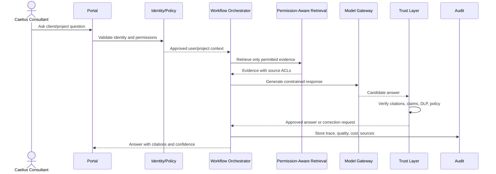

### Example permission-aware retrieval contract

```python
def retrieve_enterprise(query, user_context, project_id, top_k=8):
    filters = {
        "tenant_id": user_context.tenant_id,
        "project_id": project_id,
        "allowed_roles": {"$in": user_context.roles},
        "classification": {"$in": user_context.allowed_classifications},
        "status": "approved",
    }
    return vector_store.search(query=query, filters=filters, top_k=top_k)
```

This is recommended enterprise code, not current AcadAI source.

### Rollout plan

1. Start with internal onboarding and certification content.
2. Establish source governance, permissions, and evaluation benchmarks.
3. Pilot with a limited consultant cohort.
4. Integrate Slack and selected Salesforce/MuleSoft knowledge sources.
5. Add project-specific assistants with strict isolation.
6. Measure time saved, answer acceptance, source verification, and learning gains.
7. Expand only after security, quality, and cost SLOs are met.

### Strong interview statement

> "For Caelius, I would redesign AcadAI as a governed enterprise knowledge and enablement platform. The differentiator would not be simply adding more agents; it would be permission-aware retrieval across Salesforce, MuleSoft, Data Cloud, Informatica, Slack, and approved repositories, with durable workflows, enterprise identity, verified citations, DLP, auditability, and measurable consultant productivity."

---

## Technology Adoption Matrix

| Technology | Why not in current prototype | Enterprise adoption trigger |
|---|---|---|
| LangChain/LangGraph | Fixed workflow is easy to express directly | Durable workflows, retries, checkpoints, guardrails |
| CrewAI | Roles do not need autonomous crew collaboration | Complex delegated content/business operations |
| AutoGen | No need for conversational/event-driven agent teams | Long-running multi-agent investigations and GraphFlow |
| Pinecone | 12K local vectors do not justify managed service | Multitenancy, high concurrency, managed operations |
| Chroma | Existing store already uses FAISS | Unified document/vector lifecycle and client-server storage |
| Fine-tuned Mistral | RAG/prompting handles changing course facts | Stable behavior specialization with strong training/evaluation data |

---

## Source Reference Map

All application references point to `acadai_app_final_mistral_faiss.py`.

| Behavior | Source location |
|---|---|
| Cached local models and FAISS store | Lines 218-315 |
| FAISS hybrid retrieval | Lines 617-797 |
| Web-search synchronous calls | Lines 836-880 |
| Mistral API call and timeout | Lines 886-920 |
| Router, Reasoning, Tutor, Critic | Lines 925-1083 |
| Tutor refinement | Lines 1086-1098 |
| Session-state learner data | Lines 1124-1166 |
| Streamlit controls and local FAISS selection | Lines 2238-2315 |
| Ask pipeline orchestration | Lines 2320-2428 |
| Unconditional Evaluation-tab retrieval | Lines 2652-2731 |
| Existing vector-store artifacts | `AcadAI_FAISS_STORE/index.faiss`, `AcadAI_FAISS_STORE/index.pkl` |

---

## Primary External References

- [LangChain Agents](https://docs.langchain.com/oss/python/langchain/agents)
- [CrewAI Crews](https://docs.crewai.com/en/concepts/crews)
- [Microsoft AutoGen AgentChat](https://microsoft.github.io/autogen/stable/user-guide/agentchat-user-guide/index.html)
- [Pinecone documentation](https://docs.pinecone.io/guides/get-started/overview)
- [Chroma introduction](https://docs.trychroma.com/docs/overview/introduction)
- [Mistral fine-tuning guidance](https://docs.mistral.ai/capabilities/finetuning/)
- [Caelius Consulting official website](https://www.caeliusconsulting.com/)

---

## Final Interview Summary

> "AcadAI deliberately uses explicit Python orchestration, local FAISS, and prompt-based Mistral calls because its prototype workflow is fixed, inspectable, and small. LangChain, CrewAI, and AutoGen would add capabilities but also abstraction and coordination overhead. Pinecone and Chroma become attractive when document lifecycle, multitenancy, updates, and high concurrency matter. Fine-tuning is not a substitute for RAG because AcadAI needs changing, cited course evidence. To support 100,000 students, I would replace the single Streamlit process with stateless services, persistent learner state, asynchronous ingestion, a shared permission-aware vector layer, a model gateway, caching, quotas, and observability. The current system's biggest weakness is the gap between its rich product surface and prototype-grade infrastructure and evaluation. For Caelius Consulting, I would redesign it as a secure enterprise knowledge and enablement platform integrated through MuleSoft with Salesforce, Data Cloud, Agentforce, Informatica, Slack, and approved repositories, backed by enterprise identity, verified citations, DLP, audit trails, and measurable business outcomes."
