# AcadAI Interview Guide: Section 2 - Architecture

This section explains questions 16-30 using the actual AcadAI source code, persisted FAISS data, and runtime behavior.

## Architecture Facts Verified From the Repository

| Architectural property | Actual implementation |
|---|---|
| Deployment shape | Single Python Streamlit application |
| Architecture style | Modular monolith with layered, pipeline-oriented orchestration |
| Agent execution | Synchronous and sequential |
| Agent communication | Python arguments, return values, dictionaries, dataclasses, and `st.session_state` |
| Persistent vector corpus | FAISS `IndexFlatL2`, 12,263 vectors, 1,024 dimensions |
| Stored metadata | LangChain-style docstore and index-to-document mapping in `index.pkl` |
| PDF upload path | Parse into temporary in-memory `Chunk` objects; search with TF-IDF |
| Prepared corpus path | Load FAISS and metadata; search with BGE embeddings and hybrid reranking |
| LLM path | Mistral HTTP chat-completions API |
| Main Ask stages | Retrieve, route, reason, generate, critique, refine, ground, store, display |
| State | Temporary per-session learning state using Streamlit session state |

> Interview precision: AcadAI is logically modular, but physically most components currently live in one source file. It is therefore best described as a modular monolith, not microservices.

---

## 16. Explain the Complete Architecture of AcadAI

### Interview answer

AcadAI follows a layered, modular-monolith architecture built around a synchronous multi-stage learning pipeline.

At the top is the **presentation and interaction layer**, implemented in Streamlit. It exposes six workspaces: Ask, Viva Studio, Roadmap, Revision Suite, Evaluation, and Memory. The sidebar also controls retrieval settings, tutor difficulty, memory, grounding, web fallback, and refinement depth.

Below that is the **knowledge layer**. AcadAI supports three mutually exclusive active corpora:

1. A prepared FAISS store containing 12,263 academic chunks.
2. PDFs uploaded during the current Streamlit session.
3. A small built-in demonstration corpus.

The **retrieval layer** changes according to the active corpus. The prepared corpus uses BGE-large query embeddings, FAISS dense search, TF-IDF lexical scoring, keyword overlap, subject filtering, source boosts, fallbacks, optional cross-encoder reranking, and adjacent-context expansion. Uploaded PDFs and the demo corpus use a TF-IDF cosine-similarity retriever.

The **orchestration and agent layer** executes the application logic. The Router selects RAG, Direct LLM, or Web Search. The Reasoning Agent creates a concept and solution plan. The Tutor Agent generates the educational answer. The Critic Agent scores it and can trigger refinement.

The **trust layer** calculates quality metrics, displays citations and evidence, and estimates grounding by checking answer sentences against retrieved evidence.

Finally, the **learning-state layer** stores recent conversations, quiz attempts, student profile, weak topics, flashcards, and roadmaps in Streamlit session state.

### Complete architecture diagram

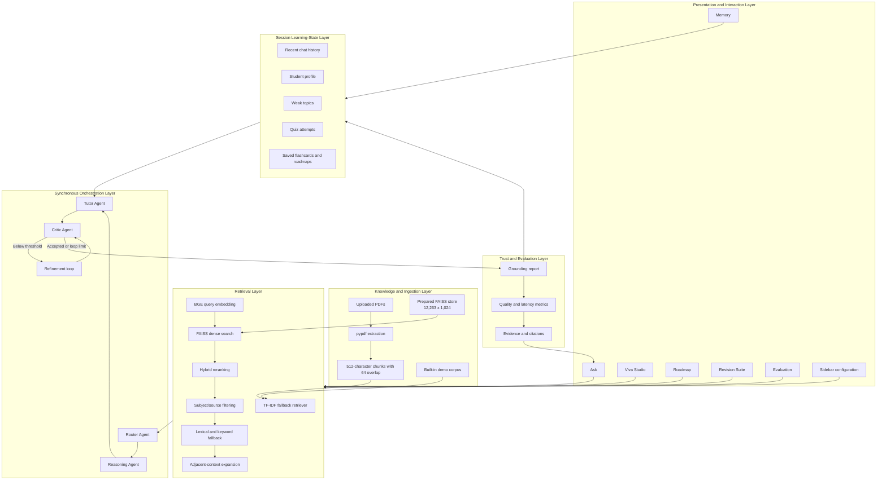

### Architectural boundaries

| Boundary | Input | Output |
|---|---|---|
| Ingestion | PDF files | `List[Chunk]` |
| Retrieval | Query + chunks/index + settings | Ranked evidence rows + match metadata |
| Router | Query + retrieval-match boolean | Route string + trace |
| Reasoning | Query | Plan dictionary + trace |
| Tutor | Query + plan + evidence + route | Answer string + trace |
| Critic | Query + answer | Score dictionary + trace |
| Grounding | Answer + evidence rows | Grounding report dictionary |
| Memory | Interaction results | Updated session-state collections |

---

## 17. Walk Me Through the User Query Lifecycle

### Interview answer

The query lifecycle begins when the user clicks **Generate Answer**. AcadAI records a start time and creates a trace list for agent observability.

First, it retrieves evidence. If the prepared FAISS store is enabled, the query goes through advanced hybrid retrieval. Otherwise, AcadAI builds a TF-IDF index over the active uploaded or demo chunks and retrieves by cosine similarity.

The retrieval result contains both ranked evidence rows and a `match` object. The Router uses that match result plus query keywords and the web-fallback setting to select one of three routes: RAG, Direct LLM, or Web Search.

The Reasoning Agent independently analyzes the question and creates a structured plan. If the route is Web Search, AcadAI obtains web snippets. If RAG evidence looks weak, the orchestrator inserts a warning into the evidence pack.

Recent conversation memory is then appended to the generation query, but importantly it is not used for retrieval. The Tutor receives the selected evidence, route, plan, difficulty, and generation query.

The generated answer moves to the Critic, which returns quality scores and feedback. If the answer is below the quality threshold and the configured loop limit has not been reached, the Tutor refines it and the Critic scores it again.

After refinement, the grounding layer checks sentence-level support against evidence. AcadAI stores the interaction, updates weak topics when grounding is low, computes total latency and other metrics, and renders the answer, traces, evidence, and trust information.

### Query lifecycle sequence

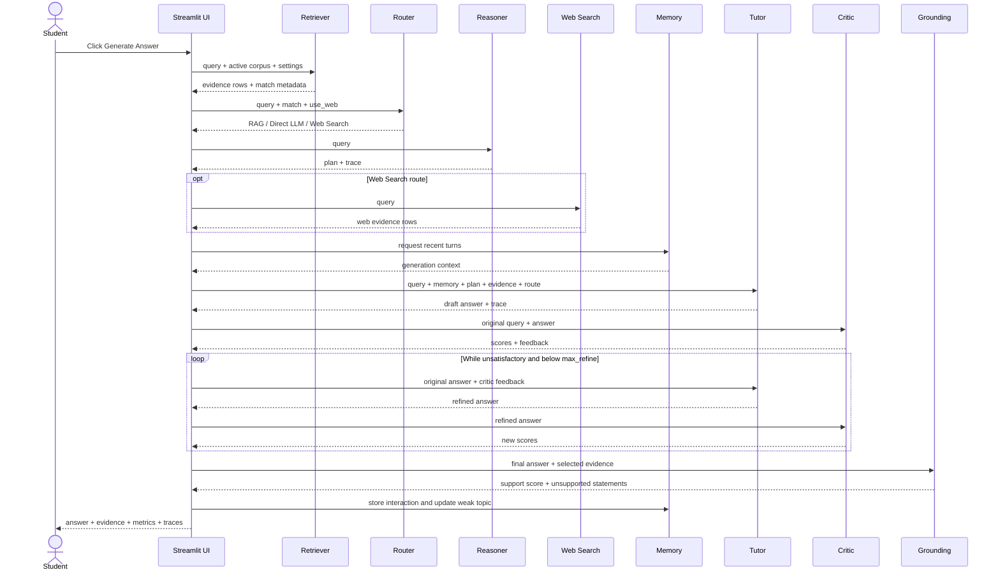

### Real orchestration code

```python
db_rows, match = retrieve_faiss(query, faiss_index, chunks, embedding_model_name, ...)
route, tr_router = router_agent(query, match["match"], use_web)
plan, tr_reasoning = reasoning_agent(query)

memory_context = build_memory_context(memory_turns) if use_memory else ""
query_for_generation = query
if memory_context:
    query_for_generation = (
        f"Current student question: {query}\n\n"
        f"Recent conversation memory for context:\n{memory_context}"
    )

answer, tr_tutor = tutor_agent(
    query_for_generation, difficulty,
    db_rows if route == "RAG" else [],
    web_rows, route, plan
)
scores, tr_critic = critic_agent(query, answer)
```

---

## 18. What Happens After a Student Uploads a PDF?

### Interview answer

After a student uploads one or more PDFs, Streamlit passes the uploaded file objects to `read_pdf_uploads`.

For each file, AcadAI writes the bytes to a temporary PDF file because `pypdf.PdfReader` expects a readable file source. It then iterates through every page, extracts text, cleans repeated whitespace, and splits the page into overlapping chunks.

Each chunk is represented by a `Chunk` dataclass containing:

- A generated document ID.
- Original filename.
- Page number.
- Extracted text.

The default chunk size is 512 characters with 64 characters of overlap. Chunks shorter than 60 characters are ignored.

If at least one uploaded chunk exists and the prepared FAISS store is not enabled, those uploaded chunks become the active corpus. At query time, AcadAI builds a TF-IDF matrix from them and retrieves using cosine similarity.

### Critical implementation truth

Uploading a PDF does **not** currently embed the document or update the persisted FAISS store. The uploaded corpus is temporary and searched lexically during the current session. This is a good prototype behavior because it avoids ingestion delay, but a production architecture should create a user-specific vector index asynchronously.

### Upload pipeline

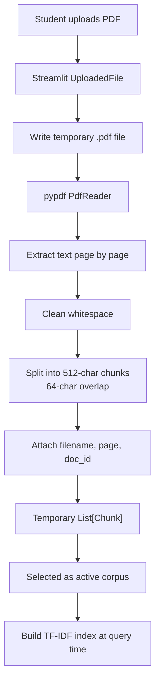

### Real ingestion code

```python
for file in files:
    with tempfile.NamedTemporaryFile(delete=False, suffix=".pdf") as tmp:
        tmp.write(file.read())
        path = tmp.name

    reader = PdfReader(path)
    for page_num, page in enumerate(reader.pages, start=1):
        text = page.extract_text() or ""
        chunks.extend(split_text(text, file.name, page_num))
```

```python
if use_faiss and faiss_index is not None and faiss_chunks:
    chunks = faiss_chunks
elif uploaded_chunks:
    chunks = uploaded_chunks
else:
    chunks = DEMO_CHUNKS
```

### Current upload-path limitations

- Scanned-image PDFs without embedded text require OCR, which is not currently implemented.
- Uploads do not update FAISS.
- TF-IDF is rebuilt when retrieval runs.
- Temporary files are created with `delete=False` and are not explicitly removed by the current function.
- Streamlit reruns can repeat PDF parsing work.

---

## 19. What Happens When a Question Is Asked?

### Interview answer

When a question is asked, AcadAI performs four broad operations: **find evidence, decide strategy, produce and improve an answer, then evaluate and remember it**.

The exact retrieval path depends on the active corpus:

- Prepared FAISS store: semantic embedding plus hybrid reranking.
- Uploaded or demo chunks: TF-IDF cosine similarity.

For FAISS retrieval, AcadAI expands the query with academic synonyms, optionally asks Mistral to expand it further, embeds it with BGE-large, searches a larger candidate pool, applies subject filtering, calculates dense, lexical, and overlap signals, reranks candidates, mixes in fallback results if needed, and expands adjacent context.

The Router then decides the route. The answer is planned, generated, critiqued, optionally refined, grounded, stored, and displayed.

### Decision flow

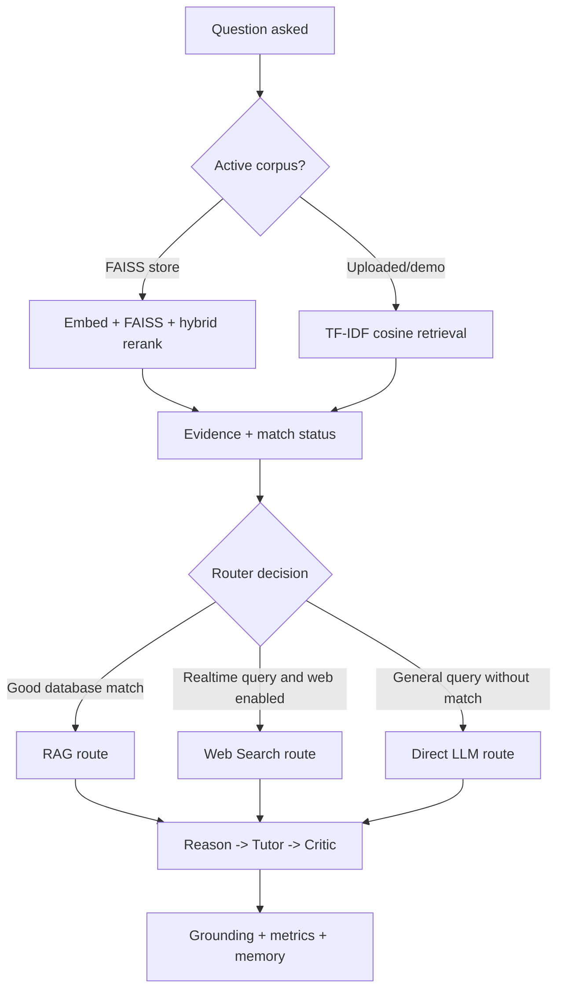

### Real FAISS query code

```python
expanded = expand_query(query)
q_emb = model.encode(
    [model_query_text(expanded, model_name)],
    normalize_embeddings=True
).astype("float32")

search_k = max(top_k, min(max(candidate_k * 2, candidate_k), len(chunks)))
raw_scores, raw_ids = index.search(q_emb, search_k)
```

The larger candidate pool is intentional because filtering and reranking require more options than the final top-k evidence set.

---

## 20. How Do Agents Communicate?

### Interview answer

AcadAI's agents communicate through in-process Python data structures. There is no message broker, agent network, event bus, or remote procedure call between agents.

Each agent is a function with a clear input and output contract:

- The Router returns a route string and `AgentTrace`.
- The Reasoning Agent returns a plan dictionary and `AgentTrace`.
- The Tutor returns an answer string and `AgentTrace`.
- The Critic returns a score dictionary and `AgentTrace`.
- Grounding returns a report dictionary.

The Streamlit Ask-tab code acts as the orchestrator. It calls each function in order and passes outputs from one stage into the next.

Longer-lived learning information is communicated indirectly through `st.session_state`. For example, memory context is read from `chat_history`, while quiz scores update `quiz_attempts` and `weak_topics`.

### Communication diagram

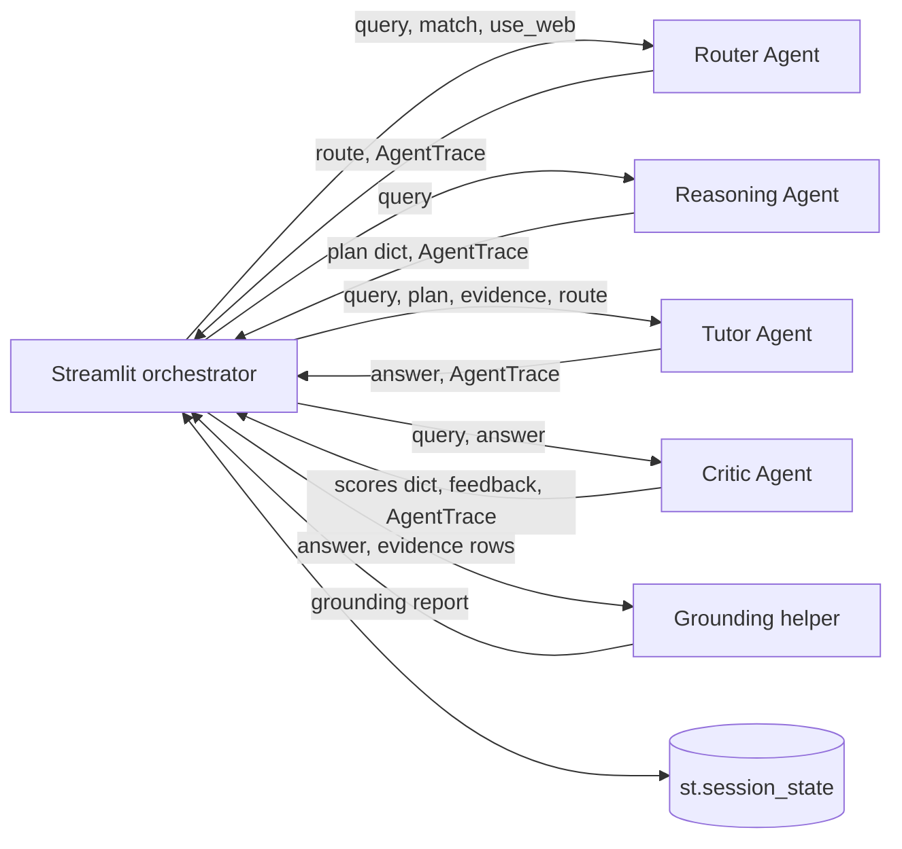

### Real contracts

```python
def router_agent(query: str, db_match: bool,
                 use_web: bool) -> Tuple[str, AgentTrace]:
```

```python
def reasoning_agent(query: str) -> Tuple[Dict, AgentTrace]:
```

```python
def tutor_agent(query: str, difficulty: str,
                context_rows: List[Dict], web_rows: List[Dict],
                route: str, plan: Dict) -> Tuple[str, AgentTrace]:
```

### Why this matters

This communication model is easy to debug and demonstrate. Its drawback is tight orchestration coupling: changing a shared dictionary shape can affect downstream stages, and there is no asynchronous or distributed execution.

---

## 21. What Are the Main Pipelines in AcadAI?

### Interview answer

AcadAI contains one shared knowledge-retrieval foundation and several task pipelines built on top of it.

### Main pipelines

| Pipeline | Purpose | Major stages |
|---|---|---|
| PDF ingestion | Convert uploaded course material into searchable chunks | Upload, extract, clean, chunk, activate |
| FAISS loading | Restore prepared semantic knowledge base | Load index, unpickle metadata, convert documents to chunks |
| Advanced retrieval | Find strong evidence from prepared corpus | Expand, embed, FAISS search, filter, hybrid rerank, fallback, expand context |
| Ask pipeline | Produce grounded academic answers | Retrieve, route, reason, tutor, critic, refine, ground, store |
| Viva pipeline | Generate and evaluate oral-exam practice | Retrieve, generate questions, evaluate answer, parse score, adapt difficulty |
| Roadmap pipeline | Create personalized study plans | Read profile and weak topics, retrieve, generate plan, save |
| Revision pipeline | Generate study materials | Retrieve once, generate notes, questions, and flashcards |
| Evaluation pipeline | Inspect retrieval quality | Run labelled queries, compare top subject, calculate hit rate |
| Memory pipeline | Maintain session personalization | Store chat, grounding, quiz scores, weak topics, and generated assets |

### Pipeline map

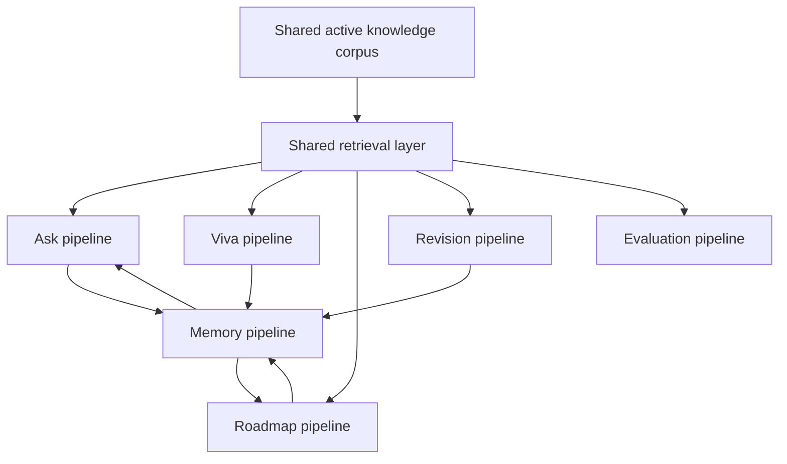

### Architectural strength

The same retrieval layer supplies evidence to several learning tasks. This avoids building separate knowledge systems for Q&A, viva, revision, and roadmaps.

---

## 22. Why Did You Choose a Modular Architecture?

### Interview answer

I chose a modular architecture because AcadAI combines several distinct concerns that evolve at different rates: ingestion, retrieval, routing, generation, critique, grounding, assessment, personalization, and UI.

Separating those concerns provides three practical advantages.

First, each module can fail gracefully. If FAISS is unavailable, TF-IDF retrieval still works. If Mistral is unavailable, deterministic fallbacks keep the application demonstrable.

Second, each stage can be improved independently. I can replace the heuristic subject detector, upgrade the reranker, or strengthen grounding without rewriting the entire learning product.

Third, modular stages make the system explainable. The UI can display agent traces, retrieval evidence, quality scores, and grounding rather than presenting the model as a black box.

### Modularity decision diagram

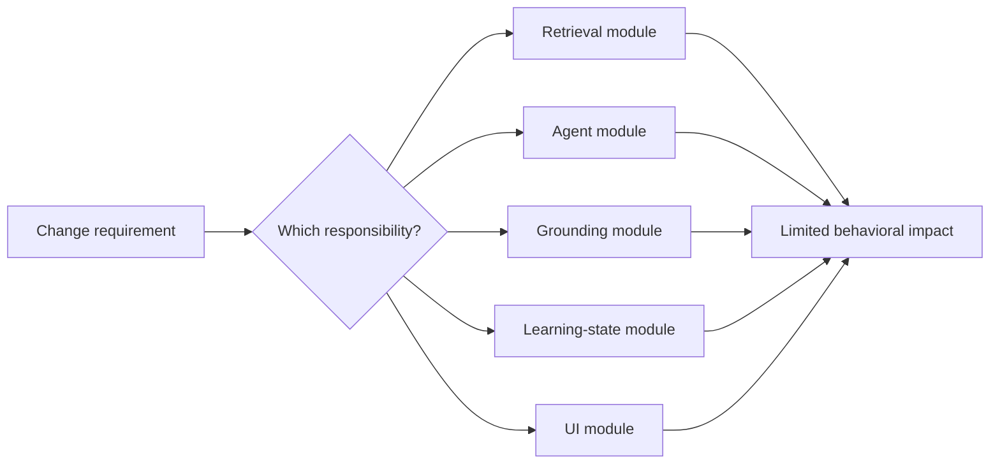

### Honest qualification

The logical architecture is modular, but the current code organization is not yet fully modular because most components live in one large source file. The next engineering step would be to turn the logical boundaries into separate tested Python packages.

---

## 23. What Are the Benefits of Agent Separation?

### Interview answer

Agent separation lets each stage optimize for one responsibility and use a specialized prompt and output contract.

The Reasoning Agent focuses on decomposition rather than prose. The Tutor focuses on pedagogy and evidence. The Critic focuses on evaluation. The Router focuses on choosing an information source. Because their goals differ, separating them reduces prompt complexity and makes failures easier to identify.

### Benefits

1. **Clear responsibility:** each agent has a narrow task.
2. **Better observability:** every agent produces an `AgentTrace`.
3. **Targeted prompts:** planning, teaching, and critique use different system instructions.
4. **Iterative quality:** the Critic can trigger refinement.
5. **Independent fallback behavior:** each function has a local non-LLM fallback.
6. **Replaceability:** an agent can later be replaced with a better model or deterministic component.
7. **Explainability:** the interview or UI can show how the answer was produced.

### Separation diagram

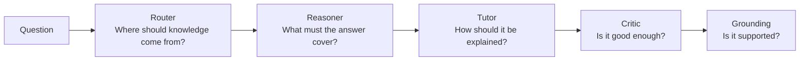

### Concrete example

The Reasoning Agent is required to return JSON containing `key_concepts`, `solution_plan`, `tools_needed`, and `difficulty_estimate`. The Tutor receives those concepts but has a separate instruction to generate concept explanation, steps, examples, exam tips, and citations. That is cleaner than asking one prompt to plan, answer, self-evaluate, and verify itself simultaneously.

---

## 24. What Are the Drawbacks of Agent Separation?

### Interview answer

The main drawback is that every additional LLM-backed agent adds latency, cost, and another point where output can be malformed or inconsistent.

In the Ask pipeline, a normal Mistral-backed request can involve three sequential calls: Reasoning, Tutor, and Critic. A single refinement adds two more calls: Refiner and another Critic evaluation. Because each call has a 30-second timeout and they run sequentially, worst-case latency grows quickly.

Agent separation also creates coordination complexity. For example, the Reasoning Agent may identify concepts that the retrieved evidence does not support, or the Critic may evaluate fluency more strongly than factual grounding. Shared data contracts are dictionaries rather than strict schemas, so malformed model output requires fallback handling.

### Drawbacks

| Drawback | Current manifestation |
|---|---|
| Higher latency | Sequential Mistral calls |
| Higher API cost | Multiple completions per answer |
| Error propagation | Weak retrieval affects Tutor and grounding |
| Output inconsistency | LLM JSON parsing can fail |
| Coordination complexity | Plans, evidence, and answers may disagree |
| Debugging surface | More stages and settings |
| Tight orchestration | Single Streamlit workflow coordinates every stage |
| No parallelism | Independent work is still executed sequentially |

### Latency multiplication diagram

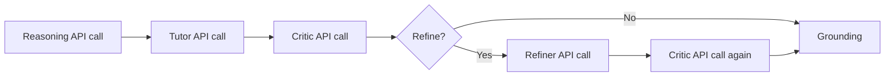

### Mitigation strategy

In a production version, I would use structured schemas, parallelize independent stages, cache repeated plans and retrievals, use smaller specialized models for routing and critique, and apply refinement only when objective checks justify it.

---

## 25. What Architecture Pattern Does AcadAI Follow?

### Interview answer

AcadAI follows a combination of architecture patterns:

1. **Modular monolith:** one deployable Streamlit application with logically separated functions and layers.
2. **Layered architecture:** presentation, ingestion, retrieval, orchestration, trust, and session-state concerns.
3. **Pipeline or pipes-and-filters pattern:** query data moves through retrieval, routing, reasoning, tutoring, critique, and grounding stages.
4. **Orchestrator pattern:** the Ask-tab control flow centrally invokes and coordinates agents.
5. **RAG pattern:** generation is conditioned on retrieved evidence.
6. **Strategy and fallback pattern:** the system selects FAISS, TF-IDF, web, direct LLM, or deterministic behavior according to availability and routing decisions.
7. **Feedback-loop pattern:** Critic feedback can send the answer through refinement.

### Pattern composition

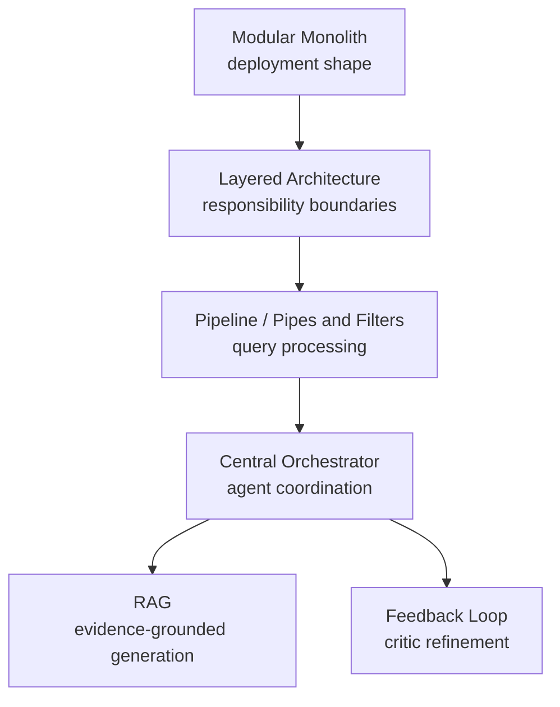

### Best concise answer

> "AcadAI is a layered modular monolith whose main request path uses an orchestrated pipes-and-filters RAG pipeline with a critic feedback loop."

---

## 26. Why Is Routing Needed?

### Interview answer

Routing is needed because no single knowledge source is appropriate for every question.

A syllabus question with a strong database match should use RAG so the answer stays aligned with course material. A real-time question such as "latest network security news" requires web search because the local corpus may be outdated. A basic general-knowledge question without a database match may use the Direct LLM route.

Routing therefore improves relevance, reduces unnecessary web or LLM use, and gives the system a controlled fallback when local evidence is missing.

### Router decision tree

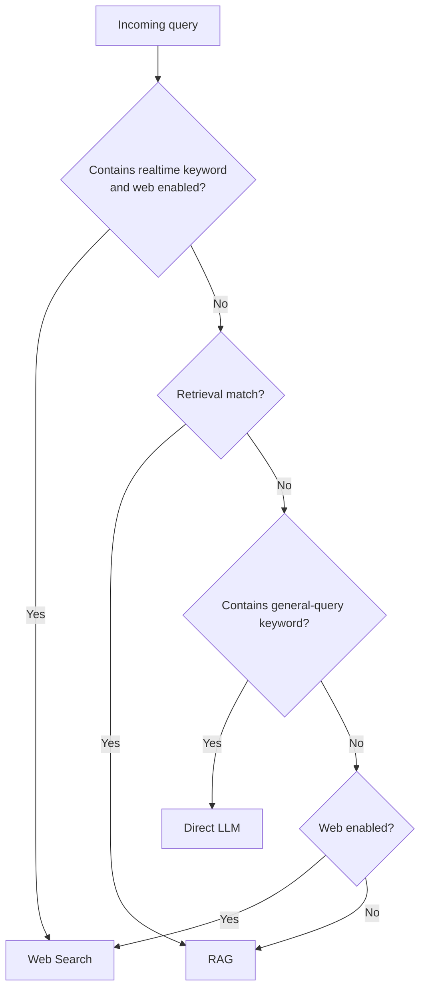

### Real router code

```python
if any(p in q_lower for p in realtime_kw) and use_web:
    route = "Web Search"
elif db_match:
    route = "RAG"
elif any(p in q_lower for p in general_kw):
    route = "Direct LLM"
elif use_web:
    route = "Web Search"
else:
    route = "RAG"
```

### Honest limitation

The current router is rule-based. It is transparent and cheap, but keywords such as `"2024"` and `"2025"` are hard-coded and will age. A production router should use intent classification, freshness metadata, and explicit user policy.

---

## 27. What Is the Control Flow?

### Interview answer

Control flow describes **which component executes next and under what conditions**.

AcadAI uses centralized synchronous control flow. Streamlit reruns the script when the user interacts with the application. Within the Ask tab, a button condition starts the pipeline. The orchestrator makes conditional decisions for corpus selection, retrieval path, routing, web search, weak-evidence warning, memory inclusion, refinement, grounding, and weak-topic updates.

No agent autonomously invokes another agent. The central Streamlit code calls every stage.

### Control-flow diagram

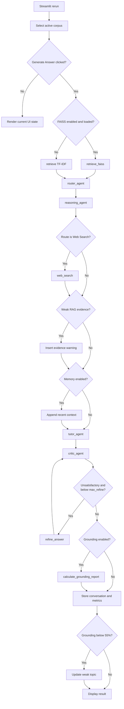

### Central control code

```python
if run and query.strip():
    ...
    if use_faiss and faiss_index is not None and faiss_chunks:
        db_rows, match = retrieve_faiss(...)
    else:
        db_rows, match = retrieve(...)

    route, tr_router = router_agent(query, match["match"], use_web)
    ...
    while (not scores.get("satisfactory")
           and refine_count < max_refine
           and scores.get("feedback")):
        answer = refine_answer(...)
        scores, tr_critic2 = critic_agent(query, answer)
```

---

## 28. What Is the Data Flow?

### Interview answer

Data flow describes **what information moves between components and how its representation changes**.

The user's raw query begins as a string. Retrieval transforms it into an expanded query and embedding, then into ranked evidence-row dictionaries. The Router transforms query and match metadata into a route. The Reasoning Agent transforms the query into a structured plan. The Tutor combines query, plan, evidence, route, difficulty, and optional memory into an answer string. The Critic transforms the answer into score and feedback fields. Grounding transforms answer plus evidence into support statistics. Finally, the system writes a summarized interaction into session state.

### Data-flow diagram

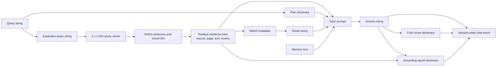

### Important data structures

```python
@dataclass
class Chunk:
    doc_id: str
    source: str
    page: int
    text: str

@dataclass
class AgentTrace:
    agent: str
    action: str
    result: str
    latency: float = 0.0
```

An evidence row extends chunk data with retrieval information such as `rank`, `subject`, `dense_norm`, `lexical`, `hybrid_score`, `overlap`, and `retrieval_mode`.

---

## 29. How Does Evidence Move Through the System?

### Interview answer

Evidence begins as page text, becomes chunks, is ranked into evidence rows, is formatted into the Tutor prompt, is cited in the answer, and is reused after generation for grounding and UI inspection.

For the prepared corpus, FAISS stores vectors while `index.pkl` stores the associated text and metadata. Query retrieval returns chunk IDs and scores. AcadAI joins those IDs to metadata, filters and reranks the candidates, and selects the final top-k rows.

Each selected row contains both a shortened `evidence` preview and fuller `text`. The Tutor prompt uses the preview with explicit document IDs. Grounding uses the fuller text when available. The UI displays evidence source, page, subject, and ranking scores.

The same evidence-row format is also reused by Viva, Roadmap, Revision, and Evaluation pipelines.

### Evidence lineage

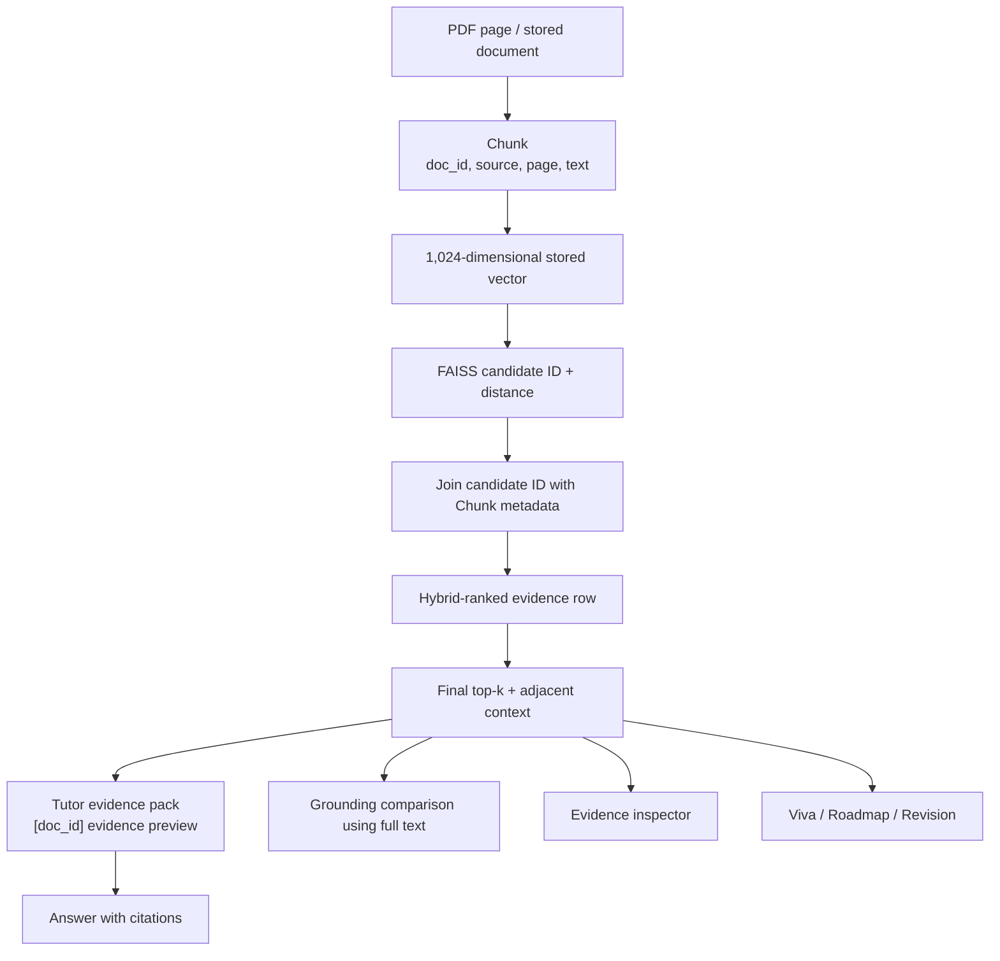

### Real evidence packaging

```python
if route == "RAG":
    evidence = "\n\n".join(
        f"[{r['doc_id']}] {r['evidence']}" for r in context_rows
    )
```

### Real grounding evidence selection

```python
evidence_text = " ".join(
    str(r.get("text") or r.get("evidence") or "")
    for r in evidence_rows
)
```

### Evidence safety mechanism

If the top RAG evidence has both low overlap and a hybrid score below the configured threshold, AcadAI prepends a warning telling the Tutor to answer only what is supported and state what is missing.

### Honest limitation

Citations are prompt-generated references to retrieved chunk IDs. The system does not currently enforce a strict sentence-to-citation mapping or validate that every citation precisely supports its associated claim.

---

## 30. Which Component Is the Bottleneck?

### Interview answer

For a normal warm request with Mistral enabled, the primary bottleneck is the **sequential external LLM pipeline**, not FAISS search.

The Reasoning Agent, Tutor Agent, and Critic Agent each call the Mistral API one after another. If refinement is triggered, the system adds a Refiner call and another Critic call. Each HTTP call has a 30-second timeout. Network latency, model generation time, and prompt length therefore dominate the end-to-end response time.

FAISS searches only 12,263 vectors, which is modest for vector search. The local hybrid reranking over roughly 100 candidates is also comparatively lightweight. However, optional cross-encoder reranking can add noticeable local CPU latency.

There are different bottlenecks for different phases:

| Phase | Likely bottleneck | Reason |
|---|---|---|
| Warm Ask request | Sequential Mistral calls | Three calls normally, up to five with one refinement |
| First FAISS request | Embedding-model cold start | BGE-large must load before encoding |
| Cross-encoder enabled | Reranker inference | Query-document pairs scored locally |
| Uploaded large PDFs | Parsing plus repeated TF-IDF fitting | Pages are extracted and TF-IDF matrix is built locally |
| Streamlit interaction rerun | Repeated PDF processing | Upload parsing is not cached |
| Web route | External DuckDuckGo/Wikipedia requests | Network dependency and sequential fallback |

### Bottleneck diagram

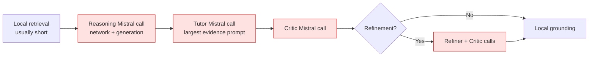

### Worst-case call-count analysis

With Mistral query expansion disabled and one refinement:

1. Reasoning call.
2. Tutor call.
3. Initial Critic call.
4. Refiner call.
5. Second Critic call.

With Mistral query expansion enabled, add one more call before retrieval. With web fallback, add one or two external search requests.

### How I would remove the bottleneck

1. Use a small local or cheaper model for Router and Critic.
2. Make reasoning optional for simple queries.
3. Parallelize independent reasoning and retrieval work.
4. Stream the Tutor response.
5. Use strict objective checks before triggering refinement.
6. Cache query embeddings, retrieval results, and repeated plans.
7. Limit evidence tokens and summarize adjacent context.
8. Run PDF ingestion and embedding as background jobs.
9. Persist uploaded-document indexes instead of rebuilding TF-IDF.
10. Add per-stage latency telemetry and percentile dashboards.

### Real timeout and sequential-call evidence

```python
r = requests.post(
    "https://api.mistral.ai/v1/chat/completions",
    ...,
    timeout=30,
)
```

```python
plan, tr_reasoning = reasoning_agent(query)
answer, tr_tutor = tutor_agent(...)
scores, tr_critic = critic_agent(query, answer)
```

The calls are visibly sequential in the orchestrator, which is why the LLM layer is the most defensible bottleneck answer.

---

## Architecture Whiteboard Summary

Use this when an interviewer asks you to draw AcadAI quickly:

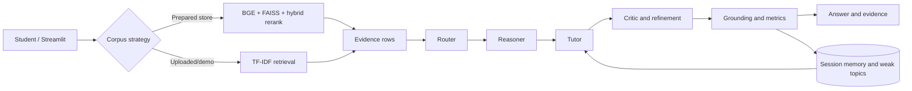

### 60-second architecture script

> "AcadAI is a layered modular monolith implemented as a Streamlit application. It supports a prepared 12,263-chunk FAISS corpus, temporary uploaded-PDF chunks, and a demo corpus. The prepared corpus uses BGE embeddings and hybrid retrieval; uploads use TF-IDF. A central synchronous orchestrator passes evidence through Router, Reasoning, Tutor, Critic, optional refinement, and grounding stages. Agents communicate through Python return values, while session state stores temporary learning memory. The same retrieval layer powers Ask, Viva, Roadmap, Revision, and Evaluation. The primary warm-path bottleneck is sequential Mistral API calls, while model loading and repeated PDF processing affect cold starts and large uploads."

---

## Difficult Architecture Follow-Ups

### Is the Router actually before retrieval?

Not in the current Ask implementation. Retrieval runs first so the Router can use the resulting `db_match` boolean. Logically the Router selects the answer source, but operationally it is a post-retrieval routing decision.

### Do agents call each other directly?

No. The Streamlit orchestrator calls each agent and passes the outputs. This is centralized orchestration rather than autonomous peer-to-peer agent communication.

### Is uploaded-PDF retrieval semantic?

No. Uploaded PDFs become temporary chunks and use TF-IDF cosine similarity unless they are separately added to a prepared FAISS store.

### Why use `IndexFlatL2` instead of an approximate index?

At 12,263 vectors, exact flat search is still practical and avoids approximate-search recall loss. If the corpus grows significantly, an HNSW or IVF-based index would offer better scaling.

### Is FAISS the bottleneck?

Not at the current corpus size. Exact search over 12,263 vectors is small compared with sequential network LLM calls. The embedding-model cold start may be noticeable, but the steady-state bottleneck is generation and critique.

### Is the current architecture horizontally scalable?

Not cleanly. Session state is local to the Streamlit process, uploaded chunks are temporary, and orchestration is synchronous. Horizontal scaling would require external state storage, persistent per-user indexes, job queues, and stateless API services.

### Where is backpressure handled?

It is not explicitly handled. There is no task queue or concurrency control layer. API timeouts prevent indefinite waiting, but production traffic would require rate limits, queues, retries, and circuit breakers.

### Does the grounding layer send answers back for correction?

The current implementation calculates and displays grounding, stores it, and updates weak topics below 55%. It does not automatically send low-grounding answers through another Tutor correction pass. Some project diagrams describe that as a desired architecture, but it is not present in the current Ask control flow.

---

## Source Reference Map

All line references point to `acadai_app_final_mistral_faiss.py`.

| Architecture topic | Lines |
|---|---:|
| Core dataclasses | 97-109 |
| PDF chunking and upload processing | 176-214 |
| Cached model loading | 218-235 |
| FAISS metadata conversion and loading | 238-312 |
| Subject detection and query expansion | 318-516 |
| Lexical scoring and context expansion | 533-597 |
| Cross-encoder reranking | 599-614 |
| Advanced FAISS retrieval pipeline | 617-797 |
| TF-IDF fallback retriever | 801-832 |
| Web-search pipeline | 836-882 |
| Mistral API boundary | 884-920 |
| Router Agent | 923-948 |
| Reasoning Agent | 951-985 |
| Tutor Agent | 989-1043 |
| Critic and refinement | 1046-1098 |
| Metrics and history | 1100-1121 |
| Memory and grounding | 1124-1195 |
| Viva and adaptive learning | 1198-1271 |
| Roadmap and revision generators | 1274-1323 |
| Shared tool retrieval | 1326-1340 |
| Configuration and corpus selection | 2231-2311 |
| Main Ask control flow | 2319-2427 |
| Viva pipeline | 2509-2573 |
| Roadmap pipeline | 2576-2618 |
| Revision pipeline | 2620-2649 |
| Evaluation pipeline | 2652-2730 |
