# AcadAI Interview Guide: Section 3 - Retrieval-Augmented Generation

This section answers questions 31-50 using AcadAI's actual source code, persisted FAISS store, corpus statistics, evaluation dashboard, and project documentation.

## Verified RAG Facts

| Item | Actual AcadAI implementation |
|---|---|
| Prepared vector store | FAISS `IndexFlatL2` |
| Prepared corpus size | 12,263 chunks from 323 source paths |
| Embedding dimension | 1,024 |
| Default embedding model | `BAAI/bge-large-en-v1.5` |
| Uploaded-PDF chunk size | 512 characters |
| Uploaded-PDF overlap | 64 characters, or 12.5% of chunk size |
| Prepared-corpus chunk statistics | Median 491 characters; mean 489.9; 95th percentile 799; maximum 800 |
| Default final evidence count | 8, configurable from 4 to 12 |
| Default FAISS candidate count | 100, configurable from 10 to 200 |
| Hybrid score | `0.45*dense + 0.40*lexical + 0.15*keyword overlap`, plus boosts |
| Evidence preview sent to Tutor | Up to 420 characters per selected row |
| Retrieval fallback | Subject lexical scan + keyword fallback + TF-IDF corpus retriever |
| Grounding | Sentence-level lexical support heuristic |
| Live retrieval evaluation | Subject-level hit rate over configurable labelled queries |

> Important distinction: the prepared FAISS corpus and uploaded-PDF corpus use different retrieval paths. Prepared FAISS data receives semantic and hybrid retrieval. Uploaded PDFs are currently searched with TF-IDF cosine similarity and are not inserted into the persisted FAISS store.

---

## 31. What Is Retrieval-Augmented Generation?

### Interview answer

Retrieval-Augmented Generation, or RAG, is an architecture that combines information retrieval with language-model generation.

Instead of asking an LLM to answer only from knowledge stored in its parameters, RAG first searches an external knowledge source for relevant evidence. It then injects that evidence into the generation prompt so the model can answer using information that is specific, inspectable, and potentially newer than its training data.

RAG has two major phases:

1. **Retrieval:** find the most relevant passages for the user's question.
2. **Generation:** provide those passages to an LLM and instruct it to produce an answer grounded in them.

In AcadAI, the external knowledge source is primarily academic notes represented as chunks in a FAISS vector store. Retrieval is enhanced with lexical matching, subject filtering, and fallbacks. Generation is handled by the Tutor Agent, which is explicitly told to use only the evidence and cite sources.

### Basic RAG diagram

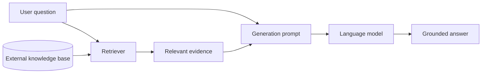

### AcadAI-specific definition

> "In AcadAI, RAG means retrieving relevant course-note chunks before generation, passing them to the Tutor Agent with document IDs, and checking the resulting answer against the same evidence afterward."

---

## 32. Why Use RAG Instead of Pure LLMs?

### Interview answer

Pure LLMs are powerful general reasoners, but they have three weaknesses for academic assistance:

1. They may not know the student's exact syllabus, lecture notes, or institution-specific definitions.
2. Their internal knowledge may be outdated or incomplete.
3. They can generate plausible statements without providing evidence.

RAG addresses these problems without retraining the model. It lets AcadAI dynamically use the student's own material, display the sources, and update the knowledge base independently from the LLM.

### Comparison

| Pure LLM | RAG in AcadAI |
|---|---|
| Answers from model parameters | Answers from retrieved course evidence plus model reasoning |
| Difficult to inspect source of facts | Displays source, page, subject, and evidence |
| Updating knowledge requires retraining or a new model | Updating knowledge requires changing documents or index |
| May answer outside syllabus | Can prioritize institution-specific notes |
| No retrieval-quality measurement | Retrieval dashboard exposes top result and hit rate |
| Higher risk of unsupported confidence | Tutor prompt and grounding layer encourage evidence-based answers |

### Decision diagram

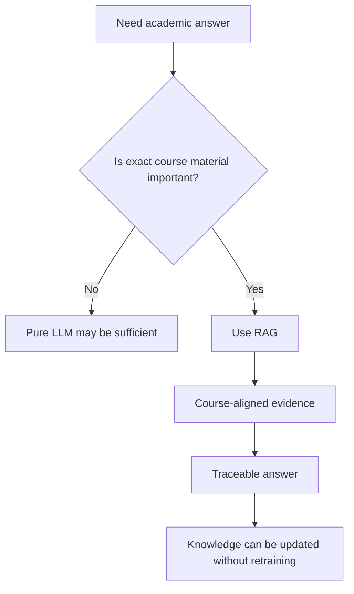

### Honest qualification

RAG improves evidence access; it does not guarantee correctness. If retrieval returns irrelevant or conflicting evidence, generation can still be wrong.

---

## 33. What Are Hallucinations?

### Interview answer

An LLM hallucination is an answer statement that sounds plausible but is unsupported, fabricated, or inconsistent with the available evidence.

In an academic system, hallucinations can include:

- Inventing a definition that does not appear in the notes.
- Giving a wrong formula or algorithm step.
- Creating a fake citation.
- Combining facts from unrelated subjects.
- Answering confidently when the source material does not cover the topic.

Hallucinations are especially dangerous in education because fluent wording can make incorrect information appear authoritative.

### Hallucination types

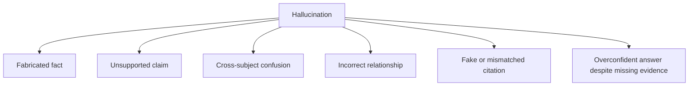

### AcadAI interpretation

AcadAI operationalizes hallucination risk as weak support between answer sentences and retrieved evidence. Its grounding report counts supported and unsupported sentences using keyword overlap and evidence-hit ratios.

---

## 34. How Does RAG Reduce Hallucinations?

### Interview answer

RAG reduces hallucinations by placing relevant evidence directly inside the generation context and instructing the model to answer from that evidence.

In AcadAI, hallucination reduction happens at several stages:

1. Hybrid retrieval increases the chance of selecting correct material.
2. Subject filtering rejects weak cross-subject chunks.
3. A weak-evidence guard warns the Tutor when retrieval confidence is low.
4. The Tutor prompt says to use only provided evidence and state missing information instead of guessing.
5. Explicit document IDs encourage source citations.
6. The Critic evaluates the answer before release.
7. Grounding compares answer sentences with the retrieved evidence.

### Defense-in-depth diagram

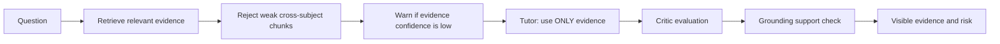

### Real Tutor constraint

```python
system = (
    "You are AcadAI's Tutor Agent - a pedagogically expert AI tutor. "
    "Generate a well-structured academic answer using ONLY the evidence provided. "
    "If evidence is weak or partially relevant, clearly say what is missing "
    "instead of guessing. "
)
```

### Important limitation

The instruction is a behavioral constraint, not a mathematical guarantee. The model may still introduce unsupported content, and AcadAI's current grounding heuristic can miss semantic contradictions.

---

## 35. Explain the RAG Pipeline in AcadAI

### Interview answer

AcadAI's advanced RAG pipeline has six phases: prepare the query, retrieve candidates, rerank and filter, build the evidence pack, generate the answer, and verify grounding.

First, AcadAI cleans and expands the query using academic synonyms, acronyms, and detected subject terms. Optional Mistral query expansion can add more related terms.

Second, the BGE embedding model converts the expanded query into a normalized 1,024-dimensional vector. FAISS searches the prepared `IndexFlatL2` for a candidate pool larger than the final top-k.

Third, AcadAI calculates lexical TF-IDF similarity and keyword overlap for the candidates. It combines these with normalized dense similarity, applies source and subject boosts, rejects weak cross-subject results, and optionally uses a cross encoder. If results are weak, lexical and keyword fallbacks scan the stored chunks.

Fourth, it selects the final top-k evidence and appends adjacent chunks from the same source and nearby pages.

Fifth, the Tutor receives evidence previews with document IDs and generates a structured answer.

Finally, the Critic evaluates the answer and the grounding function measures sentence support against the fuller evidence text.

### Complete RAG pipeline

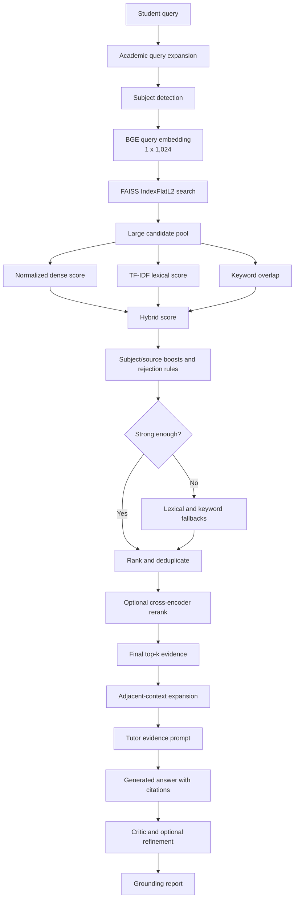

### Real hybrid formula

```python
hybrid = (
    0.45 * float(dense_norm[i])
    + 0.40 * float(lex[i])
    + 0.15 * float(overlaps[i])
)
```

---

## 36. What Happens During Retrieval?

### Interview answer

Retrieval is the process of converting a natural-language question into a ranked evidence set.

For the prepared FAISS corpus, AcadAI:

1. Expands the query with subject-specific terminology.
2. Detects likely subjects such as CN, OS, DBMS, or ML.
3. Embeds the expanded query.
4. Checks that the embedding dimension matches the FAISS index.
5. Searches approximately twice the configured candidate count.
6. Filters candidates by subject when appropriate.
7. Calculates dense, lexical, and overlap signals.
8. Applies boosts and rejection rules.
9. Deduplicates candidates.
10. Adds lexical or keyword fallback results when necessary.
11. Optionally reranks with a cross encoder.
12. Selects top-k and expands nearby context.

### Retrieval data transformation

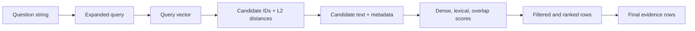

### Real retrieval code

```python
q_emb = model.encode(
    [model_query_text(expanded, model_name)],
    normalize_embeddings=True
).astype("float32")

search_k = max(top_k, min(max(candidate_k * 2, candidate_k), len(chunks)))
raw_scores, raw_ids = index.search(q_emb, search_k)
```

### Uploaded-PDF retrieval

Uploaded PDFs take a simpler path:

```python
vec, mat = build_index(chunks)
q_vec = vec.transform([query])
sims = cosine_similarity(q_vec, mat).ravel()
ranked = np.argsort(sims)[::-1][:top_k]
```

This path is lexical rather than semantic.

---

## 37. What Happens During Generation?

### Interview answer

During generation, AcadAI converts retrieved evidence into an educational response.

The Tutor Agent receives the student's question, requested difficulty, key concepts from the Reasoning Agent, selected route, and evidence rows. For RAG, every evidence preview is prefixed with its document ID. These entries are concatenated into the prompt.

The Tutor's system instruction asks for four things:

1. Concept explanation.
2. Step-by-step breakdown with worked examples.
3. Exam-oriented tips.
4. Explicit source citations.

After generation, the answer goes to the Critic. If quality is below the threshold, it can be refined. Then the grounding layer checks the final answer against the evidence.

### Generation flow

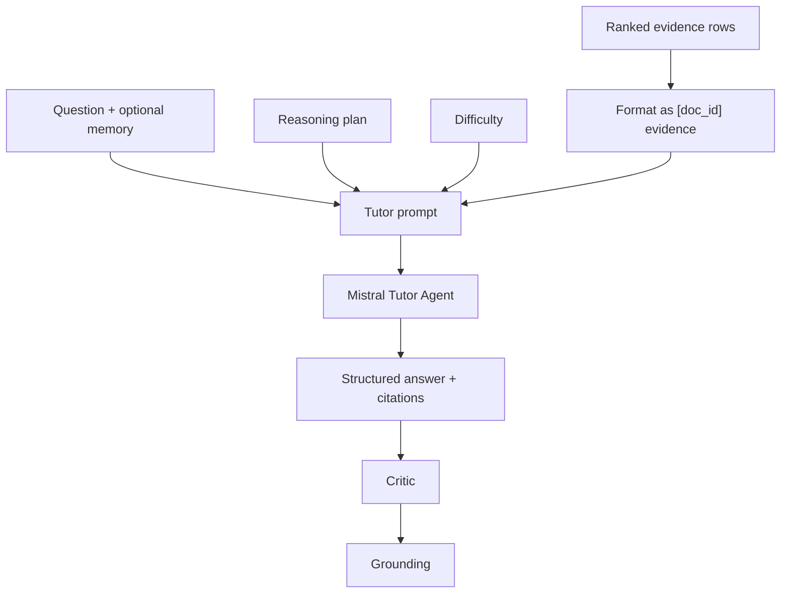

### Real context injection

```python
evidence = "\n\n".join(
    f"[{r['doc_id']}] {r['evidence']}"
    for r in context_rows
)

prompt = (
    f"Difficulty: {difficulty}\n"
    f"Key concepts: {concepts}\n"
    f"Student query: {query}\n\n"
    f"Evidence:\n{evidence}"
)
```

---

## 38. What Happens If Retrieval Fails?

### Interview answer

AcadAI handles retrieval failure through multiple fallback layers rather than immediately returning an empty result.

Within advanced FAISS retrieval, if dense search and filtering produce no strong candidates, AcadAI performs:

1. A subject-filtered lexical TF-IDF scan.
2. An exact keyword and phrase fallback over all stored chunks.
3. A merge and deduplication step.

If initial results exist but are weak, keyword fallback results are mixed into the candidate set before final selection.

After retrieval, the Router may select Web Search or Direct LLM when the database match is false. If RAG is still selected with weak evidence, the orchestrator inserts a warning into the evidence pack. If no reliable evidence and no useful fallback are available, the Tutor returns a `NOT_FOUND` message.

### Failure-handling tree

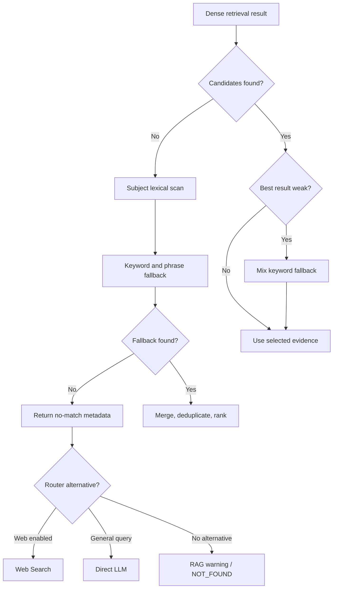

### Real failure code

```python
if not pre_selected:
    fallback_rows = lexical_subject_scan(...)
    keyword_rows = keyword_fallback_search(...)
    merged = fallback_rows + keyword_rows
```

```python
answer = (
    "NOT_FOUND: No reliable evidence. "
    "Upload relevant PDFs or enable web fallback."
)
```

---

## 39. Why Is Chunking Important?

### Interview answer

Chunking breaks long documents into smaller searchable units.

Embedding an entire textbook or PDF page as one vector would mix many topics into one representation. That makes retrieval less precise and forces the LLM to receive too much irrelevant text. Very small chunks create the opposite problem: they may lose definitions, conditions, examples, or surrounding meaning.

Good chunks improve:

- Retrieval precision, because each vector represents a focused passage.
- Context efficiency, because only relevant passages enter the prompt.
- Citation quality, because evidence can be tied to a specific source and page.
- Grounding, because answer statements can be compared with focused evidence.

### Chunking trade-off

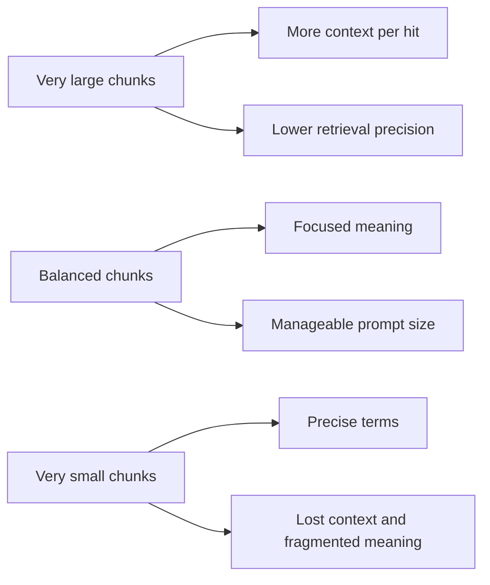

### AcadAI example

Uploaded PDFs use 512-character chunks with 64-character overlap. This is a lightweight compromise for lecture-note paragraphs and short technical explanations.

---

## 40. How Do You Choose Chunk Size?

### Interview answer

Chunk size should be chosen empirically based on document structure, embedding model behavior, question types, retrieval metrics, and the LLM context budget.

For technical academic material, a chunk should ideally contain one complete definition, procedure, example, or small group of related points. If the chunk is too large, unrelated concepts compete in the embedding. If it is too small, the retrieved passage may not contain enough evidence to answer.

AcadAI's uploaded-PDF path uses 512 characters. The prepared FAISS corpus has a median of 491 characters but a maximum of 800, suggesting its original indexing process used a somewhat larger upper limit.

### Verified corpus statistics

| Statistic | Prepared FAISS corpus |
|---|---:|
| Chunks | 12,263 |
| Mean characters | 489.9 |
| Median characters | 491 |
| 95th percentile | 799 |
| Maximum | 800 |
| Mean words | 77.6 |
| Median words | 78 |

### Selection method

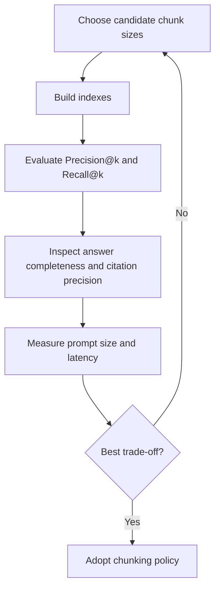

### Honest limitation

The current repository does not contain an automated chunk-size ablation experiment. The 512-character upload setting is a practical design choice, not a proven global optimum.

---

## 41. What Is Overlap in Chunking?

### Interview answer

Overlap means repeating part of the previous chunk at the beginning of the next chunk.

It protects concepts that cross a chunk boundary. For example, a definition might appear at the end of one chunk while its conditions or example appear immediately afterward. Without overlap, retrieval may return only half the idea.

AcadAI advances by `chunk_size - overlap`. With a chunk size of 512 and overlap of 64, each new chunk starts 448 characters after the previous one. That gives a 12.5% overlap.

### Overlap diagram

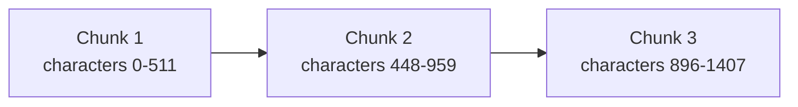

The repeated regions are characters `448-511` and `896-959`.

### Real code

```python
part = text[start: start + chunk_size]
start += max(1, chunk_size - overlap)
```

### Trade-off

More overlap improves continuity but increases duplicate chunks, storage, indexing cost, and the chance of repetitive evidence.

---

## 42. What Retrieval Strategy Did You Use?

### Interview answer

AcadAI uses a hybrid, multi-stage retrieval strategy.

The primary path combines:

- **Dense semantic retrieval:** BGE-large embeddings searched through FAISS.
- **Lexical retrieval:** TF-IDF cosine similarity.
- **Keyword overlap:** exact query-term coverage.
- **Subject filtering:** heuristic classification for B.Tech subjects.
- **Source boosts:** filename and folder hints.
- **Domain-specific boosts:** extra support for subnetting and network terminology.
- **Optional cross-encoder reranking:** direct query-passage relevance scoring.
- **Keyword and lexical fallback:** full-corpus scans when semantic retrieval is weak.
- **Adjacent-context expansion:** nearby chunks from the same source and page.

### Retrieval strategy stack

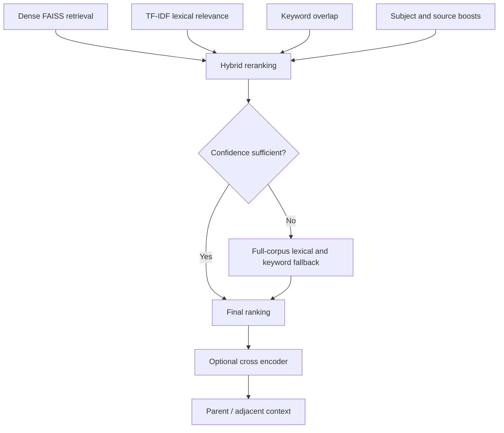

### Why hybrid retrieval?

Semantic retrieval handles paraphrases, while lexical retrieval protects exact academic terminology such as `CIDR`, `ACID`, or `BCNF`. Combining both reduces the weaknesses of either method alone.

---

## 43. What Are the Limitations of RAG?

### Interview answer

RAG moves part of the problem from generation to retrieval. It improves grounding, but its quality is limited by the documents, chunking, indexing, retrieval, and prompt design.

### General limitations

1. Relevant information may not exist in the corpus.
2. Poor chunking can split or mix concepts.
3. Retrieval can miss paraphrases or select semantically similar but wrong passages.
4. Retrieved documents can be outdated, incorrect, or contradictory.
5. Too much evidence can distract the model.
6. The LLM can ignore or misinterpret evidence.
7. Citations can still be mismatched.
8. Retrieval and reranking add latency and complexity.

### AcadAI-specific limitations

- Uploaded PDFs use TF-IDF rather than semantic indexing.
- Scanned PDFs have no OCR pipeline.
- Subject detection is keyword-based.
- Context limits are character and top-k based, not tokenizer-aware.
- Conflict resolution is not explicit.
- Grounding is lexical rather than entailment-based.
- The live evaluation dashboard measures subject-level hit rate, not full relevance judgments.
- Low grounding does not currently trigger automatic evidence-based regeneration.

### Failure-chain diagram

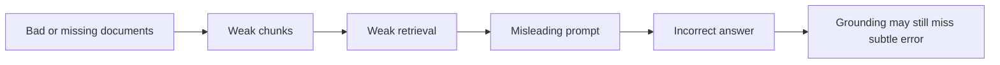

### Best interview line

> "RAG does not remove hallucination; it makes knowledge access and answer verification more controllable."

---

## 44. Why Not Fine-Tune the Model?

### Interview answer

Fine-tuning and RAG solve different problems.

Fine-tuning is useful for changing model behavior, style, task format, or specialized reasoning patterns. It is less suitable for frequently changing factual knowledge because updating facts requires new training data and another training cycle. It also does not naturally provide citations.

AcadAI's primary need is to answer from student-specific and institution-specific notes. Those documents can change every semester or session. RAG lets the system update knowledge by changing the corpus rather than retraining Mistral.

### RAG versus fine-tuning

| Requirement | RAG | Fine-tuning |
|---|---|---|
| Add new course notes quickly | Strong | Requires training cycle |
| Provide source citations | Natural | Not natural |
| Keep institution-specific material separate | Strong | Harder |
| Change answer style consistently | Moderate through prompts | Strong |
| Teach new response format | Moderate | Strong |
| Correct or delete a fact | Update corpus/index | Difficult to guarantee |
| Initial cost | Lower | Higher |

### Decision diagram

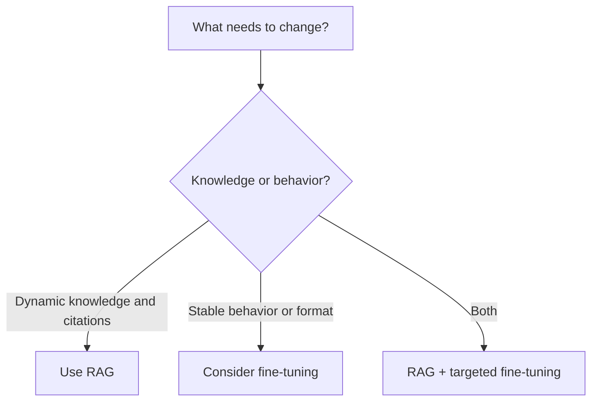

### Honest future approach

A mature AcadAI version could combine RAG with a small fine-tuned educational model for consistent tutoring style or critique, while keeping course facts in the retrievable corpus.

---

## 45. What Is Context Injection?

### Interview answer

Context injection is the process of placing retrieved evidence inside the LLM prompt before generation.

The LLM does not directly query FAISS. AcadAI retrieves evidence in Python, formats each selected passage with a document ID, and inserts the resulting text under an `Evidence:` section in the Tutor prompt.

This temporary prompt context guides generation without changing the model's trained parameters.

### Context injection diagram

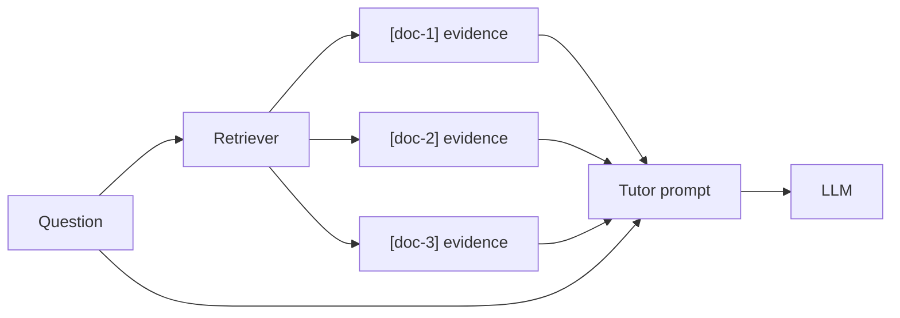

### Real code

```python
evidence = "\n\n".join(
    f"[{r['doc_id']}] {r['evidence']}"
    for r in context_rows
)

prompt = (
    f"Difficulty: {difficulty}\n"
    f"Key concepts: {concepts}\n"
    f"Student query: {query}\n\n"
    f"Evidence:\n{evidence}"
)
```

Conversation memory is also injected into the generation query, but it is deliberately not used for retrieval.

---

## 46. How Do You Prevent Context Overflow?

### Interview answer

AcadAI controls context size through bounded retrieval and evidence truncation.

The final evidence count defaults to eight and can be configured only between four and twelve. Retrieval may inspect many candidates, but only final top-k rows reach the Tutor. Each row's prompt-facing evidence preview is truncated to approximately 420 characters. Adjacent chunks can enrich the row's full text, but the prompt still receives the shortened preview. Memory is also limited to a configurable number of recent turns, with each previous answer shortened.

### Existing context controls

| Control | Current behavior |
|---|---|
| Final evidence top-k | Default 8; UI range 4-12 |
| Evidence preview | `quote(..., 420)` for advanced retrieval |
| Candidate pool | Large for ranking, but not all candidates enter prompt |
| Memory turns | Default 4; UI range 1-8 |
| Stored memory answer excerpt | Up to 450 characters |
| Critic input | Answer truncated to first 1,500 characters |
| Tool evidence | Explicit slices such as first 8, 10, or 12 rows |

### Context-funnel diagram

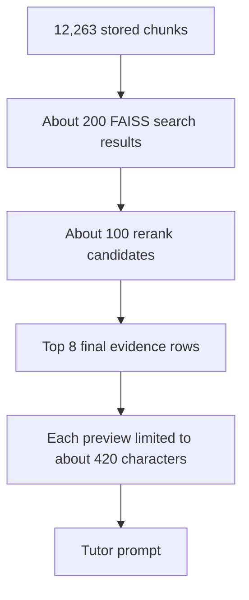

### Honest limitation

AcadAI does not currently count tokens or dynamically enforce the Mistral model's context-window limit. It uses character limits and top-k bounds as practical proxies. A production version should use tokenizer-aware budgeting, reserve output tokens, and trim evidence by marginal relevance.

---

## 47. What Happens When Multiple Documents Conflict?

### Interview answer

In the current implementation, conflicting documents are not explicitly detected or reconciled.

AcadAI ranks chunks by relevance, so the most relevant and highest-scoring passages appear first. The Tutor receives multiple evidence rows with source IDs and is instructed to use only the evidence. If different sources disagree, the LLM may mention the difference, choose one interpretation, or produce an inconsistent synthesis.

The source and page metadata make conflicts inspectable by the user, but there is no dedicated conflict detector, source-authority score, timestamp policy, or consensus algorithm.

### Current conflict behavior

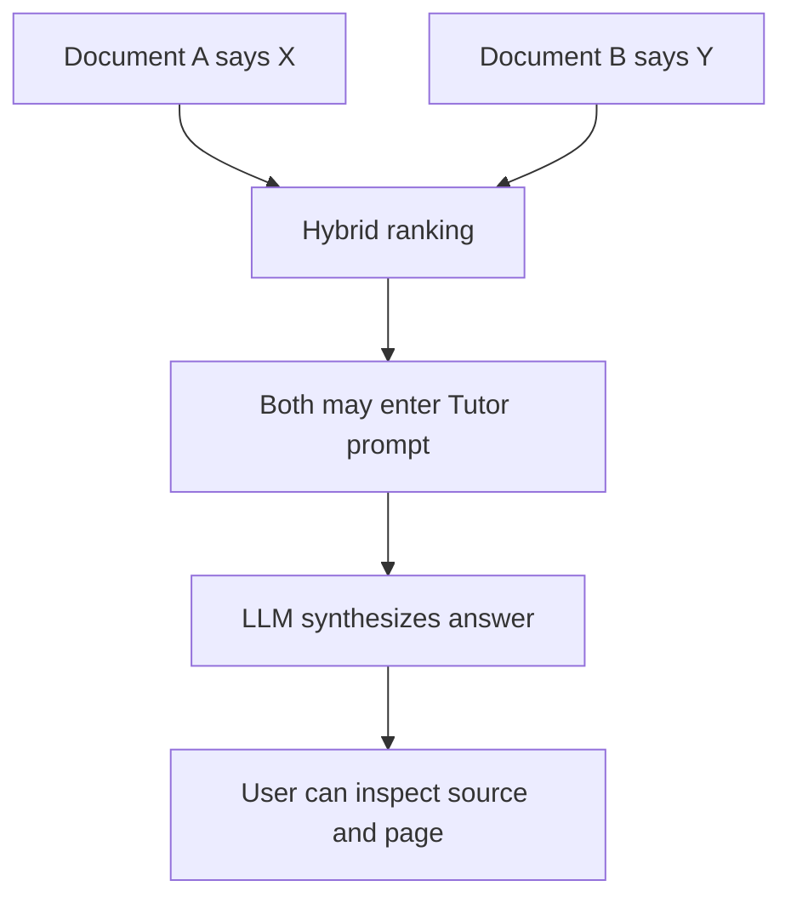

### What a stronger design should do

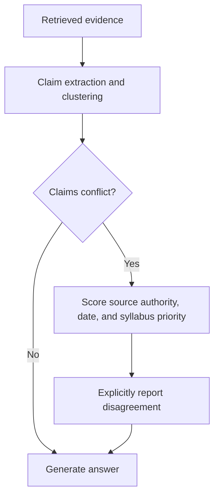

### Strong honest answer

> "Today, ranking and source visibility help manage conflicts, but AcadAI does not yet have formal contradiction detection. I would add claim-level contradiction checks and source-authority metadata before presenting a single conclusion."

---

## 48. How Do You Rank Retrieved Chunks?

### Interview answer

AcadAI ranks prepared-corpus chunks in multiple stages.

FAISS first produces raw L2 distances. Since smaller L2 distance is better, AcadAI converts those distances into a normalized higher-is-better dense score. It then calculates TF-IDF lexical similarity and keyword overlap.

The base hybrid score is:

```text
0.45 x normalized dense similarity
+ 0.40 x TF-IDF lexical similarity
+ 0.15 x keyword overlap
```

It then adds source-subject boosts and, for subnetting questions, a specialized computer-network keyword boost. Weak cross-subject candidates are rejected. Duplicate passages are removed. If enabled, a cross encoder reranks the shortlisted rows using direct query-passage scoring.

### Ranking funnel

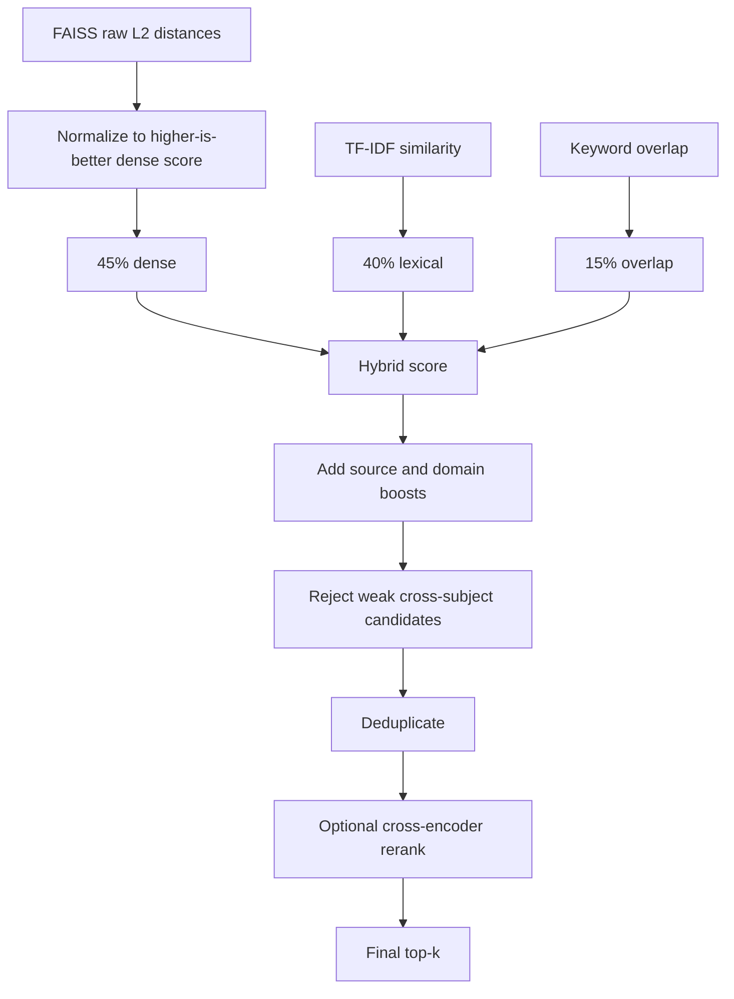

### Real ranking code

```python
hybrid = 0.45 * float(dense_norm[i]) \
       + 0.40 * float(lex[i]) \
       + 0.15 * float(overlaps[i])

hybrid += source_subject_boost(
    c_for_boost.source,
    required_subjects_for_boost
)

if is_subnetting_query(query):
    hybrid += 0.25 * cn_keyword_score(candidate_texts[i])
```

### Important nuance

If cross-encoder reranking is enabled, its score determines final order after the hybrid shortlist. It is disabled by default to save memory and latency.

---

## 49. How Do You Measure Retrieval Quality?

### Interview answer

Retrieval quality should be measured independently from generation quality because the LLM cannot produce a grounded answer if the evidence is wrong.

The AcadAI project documentation records Precision@1, Recall@4, MRR, nDCG@4, and F1@4. These metrics answer different questions:

- **Precision@1:** was the first result relevant?
- **Recall@4:** how much relevant evidence appeared in the first four?
- **MRR:** how early did the first relevant result appear?
- **nDCG@4:** were highly relevant results ordered near the top?
- **F1@4:** balance between precision and recall at four.

The current live Evaluation tab implements a simpler subject-level benchmark. Each query is paired with an expected subject. The app retrieves evidence, compares the top result's inferred subject with the expected subject, and reports hit rate plus diagnostic fields.

### Documented results

| Metric | Documented value |
|---|---:|
| Precision@1 | 1.00 |
| Recall@4 | 1.00 |
| MRR | 1.00 |
| nDCG@4 | 0.9277 |
| F1@4 | 0.7937 |

### Live evaluation flow

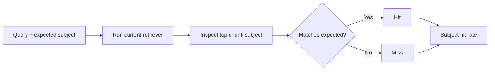

### Real live metric

```python
top_subject = found[0].get("subject", "") if found else ""
hit = bool(found) and (not expected or top_subject == expected)

hit_rate = round(
    (df_eval["Hit"] == "Yes").mean() * 100,
    1
)
```

### Critical interview honesty

The live app does not currently calculate the five ranking metrics listed in the documentation. Those should be presented as documented experiment results. A stronger evaluation harness would store query-to-relevant-chunk judgments and calculate all metrics reproducibly.

---

## 50. Why Is Grounding Important?

### Interview answer

Grounding is important because a response can be fluent, relevant, and well structured while still containing unsupported statements.

RAG retrieves evidence before generation; grounding checks the answer after generation. It closes the trust loop by asking: "Can this answer actually be supported by the evidence we retrieved?"

In AcadAI, grounding:

- Produces a score from 0 to 100.
- Counts supported and unsupported answer sentences.
- Labels the answer strongly, partially, or weakly grounded.
- Displays unsupported statements.
- Stores grounding history.
- Updates the weak-topic tracker when grounding is below 55%.

### Retrieval versus grounding

```mermaid
flowchart LR
    Q["Question"] --> R["Retrieval asks:<br/>What evidence is relevant?"]
    R --> G["Generation creates answer"]
    G --> V["Grounding asks:<br/>Is the answer supported?"]
    V --> T["Trust signal for student"]
```

### Real grounding code

```python
for sent in sents:
    overlap = keyword_overlap(sent, evidence_text)
    sent_terms = [t for t in tokenize(sent) if len(t) > 3]
    evidence_hits = sum(
        1 for t in set(sent_terms)
        if t in evidence_text.lower()
    )
    support_ratio = evidence_hits / max(1, len(set(sent_terms)))

    if overlap >= 0.18 or support_ratio >= 0.28:
        supported += 1
    else:
        unsupported.append(sent)

score = round((supported / max(1, len(sents))) * 100, 1)
```

### Honest limitation

This is a transparent lexical grounding heuristic, not a true natural-language inference or factual-verification model. It may mark a sentence as supported because it shares vocabulary with evidence even if its meaning is wrong, and it may miss valid paraphrases with low lexical overlap.

### Strong closing line

> "Retrieval gives the model evidence; grounding gives the user a reason to trust or question the answer."

---

## RAG Whiteboard Summary

```mermaid
flowchart LR
    DOC["Academic PDFs"] --> CH["Chunks"]
    CH --> IDX["BGE vectors + FAISS"]
    Q["Question"] --> EX["Expand and classify"]
    EX --> IDX
    IDX --> CAN["Candidates"]
    CAN --> HY["Hybrid rank + fallback"]
    HY --> TOP["Top-k evidence"]
    TOP --> T["Tutor generation"]
    T --> C["Critic"]
    C --> G["Grounding"]
    G --> OUT["Answer + citations + trust metrics"]
```

### 60-second RAG script

> "AcadAI uses RAG so answers can be based on course notes rather than only Mistral's internal knowledge. The prepared corpus contains 12,263 chunks represented by 1,024-dimensional BGE embeddings in a FAISS IndexFlatL2. At query time, AcadAI expands the question, retrieves a large candidate set, and ranks it using 45 percent dense similarity, 40 percent TF-IDF similarity, and 15 percent keyword overlap, with subject and source boosts plus lexical fallbacks. It sends only the final top-k evidence previews to the Tutor Agent, which is instructed to use only that evidence and cite document IDs. After generation, a Critic evaluates quality and a grounding layer estimates sentence-level evidence support. The main limitations are heuristic subject classification, no explicit conflict resolution, lexical grounding, and no tokenizer-aware context budget."

---

## Difficult RAG Follow-Ups

### Does RAG guarantee no hallucinations?

No. It reduces risk by providing evidence and enabling verification, but poor retrieval or model behavior can still create unsupported answers.

### Is AcadAI's FAISS search approximate?

No. The persisted index is `IndexFlatL2`, which performs exact L2 nearest-neighbor search. At 12,263 vectors, exact search is practical.

### Why normalize embeddings if the index uses L2?

Normalized embeddings make L2 distance closely related to cosine similarity, assuming the stored vectors were created consistently. The system also checks dimensional compatibility, but the repository does not independently verify stored-vector normalization.

### Are uploaded PDFs added to FAISS?

No. They are temporarily chunked and searched using TF-IDF in the current implementation.

### Why retrieve more candidates than final top-k?

Subject filtering, hybrid scoring, deduplication, and reranking need a larger candidate pool. Searching only final top-k would leave too little room to correct poor dense ordering.

### Does adjacent-context expansion increase prompt size?

It expands the row's full `text`, which grounding and evidence inspection can use. The Tutor receives the shortened `evidence` preview, limited to approximately 420 characters.

### How are conflicts resolved?

They are not explicitly resolved. Relevance ranking and source visibility help, but formal contradiction detection is future work.

### Does low grounding automatically regenerate the answer?

No. Current code displays and stores grounding and updates weak topics below 55%. It does not send low-grounding output back through the Tutor.

### Is the documented 100% retrieval result sufficient?

No. The default benchmark contains only 12 subject-labelled queries. A production evaluation needs a larger, versioned, independently labelled test set with chunk-level relevance judgments.

---

## Source Reference Map

All line references point to `acadai_app_final_mistral_faiss.py`.

| RAG topic | Lines |
|---|---:|
| Text cleaning, tokenization, overlap | 152-174 |
| Upload chunking | 176-214 |
| Embedding and cross-encoder loading | 218-235 |
| FAISS metadata loading | 238-312 |
| Subject detection and source boosts | 318-382 |
| Keyword fallback search | 385-438 |
| Subject filtering | 441-466 |
| Query expansion | 469-516 |
| Dense score normalization | 518-530 |
| TF-IDF candidate scoring | 533-543 |
| Lexical subject fallback | 546-575 |
| Adjacent-context expansion | 578-597 |
| Cross-encoder reranking | 599-614 |
| Advanced FAISS retrieval | 617-797 |
| Uploaded/demo TF-IDF retrieval | 801-832 |
| Tutor context injection and generation | 989-1043 |
| Critic and refinement | 1046-1098 |
| Grounding report | 1169-1195 |
| Retrieval controls | 2254-2264 |
| Ask RAG orchestration and weak-evidence guard | 2319-2427 |
| Live retrieval evaluation | 2652-2730 |
