# AcadAI Interview Guide: Section 4 - Embeddings

This section answers questions 51-65 using AcadAI's actual embedding code, persisted FAISS index, reconstructed stored vectors, retrieval behavior, and primary model documentation.

## Verified Embedding Facts

| Item | Verified value |
|---|---|
| Default embedding model | `BAAI/bge-large-en-v1.5` |
| Embedding library | Sentence Transformers |
| Stored vector dimension | 1,024 |
| Number of stored vectors | 12,263 |
| FAISS index type | `IndexFlatL2` |
| FAISS metric | Squared L2 distance |
| Vector storage file | `AcadAI_FAISS_STORE/index.faiss` |
| Metadata storage file | `AcadAI_FAISS_STORE/index.pkl` |
| Index file size | 50,229,293 bytes, approximately 50.2 MB |
| Raw vector payload | `12,263 x 1,024 x 4 = 50,229,248` bytes |
| Query normalization | `normalize_embeddings=True` |
| Stored-vector normalization | Verified sample norms are approximately `1.0` |
| Dimension safety check | Query dimension must equal `index.d` |
| Non-embedding fallback | TF-IDF cosine similarity |

> Interview honesty: the repository proves that BGE-Large is configured and required for the existing 1,024-dimensional index. It does not contain a model-selection ablation study. Therefore, explain the rationale as an engineering justification, not as a measured claim that BGE-Large was proven best for this corpus.

---

## 51. What Are Embeddings?

### Interview answer

Embeddings are dense numerical representations of data. In a text-retrieval system, an embedding model converts a sentence, paragraph, or document chunk into a fixed-length vector of floating-point numbers.

The purpose of that vector is to represent meaning in a form that a computer can compare mathematically. Texts with similar meanings should be located closer together in vector space, even when they do not use exactly the same words.

For example:

- "Explain database normalization"
- "How do normal forms reduce redundancy?"

These sentences use different words, but a good embedding model should place their vectors relatively close because they discuss the same concept.

In AcadAI, every prepared academic chunk is represented by a 1,024-dimensional vector. A student's query is converted into another 1,024-dimensional vector, and FAISS searches for nearby stored vectors.

### Concept diagram

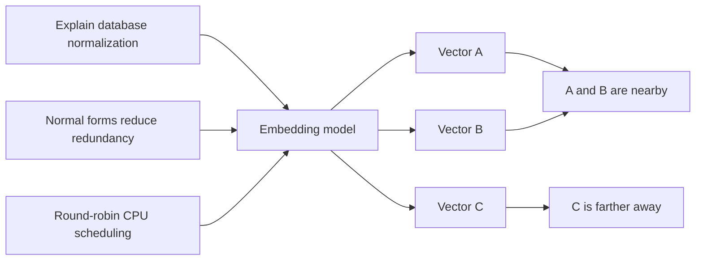

### Important clarification

An individual vector coordinate usually does not have a simple human-readable meaning such as "dimension 17 means DBMS." Meaning is distributed across the full vector.

---

## 52. Why Are Embeddings Needed?

### Interview answer

Embeddings are needed because keyword matching alone cannot reliably capture paraphrases, conceptual similarity, or different ways of asking the same question.

A lexical system performs well when the query and document use the same terms. It can struggle when the wording changes. Embeddings let AcadAI search by semantic meaning rather than only exact token overlap.

For example, a student may ask "How can the OS avoid indefinite resource waiting?" while the source uses the term "deadlock prevention." A semantic embedding model can connect those ideas even if the wording is different.

### Keyword versus embedding retrieval

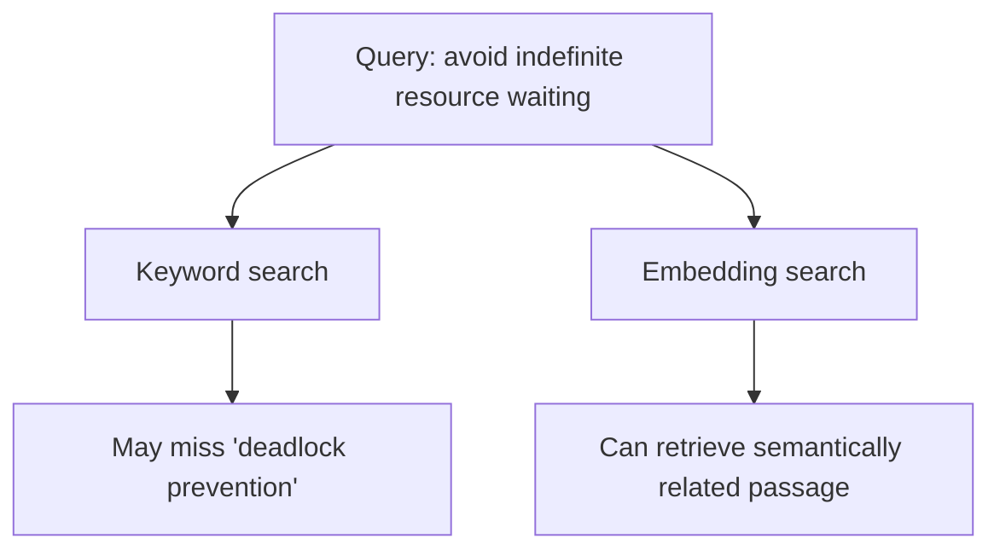

### Why AcadAI still uses lexical signals

Embeddings can retrieve conceptually related but academically wrong material. AcadAI therefore combines dense embedding similarity with TF-IDF similarity, keyword overlap, subject filtering, and source boosts.

> "Embeddings provide semantic recall; lexical signals and filters restore precision."

---

## 53. Which Embedding Model Did You Use?

### Interview answer

AcadAI uses `BAAI/bge-large-en-v1.5` through the Sentence Transformers library.

The model converts each query into a normalized 1,024-dimensional float vector. That dimension must match the prepared FAISS index. The existing index contains 12,263 vectors with dimension 1,024.

### Real configuration

```python
DEFAULT_EMBEDDING_MODEL = os.getenv(
    "EMBEDDING_MODEL",
    "BAAI/bge-large-en-v1.5"
)
```

### Real model loading

```python
@st.cache_resource(show_spinner=False)
def get_embedding_model(model_name: str):
    if SentenceTransformer is None:
        return None
    try:
        return SentenceTransformer(model_name)
    except Exception:
        return None
```

The model is cached as a Streamlit resource so it is not reloaded for every interaction.

### Compatibility requirement

Changing to a model that produces a different vector dimension will make the existing index unusable until the document corpus is re-embedded and the FAISS index is rebuilt.

---

## 54. Why BGE-Large?

### Interview answer

The repository does not include an explicit model comparison experiment, so the most honest answer is that BGE-Large was selected as a strong, locally deployable English retrieval model that matches the prepared index.

The engineering rationale is:

1. **Retrieval specialization:** BGE is designed for embedding and passage retrieval tasks.
2. **Semantic quality:** the large English v1.5 model is intended to provide strong retrieval representations.
3. **Local execution:** it can run through Sentence Transformers without sending course text to an external embedding API.
4. **Open integration:** it works directly with FAISS and the Python AI ecosystem.
5. **Index compatibility:** AcadAI's existing vectors are 1,024-dimensional, which matches BGE-Large.
6. **Normalization support:** Sentence Transformers can produce normalized BGE embeddings suitable for similarity search.
7. **Improved v1.5 score distribution:** the BGE model card states that v1.5 was designed to improve retrieval behavior and similarity-score distribution.

### Model-selection trade-off

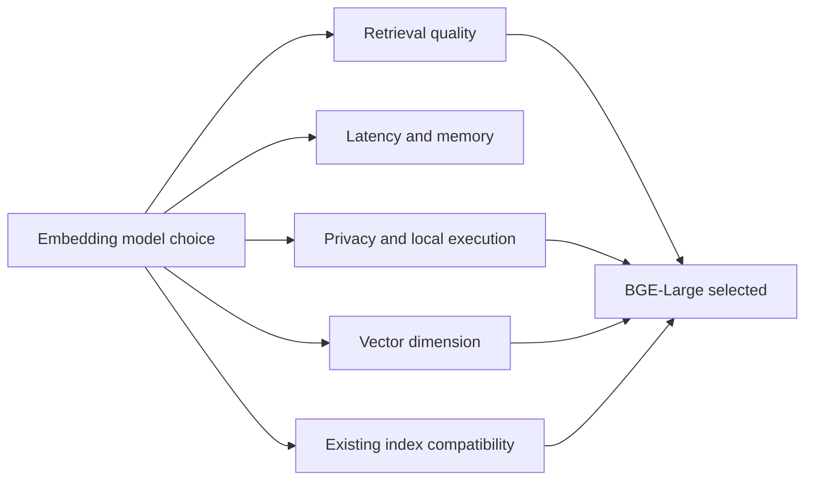

### Trade-off

BGE-Large is heavier and slower than smaller embedding models. A smaller BGE model could reduce memory and latency, but the entire stored corpus would need to be re-embedded because its vector dimension would differ.

---

## 55. What Is Embedding Dimension?

### Interview answer

Embedding dimension is the number of numerical coordinates in each vector.

AcadAI's BGE-Large embeddings have 1,024 dimensions. Therefore, each query and every stored chunk is represented as a vector containing 1,024 floating-point values.

If the corpus contains `N` chunks and each vector has dimension `D`, the vector matrix has shape:

```text
N x D
```

For AcadAI:

```text
12,263 x 1,024
```

Using 32-bit floats, the raw vector memory is:

```text
12,263 x 1,024 x 4 bytes = 50,229,248 bytes
```

This almost exactly matches the verified FAISS index file size of 50,229,293 bytes.

### Dimension diagram

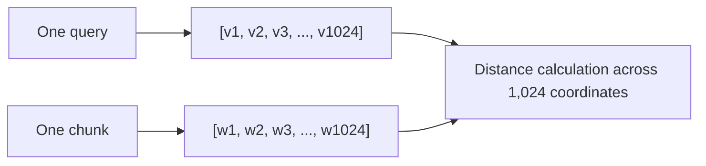

### Real safety check

```python
if q_emb.shape[1] != index.d:
    return [], {
        "match": False,
        "reason": (
            f"Embedding dimension mismatch: model gives {q_emb.shape[1]}, "
            f"FAISS index needs {index.d}."
        ),
    }
```

### Trade-off

Larger dimensions can encode richer distinctions, but they require more storage, memory bandwidth, and distance-calculation work.

---

## 56. What Happens During Embedding Generation?

### Interview answer

During query embedding generation, AcadAI first expands the student's question with academic synonyms and subject-specific terms. It optionally asks Mistral for additional expansion.

The expanded string is passed to the Sentence Transformer model. Internally, the model tokenizes the text, processes the tokens through a transformer, pools the learned token representations into one fixed-length vector, and returns the vector.

AcadAI requests normalized embeddings, converts them to 32-bit floats, and verifies the dimension before searching FAISS.

### Generation flow


### Real query-embedding code

```python
expanded = expand_query(query)

q_emb = model.encode(
    [model_query_text(expanded, model_name)],
    normalize_embeddings=True
).astype("float32")
```

### Prepared document embeddings

The repository contains the finished FAISS index but not the original index-building script. Therefore, the exact document-embedding generation code is not present. However, the stored vectors were verified to have approximately unit norm and dimension 1,024, indicating a compatible normalized embedding pipeline.

---

## 57. How Do Semantic Embeddings Work?

### Interview answer

Semantic embedding models learn from large text datasets so that texts used in similar contexts or expressing similar concepts receive nearby vector representations.

Unlike TF-IDF, which primarily represents word occurrence, a transformer embedding model processes each word in relation to the surrounding words. This contextual processing helps distinguish meanings and connect paraphrases.

For example, the word "process" means something different in:

- "operating-system process scheduling"
- "software development process"

A contextual embedding model uses the surrounding sentence to produce different representations.

### Semantic representation diagram

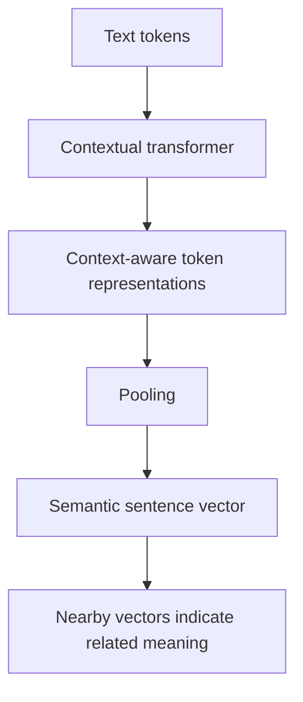

### Training intuition

Embedding models are trained so semantically related query-passage pairs become closer and unrelated examples become farther apart. This is often implemented with contrastive learning.

### Limitation

Embeddings capture statistical semantic patterns, not perfect logical understanding. They can overvalue shared nouns, confuse relatedness with direct relevance, and miss subtle negation or factual contradiction.

---

## 58. How Are Embeddings Stored?

### Interview answer

AcadAI stores vectors and document metadata separately.

The `index.faiss` file contains the 12,263 dense vectors in a FAISS `IndexFlatL2`. Because it is a flat index, the vectors are stored directly and exact L2 distance is calculated during search.

The `index.pkl` file contains a LangChain-style in-memory document store and a mapping from each FAISS vector position to its document ID. Each document contains text and metadata such as source and page.

At load time, AcadAI:

1. Reads the FAISS vector index.
2. Unpickles the document store and mapping.
3. Iterates through FAISS positions in order.
4. Converts each stored document into AcadAI's `Chunk` dataclass.

### Storage architecture

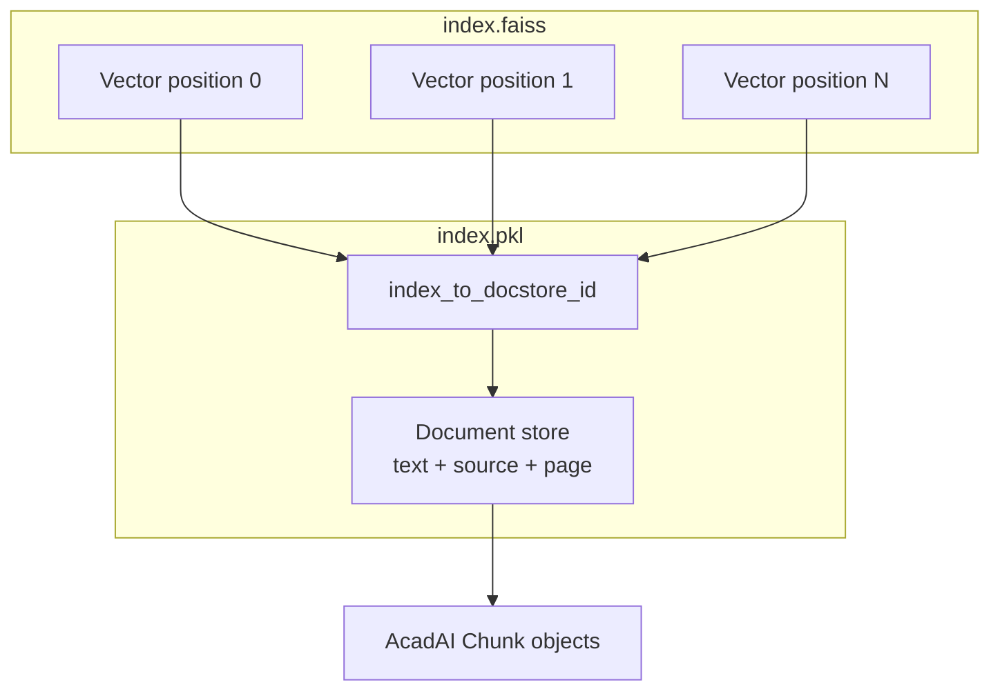

### Real loading code

```python
index = faiss.read_index(index_path)

with open(pkl_path, "rb") as f:
    obj = pickle.load(f)

chunks = _extract_chunks_from_pickle(obj)
```

### Why separate vectors and metadata?

FAISS is optimized for numerical nearest-neighbor search, while the document store retains the text and source information needed after vector IDs are retrieved.

---

## 59. Why Not Use OpenAI Embeddings?

### Interview answer

The repository does not use OpenAI embeddings or include an OpenAI dependency. AcadAI's embedding path is intentionally local through Sentence Transformers and BGE-Large.

The practical reasons for that design are:

1. **Privacy:** academic notes do not need to be sent to a third-party embedding API.
2. **No per-embedding API cost:** once the model is available locally, indexing and queries do not incur embedding-request charges.
3. **Offline and reproducible retrieval:** the same local model can be reused without network availability.
4. **Control:** the model, normalization, vector dimension, and index can be managed directly.
5. **Existing-index compatibility:** the persisted store already contains 1,024-dimensional BGE-compatible vectors.

### Trade-off comparison

| Local BGE embeddings | Hosted embedding API |
|---|---|
| Academic text stays local | Text is sent over network |
| Requires local model memory and compute | Provider handles inference |
| No per-call embedding fee | Usage-based API cost |
| Can work offline after model download | Requires network and credentials |
| Full control over model and indexing | Simpler operational setup |
| Existing AcadAI index is compatible | Requires rebuilding the index |

### Honest qualification

This does not mean hosted embeddings are inherently worse. They may provide easier scaling, strong quality, and less local infrastructure. The best choice should be based on retrieval benchmarks, privacy policy, latency, and cost.

---

## 60. What Is Cosine Similarity?

### Interview answer

Cosine similarity measures the angle between two vectors rather than their absolute length.

For vectors `A` and `B`:

```text
cosine_similarity(A, B) = (A dot B) / (||A|| x ||B||)
```

A value closer to `1` means the vectors point in similar directions. A value near `0` means they are largely unrelated.

Cosine similarity is useful for text because it focuses on the pattern and direction of semantic features instead of vector magnitude.

### Geometric intuition

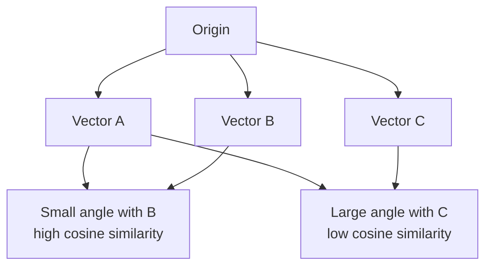

### AcadAI usage

AcadAI directly uses scikit-learn cosine similarity for TF-IDF retrieval and lexical reranking:

```python
sims = cosine_similarity(q_vec, mat).ravel()
```

For dense FAISS retrieval, AcadAI uses L2 distance, but the vectors are normalized. For unit vectors, squared L2 distance and cosine similarity are monotonically related:

```text
||A - B||² = 2 - 2 x cosine_similarity(A, B)
```

Therefore, smaller L2 distance produces the same ordering as larger cosine similarity when both vectors have unit norm.

---

## 61. What Is Vector Distance?

### Interview answer

Vector distance is a numerical measure of how far apart two vectors are in embedding space.

AcadAI's FAISS store uses L2, or Euclidean, distance. FAISS `IndexFlatL2` returns squared L2 distance:

```text
distance²(A, B) = sum((Ai - Bi)²)
```

Smaller distance means the query and chunk vectors are more similar.

AcadAI converts raw FAISS distances into a normalized higher-is-better dense score before combining them with lexical signals.

### Distance flow

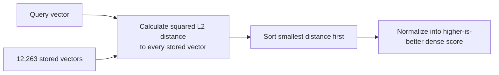

### Real normalization code

```python
inv = 1.0 / (1.0 + np.maximum(scores, 0))
mn, mx = float(inv.min()), float(inv.max())
return (inv - mn) / (mx - mn + 1e-9)
```

### Verified example

Two sampled normalized stored vectors had:

```text
squared L2 distance = 0.7483
cosine similarity   = 0.6259
```

For unit vectors:

```text
2 - 2 x 0.6259 = 0.7482
```

This confirms the expected L2-cosine relationship for the stored normalized vectors.

---

## 62. How Do Embeddings Capture Meaning?

### Interview answer

Embeddings capture meaning by learning recurring relationships between words, phrases, and passages across large training datasets.

During training, the model is encouraged to place relevant or semantically similar examples closer together and unrelated examples farther apart. Transformer attention lets the representation depend on context, and contrastive learning shapes the final vector space for similarity and retrieval.

The result is a distributed representation where meaning is encoded across many coordinates and geometric relationships.

### Learning intuition

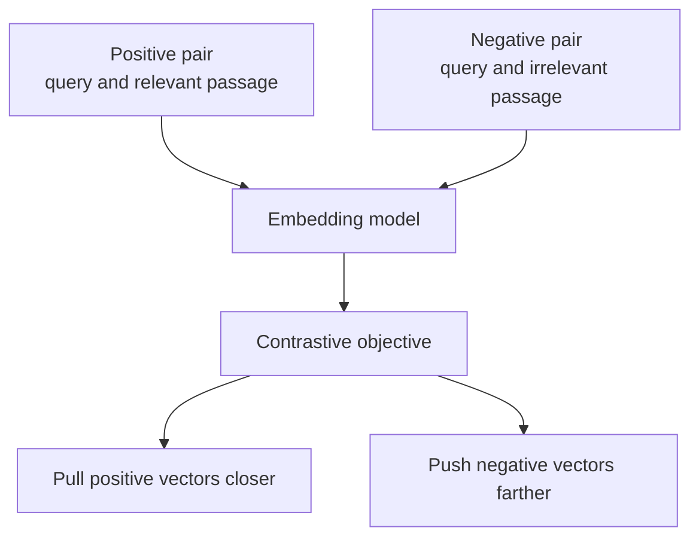

### Example

The query "What are the conditions for deadlock?" can be close to a passage containing "mutual exclusion, hold and wait, no preemption, and circular wait" even if the passage does not repeat the full query.

### Limitation

Embedding proximity represents learned association and semantic relatedness. It does not prove that a passage answers the question correctly.

---

## 63. What Is Semantic Search?

### Interview answer

Semantic search retrieves information based on meaning rather than only exact keyword matches.

The system embeds both queries and documents into the same vector space. It then returns documents whose vectors are closest to the query vector.

In AcadAI:

1. Academic chunks were embedded and stored in FAISS.
2. The expanded student query is embedded using the same model.
3. FAISS finds the closest stored vectors.
4. AcadAI reranks the results with lexical and subject-aware signals.

### Semantic-search sequence

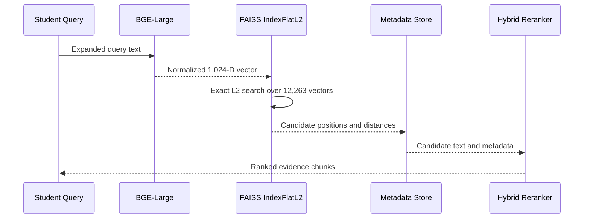

### Semantic versus lexical search

Semantic search improves paraphrase retrieval. Lexical search remains useful for exact technical terms, identifiers, acronyms, and formulas. AcadAI deliberately uses both.

---

## 64. What Happens When Embeddings Are Poor?

### Interview answer

Poor embeddings place relevant passages far from the query or irrelevant passages too close. This damages retrieval before the LLM sees any evidence.

Symptoms include:

- Wrong-subject chunks appearing near the top.
- Relevant passages missing from the candidate pool.
- Generic passages outranking exact definitions.
- Low retrieval hit rate.
- Weak grounding and poor final answers.

AcadAI reduces this risk using hybrid reranking, subject filtering, source boosts, keyword fallbacks, optional cross-encoder reranking, and a weak-evidence guard.

### Failure and recovery flow

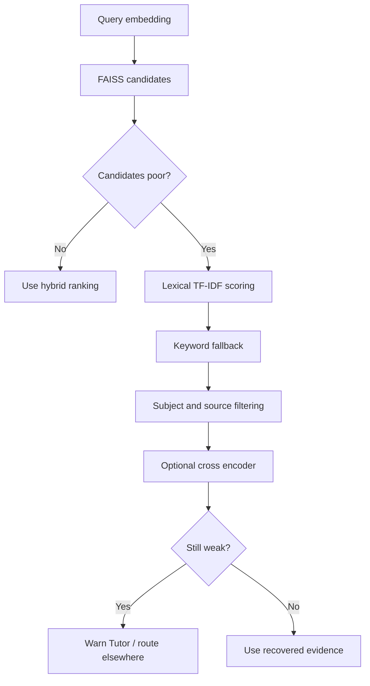

### Real recovery behavior

```python
if not pre_selected:
    fallback_rows = lexical_subject_scan(...)
    keyword_rows = keyword_fallback_search(...)
```

```python
if best_overlap_now < 0.08 or best_hybrid_now < min_hybrid_score:
    keyword_rows = keyword_fallback_search(...)
```

### Root causes

Poor embedding performance can come from model-domain mismatch, inconsistent query/document encoding, bad chunking, missing query instructions, noisy PDFs, or using a different model from the one that built the index.

---

## 65. How Would You Improve Retrieval Quality?

### Interview answer

I would improve retrieval quality through measurement first, then upgrades across embeddings, indexing, metadata, reranking, and evaluation.

### 1. Build a reproducible relevance benchmark

Create a versioned dataset containing questions, relevant chunk IDs, relevance grades, and expected answer evidence. Automatically calculate Precision@k, Recall@k, MRR, and nDCG after every retrieval change.

### 2. Run embedding-model and chunking ablations

Compare BGE-Large with smaller, multilingual, and domain-adapted models using the actual AcadAI corpus. Test multiple chunk sizes, overlap levels, and structure-aware splitting.

### 3. Use proper query/document encoding policy

Evaluate BGE retrieval instructions for short queries, ensure documents and queries use the intended encoding methods, and verify normalization for the entire stored index.

### 4. Fine-tune embeddings using academic hard negatives

Examples of hard negatives are chunks that sound semantically similar but belong to the wrong subject. Training with these examples would directly target AcadAI's cross-subject retrieval problem.

### 5. Strengthen metadata

Store explicit subject, university, semester, course, unit, source authority, date, and document type rather than inferring most metadata from keywords and filenames.

### 6. Improve reranking

Use a trained cross encoder on a limited shortlist and calibrate hybrid weights on labelled data rather than relying on fixed manual coefficients.

### 7. Improve retrieval diversity

Use maximal marginal relevance or duplicate clustering so the final evidence covers different aspects of the question instead of returning repetitive nearby chunks.

### 8. Add persistent semantic indexing for uploads

Uploaded PDFs should be embedded asynchronously and added to a user-specific vector store instead of using a TF-IDF-only temporary path.

### Improvement roadmap

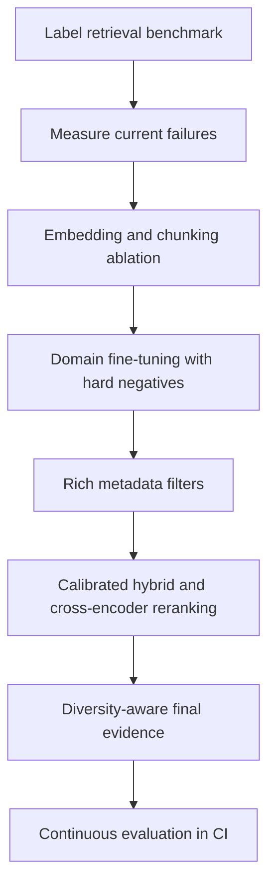

### Strong interview closing

> "I would not improve retrieval by simply choosing a larger embedding model. I would create labelled relevance data, identify the actual failure modes, and optimize embedding choice, chunking, metadata, reranking, and diversity against measurable metrics."

---

## Embedding Whiteboard Summary

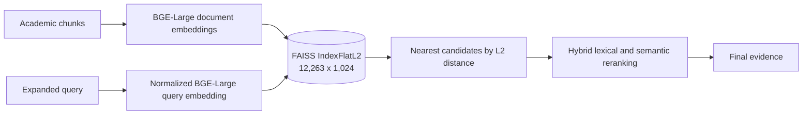

### 60-second embedding script

> "Embeddings convert text into vectors so AcadAI can search by meaning rather than only exact words. AcadAI uses BAAI/bge-large-en-v1.5 through Sentence Transformers. The prepared FAISS store contains 12,263 unit-normalized vectors, each with 1,024 dimensions, in an exact IndexFlatL2. At query time, AcadAI expands the question, generates a normalized float32 vector, verifies that its dimension matches the index, and searches for the nearest chunk vectors. Because the vectors are normalized, smaller squared L2 distance gives the same ranking as higher cosine similarity. Dense results are then combined with TF-IDF, keyword overlap, subject filters, fallbacks, and optional cross-encoder reranking. The main improvement path is not merely a larger model; it is a labelled benchmark, domain hard negatives, richer metadata, and calibrated reranking."

---

## Difficult Embedding Follow-Ups

### Are the stored vectors definitely normalized?

Sampled vectors reconstructed from the FAISS index have L2 norms of approximately `1.0`. This strongly indicates normalized storage, but a complete validation should check every vector.

### Does `IndexFlatL2` use cosine similarity?

No. It calculates squared L2 distance. However, for unit-normalized vectors, L2 distance and cosine similarity produce the same ranking.

### Why not use `IndexFlatIP`?

For normalized vectors, inner product directly equals cosine similarity and would be simpler to interpret. The existing index uses `IndexFlatL2`, which is still mathematically valid for normalized vectors. Changing index type would require rebuilding or converting the index.

### Is FAISS storing the text?

No. FAISS stores numerical vectors. Text and metadata are stored separately in `index.pkl` and joined through a vector-position-to-document-ID mapping.

### Are uploaded PDFs embedded?

No. The current upload path searches temporary chunks using TF-IDF. It does not generate persistent BGE embeddings for uploads.

### What happens if I change the embedding model in the sidebar?

If the model produces a different dimension, AcadAI returns a dimension-mismatch error. Even if the dimension matches, retrieval quality may be invalid because query and document vectors must come from the same compatible embedding space.

### Why can a same-dimension model still fail?

Dimension equality only guarantees that FAISS can calculate distance. It does not guarantee that vectors from two different models share the same semantic coordinate system.

### Why use a cross encoder after embeddings?

Embedding search is efficient because queries and documents are encoded separately. A cross encoder evaluates each query-document pair jointly and is usually more precise but slower, so it is best used only on a shortlist.

---

## Source Reference Map

All local line references point to `acadai_app_final_mistral_faiss.py`.

| Embedding topic | Lines |
|---|---:|
| Embedding and FAISS imports | 24-34 |
| Default model and retrieval configuration | 37-42 |
| Cached embedding-model loading | 218-226 |
| FAISS metadata extraction and loading | 238-312 |
| Query-model text formatting | 511-516 |
| Dense-score normalization | 518-530 |
| TF-IDF cosine scoring | 533-543 |
| Cross-encoder reranking | 599-614 |
| Query embedding and dimension check | 627-642 |
| FAISS search and candidate creation | 644-661 |
| Hybrid semantic and lexical ranking | 663-725 |
| Poor-result fallbacks | 728-765 |
| TF-IDF-only retrieval fallback | 801-832 |
| Embedding model sidebar control | 2266-2270 |

## Primary External References

- BAAI BGE-Large model card: <https://huggingface.co/BAAI/bge-large-en-v1.5>
- FAISS getting-started documentation: <https://github.com/facebookresearch/faiss/wiki/Getting-started>
- Sentence Transformers semantic-search documentation: <https://www.sbert.net/examples/sentence_transformer/applications/semantic-search/README.html>
