# AcadAI Interview Guide: Section 5 - FAISS

This section answers questions 66-80 using AcadAI's actual `index.faiss`, `index.pkl`, loading code, retrieval implementation, local search benchmark, and official FAISS documentation.

## Verified FAISS Facts

| Item | Actual AcadAI value |
|---|---|
| FAISS package | `faiss-cpu` |
| Index class | `IndexFlatL2` |
| Search type | Exact exhaustive nearest-neighbor search |
| Distance metric | Squared L2 distance |
| Vector dimension | 1,024 |
| Stored vectors | 12,263 |
| Index trained state | `True`; flat indexes require no learned training stage |
| Vector bytes per item | `4 x 1,024 = 4,096` bytes |
| `index.faiss` size | 50,229,293 bytes |
| Raw vector payload | 50,229,248 bytes |
| `index.pkl` size | 9,009,635 bytes |
| Metadata structure | `(InMemoryDocstore, index_to_docstore_id dict)` |
| Local search-only benchmark | About 3.2 ms average for top-200 over 12,263 vectors |
| Default final top-k | 8 |
| Default rerank candidates | 100; FAISS initially searches up to about 200 |

> Critical interview correction: FAISS is a library that supports both exact and approximate nearest-neighbor indexes. AcadAI's current `IndexFlatL2` is **not approximate**. It performs brute-force exact search over every stored vector. The `impact.md` description of the current index as approximate is inaccurate.

---

## 66. What Is FAISS?

### Interview answer

FAISS stands for Facebook AI Similarity Search. It is a library designed for efficient similarity search and clustering of dense vectors.

After text is converted into embeddings, a system needs to find which stored vectors are closest to a query vector. FAISS provides specialized index structures and optimized distance-computation implementations for that task.

FAISS supports:

- Exact nearest-neighbor search.
- Approximate nearest-neighbor search.
- L2 distance and inner-product search.
- CPU and GPU execution.
- Compression and quantization.
- Inverted-file and graph-based indexes.
- Searches over very large vector collections.

In AcadAI, FAISS stores and searches the semantic embeddings of academic document chunks.

### FAISS role in AcadAI

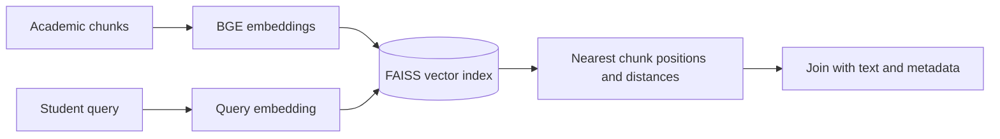

### Concise interview definition

> "FAISS is AcadAI's high-performance numerical search engine for finding the academic chunk vectors nearest to a student's query vector."

---

## 67. Why FAISS?

### Interview answer

FAISS was chosen because AcadAI needs fast local similarity search over dense embeddings.

The main reasons are:

1. **Designed for vector search:** FAISS directly supports nearest-neighbor operations over float vectors.
2. **Local and private:** academic vectors and notes remain on the machine.
3. **Low operational complexity:** no external vector-database server is required for this prototype.
4. **Fast native implementation:** FAISS uses optimized C++ routines behind the Python API.
5. **Multiple scaling paths:** exact flat search can later be replaced by IVF, HNSW, product quantization, or GPU search.
6. **Simple persistence:** the index can be written to and loaded from a file.
7. **Good fit for current size:** 12,263 vectors are small enough for exact search.

### Selection diagram

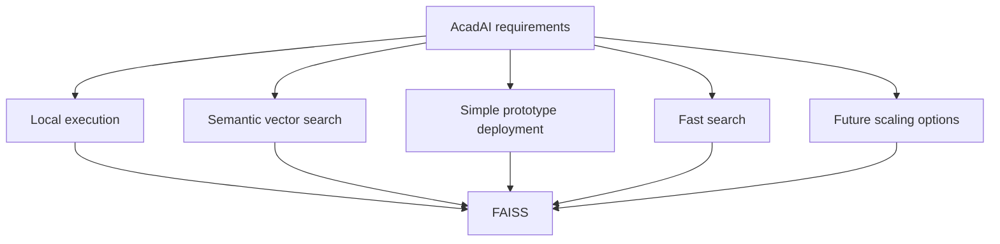

### Verified performance context

A local search-only benchmark over the current index averaged approximately `3.2 ms` for retrieving top-200 results. This excludes query embedding, Python reranking, and LLM generation, so it should not be described as total retrieval latency.

---

## 68. How Does FAISS Work Internally?

### Interview answer

FAISS works by storing vectors in an index structure and applying a distance function between a query vector and stored vectors.

The internal behavior depends on the selected index type. AcadAI uses `IndexFlatL2`, the simplest exact index:

1. Store every vector as an uncompressed float32 array.
2. Receive a query vector.
3. Calculate squared L2 distance from the query to every stored vector.
4. Keep the smallest distances.
5. Return distances and sequential vector positions.

Because the index is flat, it has no partitions, graph, or compressed codes. It performs exhaustive comparison and guarantees exact nearest neighbors.

### Current internal flow

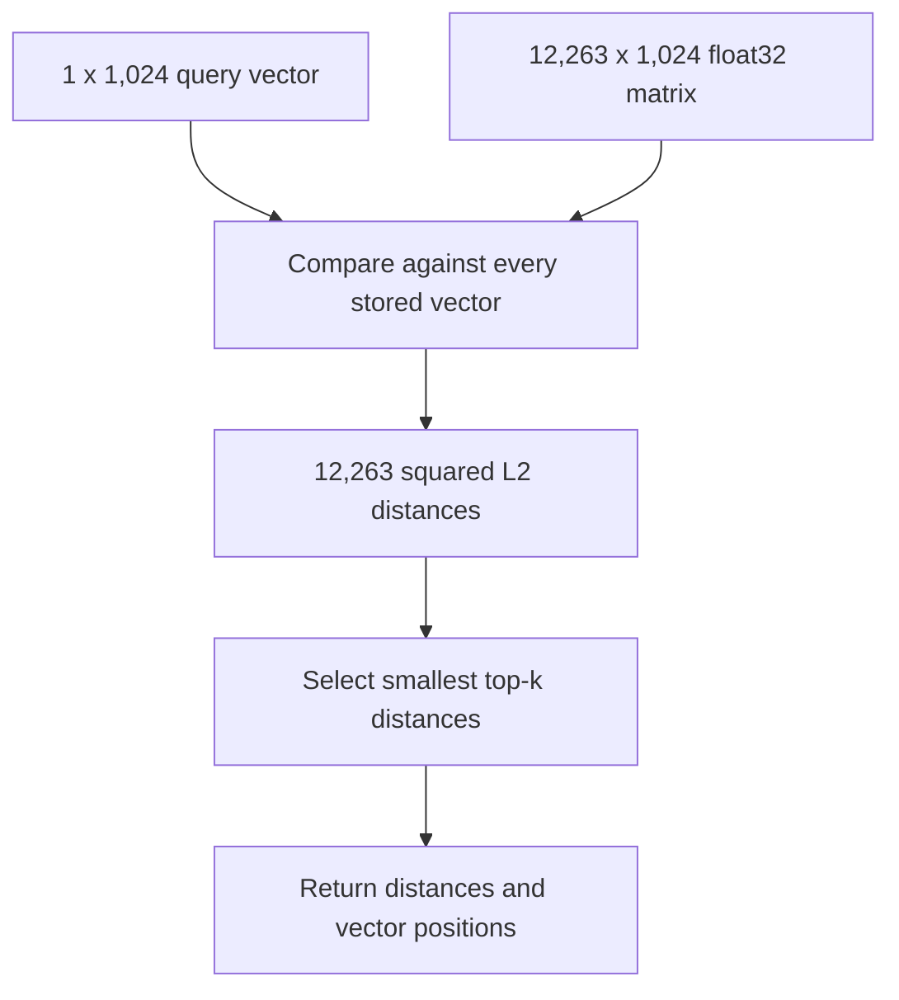

### Complexity

For a flat index, one query requires work proportional to:

```text
O(number_of_vectors x vector_dimension)
```

For AcadAI:

```text
12,263 x 1,024 coordinate comparisons per query
```

FAISS performs these operations in optimized native code, which is why exhaustive search remains practical at this size.

---

## 69. What Is Approximate Nearest Neighbor Search?

### Interview answer

Approximate Nearest Neighbor, or ANN, search speeds up vector retrieval by avoiding comparisons with every stored vector.

ANN indexes organize vectors into structures such as clusters, inverted lists, graphs, or compressed codes. During a query, the search explores only promising regions. This reduces latency and memory use, but it may miss the true nearest neighbor.

Examples in FAISS include:

- `IndexIVFFlat`: partitions vectors into inverted lists and searches selected lists.
- `IndexHNSWFlat`: navigates a graph toward nearby vectors.
- `IndexIVFPQ`: combines partitioning with product quantization.

### Exact versus approximate search

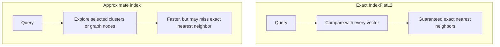

### AcadAI-specific answer

AcadAI currently does **not** use ANN. Its `IndexFlatL2` performs exact brute-force search. ANN would become relevant when the corpus grows enough that exhaustive comparison no longer meets latency or memory requirements.

---

## 70. Why Not SQL Search?

### Interview answer

Traditional SQL databases are excellent for structured filtering, joins, transactions, and exact conditions. They are not naturally optimized for comparing dense semantic vectors unless a vector extension is added.

A SQL query such as:

```sql
SELECT * FROM chunks WHERE text LIKE '%deadlock%';
```

can retrieve exact text matches, but it may miss a passage about "processes permanently waiting for resources" if the word `deadlock` is absent.

FAISS searches embedding space, so it can retrieve semantically related text even with different wording.

### SQL versus FAISS

| Traditional SQL search | FAISS vector search |
|---|---|
| Exact fields, conditions, joins | Semantic vector proximity |
| Strong transactions and persistence | Strong nearest-neighbor computation |
| Text matching depends on words or full-text index | Can retrieve paraphrases |
| Rich metadata filtering | Limited metadata capabilities by itself |
| Server/database system | Local vector-search library |

### Combined production architecture

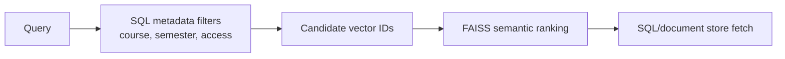

### Strong answer

> "I would not replace SQL with FAISS. In production, I would use SQL for metadata, authorization, and persistence, and FAISS or another vector engine for semantic similarity."

---

## 71. What Is Vector Indexing?

### Interview answer

Vector indexing is the process of organizing embedding vectors so nearest-neighbor queries can be executed efficiently.

An index defines:

- How vectors are stored.
- Which distance metric is used.
- Whether search is exact or approximate.
- How much memory is required.
- Whether the index must be trained.
- Which speed-recall trade-offs are available.

AcadAI's prepared corpus was embedded before runtime and stored in an `IndexFlatL2`. This index stores all vectors directly and compares every one during search.

### Indexing lifecycle


### Current-index properties

| Property | `IndexFlatL2` behavior |
|---|---|
| Training required | No |
| Search accuracy | Exact |
| Storage | Full float32 vectors |
| Search work | Compare all vectors |
| Memory per vector | `4 x dimension` bytes |
| IDs | Sequential positions unless wrapped with an ID map |

---

## 72. Explain `index.faiss`

### Interview answer

`index.faiss` is the binary file containing AcadAI's numerical FAISS index.

It stores:

- The index type: `IndexFlatL2`.
- The metric configuration.
- Vector dimension: 1,024.
- Total vectors: 12,263.
- All vector values as uncompressed float32 data.

It does **not** store the original PDF text, source filenames, or page metadata.

### File-size verification

Each vector requires:

```text
1,024 dimensions x 4 bytes = 4,096 bytes
```

All vectors require:

```text
12,263 x 4,096 = 50,229,248 bytes
```

The actual file is:

```text
50,229,293 bytes
```

The 45-byte difference is consistent with small serialization metadata around the raw flat-vector payload.

### `index.faiss` diagram

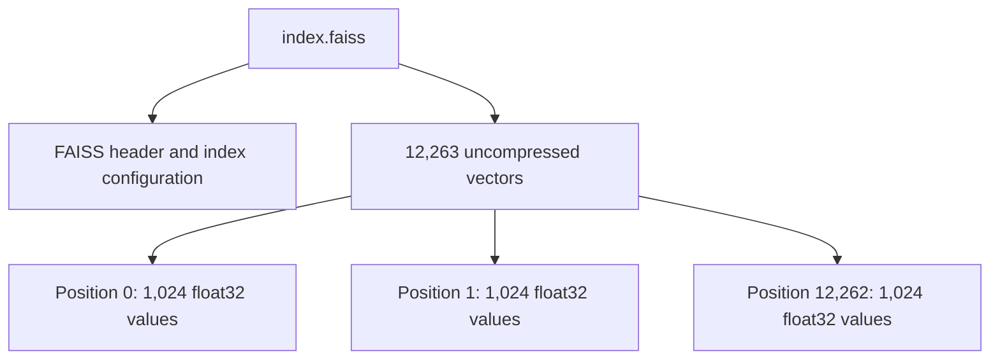

### Real loading code

```python
index = faiss.read_index(index_path)
```

---

## 73. Explain `index.pkl`

### Interview answer

`index.pkl` stores the document-side information that FAISS does not manage.

The verified file is a tuple containing:

1. A LangChain `InMemoryDocstore`.
2. A dictionary mapping sequential FAISS positions to document UUIDs.

The docstore contains `Document` objects with:

- `page_content`.
- Source path.
- Page number.
- PDF metadata such as producer, author, and creation date when available.

The mapping connects a vector result such as position `0` to the correct document object.

### Relationship between files

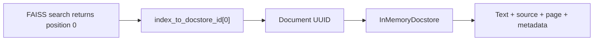

### Verified example structure

```text
index.pkl
  tuple
    InMemoryDocstore: 12,263 documents
    dict: 12,263 position -> UUID mappings
```

### Real extraction code

```python
docstore, index_to_docstore_id = obj[0], obj[1]
docs = getattr(docstore, "_dict", None)

for i in sorted(index_to_docstore_id):
    doc_id = index_to_docstore_id[i]
    doc = docs.get(doc_id)
```

### Security note

Python pickle can execute code during deserialization. A production system should load pickle files only from trusted sources or replace pickle with a safer metadata format.

---

## 74. What Happens During Retrieval?

### Interview answer

During FAISS retrieval, AcadAI performs semantic candidate search followed by Python-level hybrid reranking.

The process is:

1. Expand the user's query.
2. Generate a normalized 1,024-dimensional query embedding.
3. Verify dimension compatibility with the index.
4. Search a larger FAISS candidate pool.
5. Use returned positions to access corresponding chunks.
6. Apply subject filtering.
7. Normalize L2 distances into higher-is-better dense scores.
8. Compute TF-IDF lexical scores and keyword overlap.
9. Apply hybrid scoring, boosts, rejection rules, and deduplication.
10. Add fallback results when semantic candidates are weak.
11. Optionally cross-encode the shortlist.
12. Return the final top-k evidence.

### Retrieval sequence

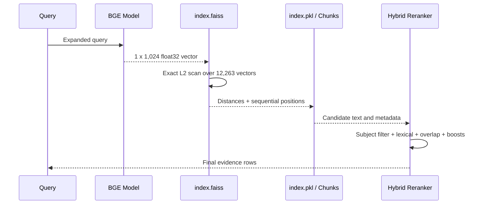

### Real search code

```python
search_k = max(
    top_k,
    min(max(candidate_k * 2, candidate_k), len(chunks))
)

raw_scores, raw_ids = index.search(q_emb, search_k)
```

---

## 75. How Is Retrieval Speed Improved?

### Interview answer

AcadAI improves retrieval speed through a combination of precomputation, native vector search, caching, bounded reranking, and staged processing.

### Implemented speed techniques

1. **Precomputed document embeddings:** chunks are not re-embedded at query time.
2. **Persisted FAISS index:** the numerical index is loaded from disk.
3. **Cached resources:** the FAISS store and embedding model use Streamlit resource caching.
4. **Optimized native exact search:** FAISS performs distance computation in compiled code.
5. **Bounded candidate reranking:** Python lexical and hybrid scoring runs only on a configurable candidate subset.
6. **Final top-k limit:** only a small evidence set continues to generation.
7. **Optional cross encoder:** expensive reranking is disabled by default.
8. **No FAISS rebuild for fallbacks:** fallback scans reuse text from `index.pkl`.

### Speed funnel

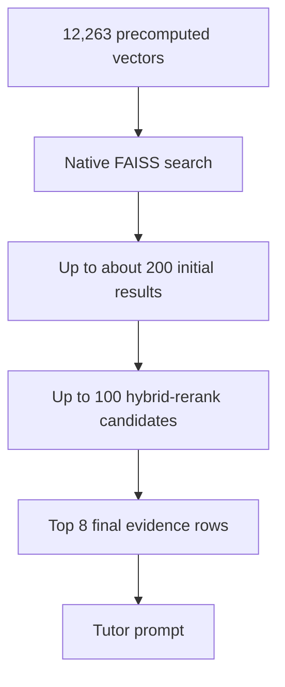

### Real caching

```python
@st.cache_resource(show_spinner=False)
def load_faiss_store(store_dir: str):
    ...
```

```python
@st.cache_resource(show_spinner=False)
def get_embedding_model(model_name: str):
    ...
```

### Important nuance

`IndexFlatL2` does not reduce the number of vector comparisons. Its speed comes from optimized exhaustive computation. For much larger corpora, AcadAI would need an approximate or compressed index.

---

## 76. What Is Brute-Force Retrieval?

### Interview answer

Brute-force vector retrieval compares the query vector with every stored vector and returns the closest results.

This is exactly what AcadAI's `IndexFlatL2` does.

### Brute-force algorithm

```python
distances = []
for vector_id, vector in all_vectors:
    distance = squared_l2(query_vector, vector)
    distances.append((distance, vector_id))

return smallest_k(distances)
```

FAISS implements this much more efficiently in native code, but the logical operation is the same.

### Benefits and drawbacks

| Benefit | Drawback |
|---|---|
| Exact nearest neighbors | Work increases linearly with vector count |
| No training required | Full vectors consume memory |
| Simple and predictable | Becomes expensive at very large scale |
| Strong baseline for evaluation | Does not exploit partitions or graphs |

### Why it is reasonable for AcadAI

At 12,263 vectors, exact search is still practical. It avoids ANN recall loss and gives a reliable semantic candidate baseline before hybrid reranking.

---

## 77. What Are FAISS Limitations?

### Interview answer

FAISS is a high-performance vector-search library, not a complete managed database or application platform.

### General FAISS limitations

1. It does not provide authentication, user management, or access control.
2. It does not provide a built-in distributed service layer.
3. Metadata filtering is limited and often must be implemented separately.
4. Persistence, replication, backups, and failover are application responsibilities.
5. Index choice and tuning require expertise.
6. Some indexes trade recall for speed or memory.
7. Large indexes may require substantial RAM or GPU memory.
8. Incremental deletion and update behavior varies by index type.

### AcadAI-specific limitations

- The current flat index scans every vector.
- Metadata lives in a pickle file and is loaded into memory.
- Subject filtering happens after FAISS search rather than inside the vector index.
- Uploaded PDFs are not added to FAISS.
- There is no multi-user namespace isolation.
- There is no replication or distributed query layer.
- The app loads only a single local store.
- Pickle loading assumes trusted files.

### Limitation map

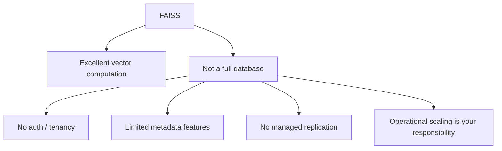

---

## 78. How Many Vectors Can FAISS Handle?

### Interview answer

There is no single fixed maximum. Capacity depends on index type, vector dimension, precision, available RAM or GPU memory, latency target, and recall requirement.

FAISS is designed for very large-scale similarity search and provides indexes and documented benchmarks for million-, billion-, and even larger-scale scenarios. However, the current AcadAI `IndexFlatL2` stores full float32 vectors and scans all of them, so its practical limit is much lower than a compressed or distributed FAISS deployment.

### Current memory scaling at 1,024 dimensions

Each vector requires:

```text
1,024 x 4 bytes = 4,096 bytes
```

Approximate raw-vector memory:

| Vector count | Raw `IndexFlatL2` vector memory |
|---:|---:|
| 12,263 | 50.23 MB |
| 100,000 | 409.6 MB |
| 1 million | 4.096 GB |
| 10 million | 40.96 GB |
| 1 billion | 4.096 TB |

These figures exclude metadata, application memory, and temporary search buffers.

### Capacity diagram

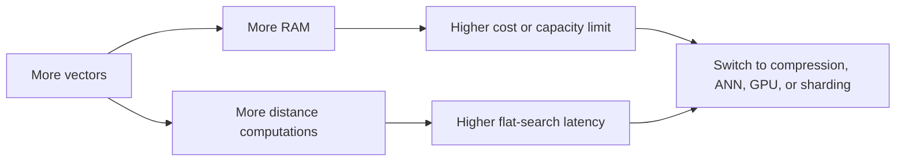

### Best interview answer

> "FAISS as a library can support billion-scale search with appropriate indexes and hardware, but AcadAI's current 1,024-dimensional flat index needs about 4.096 GB per million vectors and performs exhaustive search, so I would change the index architecture well before billion scale."

---

## 79. How Would You Scale FAISS?

### Interview answer

I would scale FAISS in stages, based on measured latency, recall, and memory rather than switching architectures prematurely.

### Stage 1: Optimize the current single-node system

- Batch document embedding.
- Cache query embeddings and retrieval results.
- Persist richer metadata separately.
- Add structured subject filters before vector search where possible.
- Benchmark latency percentiles and recall.

### Stage 2: Replace flat search with ANN

- Use `IndexIVFFlat` when the corpus becomes too large for exhaustive search.
- Tune `nlist` and `nprobe` to balance speed and recall.
- Consider `IndexHNSWFlat` for fast graph-based search.

### Stage 3: Reduce memory

- Use scalar quantization or product quantization.
- Use `IndexIVFPQ` for large-scale compressed retrieval.
- Store lower-dimensional or smaller-model embeddings if quality remains acceptable.

### Stage 4: Use hardware and partitioning

- Move suitable indexes to GPU.
- Shard vectors by subject, institution, semester, or tenant.
- Search shards in parallel and merge top-k results.
- Replicate hot shards for availability.

### Stage 5: Build a service layer

- Put FAISS behind a stateless retrieval API.
- Store metadata and access rules in a database.
- Add background ingestion, index versioning, blue-green index swaps, monitoring, and backups.

### Scaling roadmap

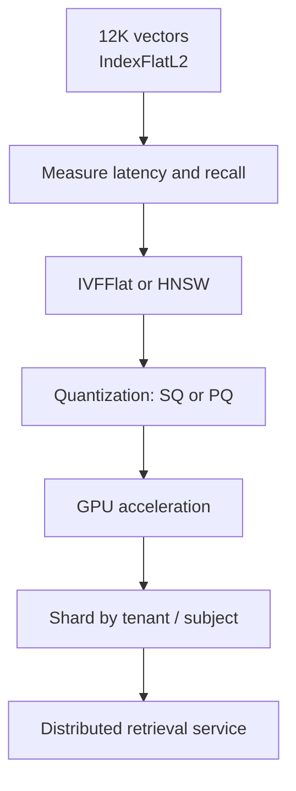

### Example future index

```python
d = 1024
coarse_quantizer = faiss.IndexFlatL2(d)
index = faiss.IndexIVFPQ(
    coarse_quantizer,
    d,
    nlist,
    code_size,
    8,
)
index.train(training_vectors)
index.add(document_vectors)
index.nprobe = 8
```

This trades some exactness for much lower search work and memory.

---

## 80. Why Not Pinecone?

### Interview answer

Pinecone is a managed vector database, while FAISS is a vector-search library. The choice depends on project stage and operational requirements.

For AcadAI's current prototype, local FAISS is a good fit because:

1. The corpus is only 12,263 vectors.
2. Exact local search is fast enough.
3. There is no external vector-service dependency.
4. Course embeddings can remain local.
5. There is no managed-service cost for vector search.
6. The implementation is transparent and easy to demonstrate.

Pinecone would become attractive if AcadAI needed:

- Managed scaling and availability.
- Multi-user or multi-institution namespaces.
- Hosted persistence and operational tooling.
- Metadata filtering at service level.
- High-concurrency remote access.
- Less infrastructure management.

### FAISS versus Pinecone

| Local FAISS | Pinecone |
|---|---|
| Library embedded in application | Managed vector database service |
| Full local control | Provider-managed operations |
| Academic vectors can remain local | Vectors and metadata are hosted |
| No vector-service request cost | Usage-based managed-service cost |
| Developer handles scaling and availability | Managed scaling and availability features |
| Simple for one-machine prototype | Better fit for distributed production use |
| Limited built-in tenancy and metadata operations | Namespaces and metadata-oriented service features |

### Decision diagram

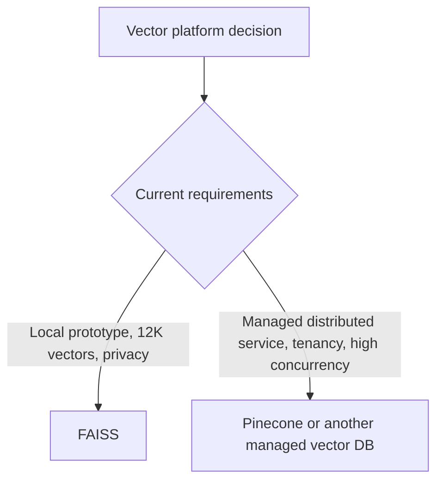

### Strong interview answer

> "I did not choose FAISS because Pinecone is bad. I chose FAISS because a local exact index is the simplest and most cost-effective architecture for the current corpus. If AcadAI becomes a multi-tenant production service, I would benchmark a managed vector database against a self-hosted FAISS service."

---

## FAISS Whiteboard Summary


### 60-second FAISS script

> "FAISS is AcadAI's local vector-similarity engine. The current store uses an exact IndexFlatL2 containing 12,263 normalized 1,024-dimensional vectors. It stores the full float32 vectors in `index.faiss`, while `index.pkl` stores a LangChain document store and a mapping from FAISS positions to document IDs. At query time, BGE-Large generates a compatible query vector, FAISS compares it against every stored vector and returns the closest positions, and AcadAI joins those positions to text metadata before hybrid reranking. Exact flat search is appropriate at the current size and averaged about 3.2 milliseconds for search-only top-200 retrieval locally. For larger scale, I would move to IVF or HNSW, add quantization, use GPUs, shard by tenant or subject, and place retrieval behind a service layer."

---

## Difficult FAISS Follow-Ups

### Is AcadAI using Approximate Nearest Neighbor search?

No. The current index is `IndexFlatL2`, which performs exhaustive exact search. FAISS supports ANN, but AcadAI does not currently use an ANN index.

### Why does `IndexFlatL2.is_trained` return true?

Flat indexes do not need a learned training phase. They are ready to accept and search vectors immediately, so FAISS reports them as trained.

### Does `IndexFlatL2` store custom vector IDs?

No. Flat indexes use sequential positions. AcadAI's `index.pkl` mapping connects those positions to document UUIDs.

### What happens if `index.faiss` and `index.pkl` become misaligned?

FAISS positions could resolve to the wrong document text, causing severe retrieval corruption. The files should be versioned, validated, and deployed atomically.

### Does FAISS support metadata filtering?

FAISS primarily searches vectors. AcadAI applies heuristic subject filtering after candidate retrieval. Production systems often combine FAISS with a metadata database or partition indexes by metadata.

### Can vectors be updated?

Index capabilities differ. With a flat index, removal changes sequential numbering, which makes the external position mapping difficult to maintain. A production system should use stable ID mapping, versioned rebuilds, or an index type and wrapper designed for updates.

### Why not use ANN immediately?

At 12,263 vectors, exact search is simple, fast, and recall-perfect. ANN adds tuning complexity and possible recall loss without a demonstrated need.

### Is the 3.2 ms benchmark end-to-end retrieval latency?

No. It measures repeated `index.search` calls using an already available query vector. It excludes query embedding, filtering, lexical scoring, fallback scans, cross-encoder reranking, and UI overhead.

---

## Source Reference Map

All local line references point to `acadai_app_final_mistral_faiss.py`.

| FAISS topic | Lines |
|---|---:|
| Optional FAISS import and defaults | 24-40 |
| FAISS-compatible document conversion | 238-248 |
| `index.pkl` extraction | 250-289 |
| Store loading and `faiss.read_index` | 292-312 |
| Dense-distance normalization | 518-530 |
| Advanced FAISS retrieval entry | 617-627 |
| Query embedding and dimension check | 632-642 |
| Search size and `index.search` | 644-661 |
| Candidate limiting and hybrid reranking | 663-725 |
| Text-based fallbacks | 728-765 |
| Final top-k selection | 767-795 |
| Non-FAISS TF-IDF fallback | 801-832 |
| Sidebar FAISS controls | 2254-2270 |
| FAISS loading and corpus selection | 2279-2310 |

## Primary External References

- FAISS documentation: <https://faiss.ai/>
- FAISS index types and memory formulas: <https://github.com/facebookresearch/faiss/wiki/Faiss-indexes>
- FAISS index-selection guidance: <https://github.com/facebookresearch/faiss/wiki/Guidelines-to-choose-an-index>
- Pinecone overview: <https://docs.pinecone.io/guides/get-started/overview>
