# AcadAI Interview Guide: Section 6 - Hybrid Retrieval

This section answers questions 81-90 using AcadAI's actual dense retrieval, TF-IDF scoring, keyword overlap, subject filtering, fallback, cross-encoder, and evaluation code.

## Verified Hybrid-Retrieval Facts

| Item | Actual implementation |
|---|---|
| Dense candidate source | BGE-Large query embedding + FAISS `IndexFlatL2` |
| Lexical score | TF-IDF cosine similarity over FAISS candidates |
| Keyword score | Fraction of meaningful expanded-query terms found in a chunk |
| Base hybrid formula | `0.45*dense + 0.40*lexical + 0.15*overlap` |
| Additional boosts | Source/subject boost up to `0.24`; subnetting-specific boost |
| Default FAISS candidate setting | 100 |
| Initial FAISS search size | Usually up to `candidate_k * 2`, therefore 200 by default |
| Final evidence count | 8 by default |
| Optional reranker | `cross-encoder/ms-marco-MiniLM-L-6-v2` |
| Fallbacks | Subject lexical scan and full-corpus keyword fallback |
| Live evaluation | Subject-level top-result hit rate |

> Interview honesty: the weights are implemented and documented, but the repository contains no grid search, ablation study, or learned weight-optimization script. Present them as manually selected engineering defaults, not empirically proven optimal weights.

---

## 81. What Is Hybrid Retrieval?

### Interview answer

Hybrid retrieval combines multiple retrieval signals instead of depending on only one search method.

Dense semantic search represents queries and documents as embeddings and retrieves conceptually similar passages. Lexical search scores exact words and phrases. Hybrid retrieval combines these signals so the system can understand paraphrases while still respecting precise academic terminology.

AcadAI's hybrid retrieval is broader than a simple dense-plus-keyword formula. It includes:

1. Dense FAISS retrieval.
2. TF-IDF lexical scoring.
3. Keyword overlap.
4. Subject and source boosts.
5. Cross-subject rejection rules.
6. Full-corpus lexical and keyword fallbacks.
7. Optional cross-encoder reranking.

### Hybrid architecture

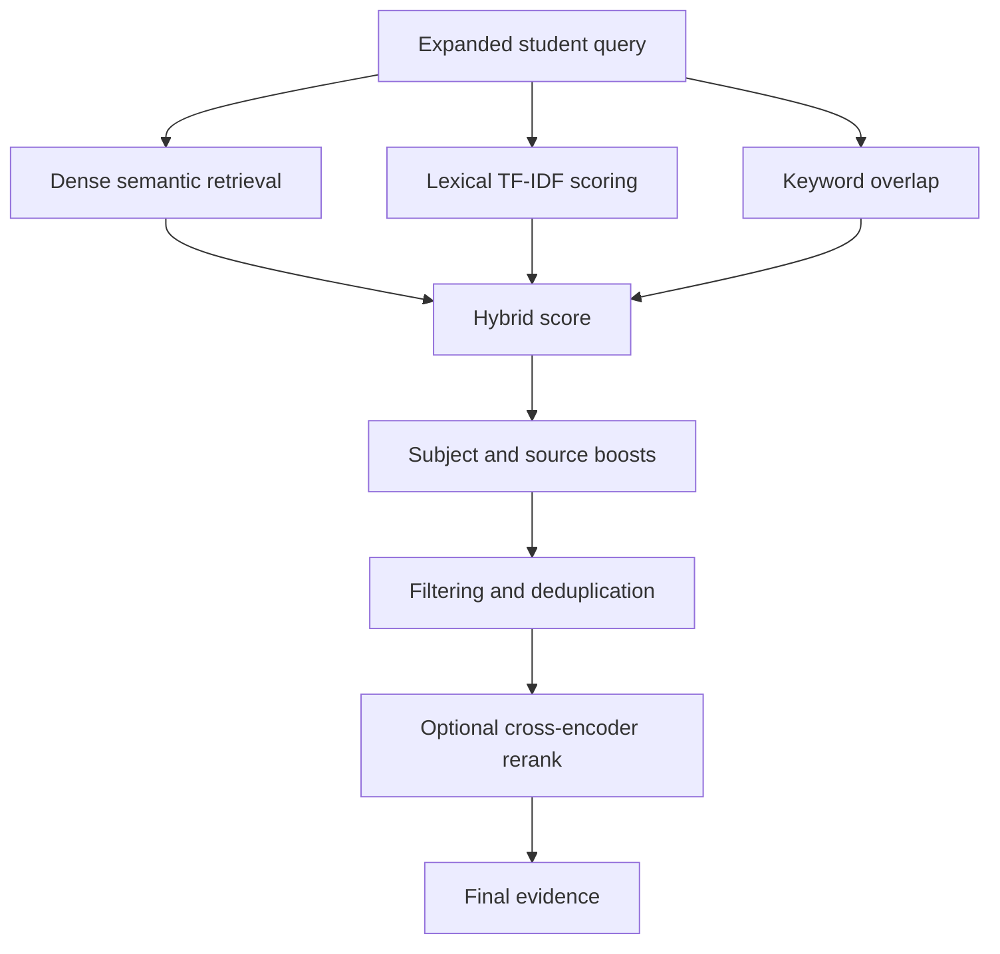

### Strong definition

> "Hybrid retrieval combines semantic understanding with exact textual evidence so AcadAI can retrieve both paraphrases and syllabus-specific terminology."

---

## 82. Why Combine Dense and Lexical Search?

### Interview answer

Dense and lexical retrieval fail in different ways, so combining them creates a more reliable system.

Dense retrieval is strong when the user paraphrases the source. For example, a query about "processes permanently waiting for resources" can retrieve a passage about deadlock even without exact word matching.

However, dense retrieval may return a broadly related but wrong passage. This is risky in a mixed B.Tech corpus where terms such as `process`, `model`, `network`, or `classification` appear in several subjects.

Lexical retrieval is strong for exact terms, acronyms, formulas, and phrases such as:

- `BCNF`
- `CIDR`
- `ACID`
- `subnet mask`
- `primary key`

But lexical retrieval may miss paraphrases.

### Complementary strengths

| Dense semantic search | Lexical search |
|---|---|
| Finds paraphrases | Finds exact terminology |
| Captures broad meaning | Preserves rare acronyms and phrases |
| Can confuse related subjects | Can miss different wording |
| Good semantic recall | Good exact-match precision |

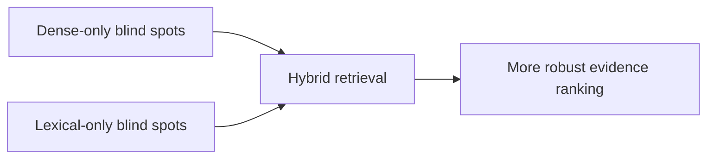

### AcadAI-specific reason

AcadAI searches 323 source paths covering many academic subjects. Hybrid retrieval helps prevent a semantically related machine-learning passage from outranking an exact DBMS or computer-network passage.

---

## 83. How Is Hybrid Score Calculated?

### Interview answer

AcadAI first converts three base signals into higher-is-better scores:

- Normalized dense similarity from FAISS L2 distances.
- TF-IDF cosine similarity.
- Keyword overlap.

It calculates the base score as:

```text
hybrid =
    0.45 x normalized dense score
  + 0.40 x lexical TF-IDF score
  + 0.15 x keyword overlap
```

It then adds contextual boosts:

- Up to `0.24` when the source filename or folder suggests the expected subject.
- A subnetting-specific keyword boost for relevant computer-network queries.

### Score diagram

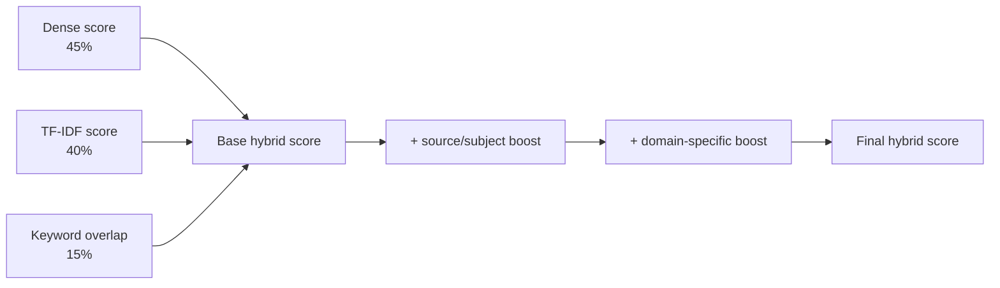

### Real code

```python
hybrid = (
    0.45 * float(dense_norm[i])
    + 0.40 * float(lex[i])
    + 0.15 * float(overlaps[i])
)

hybrid += source_subject_boost(
    c_for_boost.source,
    required_subjects_for_boost
)

if is_subnetting_query(query):
    hybrid += 0.25 * cn_keyword_score(candidate_texts[i])
```

### Important nuance

The final score can exceed `1.0` because boosts are added after the weighted base score. It is a ranking score, not a calibrated probability.

---

## 84. Why Use Keyword Overlap?

### Interview answer

Keyword overlap provides a simple, interpretable signal that measures how much of the expanded query's meaningful vocabulary appears in a candidate chunk.

It protects important terms that semantic embeddings may underweight. In academic retrieval, a chunk containing several exact query terms is often more useful than a broadly related passage.

AcadAI removes very short terms, converts query terms into a set, and calculates:

```text
overlap =
number of query terms appearing in chunk
/
number of query terms
```

### Real implementation

```python
def keyword_overlap(query: str, text: str) -> float:
    query_terms = {t for t in tokenize(query) if len(t) > 2}
    if not query_terms:
        return 0.0
    return len(query_terms & set(tokenize(text))) / len(query_terms)
```

### Example

For an expanded query containing:

```text
subnet, mask, network, address, broadcast, hosts
```

and a chunk containing:

```text
subnet, mask, network, address
```

the overlap is:

```text
4 / 6 = 0.667
```

### Why it helps

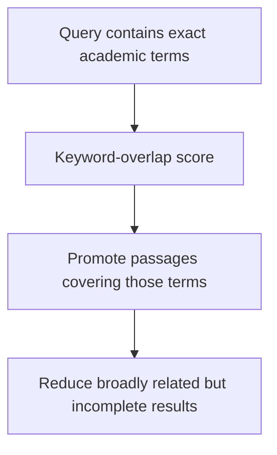

### Limitation

Keyword overlap does not understand synonyms, word importance, negation, or phrase order. It is useful only as one signal within the hybrid system.

---

## 85. What Weights Did You Choose?

### Interview answer

The implemented base weights are:

| Signal | Weight |
|---|---:|
| Dense semantic similarity | 0.45 |
| TF-IDF lexical similarity | 0.40 |
| Keyword overlap | 0.15 |

The design gives semantic similarity the highest weight, but lexical relevance is almost equally important. Keyword overlap acts as a smaller precision signal.

Additional non-base coefficients include:

| Rule | Value |
|---|---:|
| Matching source alias boost per detected subject | `+0.12`, capped at `+0.24` |
| Subnetting candidate boost | `+0.25 x cn_keyword_score` |
| Cross-subject rejection threshold | Reject when overlap `<0.15` and lexical `<0.05` |
| Weak-result fallback condition | Overlap `<0.08` or hybrid below configured confidence |
| Default minimum hybrid confidence | `0.25` |

### Weight visualization

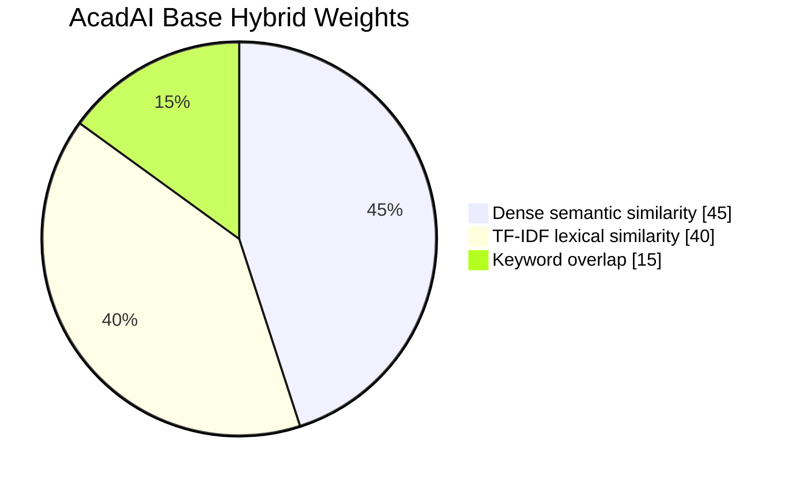

### Interpretation

The weights communicate that exact academic language matters nearly as much as broad semantic meaning in this corpus.

---

## 86. How Were the Weights Selected?

### Interview answer

The repository does not contain an automated weight-selection experiment, so the honest answer is that these are manually chosen engineering defaults.

They reflect a practical design assumption:

- Dense similarity should lead because users often paraphrase.
- Lexical similarity should remain nearly equal because course notes contain exact technical language.
- Raw keyword overlap should influence ranking without dominating it.

The weights are documented in `impact.md` and implemented directly in the retrieval function, but there is no evidence in the repository that a grid search or learning-to-rank model selected them.

### How weights should be selected rigorously

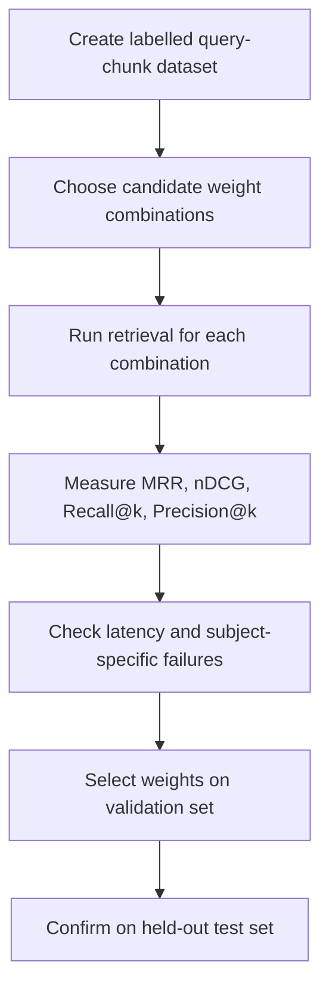

### Example tuning method

```python
for dense_weight in [0.3, 0.4, 0.5, 0.6]:
    for lexical_weight in [0.2, 0.3, 0.4, 0.5]:
        overlap_weight = 1.0 - dense_weight - lexical_weight
        if overlap_weight < 0:
            continue
        evaluate_retrieval(
            dense_weight,
            lexical_weight,
            overlap_weight,
        )
```

### Strong interview answer

> "The current weights were selected manually as sensible defaults. My next step would be to tune them against a versioned relevance benchmark rather than claiming they are globally optimal."

---

## 87. What Is Reranking?

### Interview answer

Reranking is a second-stage retrieval process that reorders an initial candidate set using additional or more expensive relevance signals.

The first-stage retriever is optimized to find a broad set of potentially relevant candidates quickly. The reranker then spends more computation distinguishing the strongest results.

In AcadAI:

1. FAISS retrieves a large semantic candidate pool.
2. Subject filtering reduces obvious mismatches.
3. Hybrid scoring reorders candidates using dense, lexical, overlap, and boost signals.
4. An optional cross encoder can perform another reranking pass.
5. The final top-k evidence is selected.

### Two-stage retrieval

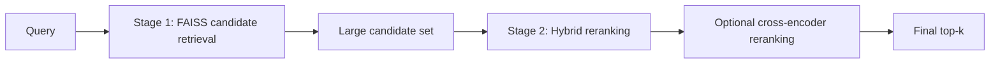

### Real ordering code

```python
order = np.argsort(np.array(hybrid_scores))[::-1]

for cand_i in order:
    ...
    pre_selected.append({...})
```

Reranking changes ordering and selection; it does not alter the stored FAISS vectors.

---

## 88. Why Rerank Results?

### Interview answer

The nearest embedding vectors are not always the best answer evidence.

Dense retrieval optimizes semantic proximity, but the top result may:

- Belong to the wrong subject.
- Mention the concept only generally.
- Omit an exact phrase or formula.
- Be repetitive.
- Come from a less relevant source.

Reranking lets AcadAI apply task-specific knowledge after broad semantic retrieval. It can promote exact terminology, reward matching subject filenames, reject weak cross-subject candidates, and deduplicate near-identical chunks.

### Retrieval versus reranking objectives

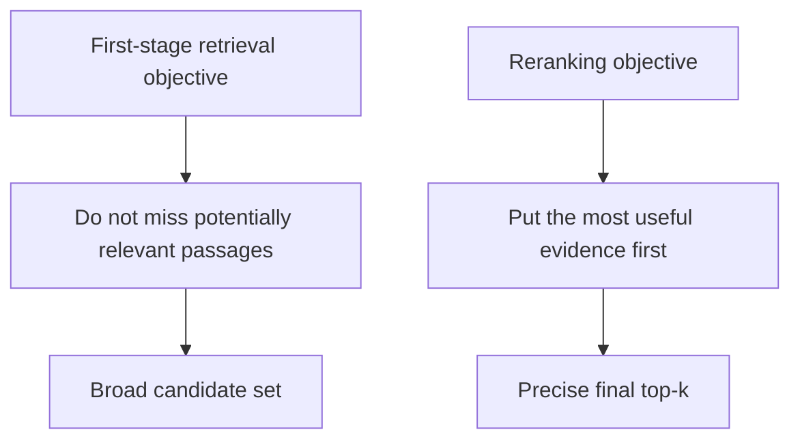

### Why not calculate every signal over all chunks?

TF-IDF scoring, rules, and especially cross-encoder inference are more expensive than retrieving a bounded FAISS candidate set. Reranking only a shortlist preserves practical latency.

### Important nuance

Reranking can improve Precision@k, MRR, and nDCG by moving relevant results upward. It cannot recover a relevant chunk that is absent from the candidate set unless a fallback retrieval path adds it.

---

## 89. What Is Cross-Encoder Reranking?

### Interview answer

A cross encoder jointly processes the query and candidate passage as one input pair and outputs a direct relevance score.

In bi-encoder retrieval, the query and document are encoded separately. This enables fast vector search because document embeddings can be precomputed. However, separate encoding limits how deeply the model can compare specific query-document interactions.

A cross encoder reads both texts together, allowing token-level attention between the query and passage. It is usually more precise but much slower because every candidate pair requires a model inference.

### Bi-encoder versus cross encoder

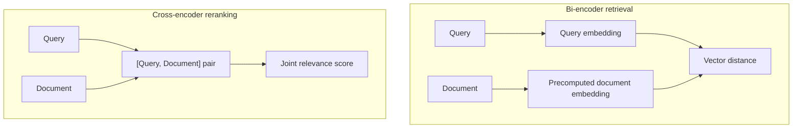

### AcadAI implementation

The default optional model is:

```text
cross-encoder/ms-marco-MiniLM-L-6-v2
```

Real code:

```python
pairs = [[query, r["text"]] for r in rows]
ce_scores = reranker.predict(pairs)

for r, s in zip(rows, ce_scores):
    r["cross_score"] = round(float(s), 4)

rows.sort(
    key=lambda x: x.get("cross_score", -999),
    reverse=True
)
```

### Why optional?

It improves ranking precision but adds model-download size, memory use, cold-start time, and inference latency. AcadAI disables it by default for lightweight laptop use.

---

## 90. How Does Hybrid Retrieval Improve Recall?

### Interview answer

Hybrid retrieval improves practical recall by giving relevant evidence multiple ways to enter the candidate set.

Dense retrieval can find paraphrases. Lexical retrieval can recover exact academic terms missed by embeddings. Keyword fallback can scan all chunks when dense candidates are weak. Query expansion adds synonyms and full forms. Searching a larger FAISS pool gives filters and rerankers more opportunities.

AcadAI's recall-oriented mechanisms include:

1. Query expansion.
2. Searching up to roughly twice the candidate setting.
3. Dense semantic retrieval.
4. Subject-filtered lexical full-corpus scan when needed.
5. Exact keyword and phrase fallback.
6. Merging dense and fallback result sets.
7. Adjacent-context expansion after selection.

### Recall improvement flow

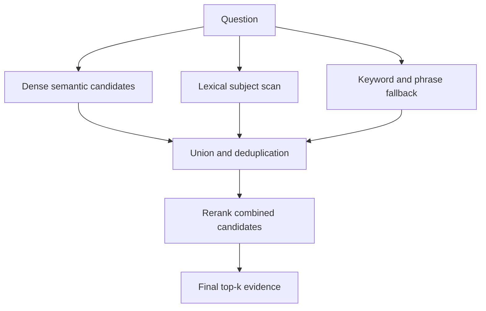

### Real fallback merge

```python
fallback_rows = lexical_subject_scan(...)
keyword_rows = keyword_fallback_search(...)
merged = fallback_rows + keyword_rows
```

When dense results exist but are weak:

```python
if best_overlap_now < 0.08 or best_hybrid_now < min_hybrid_score:
    keyword_rows = keyword_fallback_search(...)
    pre_selected = pre_selected + keyword_rows
```

### Critical technical nuance

Hybrid **reranking by itself** does not improve candidate recall. It only changes the order of retrieved candidates. Recall improves when the system expands or unions candidate sources, such as through larger FAISS retrieval and lexical/keyword fallbacks.

Subject filtering and strict rejection rules can improve precision but may reduce recall if they incorrectly remove a relevant passage. This is why AcadAI falls back to the original candidates when the subject filter is too strict.

### Measurement honesty

The project documentation reports Recall@4 of `1.00`, but the live dashboard currently measures subject-level hit rate rather than recall. A rigorous proof of recall improvement would compare dense-only, lexical-only, and hybrid configurations on the same chunk-labelled benchmark.

---

## Hybrid Retrieval Whiteboard Summary

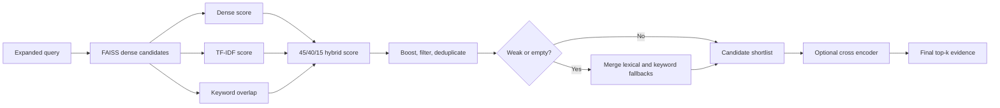

### 60-second hybrid-retrieval script

> "AcadAI uses hybrid retrieval because dense and lexical search have complementary strengths. BGE and FAISS find semantic paraphrases, while TF-IDF and keyword overlap protect exact academic terms such as CIDR, BCNF, and ACID. For each FAISS candidate, AcadAI calculates a base score of 45 percent normalized dense similarity, 40 percent TF-IDF similarity, and 15 percent keyword overlap, then adds subject and source boosts, rejects weak cross-subject results, and deduplicates. If dense results are empty or weak, it merges full-corpus lexical and keyword fallback results. An optional MiniLM cross encoder can jointly score query-passage pairs for final ordering. The current weights are manual defaults, not experimentally proven optimal. Recall improves mainly through the union of dense and fallback candidate sources; reranking itself primarily improves ordering and precision."

---

## Difficult Hybrid-Retrieval Follow-Ups

### Is keyword overlap the same as TF-IDF?

No. Keyword overlap measures the fraction of distinct query terms present in a chunk. TF-IDF weights terms according to their importance in the candidate collection and uses cosine similarity.

### Do the base weights sum to one?

Yes: `0.45 + 0.40 + 0.15 = 1.00`. However, later boosts can make the final hybrid score exceed one.

### Is the hybrid score a probability?

No. It is a ranking score. Its values are not calibrated probabilities of relevance.

### Does cross-encoder reranking use the hybrid score?

The cross encoder is applied to the shortlisted rows and then sorts them by `cross_score`. Therefore, when enabled, cross-encoder score determines the final order of that shortlist.

### Can filtering hurt retrieval?

Yes. Incorrect subject detection can remove relevant candidates. AcadAI mitigates this by keeping the original candidate set when filtering produces fewer than three results, except for strong subnetting queries.

### Does hybrid retrieval always improve recall?

No. It depends on candidate generation and tuning. Unioning dense and lexical candidates can improve recall, while poor filters or small top-k values can reduce it.

### Why not run the cross encoder over all 12,263 chunks?

Joint query-document inference for every chunk would be far slower than vector search. Cross encoders are best used on a small shortlist.

### How would you improve the current hybrid system?

Create a chunk-labelled benchmark, tune weights by validation metrics, replace heuristic metadata with explicit metadata, evaluate reciprocal-rank fusion, add diversity-aware selection, and use a domain-trained reranker.

---

## Source Reference Map

All line references point to `acadai_app_final_mistral_faiss.py`.

| Hybrid retrieval topic | Lines |
|---|---:|
| Keyword-overlap calculation | 169-174 |
| Subject detection and source boosts | 318-382 |
| Full-corpus keyword fallback | 385-438 |
| Subject filtering | 441-466 |
| Query expansion | 469-516 |
| Dense-score normalization | 518-530 |
| TF-IDF lexical scoring | 533-543 |
| Full-corpus lexical fallback | 546-575 |
| Cross-encoder reranking | 599-614 |
| Large candidate retrieval | 643-666 |
| Hybrid score calculation | 669-689 |
| Filtering, rejection, and deduplication | 689-725 |
| Empty-result fallback merge | 728-746 |
| Weak-result fallback mixing | 748-765 |
| Optional cross-encoder application | 767-768 |
| Final selection and match confidence | 770-795 |
| Hybrid controls | 2255-2264 |
| Live retrieval evaluation | 2652-2730 |
