# AcadAI Interview Guide: Section 7 - Multi-Agent Design

This section answers questions 91-110 using AcadAI's actual agent functions, prompts, return contracts, orchestration loop, traces, grounding logic, and session-state behavior.

## Verified Multi-Agent Facts

| Component | Actual implementation |
|---|---|
| Overall style | Centrally orchestrated, synchronous multi-stage workflow |
| Router Agent | Deterministic rule-based Python function |
| Reasoning Agent | Mistral-backed structured planner with deterministic fallback |
| Tutor Agent | Mistral-backed answer generator with route-specific fallback |
| Critic Agent | Mistral-backed evaluator with heuristic fallback |
| Grounding Agent | Deterministic lexical-support function, not an LLM agent |
| Memory Agent | Session-state helper functions, not an autonomous agent |
| Core communication | Python arguments, return values, dictionaries, and `AgentTrace` |
| Critic threshold | `satisfactory = true` when overall score is at least 7 |
| Refinement limit | Configurable from 0 to 3; default 1 |
| Normal Mistral Ask calls | Reasoning, Tutor, Critic: 3 sequential calls |
| One refinement | Adds Refiner and second Critic: total 5 calls |
| Grounding feedback loop | Reports and updates weak topics; does not regenerate answer |

> Interview precision: AcadAI is a practical multi-agent workflow, not a framework of autonomous agents communicating peer-to-peer. The Streamlit Ask pipeline is the central orchestrator, and several "agents" are deterministic specialized modules.

---

## 91. Why Use Multiple Agents?

### Interview answer

AcadAI uses multiple agents to separate responsibilities that have different goals, prompts, output formats, and failure modes.

A single prompt could attempt to understand the question, select a source, plan an explanation, generate the answer, evaluate quality, and verify evidence. However, that prompt would be difficult to control, inspect, and improve.

AcadAI divides the workflow into specialized roles:

- Router: decide which knowledge path to use.
- Reasoning: identify concepts and plan the response.
- Tutor: explain pedagogically using evidence.
- Critic: evaluate quality and provide feedback.
- Grounding: estimate whether the final statements are supported.

This separation makes the workflow easier to debug and lets weak answers receive a dedicated critique and refinement pass.

### Responsibility separation

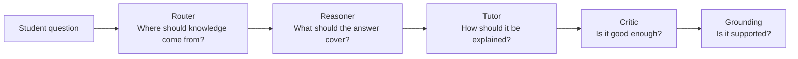

### Strong answer

> "I used multiple agents to turn one opaque generation step into an inspectable learning workflow with specialized planning, teaching, criticism, and verification responsibilities."

---

## 92. What Is a Router Agent?

### Interview answer

A Router Agent selects the most appropriate processing path for a request.

In AcadAI, the Router chooses among:

- `RAG`: use retrieved academic notes.
- `Web Search`: use current external information.
- `Direct LLM`: use general model knowledge.

It receives the query, a boolean indicating whether local retrieval found a match, and the user's web-fallback setting. It returns the selected route and an `AgentTrace`.

### Router role

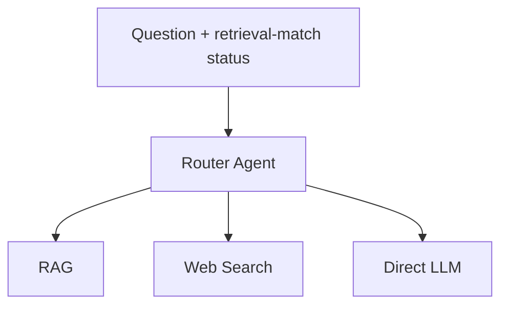

### AcadAI nuance

The Router does not initiate retrieval. The Ask pipeline retrieves first, then passes the resulting match boolean to the Router.

---

## 93. What Is a Reasoning Agent?

### Interview answer

A Reasoning Agent analyzes the task before answer generation. Its job is to determine what concepts matter and how the response should be organized.

AcadAI's Reasoning Agent returns a structured plan containing:

- `key_concepts`
- `solution_plan`
- `tools_needed`
- `difficulty_estimate`

The plan is displayed in the UI and the key concepts are passed to the Tutor.

### Reasoning output

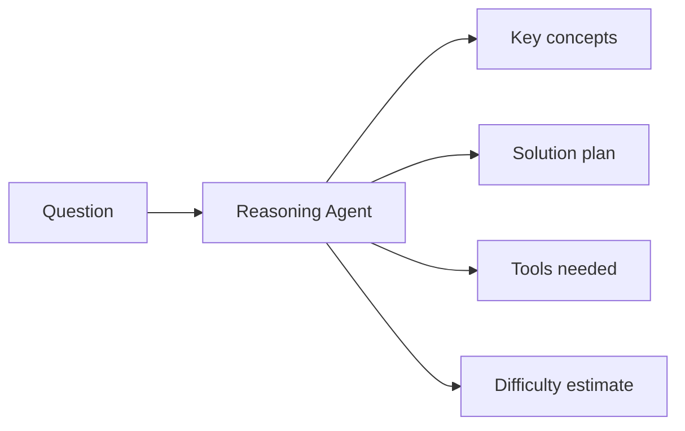

### Important implementation nuance

The current Tutor directly uses only the plan's `key_concepts`. The full solution plan is displayed for explainability but is not injected into the Tutor prompt.

---

## 94. What Is a Tutor Agent?

### Interview answer

The Tutor Agent is responsible for turning evidence and a reasoning plan into a clear educational answer.

It is not instructed merely to provide a factual response. It must:

1. Explain the concept.
2. Break it down step by step.
3. Include worked examples.
4. Add exam-oriented tips.
5. Cite the supplied evidence.
6. Adapt to the selected difficulty.

For a RAG route, it receives academic evidence. For Web Search, it receives snippets. For Direct LLM, it is allowed to use general knowledge.

### Tutor role

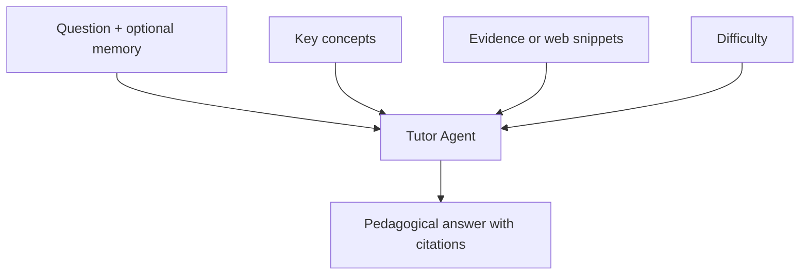

---

## 95. What Is a Critic Agent?

### Interview answer

The Critic Agent evaluates the generated answer rather than generating the initial answer itself.

AcadAI's Critic scores:

- Relevance
- Completeness
- Accuracy
- Clarity
- Overall quality

It also returns:

- A `satisfactory` boolean.
- Improvement feedback when the answer is unsatisfactory.

An overall score of at least 7 is considered satisfactory.

### Critic role

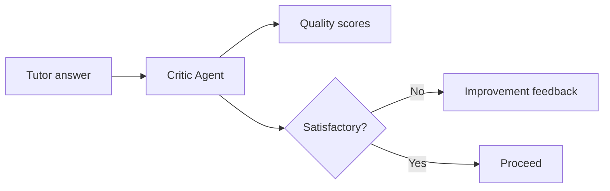

### Honest limitation

When Mistral is unavailable, the Critic's fallback `accuracy` score is fixed at `7.5`; therefore, fallback criticism is a presentation heuristic, not genuine factual verification.

---

## 96. What Is a Grounding Agent?

### Interview answer

Conceptually, a Grounding Agent verifies whether the generated answer is supported by retrieved evidence.

In AcadAI, grounding is implemented as a deterministic function rather than an LLM agent. It splits the answer into sentences, combines the retrieved evidence, and calculates lexical support for each answer sentence.

It returns:

- Grounding score from 0 to 100.
- Number of supported sentences.
- Total checked sentences.
- Possibly unsupported sentences.
- Status: strongly, partially, or weakly grounded.

### Grounding role

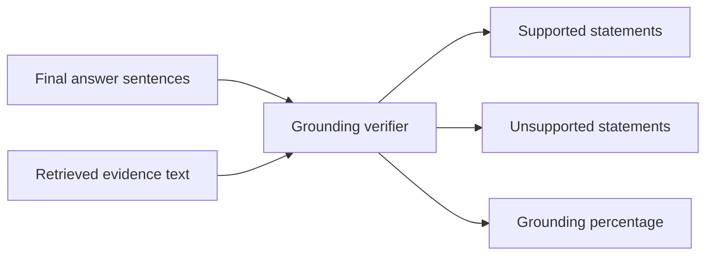

### Critical implementation truth

Grounding does not currently reject or regenerate the answer. It reports risk, stores the score, and updates weak topics below 55%.

---

## 97. How Does the Router Agent Work?

### Interview answer

The Router Agent is a transparent rule-based classifier.

It checks the query for real-time keywords such as `today`, `latest`, `current`, `recent`, `news`, and `price`. If one is present and web search is enabled, it chooses Web Search.

Otherwise, if retrieval reported a database match, it chooses RAG. If there is no match but the query looks like a basic general question, it chooses Direct LLM. If web search is enabled, it becomes the fallback. Otherwise, it returns RAG.

### Decision tree

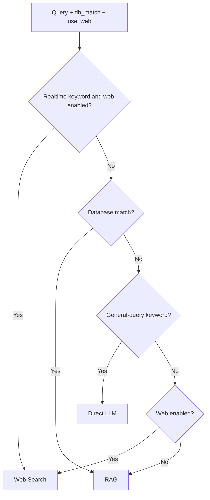

### Real code

```python
if any(p in q_lower for p in realtime_kw) and use_web:
    route = "Web Search"
elif db_match:
    route = "RAG"
elif any(p in q_lower for p in general_kw):
    route = "Direct LLM"
elif use_web:
    route = "Web Search"
else:
    route = "RAG"
```

### Limitation

The route is based on hard-coded keywords rather than a learned intent and freshness classifier.

---

## 98. How Does the Reasoning Agent Work?

### Interview answer

The Reasoning Agent calls Mistral with a system prompt requiring JSON-only output. This creates a structured interface between planning and generation.

It asks for key concepts, a solution plan, tools, and difficulty. AcadAI removes optional Markdown fences and parses the result as JSON.

If parsing fails, the raw output is converted into a limited fallback plan. If the LLM is unavailable, AcadAI extracts meaningful query words and creates a deterministic four-step plan.

### Reasoning flow

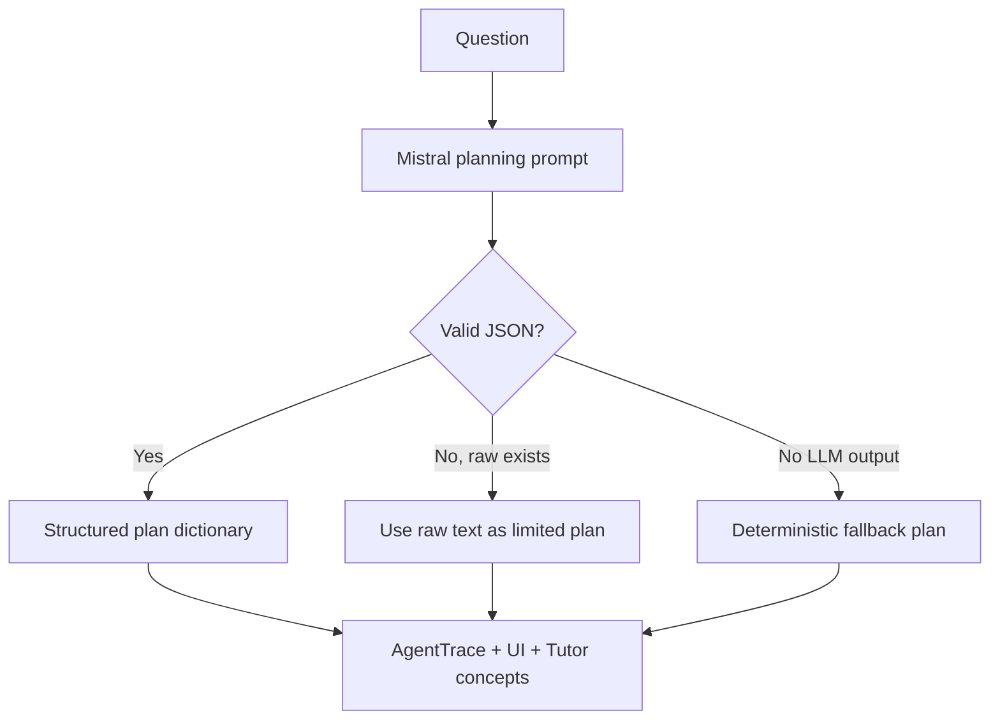

### Real prompt contract

```python
system = (
    "Analyse the student query and return ONLY valid JSON with keys: "
    "key_concepts (list), solution_plan (list of steps), "
    "tools_needed (list), difficulty_estimate "
    "(beginner/intermediate/advanced)."
)
```

---

## 99. How Does the Tutor Agent Work?

### Interview answer

The Tutor Agent first builds a route-specific evidence pack.

- For RAG, it formats document IDs and evidence previews.
- For Web Search, it formats titles and snippets.
- For Direct LLM, it allows general knowledge.

It then combines the requested difficulty, key concepts from the Reasoning Agent, student query, optional conversation memory, and evidence into a prompt.

The Tutor calls Mistral with a pedagogical system instruction. If the API is unavailable, it returns a deterministic evidence-based answer, web summary, or `NOT_FOUND` response.

### Tutor processing flow

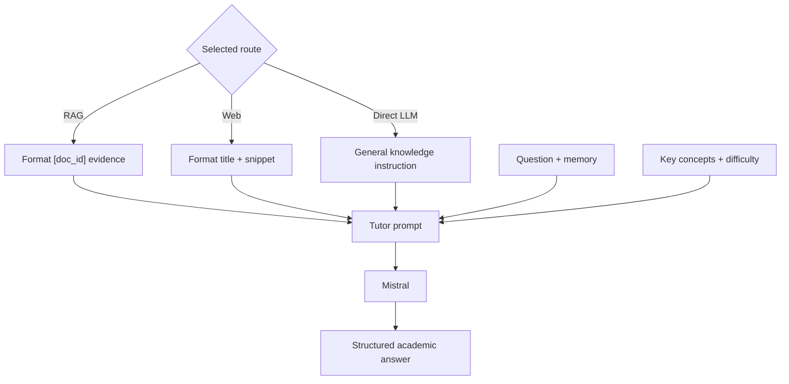

### Real evidence packaging

```python
if route == "RAG":
    evidence = "\n\n".join(
        f"[{r['doc_id']}] {r['evidence']}"
        for r in context_rows
    )
```

---

## 100. How Does the Critic Agent Work?

### Interview answer

The Critic receives the original user query and the generated answer, truncated to the first 1,500 characters.

It prompts Mistral to return strict JSON containing the quality scores, satisfactory decision, and feedback. AcadAI parses the JSON and creates an `AgentTrace`.

If the model output is missing or invalid, a heuristic fallback calculates:

- Relevance from keyword overlap.
- Completeness from answer length.
- Clarity from examples and citations.
- Accuracy as a fixed 7.5.

The average becomes the overall score, and overall scores of at least 7 pass.

### Critic algorithm

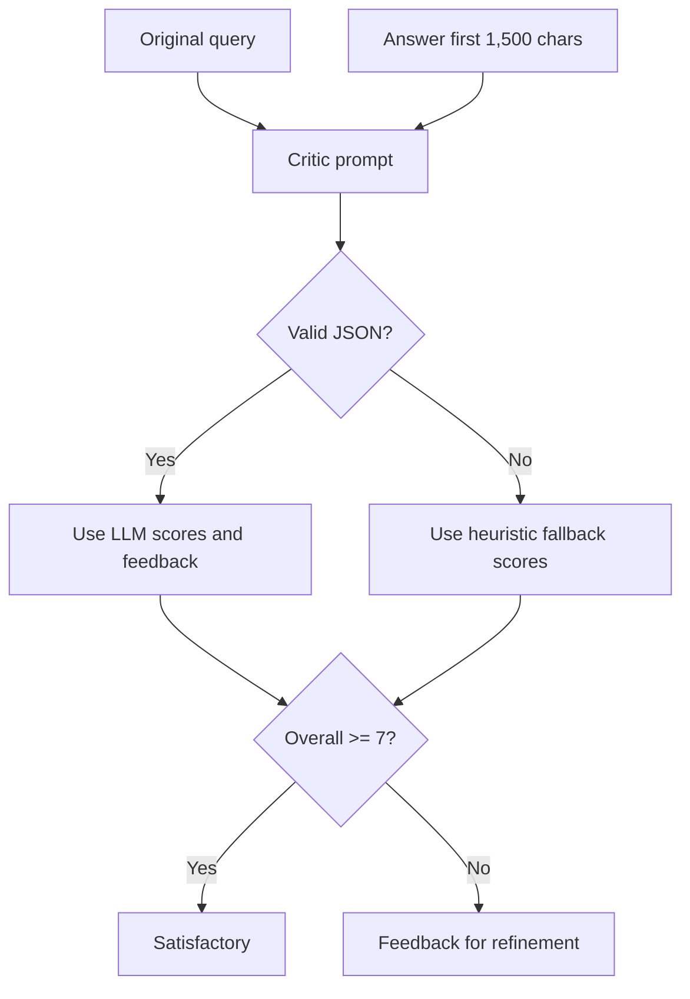

### Real pass condition

```python
"satisfactory": overall >= 7.0
```

---

## 101. How Does the Grounding Agent Work?

### Interview answer

AcadAI's grounding verifier compares answer statements with the retrieved evidence after generation.

It:

1. Combines all evidence-row full text.
2. Splits the answer into sentences containing at least five words.
3. Measures keyword overlap for each sentence.
4. Calculates how many distinct meaningful sentence terms appear in evidence.
5. Marks the sentence supported when overlap is at least `0.18` or support ratio is at least `0.28`.
6. Calculates the percentage of supported sentences.

### Grounding algorithm

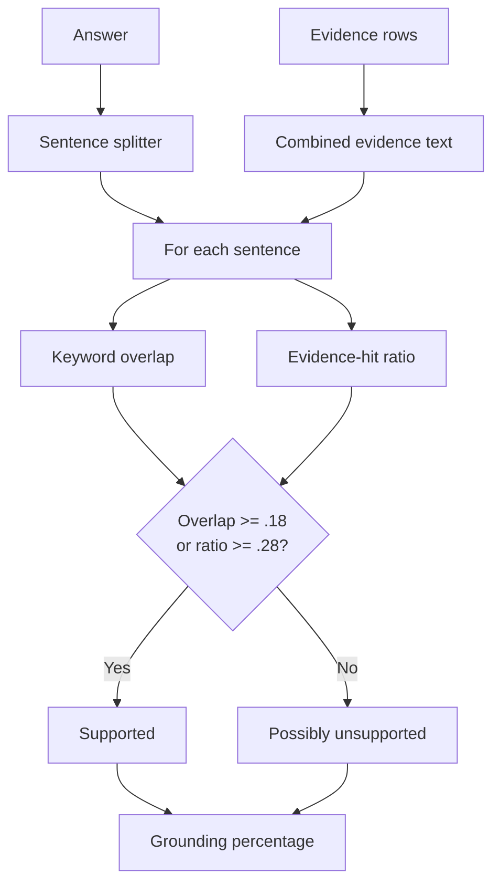

### Real code

```python
if overlap >= 0.18 or support_ratio >= 0.28:
    supported += 1
else:
    unsupported.append(sent)
```

### Limitation

This is lexical evidence matching, not semantic entailment or contradiction detection.

---

## 102. Why Separate Reasoning From Tutoring?

### Interview answer

Reasoning and tutoring optimize for different outputs.

The Reasoning Agent should think in terms of concepts, dependencies, tools, and solution steps. The Tutor should optimize for learner clarity, examples, exam usefulness, and citations.

Separating them reduces prompt complexity and makes the plan inspectable. It also creates the option to replace the planning model, validate the plan, or adapt it before generating prose.

### Separation of concerns

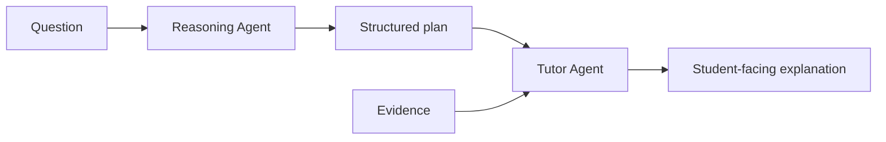

### Honest implementation nuance

AcadAI currently passes key concepts into the Tutor prompt, but not the complete solution plan. Therefore, the separation exists, but the plan-to-Tutor contract could be strengthened.

---

## 103. Why Separate Tutoring From Criticism?

### Interview answer

The Tutor is optimized to produce a helpful answer, while the Critic is optimized to find weaknesses.

Combining creation and evaluation in one pass can lead the model to accept its own assumptions. A separate Critic prompt provides a second perspective and explicit quality dimensions.

The separation enables:

- Clear scoring.
- Targeted improvement feedback.
- A refinement loop.
- Visible quality metrics.
- Independent replacement or calibration of the evaluator.

### Creator-evaluator pattern

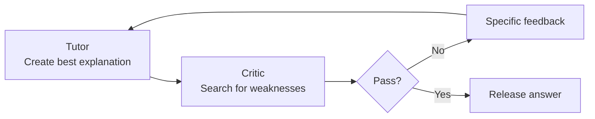

### Risk

Both Tutor and Critic use the same underlying Mistral model by default, so their errors may be correlated. A separate evaluation model or deterministic rubric could increase independence.

---

## 104. How Do Agents Exchange Information?

### Interview answer

Agents exchange information through the central Python orchestrator, not by messaging each other directly.

Each core agent has a function contract:

- Router returns `(route, AgentTrace)`.
- Reasoning returns `(plan, AgentTrace)`.
- Tutor returns `(answer, AgentTrace)`.
- Critic returns `(scores, AgentTrace)`.
- Grounding returns a report dictionary.

The orchestrator stores these values and passes the relevant outputs into later stages. Session-level memory is exchanged through `st.session_state`.

### Information-exchange diagram

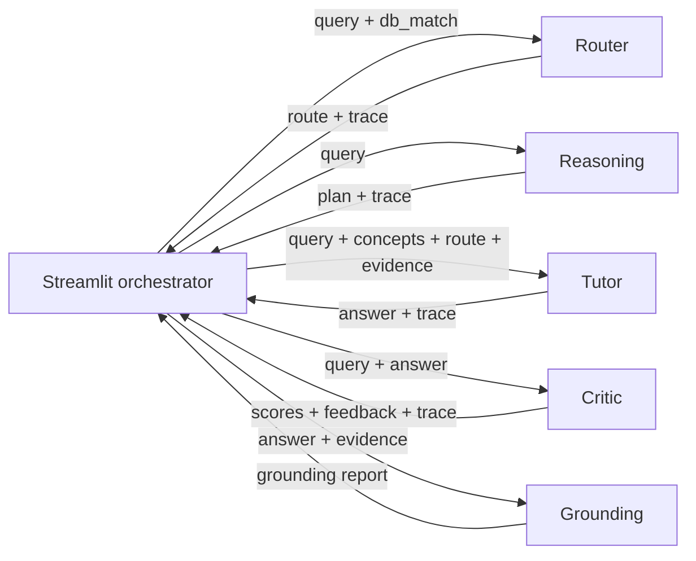

### Shared trace contract

```python
@dataclass
class AgentTrace:
    agent: str
    action: str
    result: str
    latency: float = 0.0
```

---

## 105. How Does Feedback Flow?

### Interview answer

The implemented feedback loop is between the Critic and the Tutor refinement pass.

After the Tutor generates an answer, the Critic returns scores, a satisfactory boolean, and feedback. The orchestrator checks three conditions:

1. The answer is not satisfactory.
2. The refinement count is below the configured maximum.
3. Feedback is present.

If all conditions hold, the original answer and Critic feedback are sent to `refine_answer`. The refined answer is then evaluated by the Critic again.

### Feedback loop

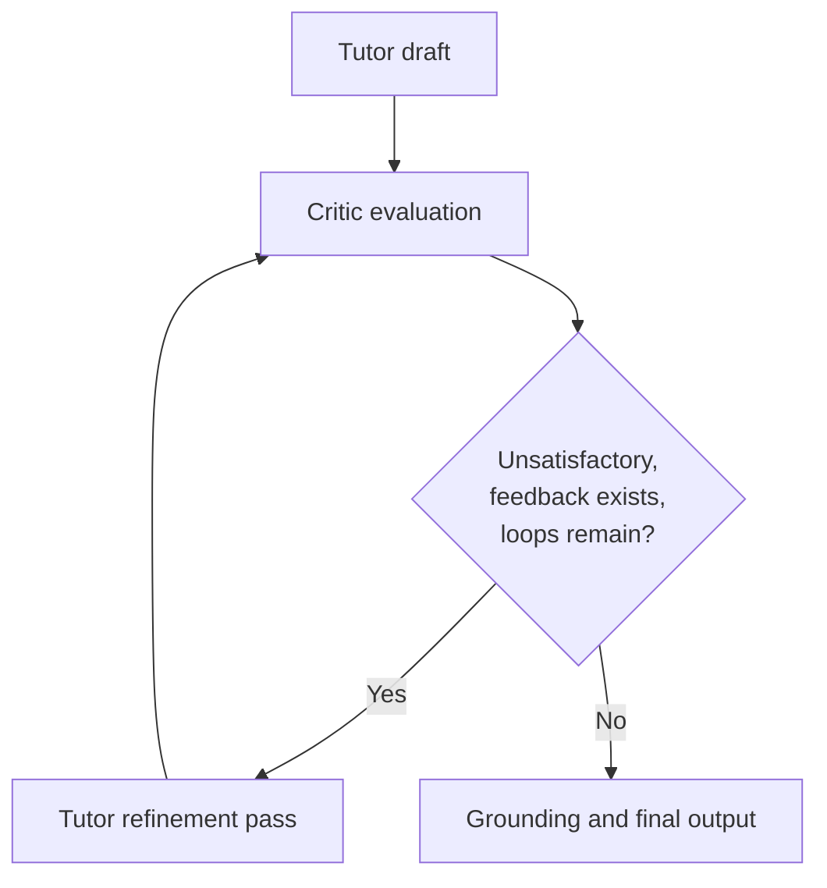

### Real loop

```python
while (
    not scores.get("satisfactory")
    and refine_count < max_refine
    and scores.get("feedback")
):
    answer = refine_answer(
        query, answer, scores["feedback"], difficulty
    )
    scores, tr_critic2 = critic_agent(query, answer)
    refine_count += 1
```

### Important correction

The grounding report does not feed back into Tutor refinement in the current code, even though project documentation diagrams describe that desired behavior.

---

## 106. What If the Critic Agent Rejects the Answer?

### Interview answer

If the Critic marks the answer unsatisfactory and provides feedback, AcadAI starts a bounded refinement loop.

The Refiner receives:

- Original answer.
- Critic feedback.
- Original query.
- Selected difficulty.

It is instructed to preserve correct content and address only the stated weaknesses. The Critic then evaluates the refined answer again.

The loop ends when:

- The Critic accepts the answer.
- The maximum refinement count is reached.
- The Critic provides no feedback.

### Rejection flow

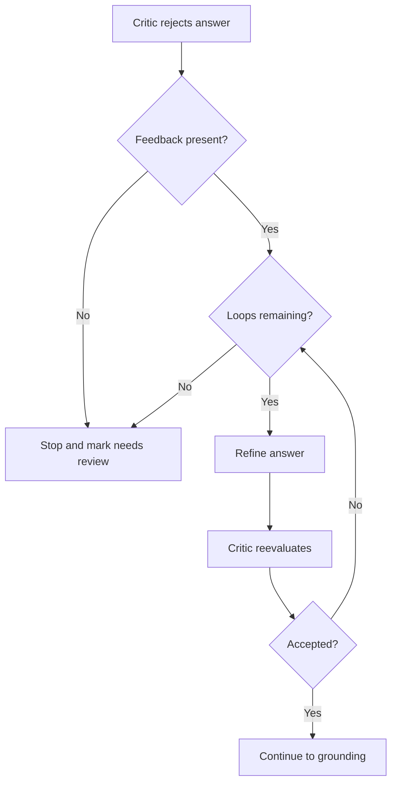

### After repeated rejection

AcadAI still displays the latest answer after the loop limit. Metrics mark `Needs review` as `Yes` when the final Critic result remains unsatisfactory.

---

## 107. What If Agents Disagree?

### Interview answer

The current implementation does not have explicit multi-agent negotiation, voting, arbitration, or conflict-resolution logic.

Agents do not directly debate each other. The central orchestrator resolves outcomes according to fixed control rules:

- The Router's route determines the evidence source.
- The Tutor generates using the supplied route and evidence.
- The Critic can request refinement.
- The refinement loop stops at a configured bound.
- Grounding reports support but does not override the Critic or regenerate the answer.

### Current disagreement behavior

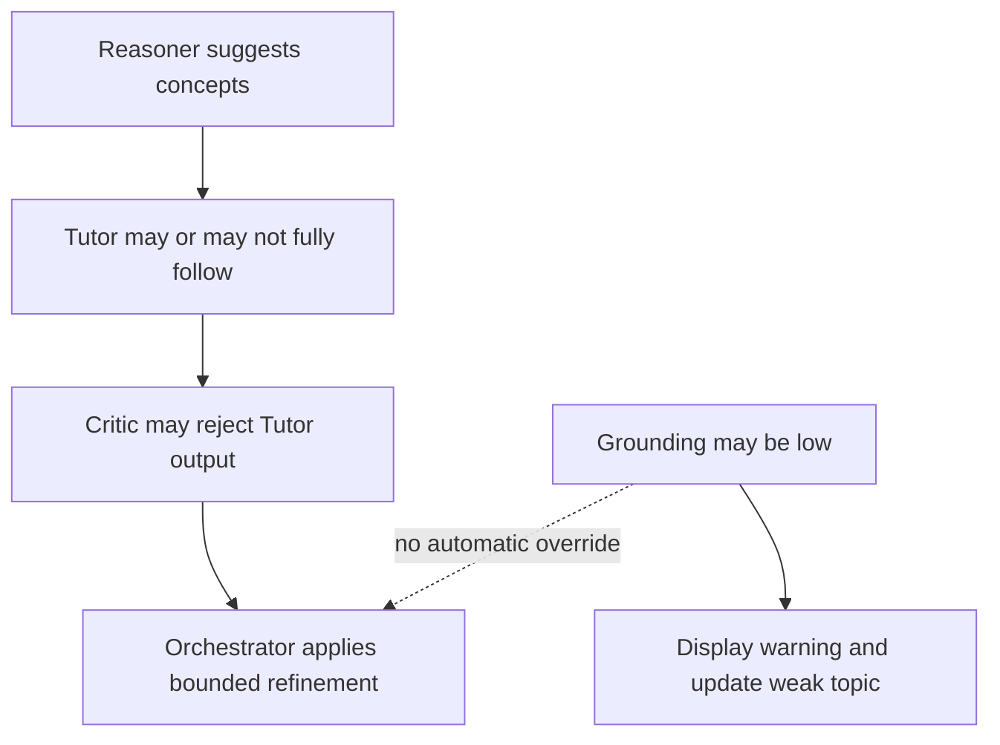

### Examples of unresolved disagreement

- Reasoning may identify concepts unsupported by retrieved evidence.
- Critic may accept an answer with low grounding.
- Grounding may flag statements after the Critic accepted them.
- Tutor and Critic may share the same model bias.

### Strong honest answer

> "AcadAI currently resolves disagreement through centralized precedence and bounded feedback, not agent consensus. A stronger version would define explicit policies, such as grounding vetoes, evidence-aware criticism, and a final arbiter."

---

## 108. What Is the Benefit of Iterative Refinement?

### Interview answer

Iterative refinement gives the system a chance to correct weaknesses identified after the first draft.

Single-pass generation may omit examples, citations, definitions, or important concepts. The Critic converts those weaknesses into explicit feedback, and the Refiner targets them without discarding correct content.

Benefits include:

- Better completeness.
- Clearer explanations.
- More examples and citations.
- Visible quality control.
- Reduced dependence on a perfect first prompt.

### Quality-improvement loop

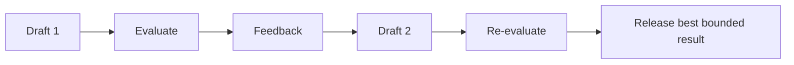

### Limitation

More refinement does not guarantee correctness. The model may introduce new errors, repeat itself, or optimize for the Critic's rubric rather than evidence. This is why the loop is bounded.

---

## 109. How Does the Agent Architecture Improve Quality?

### Interview answer

The architecture improves quality through specialized constraints and multiple checkpoints.

| Stage | Quality contribution |
|---|---|
| Router | Selects a more suitable knowledge source |
| Reasoning | Identifies concepts before prose generation |
| Tutor | Enforces pedagogical structure and citations |
| Critic | Scores relevance, completeness, accuracy, and clarity |
| Refinement | Targets identified weaknesses |
| Grounding | Exposes unsupported statements |
| Memory | Adds continuity for follow-up questions |
| Traces | Makes behavior inspectable |

### Quality layers

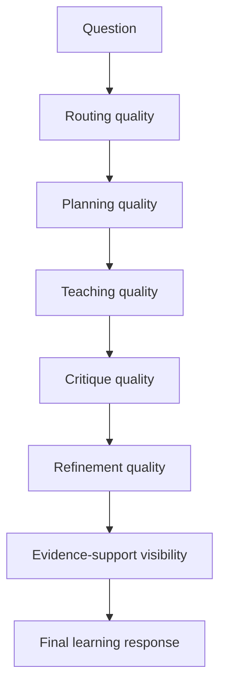

### Critical interview honesty

The repository does not include a controlled experiment proving that the full multi-agent pipeline outperforms a single-pass baseline. `impact.md` cites expected literature-based improvements, but AcadAI needs a reproducible ablation study to quantify its own gain.

---

## 110. What Is the Overhead of Multi-Agent Systems?

### Interview answer

The main overhead is additional latency, API cost, coordination complexity, and failure surface.

For a normal Mistral-backed Ask request, AcadAI makes three sequential LLM calls:

1. Reasoning.
2. Tutor.
3. Critic.

One refinement adds:

4. Refiner.
5. Second Critic.

If optional Mistral query expansion is enabled, it adds another call before retrieval. Every Mistral call has a 30-second timeout.

### Call-count diagram

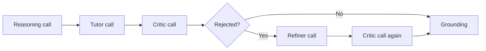

### Overhead categories

| Overhead | Current manifestation |
|---|---|
| Latency | Sequential network LLM calls |
| Cost | Multiple completion requests per question |
| Prompt tokens | Query, memory, evidence, answer, and feedback repeated across stages |
| Coordination | Orchestrator manages contracts and loop conditions |
| Parsing failures | Reasoning and Critic JSON can be malformed |
| Correlated errors | Same Mistral model handles several roles |
| Observability complexity | More stages and traces to monitor |
| Evaluation complexity | Each agent requires separate and end-to-end testing |

### Mitigation strategy

1. Use deterministic Router and Grounding modules, as AcadAI already does.
2. Use smaller models for planning and critique.
3. Skip Reasoning for simple questions.
4. Trigger refinement only on objective failures.
5. Parallelize independent retrieval and reasoning.
6. Cache repeated plans and critiques.
7. Use strict schemas and validation.
8. Track per-agent latency, tokens, cost, and quality gain.

### Strong closing answer

> "Multi-agent design improves control and inspectability, but every agent must justify its latency and cost with measurable quality gain. Otherwise, it is orchestration overhead rather than useful specialization."

---

## Multi-Agent Whiteboard Summary

```mermaid
flowchart LR
    Q["Student question"] --> RET["Retrieve evidence"]
    RET --> R["Router"]
    R --> P["Reasoning"]
    P --> T["Tutor"]
    T --> C["Critic"]
    C --> D{"Pass?"}
    D -- No --> F["Refiner"] --> C
    D -- Yes --> G["Grounding"]
    G --> M["Memory and weak-topic update"]
    M --> O["Answer + metrics + traces"]
```

### 60-second multi-agent script

> "AcadAI uses a centrally orchestrated multi-agent workflow. The Router is a deterministic rule-based module that selects RAG, Web Search, or Direct LLM after initial retrieval. The Reasoning Agent asks Mistral for structured key concepts and a solution plan. The Tutor uses the route, evidence, concepts, difficulty, and optional memory to generate an exam-oriented answer. The Critic scores relevance, completeness, accuracy, and clarity; if overall quality is below seven, its feedback can trigger a bounded Tutor refinement loop. The Grounding component then checks sentence-level lexical support against evidence. Agents exchange Python return values through the Streamlit orchestrator and produce latency traces. The design improves specialization and visibility, but its cost is sequential LLM latency, extra API calls, and coordination complexity."

---

## Difficult Multi-Agent Follow-Ups

### Is AcadAI truly multi-agent if agents are functions?

Yes, in the practical role-specialization sense: components have distinct responsibilities, prompts, outputs, and feedback flow. It is not an autonomous-agent framework with independent processes or peer-to-peer communication.

### Is Grounding really an agent?

Conceptually it has an agent-like verification responsibility. Technically, the current implementation is a deterministic Python helper function.

### Does the Router use an LLM?

No. It is rule-based and transparent.

### Does the Reasoning Agent control retrieval?

No. Retrieval runs before routing and reasoning in the current Ask flow. The Reasoning Agent's `tools_needed` field is descriptive rather than executable.

### Does the Tutor receive the complete reasoning plan?

No. It receives the plan dictionary, but the prompt currently injects only `key_concepts`, not the full `solution_plan`.

### Can the Grounding component reject an answer?

No. It reports a score and unsupported sentences, stores the result, and can update weak topics. It does not currently trigger correction.

### What if the Critic keeps rejecting?

The loop stops at the configured maximum, and the latest answer is displayed with `Needs review` marked accordingly.

### How would you strengthen agent disagreement handling?

Give the Critic retrieved evidence, let grounding veto unsupported answers, introduce an explicit final arbiter, define source-of-truth precedence, and log disagreement cases for evaluation.

---

## Source Reference Map

All line references point to `acadai_app_final_mistral_faiss.py`.

| Multi-agent topic | Lines |
|---|---:|
| `AgentTrace` contract | 105-109 |
| Mistral API boundary | 884-920 |
| Router Agent | 923-946 |
| Reasoning Agent | 949-984 |
| Tutor Agent | 987-1041 |
| Critic Agent | 1044-1083 |
| Tutor refinement pass | 1086-1097 |
| Metrics and review status | 1100-1121 |
| Conversation memory helpers | 1124-1166 |
| Grounding verification | 1169-1195 |
| Viva and Viva Critic agents | 1198-1228 |
| Extended learning agents | 1274-1323 |
| Agent trace UI renderer | 1366-1375 |
| Refinement-loop control | 2394-2405 |
| Grounding and weak-topic update | 2407-2418 |
| Critic metrics and grounding UI | 2439-2464 |
| Agent trace and reasoning-plan UI | 2467-2489 |
