# AcadAI Interview Guide: Section 8 - Memory System

This section answers questions 111-120 using AcadAI's actual Streamlit session-state implementation, conversation-context builder, weak-topic logic, quiz history, clear behavior, and learning-profile features.

## Verified Memory Facts

| Item | Actual implementation |
|---|---|
| Memory storage | `st.session_state` |
| Persistence | Temporary browser/session-scoped state, not a long-term database |
| Maximum stored chat turns | 30 |
| Turns injected into generation | Configurable 1-8; default 4 |
| Prior answer size injected per turn | Up to 450 characters |
| Chat turns shown in Memory tab | Latest 10 |
| Answer preview shown in Memory tab | Up to 700 characters |
| Adaptive-difficulty window | Last 5 scored quiz attempts |
| Weak-topic storage | Dictionary mapping topic to integer weakness count |
| Low-grounding weak-topic update | `+1` when grounding is below 55% |
| Low-viva weak-topic update | `+2` when parsed viva score is below 7/10 |
| Clear Conversation Memory | Clears `chat_history` and `history` only |
| Not cleared by that button | Profile, weak topics, quiz attempts, current quiz, flashcards, roadmaps |
| Memory use in Ask | Added to Tutor generation context, not retrieval query |

> Interview precision: AcadAI currently provides session memory and lightweight personalization. It does not provide durable cross-session user memory, authentication-backed profiles, a database, or a vector memory store.

---

## 111. Why Is Memory Needed?

### Interview answer

Memory is needed because learning is sequential. A student often asks a follow-up question that depends on the previous explanation, and a useful tutor should remember the learner's goals, weak areas, and recent performance.

Without memory, every query is isolated. If a student first asks, "What is deadlock?" and then asks, "How can it be prevented?", a stateless system may not know what "it" refers to or how much was already explained.

AcadAI uses memory for:

- Contextual follow-up answers.
- Student-profile-aware roadmaps.
- Weak-topic tracking.
- Adaptive quiz difficulty.
- Showing recent learning history.
- Retaining generated flashcards and roadmaps during the session.

### Stateless versus memory-aware tutoring

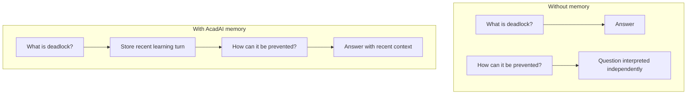

### Strong answer

> "Memory turns AcadAI from a sequence of unrelated answers into a learning session that can maintain context, track weaknesses, and adapt future support."

---

## 112. What Memory Does AcadAI Store?

### Interview answer

AcadAI stores several kinds of learning state in Streamlit session state.

### Stored state

| Session-state key | Stored information |
|---|---|
| `chat_history` | Recent queries, answers, route, subject, time, grounding score |
| `history` | Session metrics such as query, route, overall quality, satisfaction, refinements |
| `student_profile` | Name, semester, branch, preferred level, learning goal |
| `weak_topics` | Topic-to-weakness-count dictionary |
| `quiz_attempts` | Time, topic, score, and difficulty level |
| `quiz_questions` | Current generated viva questions |
| `quiz_topic` | Current viva topic |
| `quiz_rows` | Evidence rows used by the current quiz |
| `saved_flashcards` | Generated flashcard sets |
| `saved_roadmaps` | Generated study roadmaps |

### Memory architecture

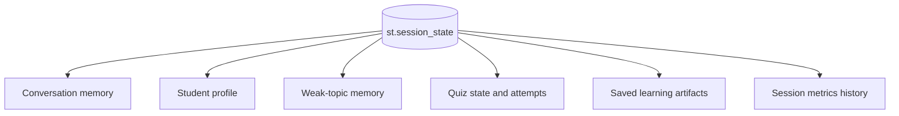

### Real initialization code

```python
st.session_state.setdefault("chat_history", [])
st.session_state.setdefault("student_profile", {
    "name": "Student",
    "semester": "B.Tech",
    "branch": "CSE / AIML",
    "preferred_level": "intermediate",
    "goal": "exam + interview preparation",
})
st.session_state.setdefault("weak_topics", {})
st.session_state.setdefault("quiz_attempts", [])
st.session_state.setdefault("saved_flashcards", [])
st.session_state.setdefault("saved_roadmaps", [])
```

---

## 113. How Is Conversation History Stored?

### Interview answer

Each completed Ask interaction is appended to `st.session_state["chat_history"]` as a dictionary.

The stored fields are:

- Time.
- User query.
- Generated answer.
- Selected route.
- Inferred subject.
- Grounding score.

After appending a turn, AcadAI keeps only the most recent 30 turns.

### Stored conversation object

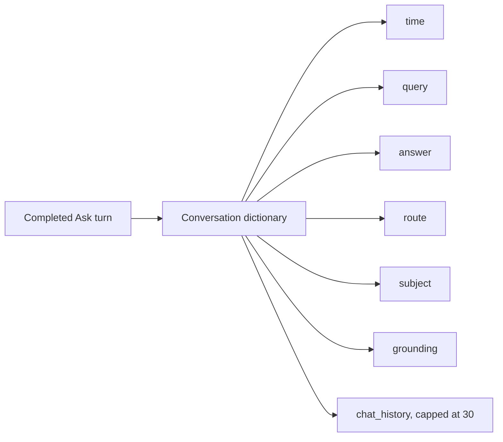

### Real code

```python
st.session_state.setdefault("chat_history", []).append({
    "time": datetime.now().strftime("%H:%M:%S"),
    "query": query,
    "answer": answer,
    "route": route,
    "subject": subject,
    "grounding": round(float(grounding_score), 1),
})

st.session_state["chat_history"] = \
    st.session_state["chat_history"][-30:]
```

### Important limitation

The stored timestamp contains only time of day, not a complete date, timezone, or durable record identifier.

---

## 114. How Is Weak-Topic History Stored?

### Interview answer

Weak-topic history is stored as a simple dictionary where each topic maps to an integer weakness count.

For example:

```python
{
    "DBMS normalization": 2,
    "CN": 1,
    "Operating System deadlock": 4,
}
```

The `update_weak_topic` function cleans the topic name, limits it to 80 characters, and increments the existing count.

Weakness is updated from two current signals:

1. If an Ask answer has grounding below 55%, the detected subject or query receives `+1`.
2. If a viva score is below 7/10, the viva topic receives `+2`.

### Weak-topic update flow

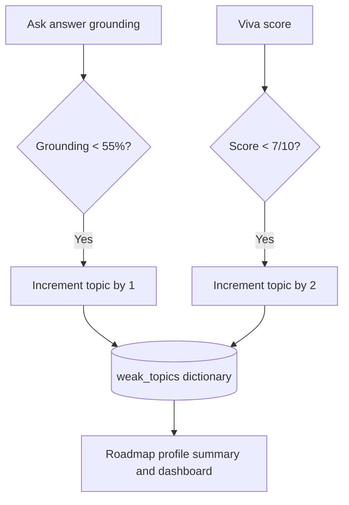

### Real code

```python
def update_weak_topic(topic: str, amount: int = 1):
    topic = clean_text(topic or "General")[:80]
    weak = st.session_state.setdefault("weak_topics", {})
    weak[topic] = int(weak.get(topic, 0)) + amount
```

### Honest limitation

Weak-topic counts only increase. There is no mastery decay, recovery mechanism, confidence score, timestamp, or topic normalization. Similar topic names can become separate entries.

---

## 115. What Is Contextual Memory?

### Interview answer

Contextual memory is recent interaction history inserted into the current generation prompt so the model can understand follow-up questions.

AcadAI takes the most recent configured number of chat turns and formats each one with:

- Previous student question.
- A shortened previous AcadAI answer.
- Subject.
- Grounding score.

The resulting memory text is appended to the current student question before the Tutor Agent generates the answer.

### Contextual-memory flow

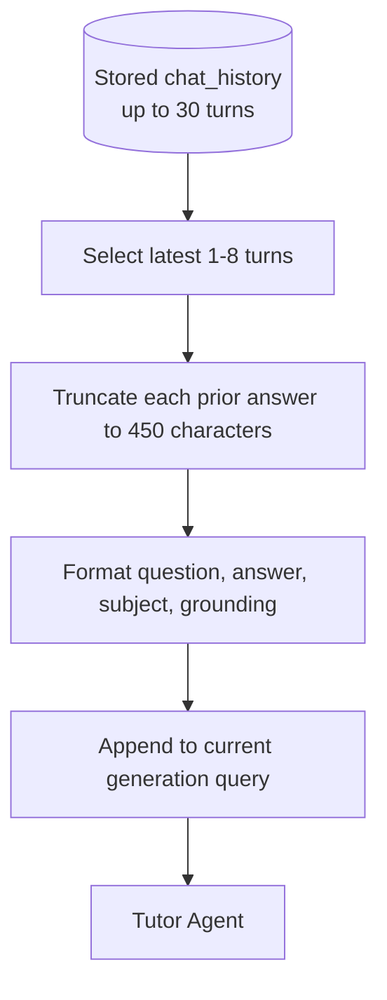

### Real context builder

```python
history = st.session_state.get("chat_history", [])[-max_turns:]

blocks.append(
    f"Turn {i}: Student asked: {item.get('query','')}\n"
    f"AcadAI answered: {quote(item.get('answer',''), 450)}\n"
    f"Subject: {item.get('subject','GENERAL')} | "
    f"Grounding: {item.get('grounding','-')}%"
)
```

### Critical implementation detail

Contextual memory is added only to generation. Retrieval still uses the current raw query, so an ambiguous follow-up may fail to retrieve the correct evidence even though the Tutor receives conversational context afterward.

---

## 116. How Does Memory Improve Answers?

### Interview answer

Memory improves answers by providing continuity and personalization.

For follow-up questions, recent conversation context helps the Tutor infer references such as "it," "that technique," or "explain the second point." It also helps avoid repeating the entire previous explanation.

The wider learning state improves other modules:

- Student profile influences roadmap and revision prompts.
- Weak topics are included in profile summaries.
- Quiz-attempt history recommends the next difficulty.
- Previous grounding scores make learning history inspectable.

### Memory-to-feature map

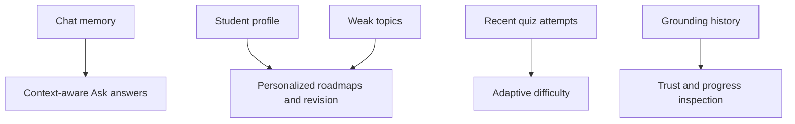

### Real generation injection

```python
memory_context = build_memory_context(memory_turns) if use_memory else ""

if memory_context:
    query_for_generation = (
        f"Current student question: {query}\n\n"
        f"Recent conversation memory for context:\n{memory_context}"
    )
```

### Honest limitation

There is no measured comparison in the repository proving how much memory improves answer quality. Memory may also introduce irrelevant or incorrect previous content.

---

## 117. How Many Memory Turns Are Retained?

### Interview answer

There are three different numbers to distinguish:

1. **Stored conversation history:** up to the latest 30 turns.
2. **Turns injected into generation:** configurable from 1 to 8, default 4.
3. **Turns displayed in the Memory tab:** latest 10.

Additionally, adaptive quiz difficulty uses the latest 5 scored quiz attempts.

### Retention layers

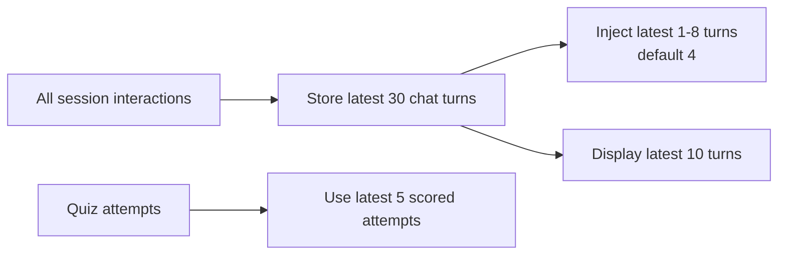

### Real controls

```python
memory_turns = st.slider(
    "Memory turns used",
    1, 8, 4
)
```

```python
st.session_state["chat_history"] = \
    st.session_state["chat_history"][-30:]
```

### Why use a smaller generation window?

It limits prompt size and reduces the chance that old conversation distracts the Tutor.

---

## 118. What Happens When Memory Is Cleared?

### Interview answer

When the user clicks **Clear Conversation Memory**, AcadAI clears:

- `chat_history`
- `history`

It then calls `st.rerun()` so the interface immediately reflects the cleared state.

### Real clear code

```python
if st.button("Clear Conversation Memory", use_container_width=True):
    st.session_state["chat_history"] = []
    st.session_state["history"] = []
    st.rerun()
```

### Clear behavior diagram

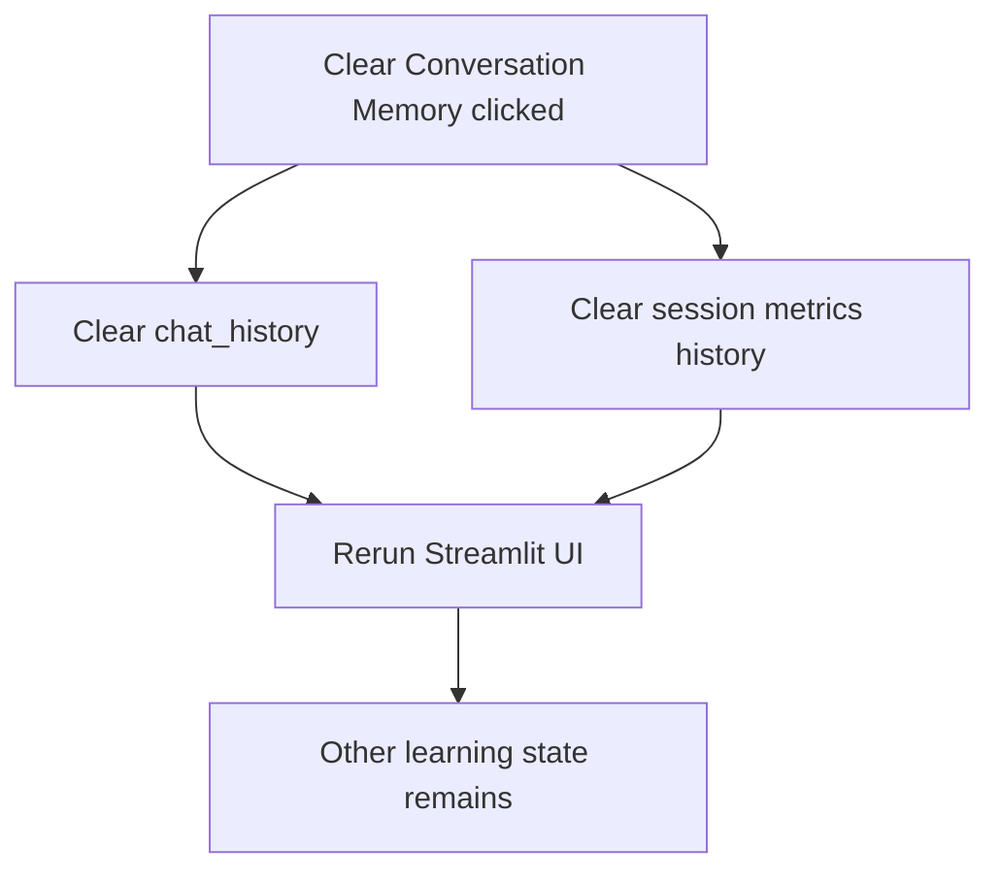

### What is not cleared?

The button does not clear:

- Student profile.
- Weak topics.
- Quiz attempts.
- Current quiz topic, questions, or evidence.
- Saved flashcards.
- Saved roadmaps.

### Strong honest answer

> "The current control clears conversational context and metric history, not the entire learning profile. A production interface should provide separate clear-chat, reset-learning-profile, and delete-all-data actions."

---

## 119. How Do You Avoid Stale Memory?

### Interview answer

AcadAI currently reduces stale-memory risk through recency limits, truncation, optional memory use, and manual clearing.

Implemented controls include:

- Only the latest 30 chat turns are stored.
- Only the latest 1-8 turns are injected.
- Previous answers are truncated to 450 characters in generation memory.
- The user can disable conversation memory.
- The user can clear conversation memory.
- Session state naturally disappears when the Streamlit session ends or is reset.

### Current stale-memory controls

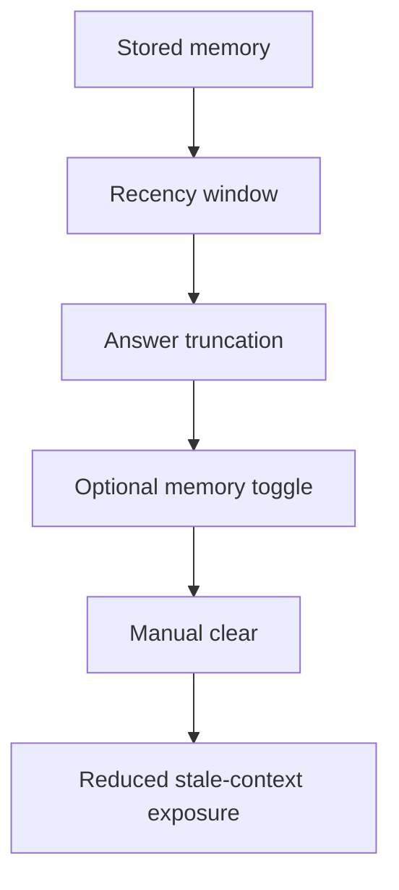

### What is missing?

AcadAI does not currently use:

- Time-to-live expiration.
- Semantic relevance filtering.
- Topic-based conversation threads.
- Memory confidence or source validity.
- Summarization with fact checking.
- Full dates or recency scoring.
- Weak-topic recovery or decay.

### How I would improve it

1. Retrieve only memories semantically relevant to the current question.
2. Add timestamps and TTL policies.
3. Separate conversations by subject and study session.
4. Store summaries plus links to original turns.
5. Downweight memories with low grounding.
6. Let students edit or delete individual memories.
7. Reduce weak-topic counts after demonstrated mastery.

### Important nuance

The current memory context includes grounding scores, but the code does not use those scores to filter or downweight low-grounding previous answers.

---

## 120. What Are the Privacy Concerns?

### Interview answer

Memory systems handle potentially sensitive educational data, so privacy must be treated as an architectural requirement.

AcadAI may temporarily hold:

- Student name, branch, semester, and goals.
- Questions and full generated answers.
- Weak-topic assessments.
- Quiz scores and learning difficulty.
- Uploaded academic material.
- Generated study artifacts.

Although this state is not persisted to a user database, it exists in server-side Streamlit session memory. More importantly, when Mistral-backed generation is enabled, the current question, selected evidence, and recent conversation memory can be sent to the external Mistral API.

### Privacy data flow

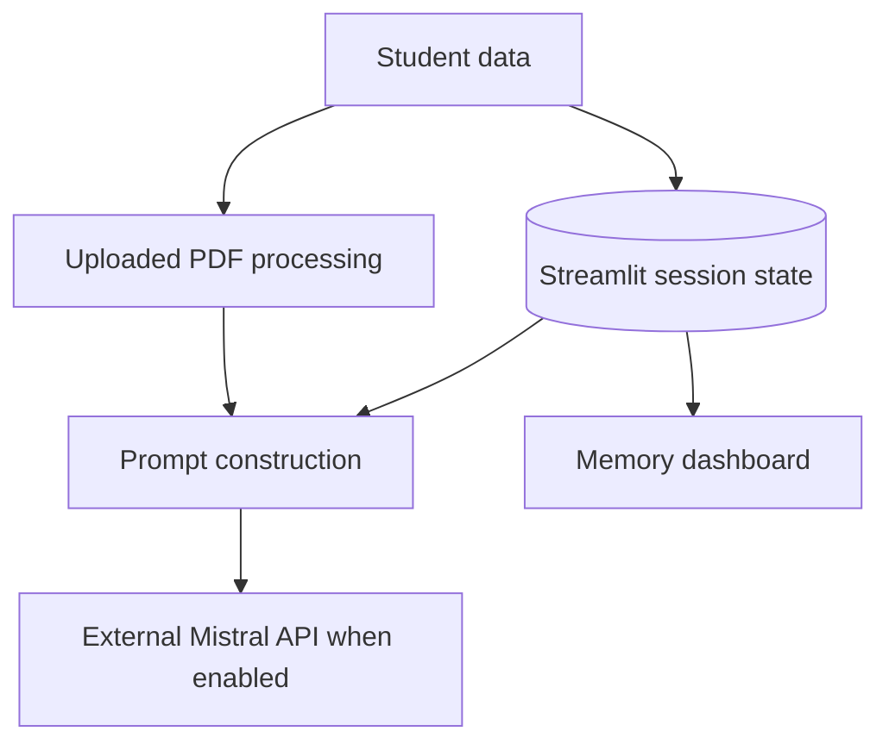

### Current privacy risks

1. No authentication or user-owned persistent profile.
2. No explicit consent screen for memory retention or external API transmission.
3. No per-field deletion or complete delete-all-data control.
4. No encryption policy in the application layer.
5. Full chat answers are stored in session state.
6. Weak-topic and quiz data can reveal learner performance.
7. Uploaded PDFs are written to temporary files with `delete=False` and are not explicitly removed by the upload function.
8. API prompts may contain academic evidence and conversation context.
9. Session-state isolation depends on Streamlit deployment behavior and secure configuration.

### Production privacy controls

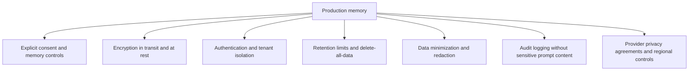

### Strong interview answer

> "The current memory is session-scoped, which reduces long-term retention risk, but it does not remove privacy obligations. Before production use, I would add explicit consent, authentication, tenant isolation, data minimization, secure deletion, retention policies, and transparent controls over what is sent to external models."

---

## Memory-System Whiteboard Summary

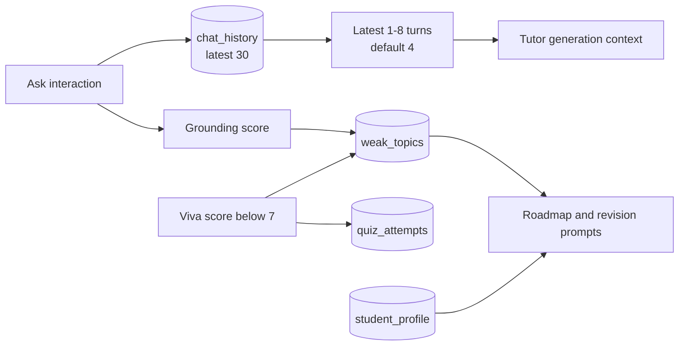

### 60-second memory script

> "AcadAI uses temporary Streamlit session memory rather than a persistent database. It stores up to 30 chat turns containing the query, full answer, route, subject, time, and grounding score. For a new answer, it injects only the latest 1 to 8 turns, defaulting to 4, and truncates each previous answer to 450 characters. Separate state stores the student profile, weak-topic counts, quiz attempts, current quiz, flashcards, and roadmaps. Weak topics increase by one for grounding below 55 percent and by two for viva scores below 7. The clear-conversation button removes chat and metric history only. Current stale-memory controls are recency windows, truncation, optional memory, and manual clearing; production would require relevance filtering, TTLs, persistent consent, authentication, deletion controls, and stronger privacy protection."

---

## Difficult Memory Follow-Ups

### Is AcadAI memory persistent across sessions?

No. It uses `st.session_state`, so it is temporary session memory rather than durable cross-session storage.

### Is memory used during retrieval?

No. Recent memory is appended to the Tutor generation query after retrieval. Retrieval uses only the current raw query.

### Can ambiguous follow-up questions retrieve the wrong evidence?

Yes. Because retrieval does not use memory, a query such as "Explain its prevention methods" may retrieve poorly even though the Tutor later receives previous context.

### Does clearing memory erase the weak-topic profile?

No. The clear-conversation button removes only `chat_history` and `history`.

### Are weak topics truly a history?

They are cumulative counters, not timestamped event histories. The system does not record when each weakness was detected or whether it was later mastered.

### Does memory use grounding quality?

Grounding scores are stored and shown in memory context, but the system does not currently filter out or downweight low-grounding turns.

### How would you add long-term memory?

Use authenticated user IDs, encrypted persistent storage, explicit consent, subject-specific memory summaries, semantic retrieval over prior turns, retention policies, and per-memory deletion controls.

### Is the student profile sent to the LLM?

It is included in roadmap and revision prompts through `profile_summary`. Conversation-memory prompts include previous questions, shortened answers, subjects, and grounding scores.

---

## Source Reference Map

All line references point to `acadai_app_final_mistral_faiss.py`.

| Memory topic | Lines |
|---|---:|
| Session metrics history | 1117-1121 |
| Learning-state initialization | 1124-1139 |
| Contextual-memory builder | 1142-1151 |
| Conversation-turn storage and 30-turn cap | 1154-1166 |
| Profile and weak-topic summary | 1231-1240 |
| Weak-topic update | 1243-1247 |
| Adaptive difficulty using latest five attempts | 1261-1271 |
| Memory controls | 2248-2249 |
| Memory injection into Tutor generation | 2378-2385 |
| Low-grounding weak-topic update | 2411-2418 |
| Quiz-attempt and weak-topic update | 2556-2567 |
| Profile storage and roadmap use | 2581-2604 |
| Saved flashcards | 2635-2639 |
| Memory dashboard and clear behavior | 2733-2781 |
