# AcadAI Interview Guide: Section 9 - Tutor Agent

This section answers questions 121-130 using AcadAI's actual Tutor Agent, Critic refinement loop, retrieval-backed learning generators, student profile, weak-topic tracker, and adaptive quiz logic.

## Verified Tutor-System Facts

| Item | Actual implementation |
|---|---|
| Core Tutor function | `tutor_agent(...)` |
| LLM provider | Mistral chat-completions API |
| Default model | `mistral-large-latest`, unless `MISTRAL_MODEL` is configured |
| Generation temperature | `0.1` |
| Core answer inputs | Query, selected difficulty, retrieved/web evidence, route, reasoning plan |
| Requested answer structure | Concept explanation, steps with worked examples, exam tips, citations |
| Quality loop | Critic scores answer; Tutor can refine it 0-3 times |
| Core difficulty choices | Beginner, intermediate, advanced |
| Specialized generators | Viva quiz, roadmap, flashcards, revision notes, exam questions |
| Revision pack implementation | UI bundle of notes, likely questions, and flashcards |
| Roadmap personalization | Student profile, weak topics, selected days, preferred level, evidence |
| Adaptive difficulty | Recommendation from the last five scored viva attempts |

> Interview precision: the core `tutor_agent` generates the main Ask-tab answer. Roadmaps, flashcards, revision notes, exam questions, and viva questions are generated by separate specialized functions. Together, they form AcadAI's broader tutoring subsystem.

---

## Complete Tutor-System View

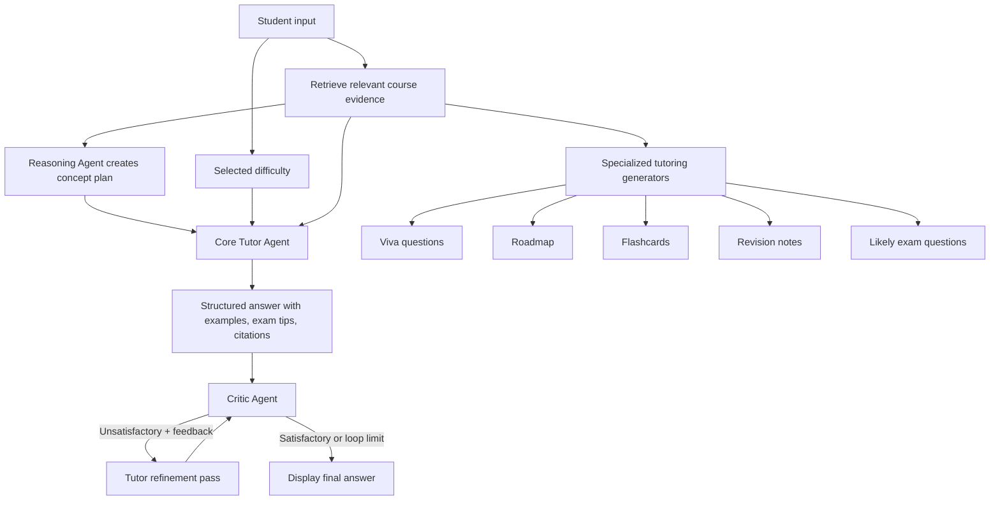

---

## 121. Why Create a Tutor Agent?

### Interview answer

A general LLM is optimized to continue text. A Tutor Agent gives that model an educational role, controlled inputs, an explicit teaching structure, and a quality-feedback loop.

In AcadAI, the Tutor Agent exists to transform retrieved evidence into a learner-facing explanation rather than simply returning raw chunks or an unconstrained model response. It is instructed to:

- Explain the concept.
- Break it down step by step.
- Include worked examples.
- Add exam-oriented tips.
- Cite the supplied sources.
- Match the requested difficulty.
- Admit when evidence is weak instead of guessing.

### Why retrieval alone is insufficient

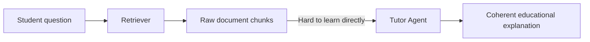

The retriever answers, "Which text is relevant?" The Tutor Agent answers, "How should this material be taught to this student?"

### Real code

```python
system = (
    "You are AcadAI's Tutor Agent - a pedagogically expert AI tutor. "
    "Generate a well-structured academic answer using ONLY the evidence provided. "
    "If evidence is weak or partially relevant, clearly say what is missing instead of guessing. "
    "Structure: (1) Concept explanation, (2) Step-by-step breakdown with worked "
    "examples, (3) Exam-oriented tips, (4) Explicit source citations. "
    "Adapt depth to the requested difficulty level."
)
```

### Strong interview statement

> "I created the Tutor Agent to separate knowledge retrieval from teaching. Retrieval supplies evidence; the Tutor converts that evidence into a structured, difficulty-aware explanation and participates in a Critic-driven refinement loop."

---

## 122. How Does the Tutor Agent Differ From an LLM?

### Interview answer

The LLM is the underlying language model. The Tutor Agent is the application-level component that gives the LLM a role, evidence, constraints, workflow position, fallback behavior, and evaluation loop.

| Plain LLM call | AcadAI Tutor Agent |
|---|---|
| Receives a prompt | Receives query, difficulty, evidence, route, and reasoning plan |
| May answer from broad model knowledge | Is instructed to use only supplied evidence |
| No guaranteed educational format | Requests explanation, steps, examples, exam tips, citations |
| No application-level fallback | Returns grounded chunks, web fallback, or `NOT_FOUND` |
| No built-in review | Answer is scored by the Critic and may be refined |
| No source routing | Works after Router, Reasoning, and retrieval components |

### Agent wrapper around the model

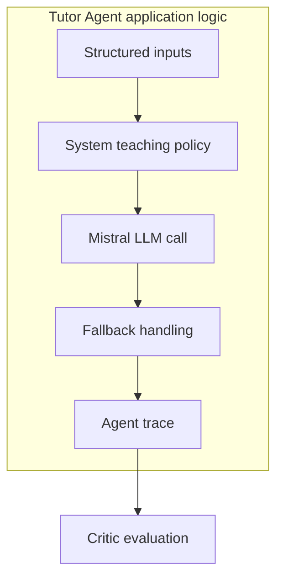

### Real LLM caller

```python
def call_llm(prompt: str, system: str = "") -> str:
    messages = []
    if system:
        messages.append({"role": "system", "content": system})
    messages.append({"role": "user", "content": prompt})

    r = requests.post(
        "https://api.mistral.ai/v1/chat/completions",
        json={
            "model": os.getenv("MISTRAL_MODEL") or "mistral-large-latest",
            "temperature": 0.1,
            "messages": messages,
        },
        timeout=30,
    )
```

The low temperature is intended to make responses more consistent, but it does not guarantee factual correctness. Grounding still depends on retrieval quality and prompt adherence.

---

## 123. How Does It Structure Explanations?

### Interview answer

The core Tutor uses prompt-level structural guidance rather than a rigid response schema. It asks the model for four educational sections:

1. Concept explanation.
2. Step-by-step breakdown with worked examples.
3. Exam-oriented tips.
4. Explicit source citations.

It also receives key concepts from the Reasoning Agent and a user-selected difficulty.

### Explanation-generation flow

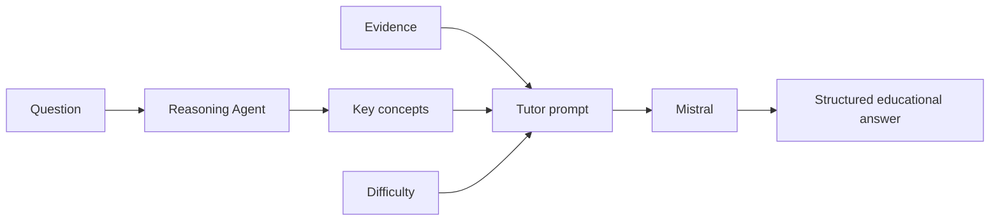

### Real prompt construction

```python
concepts = ", ".join(plan.get("key_concepts", []))
prompt = (
    f"Difficulty: {difficulty}\n"
    f"Key concepts: {concepts}\n"
    f"Student query: {query}\n\n"
    f"Evidence:\n{evidence}"
)
answer = call_llm(prompt, system)
```

### Honest limitation

The model is requested to follow the structure, but the code does not parse and validate that all four sections are present. A stronger production version would return structured JSON and validate required sections before display.

---

## 124. How Are Examples Generated?

### Interview answer

Examples in the main answer are generated by Mistral as part of the Tutor prompt. There is no separate example-generation function. The prompt explicitly asks for worked examples, and the Critic's fallback scoring checks whether example-related words appear.

### Example path

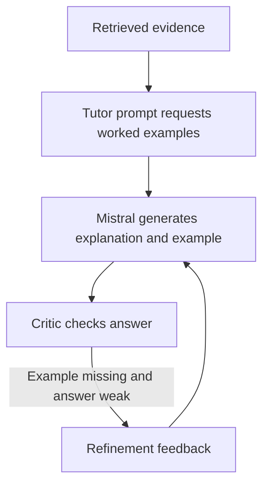

### Real Critic heuristic

```python
has_example = any(
    kw in answer.lower()
    for kw in ["example", "e.g.", "for instance", "such as"]
)
cla = 7.0 + (1.0 if has_example else 0) + (0.5 if has_cite else 0)
```

### What this means technically

- The example should be grounded because the Tutor is told to use only evidence.
- The example is not independently retrieved or fact-checked.
- The fallback Critic checks for example markers, not whether the example is correct.
- A stronger design would generate an example, retrieve supporting evidence for it, and validate its solution steps.

---

## 125. How Are Exam Notes Generated?

### Interview answer

Exam notes are generated by the specialized `generate_revision_notes` function, not directly by the core Tutor Agent. The Revision Suite retrieves up to ten final evidence rows, while the generator places up to twelve supplied rows into a prompt alongside the topic, selected revision mode, and student profile.

The available modes are:

- Night-before exam notes.
- One-page summary.
- Detailed revision notes.
- Interview/viva notes.

### Notes pipeline

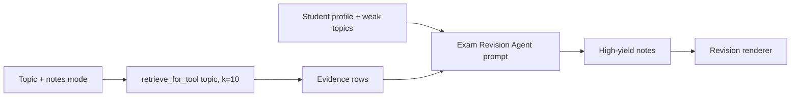

### Real code

```python
def generate_revision_notes(topic: str, mode: str, evidence_rows: List[Dict]) -> str:
    evidence = "\n\n".join(
        f"[{r.get('doc_id')}] {r.get('evidence','')}"
        for r in evidence_rows[:12]
    )
    system = (
        "You are AcadAI's Exam Revision Agent. Create high-yield B.Tech revision material. "
        "Use only the evidence when possible. Include formulas, definitions, key points, and likely questions."
    )
    prompt = (
        f"Topic: {topic}\nRevision mode: {mode}\n"
        f"Student profile: {profile_summary()}\nEvidence:\n{evidence}"
    )
    return call_llm(prompt, system)
```

### Fallback behavior

If Mistral is unavailable, AcadAI returns a generic outline containing definitions, important points, common questions, and examples. That fallback is usable as a template but is not a real content-rich revision note.

---

## 126. How Are Flashcards Generated?

### Interview answer

Flashcards are evidence-conditioned Q/A pairs generated by the specialized Flashcard Agent. A student selects between 5 and 25 cards. AcadAI retrieves evidence, asks Mistral for concise and accurate Q/A output, parses the text, renders active-recall cards, and stores the generated set in session state.

### Flashcard lifecycle

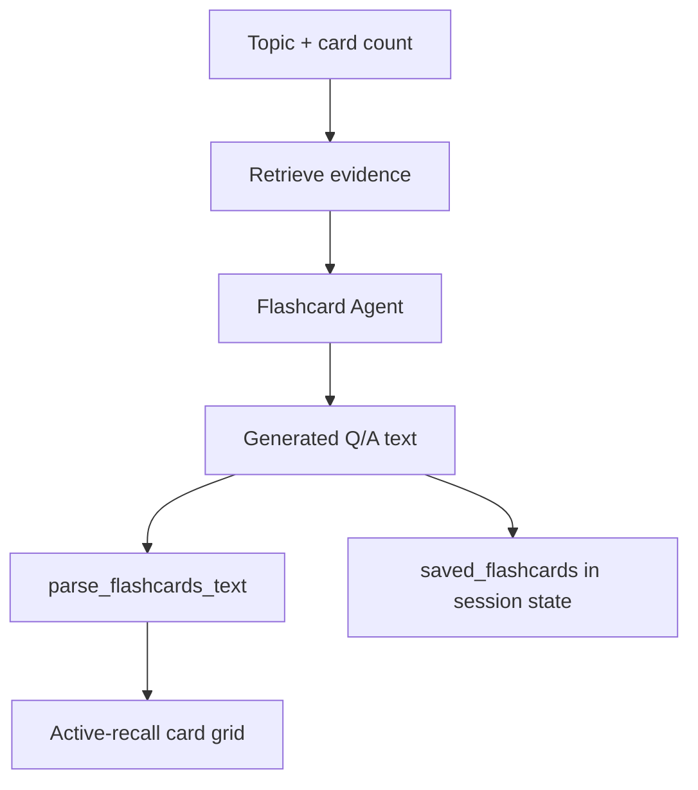

### Real generation code

```python
def generate_flashcards(topic: str, evidence_rows: List[Dict], count: int = 10) -> str:
    evidence = "\n\n".join(
        f"[{r.get('doc_id')}] {r.get('evidence','')}"
        for r in evidence_rows[:10]
    )
    system = (
        "You are AcadAI's Flashcard Agent. Create concise exam flashcards. "
        "Return in Q/A format. Keep answers short and accurate."
    )
    prompt = f"Topic: {topic}\nNumber of flashcards: {count}\nEvidence:\n{evidence}"
    out = call_llm(prompt, system)
```

### Real parsing and rendering behavior

`parse_flashcards_text` uses a regular expression to identify question/answer pairs. If that format is not found, it falls back to numbered-item parsing. The renderer then displays each pair as a card.

### Honest limitations

- The requested card count is not programmatically enforced after generation.
- Duplicate cards are not removed.
- Cards are not scheduled using spaced repetition.
- Saved cards live only in the current Streamlit session.

---

## 127. How Are Roadmaps Generated?

### Interview answer

Roadmaps are generated by a specialized Learning Roadmap Agent. It combines:

- The requested topic.
- A selected duration of 3-30 days.
- Preferred difficulty.
- Student profile.
- Tracked weak topics through `profile_summary()`.
- Retrieved course evidence.

It asks Mistral for a practical day-wise B.Tech study plan containing daily topics, practice, revision, and mini-tests.

### Personalized roadmap flow

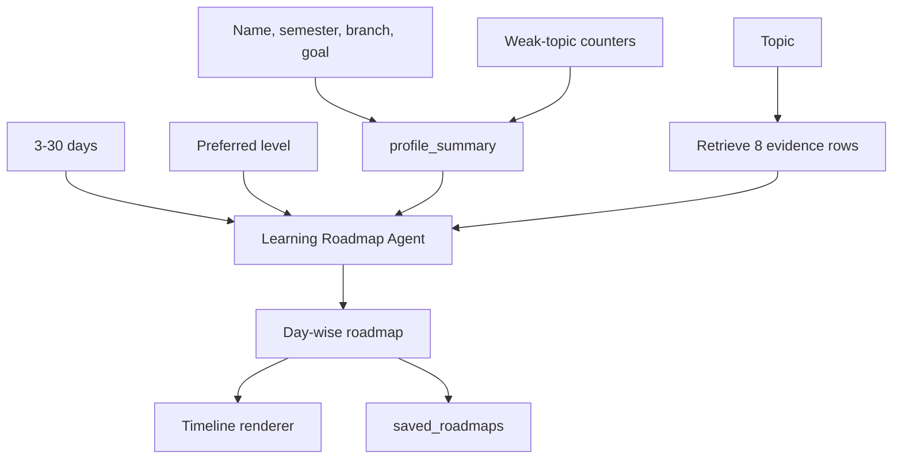

### Real code

```python
def generate_learning_roadmap(topic, days, difficulty, evidence_rows):
    evidence = "\n\n".join(
        f"[{r.get('doc_id')}] {r.get('evidence','')}"
        for r in evidence_rows[:10]
    )
    system = (
        "You are AcadAI's Learning Roadmap Agent. Create a practical day-wise B.Tech study roadmap. "
        "Use the student profile and evidence. Include daily topics, practice, revision, and mini-tests."
    )
    prompt = (
        f"Student profile: {profile_summary()}\nTopic: {topic}\n"
        f"Days: {days}\nDifficulty: {difficulty}\nEvidence:\n{evidence}"
    )
    return call_llm(prompt, system)
```

### Honest limitation

Weak topics are included as text in the profile prompt, but there is no scheduling algorithm that guarantees more days or exercises for weaker topics. The roadmap also does not track completion or automatically re-plan.

---

## 128. How Are Revision Packs Generated?

### Interview answer

AcadAI does not contain a function literally named `generate_revision_pack`. The Revision Suite builds a revision pack by retrieving evidence once and running three specialized generators against that same evidence:

1. Revision notes.
2. Likely exam questions.
3. Flashcards.

The outputs are rendered separately and combined into export-ready Markdown.

### Revision-pack orchestration

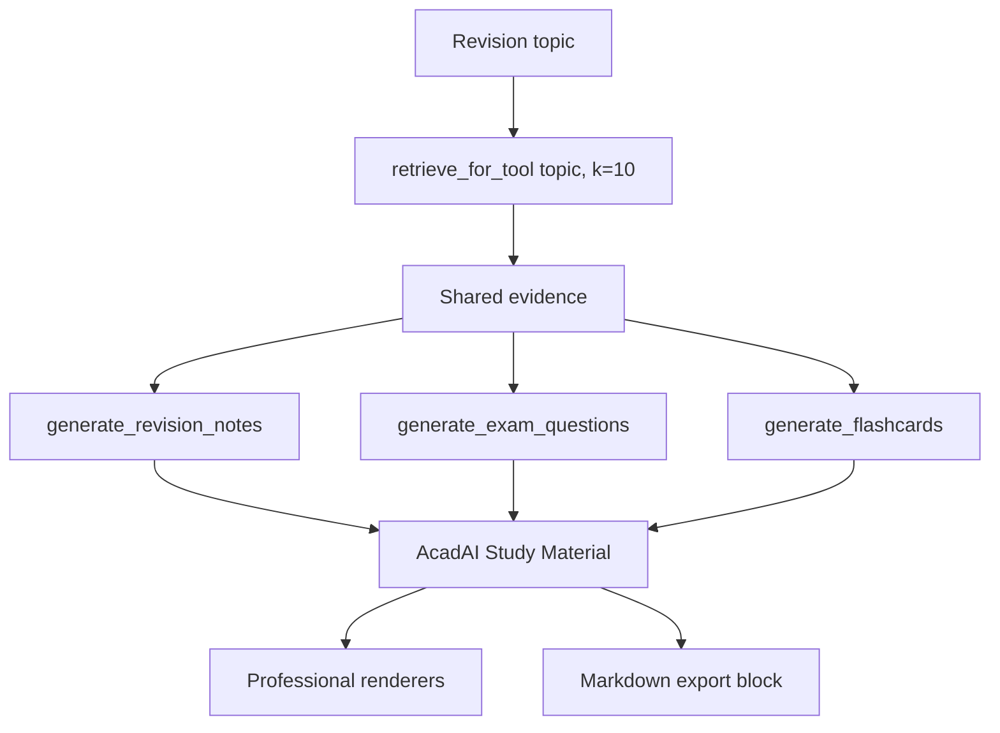

### Real orchestration code

```python
rows, _ = retrieve_for_tool(tool_topic, k=10)
notes = generate_revision_notes(tool_topic, mode, rows)
questions = generate_exam_questions(tool_topic, rows)
cards = generate_flashcards(tool_topic, rows, count=flashcard_count)

export_md = (
    f"# AcadAI Study Material: {tool_topic}\n\n"
    f"## Revision Notes\n{notes}\n\n"
    f"## Likely Questions\n{questions}\n\n"
    f"## Flashcards\n{cards}"
)
```

### Why shared evidence matters

Using one retrieved evidence set makes the notes, questions, and cards more likely to cover the same source material. However, each LLM call can still emphasize different facts, and the pack currently has no final cross-artifact consistency check.

---

## 129. How Does Pedagogy Improve Learning?

### Interview answer

Pedagogy improves learning by organizing information around how students understand, practice, recall, and prepare for assessment rather than merely presenting facts.

AcadAI implements several pedagogical mechanisms:

| Pedagogical mechanism | AcadAI implementation |
|---|---|
| Scaffolding | Beginner/intermediate/advanced Tutor level |
| Explanation sequencing | Concept, steps, example, exam tips |
| Worked examples | Explicitly requested in Tutor answers |
| Active recall | Flashcard Q/A format |
| Retrieval practice | Viva questions and likely exam questions |
| Feedback | Viva Critic and answer Critic |
| Mastery awareness | Weak-topic counters |
| Planning | Day-wise roadmaps with practice and revision |
| Contextual learning | Recent conversation memory |
| Grounded learning | Retrieved evidence and citations |

### Learning loop

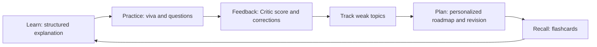

### Real quality-refinement loop

```python
scores, tr_critic = critic_agent(query, answer)

while (
    not scores.get("satisfactory")
    and refine_count < max_refine
    and scores.get("feedback")
):
    answer = refine_answer(query, answer, scores["feedback"], difficulty)
    scores, tr_critic2 = critic_agent(query, answer)
    refine_count += 1
```

### Honest evaluation statement

The architecture contains pedagogy-inspired features, but the current project does not measure actual learning gains through a controlled study, pre-test/post-test improvement, long-term retention, or spaced-repetition outcomes. In an interview, claim that the system is designed to improve learning quality, not that improved learning has already been scientifically proven.

---

## 130. How Does the Tutor Adapt Difficulty?

### Interview answer

AcadAI currently supports three forms of difficulty handling:

1. **Manual Tutor adaptation:** the student selects beginner, intermediate, or advanced; the value is sent to the core Tutor prompt.
2. **Profile-based roadmap adaptation:** the roadmap uses the student's preferred explanation level.
3. **Performance-based viva recommendation:** the last five scored attempts are examined and a recommended next level is displayed.

### Difficulty flow

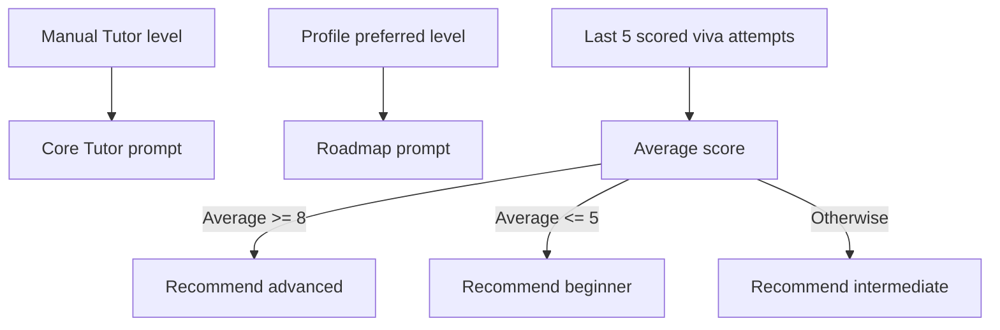

### Real adaptation logic

```python
def adaptive_difficulty_from_attempts(default_level: str) -> str:
    attempts = st.session_state.get("quiz_attempts", [])[-5:]
    scores = [
        a.get("score") for a in attempts
        if isinstance(a.get("score"), (int, float))
    ]
    if len(scores) < 2:
        return default_level
    avg = sum(scores) / len(scores)
    if avg >= 8:
        return "advanced"
    if avg <= 5:
        return "beginner"
    return "intermediate"
```

### Critical implementation detail

The adaptive function currently **recommends** the next quiz level in a caption:

```python
st.caption(
    f"Next recommended quiz level: "
    f"{adaptive_difficulty_from_attempts(difficulty)}"
)
```

It does not automatically change the sidebar difficulty or the next quiz-generation call. Also, the Tutor prompt asks the LLM to adapt depth, but the code does not enforce measurable differences such as vocabulary complexity, number of steps, prerequisite explanations, or question difficulty.

### Strong interview statement

> "Difficulty adaptation is partly implemented. Main answers use an explicit selected level, roadmaps use the profile's preferred level, and viva history produces a recommendation based on recent scores. My next improvement would be to automatically apply that recommendation and validate that generated content truly matches the target level."

---

## End-to-End Interview Walkthrough

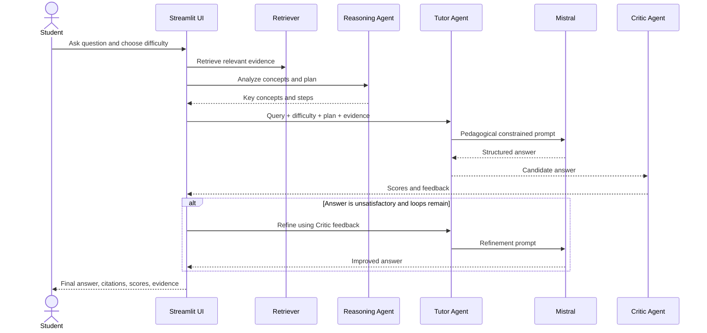

---

## What I Would Improve Next

1. Require structured JSON output for Tutor sections and validate every section.
2. Add an example-verification pass against retrieved evidence.
3. Enforce flashcard count, deduplicate cards, and add spaced repetition.
4. Add a final consistency check across revision notes, questions, and flashcards.
5. Automatically apply adaptive difficulty with a student-controlled override.
6. Define measurable difficulty rubrics for vocabulary, depth, prerequisites, and problem complexity.
7. Track roadmap completion and dynamically re-plan around weak topics.
8. Evaluate pedagogy with pre-tests, post-tests, retention tests, and learner feedback.

---

## Source Reference Map

All references point to `acadai_app_final_mistral_faiss.py`.

| Behavior | Source location |
|---|---|
| Mistral API caller and temperature | Lines 886-920 |
| Core Tutor Agent | Lines 989-1042 |
| Critic Agent | Lines 1046-1082 |
| Tutor refinement pass | Lines 1086-1098 |
| Viva question generation | Lines 1198-1214 |
| Student profile summary and weak topics | Lines 1231-1246 |
| Adaptive difficulty | Lines 1261-1271 |
| Learning roadmap generator | Lines 1274-1284 |
| Flashcard generator | Lines 1287-1297 |
| Revision-notes generator | Lines 1300-1310 |
| Exam-question generator | Lines 1313-1323 |
| Shared learning-tool retrieval | Lines 1326-1340 |
| Flashcard parser and renderer | Lines 1404-1463 |
| Roadmap renderer | Lines 1466-1504 |
| Revision and question renderers | Lines 1507-1537 |
| Tutor-level selector | Lines 2244-2245 |
| Ask-tab Tutor and Critic orchestration | Lines 2378-2405 |
| Viva performance recommendation | Lines 2556-2567 |
| Roadmap UI orchestration | Lines 2578-2609 |
| Revision-pack UI orchestration and export | Lines 2622-2652 |

---

## Final Interview Summary

> "AcadAI's Tutor Agent is not just an LLM response. It is a retrieval-grounded teaching component that receives a reasoning plan, evidence, conversation context, and selected difficulty; produces a structured academic explanation; and can refine that explanation using Critic feedback. Around the core Tutor, specialized generators create viva questions, profile-aware roadmaps, flashcards, exam notes, likely questions, and a combined revision pack. The current system provides meaningful pedagogical structure and lightweight adaptation, while future work should enforce output schemas, verify examples, automatically apply difficulty recommendations, and measure real learning gains."
