# AcadAI Mathematical Interview Guide

This guide explains the ground-level mathematics behind the techniques actually used in AcadAI. It is written so you can answer interview questions without memorizing heavy theory.

Source basis: `acadai_app_final_mistral_faiss.py`.

Implemented math/AI techniques covered:

- Text cleaning and tokenization
- Chunking and overlap
- Sparse vectors
- TF-IDF
- Cosine similarity
- Dense embeddings
- Semantic search
- FAISS vector search
- Inner product vs L2 distance
- Score normalization
- Keyword overlap
- Query expansion
- Subject filtering and boosting
- Hybrid reranking
- Cross-encoder reranking
- Top-k retrieval
- Grounding score
- Critic fallback scoring
- Retrieval hit rate
- Adaptive difficulty from quiz scores

Not implemented in AcadAI:

- BM25
- ChromaDB
- MongoDB vector search
- LangChain chains
- LangGraph
- Neural fine-tuning
- Learned custom embedding model training
- Persistent user analytics database

---

## 1. The Whole Retrieval Math in One Picture

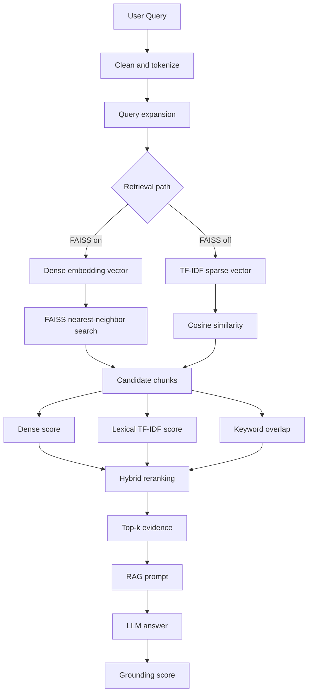

Easy explanation:

AcadAI turns text into numbers, compares those numbers, ranks the most relevant chunks, sends the best chunks to the LLM, and then checks whether the answer is supported by those chunks.

One sentence for interview:

```text
AcadAI combines dense semantic similarity, sparse TF-IDF similarity, keyword overlap, and subject-aware boosts to retrieve evidence before generating a grounded answer.
```

---

## 2. What Is a Vector?

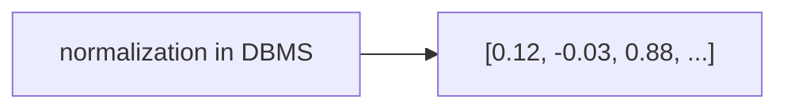

Simple idea:

A vector is just a list of numbers that represents text.

Example:

```text
"DBMS normalization" -> [0.2, 0.7, 0.1]
"database design"   -> [0.3, 0.6, 0.2]
"football match"    -> [-0.8, 0.1, 0.4]
```

The first two vectors are close because their meanings are related. The third is far away.

Interview answer:

```text
A vector is a numeric representation of text. Once text becomes numbers, we can compare queries and documents mathematically.
```

Common mistake:

```text
Vectors are not keywords. They are numerical representations used for comparison.
```

---

## 3. Sparse Vectors vs Dense Vectors

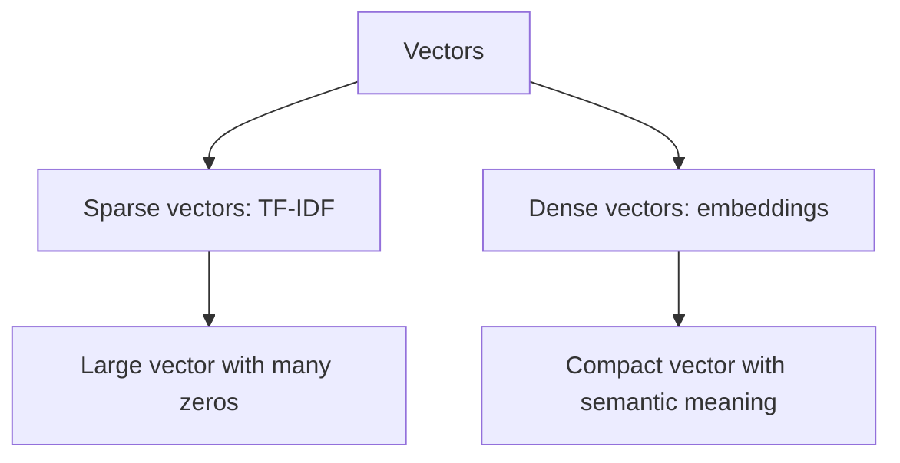

Sparse vector:

```text
Vocabulary: [dbms, normalization, deadlock, python]
Text: "dbms normalization"
Vector: [1, 1, 0, 0]
```

Dense vector:

```text
"dbms normalization" -> [0.231, -0.128, 0.442, ...]
```

Easy difference:

| Type | Used in AcadAI? | Meaning |
|---|---:|---|
| Sparse vector | Yes | Keyword-based TF-IDF vector |
| Dense vector | Yes | Neural embedding vector from SentenceTransformers |

Interview answer:

```text
AcadAI uses sparse TF-IDF vectors for fallback keyword search and dense embedding vectors for semantic FAISS search.
```

---

## 4. Tokenization

Code:

```python
def tokenize(text: str) -> List[str]:
    return re.findall(r"[a-zA-Z0-9_]+", text.lower())
```

Diagram:

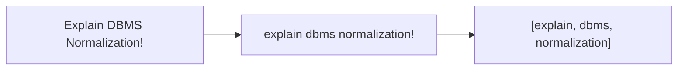

What happens:

1. Convert text to lowercase.
2. Extract words/numbers/underscores.
3. Ignore punctuation.

Interview answer:

```text
Tokenization breaks text into simple word units. AcadAI uses this for keyword overlap, subject detection, and fallback scoring.
```

---

## 5. Text Cleaning

Code:

```python
def clean_text(text: str) -> str:
    return re.sub(r"\s+", " ", text or "").strip()
```

Formula-like view:

```text
Many spaces/newlines/tabs -> one space
Leading/trailing spaces -> removed
```

Example:

```text
"DBMS\n\n normalization   reduces   redundancy"
-> "DBMS normalization reduces redundancy"
```

Why it matters:

Clean text makes chunking, token matching, and prompt formatting more stable.

Interview answer:

```text
AcadAI normalizes whitespace so extracted PDF text becomes easier to chunk, search, and display.
```

---

## 6. Chunking Mathematics

Code:

```python
def split_text(text: str, source: str, page: int,
               chunk_size: int = 512, overlap: int = 64):
    start += max(1, chunk_size - overlap)
```

Diagram:

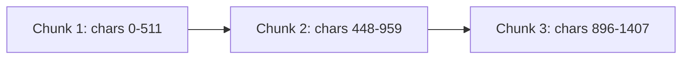

Math:

```text
chunk_size = 512 characters
overlap = 64 characters
step = chunk_size - overlap
step = 512 - 64 = 448 characters
```

Why overlap exists:

If an important sentence crosses a chunk boundary, overlap helps preserve context.

Tradeoff:

| Larger chunks | Smaller chunks |
|---|---|
| More context | More precise retrieval |
| More noise | Less context |
| Larger prompt | More chunks to search |

Interview answer:

```text
AcadAI uses 512-character chunks with 64-character overlap, so adjacent chunks share context and important text is less likely to be cut off.
```

Important limitation:

```text
This is character-based chunking, not recursive semantic chunking.
```

---

## 7. TF-IDF: The Simple Intuition

TF-IDF means:

```text
Term Frequency - Inverse Document Frequency
```

Easy meaning:

```text
A word is important if it appears often in one document but not everywhere.
```

Diagram:

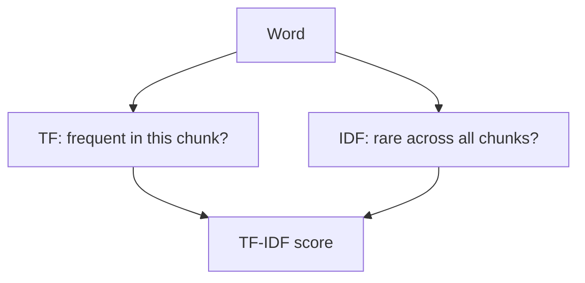

Simple example:

```text
Word: normalization
Appears often in one DBMS chunk -> high TF
Does not appear in every chunk -> high IDF
Result -> important word for that chunk
```

Interview answer:

```text
TF-IDF gives high weight to words that are frequent in a relevant chunk but rare across the whole corpus.
```

---

## 8. TF Formula

Term frequency asks:

```text
How often does a word appear in this document or chunk?
```

Basic formula:

```text
TF(term, document) = count(term in document) / total terms in document
```

Example:

```text
Chunk: "dbms normalization normalization"
term = normalization
count = 2
total terms = 3
TF = 2 / 3 = 0.67
```

Interview answer:

```text
TF measures local importance: if a word appears repeatedly in a chunk, that word likely represents the chunk.
```

Note:

scikit-learn may apply its own normalization details internally, but this is the core idea interviewers expect.

---

## 9. IDF Formula

Inverse document frequency asks:

```text
Is this word rare across all chunks?
```

Common formula:

```text
IDF(term) = log(total_documents / documents_containing_term)
```

Example:

```text
Total chunks = 1000
"the" appears in 900 chunks
IDF(the) = log(1000 / 900) = low

"normalization" appears in 20 chunks
IDF(normalization) = log(1000 / 20) = high
```

Interview answer:

```text
IDF reduces the importance of common words and increases the importance of rare, topic-specific words.
```

---

## 10. TF-IDF Formula

Formula:

```text
TF-IDF(term, document) = TF(term, document) * IDF(term)
```

Diagram:

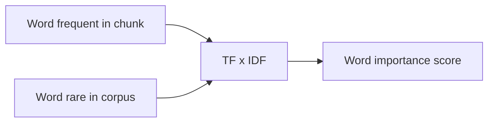

Example:

```text
"normalization" appears frequently in one DBMS chunk and rarely elsewhere.
TF = high
IDF = high
TF-IDF = very high
```

AcadAI code:

```python
vec = TfidfVectorizer(stop_words="english", ngram_range=(1, 2), max_features=12000)
mat = vec.fit_transform(corpus)
```

Interview answer:

```text
AcadAI uses TF-IDF to convert chunks into sparse vectors, then compares the query vector with chunk vectors using cosine similarity.
```

---

## 11. Why Stop Words Are Removed

Code:

```python
TfidfVectorizer(stop_words="english")
```

Stop words:

```text
the, is, are, of, and, to
```

Why remove them:

They appear everywhere and usually do not help decide relevance.

Interview answer:

```text
Removing stop words helps TF-IDF focus on meaningful academic terms like normalization, deadlock, paging, or subnetting.
```

---

## 12. What Are N-Grams?

Code:

```python
ngram_range=(1, 2)
```

Meaning:

```text
1-gram = one word
2-gram = two-word phrase
```

Example:

```text
"operating system deadlock"

1-grams:
operating, system, deadlock

2-grams:
operating system, system deadlock
```

Why AcadAI uses it:

Academic concepts often come as phrases:

- operating system
- primary key
- foreign key
- subnet mask
- quality of service

Interview answer:

```text
AcadAI uses unigrams and bigrams so retrieval can match both individual words and important academic phrases.
```

---

## 13. Cosine Similarity

Cosine similarity measures angle between two vectors.

Formula:

```text
cosine_similarity(A, B) = (A dot B) / (||A|| * ||B||)
```

Diagram:

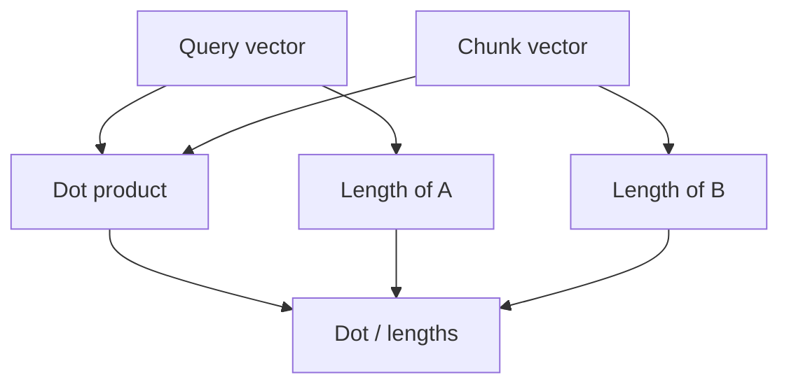

Simple meaning:

```text
Same direction -> high similarity
Different direction -> low similarity
Opposite direction -> negative or very low similarity
```

Example:

```text
Query: "DBMS normalization"
Chunk A: "Normalization reduces redundancy" -> high cosine
Chunk B: "Python list functions" -> low cosine
```

AcadAI code:

```python
sims = cosine_similarity(q_vec, mat).ravel()
```

Interview answer:

```text
Cosine similarity checks whether the query vector and chunk vector point in a similar direction, which indicates relevance.
```

---

## 14. Dot Product

Formula:

```text
A dot B = A1*B1 + A2*B2 + ... + An*Bn
```

Example:

```text
A = [1, 2, 3]
B = [4, 5, 6]

A dot B = 1*4 + 2*5 + 3*6
        = 4 + 10 + 18
        = 32
```

Why it matters:

Dot product is the numerator of cosine similarity and is also related to inner-product FAISS search.

Interview answer:

```text
The dot product measures how much two vectors align dimension by dimension.
```

---

## 15. Vector Norm

Formula:

```text
||A|| = sqrt(A1^2 + A2^2 + ... + An^2)
```

Example:

```text
A = [3, 4]
||A|| = sqrt(3^2 + 4^2)
      = sqrt(9 + 16)
      = 5
```

Why it matters:

Cosine similarity divides by vector lengths, so long documents do not win only because they have more words.

Interview answer:

```text
The norm is the vector length. Cosine similarity normalizes by length so comparison focuses on direction, not text size.
```

---

## 16. Semantic Search

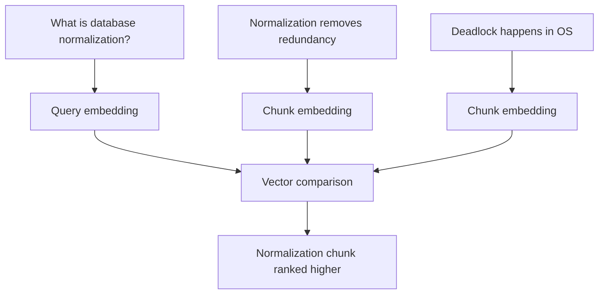

Simple meaning:

Semantic search searches by meaning, not only exact words.

Example:

```text
Query: "How do we reduce repeated data in databases?"
Relevant chunk: "Normalization reduces redundancy in DBMS."
```

Even though words differ, meanings are close.

AcadAI code:

```python
q_emb = model.encode([model_query_text(expanded, model_name)], normalize_embeddings=True).astype("float32")
raw_scores, raw_ids = index.search(q_emb, search_k)
```

Interview answer:

```text
Semantic search uses embeddings so the system can retrieve conceptually related chunks even when the query and document do not share exact words.
```

---

## 17. Embeddings

Embedding:

```text
Text -> neural model -> dense vector
```

Diagram:

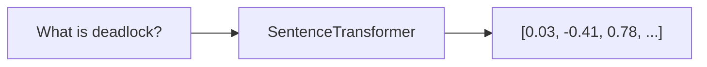

AcadAI default:

```python
DEFAULT_EMBEDDING_MODEL = "BAAI/bge-large-en-v1.5"
```

What the model does:

It maps semantically similar text to nearby vector positions.

Interview answer:

```text
Embeddings convert text into dense numeric vectors that capture semantic meaning, which enables FAISS-based semantic retrieval.
```

Important:

AcadAI generates query embeddings at runtime. The document embeddings in the FAISS store were prebuilt.

---

## 18. Embedding Dimension

Dimension means:

```text
How many numbers are in the vector?
```

Example:

```text
[0.1, 0.2, 0.3] -> 3 dimensions
```

Real embedding models often have hundreds or thousands of dimensions.

AcadAI code:

```python
if q_emb.shape[1] != index.d:
    return [], {"match": False, "reason": "Embedding dimension mismatch..."}
```

Why dimension must match:

FAISS index vectors and query vectors must have the same length.

Interview answer:

```text
If the FAISS index was built with one embedding dimension, the query embedding must have the same dimension, or vector comparison is mathematically invalid.
```

---

## 19. Normalized Embeddings

Code:

```python
model.encode(..., normalize_embeddings=True)
```

Meaning:

The vector is scaled so its length becomes 1.

Formula:

```text
normalized_vector = vector / ||vector||
```

Why useful:

When vectors have length 1, dot product and cosine similarity become closely related.

Interview answer:

```text
Normalized embeddings make similarity comparison more stable because vectors are compared by direction rather than magnitude.
```

---

## 20. FAISS

FAISS means:

```text
Facebook AI Similarity Search
```

What it does:

```text
Given a query vector, FAISS quickly finds the closest stored vectors.
```

Diagram:

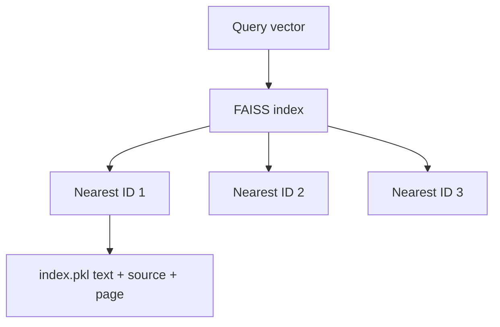

AcadAI code:

```python
index = faiss.read_index(index_path)
raw_scores, raw_ids = index.search(q_emb, search_k)
```

Interview answer:

```text
FAISS is the local vector search engine. It stores document vectors and returns nearest chunk IDs for a query embedding.
```

---

## 21. FAISS Index and Metadata

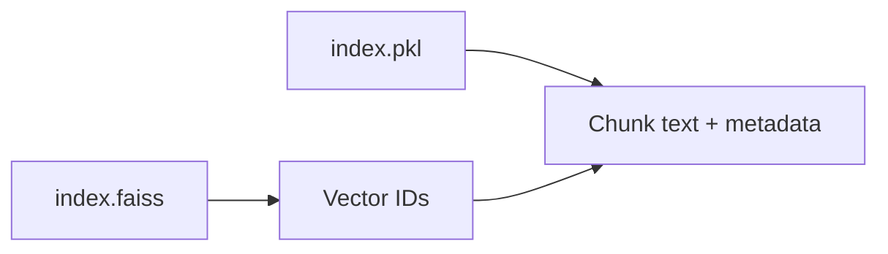

Why two files:

| File | Purpose |
|---|---|
| `index.faiss` | Stores vectors for similarity search |
| `index.pkl` | Stores document text and mapping from vector ID to document |

Interview answer:

```text
FAISS stores vectors, while the pickle file stores document text and metadata. After FAISS returns IDs, AcadAI maps those IDs back to readable evidence chunks.
```

Inspected fact:

```text
The existing pickle contains 12,263 document entries.
```

---

## 22. L2 Distance vs Inner Product

FAISS can use different distance metrics.

L2 distance:

```text
distance(A, B) = sqrt((A1-B1)^2 + (A2-B2)^2 + ... + (An-Bn)^2)
```

Inner product:

```text
inner_product(A, B) = A dot B
```

Meaning:

| Metric | Better score |
|---|---|
| L2 distance | Smaller is better |
| Inner product | Larger is better |

AcadAI code handles this:

```python
if metric_type == faiss.METRIC_INNER_PRODUCT:
    return (scores - mn) / (mx - mn + 1e-9)
inv = 1.0 / (1.0 + np.maximum(scores, 0))
```

Interview answer:

```text
AcadAI normalizes FAISS scores differently depending on whether the index uses inner product or L2 distance, because larger is better for inner product but smaller is better for L2.
```

---

## 23. Score Normalization

Why normalize:

FAISS raw scores and TF-IDF scores may be on different scales. To combine them, AcadAI converts dense scores toward a 0 to 1 range.

Formula for min-max normalization:

```text
normalized = (score - min_score) / (max_score - min_score + epsilon)
```

Code:

```python
mn, mx = float(scores.min()), float(scores.max())
return (scores - mn) / (mx - mn + 1e-9)
```

Why epsilon:

```text
1e-9 prevents division by zero when max_score equals min_score.
```

Interview answer:

```text
Score normalization makes different scoring signals comparable before combining them in hybrid reranking.
```

---

## 24. Keyword Overlap

Code:

```python
def keyword_overlap(query: str, text: str) -> float:
    query_terms = {t for t in tokenize(query) if len(t) > 2}
    return len(query_terms & set(tokenize(text))) / len(query_terms)
```

Formula:

```text
keyword_overlap = matching_query_terms / total_query_terms
```

Example:

```text
Query terms: {dbms, normalization, example}
Chunk terms: {normalization, reduces, redundancy, dbms}

Matches: {dbms, normalization}
Overlap = 2 / 3 = 0.67
```

Why used:

It prevents semantically close but topically wrong chunks from winning.

Interview answer:

```text
Keyword overlap is a simple guardrail that checks how many important query terms actually appear in the retrieved text.
```

---

## 25. Query Expansion

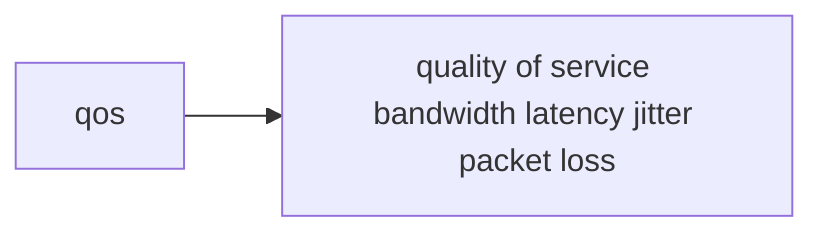

Code idea:

```python
ACADEMIC_SYNONYMS = {
    "qos": "quality of service bandwidth latency jitter packet loss ..."
}
```

Why:

Students may type abbreviations like:

- DBMS
- OS
- CN
- QoS
- subnet

The app expands these to related academic terms.

Interview answer:

```text
Query expansion improves retrieval by adding synonyms, full forms, and related academic terms before vector or lexical search.
```

Important:

AcadAI has rule-based expansion and optional Mistral-based expansion.

---

## 26. Subject Detection

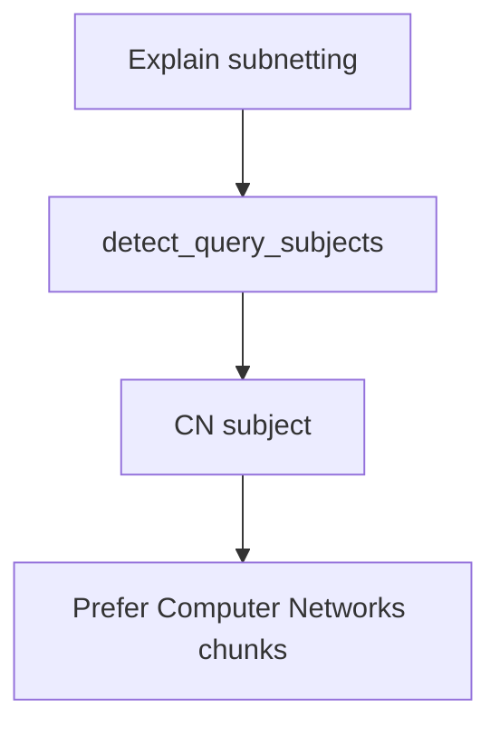

Subject detection checks keywords for subjects like:

- CN
- OS
- DBMS
- DSA
- Python
- Web
- Software Engineering
- ML

Why:

If a query clearly belongs to CN, DBMS, or OS, unrelated chunks should be down-ranked or filtered.

Interview answer:

```text
AcadAI uses lightweight keyword-based subject detection to filter or boost chunks from the expected academic subject.
```

---

## 27. Source Subject Boost

Code idea:

```python
if any(alias in source_filename for alias in subject_aliases):
    score += 0.12
```

Meaning:

If the filename hints at the subject, it receives a small boost.

Example:

```text
Query: "What is deadlock?"
Source: "operating_system_notes.pdf"
Boost: OS source gets a relevance boost
```

Interview answer:

```text
Source subject boost uses filename or folder hints as a soft signal, not a hard rule, to improve ranking.
```

---

## 28. Hybrid Reranking

AcadAI combines multiple signals.

Code:

```python
hybrid = 0.45 * dense_norm + 0.40 * lexical + 0.15 * overlaps
```

Formula:

```text
hybrid_score =
0.45 * dense_similarity
+ 0.40 * lexical_similarity
+ 0.15 * keyword_overlap
+ subject/source boosts
```

Diagram:

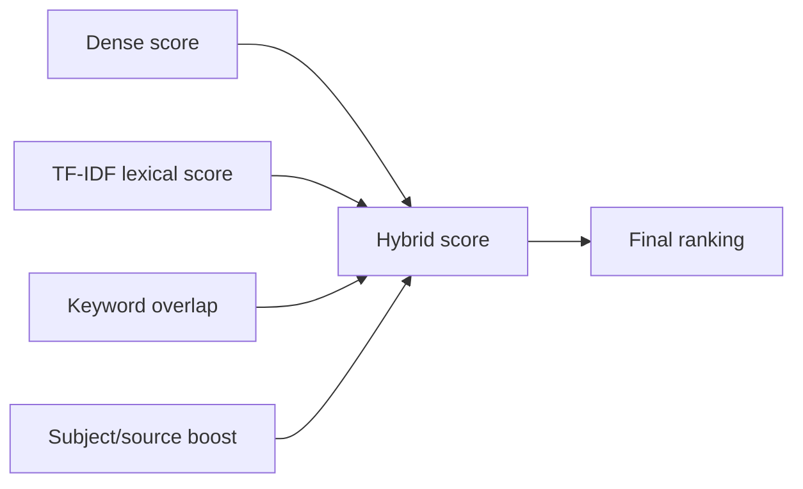

Why these weights:

Dense score captures meaning. Lexical score keeps exact terms. Overlap acts as a simple relevance guard. Boosts help subject-specific queries.

Interview answer:

```text
Hybrid reranking combines semantic similarity, keyword similarity, direct term overlap, and subject hints so retrieval is both meaning-aware and keyword-precise.
```

Common follow-up:

```text
Are the weights learned?
```

Answer:

```text
No. They are heuristic weights chosen in code. In production I would tune them using a labeled retrieval evaluation set.
```

---

## 29. Worked Hybrid Score Example

Suppose:

```text
dense_norm = 0.80
lexical = 0.50
overlap = 0.40
source_boost = 0.12
```

Formula:

```text
hybrid = 0.45*0.80 + 0.40*0.50 + 0.15*0.40 + 0.12
       = 0.36 + 0.20 + 0.06 + 0.12
       = 0.74
```

Meaning:

This chunk is likely relevant because it has good semantic similarity, decent keyword match, and source metadata support.

Interview answer:

```text
The hybrid score is a weighted relevance score. Higher score means the chunk is more likely to be useful as evidence.
```

---

## 30. Top-k Retrieval

Top-k means:

```text
Return the best k results.
```

Example:

```text
top_k = 8
Return top 8 chunks after ranking
```

AcadAI default:

```python
DEFAULT_TOP_K = 8
```

Why not return everything:

Too much evidence adds noise and increases prompt size.

Why not return only one:

One chunk may be incomplete.

Interview answer:

```text
Top-k retrieval controls how many evidence chunks are passed to the answer generator. It balances context coverage and noise.
```

---

## 31. Candidate-k vs Top-k

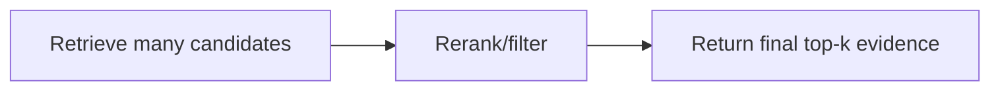

Meaning:

```text
candidate_k = how many chunks to consider before reranking
top_k = how many chunks to finally use
```

AcadAI:

```python
DEFAULT_CANDIDATE_K = 100
DEFAULT_TOP_K = 8
```

Interview answer:

```text
AcadAI retrieves a larger candidate pool, reranks it with hybrid signals, and returns a smaller final top-k evidence set.
```

---

## 32. Cross-Encoder Reranking

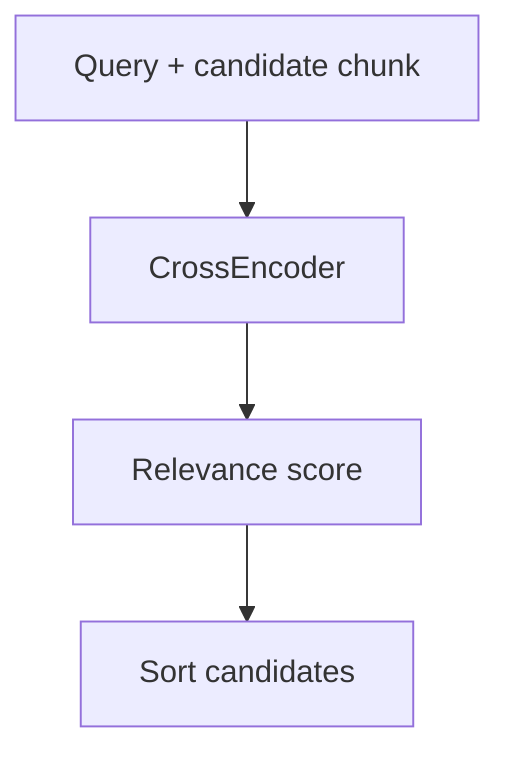

Bi-encoder vs cross-encoder:

| Model | How it works | Speed | Accuracy |
|---|---|---|---|
| Bi-encoder/SentenceTransformer | Encodes query and docs separately | Faster | Good |
| Cross-encoder | Reads query and chunk together | Slower | Often better |

AcadAI code:

```python
pairs = [[query, r["text"]] for r in rows]
ce_scores = reranker.predict(pairs)
```

Interview answer:

```text
A CrossEncoder reranker scores the query and candidate chunk together, which can improve ranking quality but costs more compute, so it is optional.
```

---

## 33. Retrieval Guard

Why needed:

Sometimes retrieval returns weak or unrelated chunks.

Code idea:

```python
if best_overlap_guard < 0.08 and best_hybrid_guard < min_hybrid_score:
    add retrieval warning to evidence
```

Meaning:

If both keyword overlap and hybrid confidence are low, the app warns the Tutor Agent that evidence may be weak.

Interview answer:

```text
The retrieval guard prevents the model from confidently answering when the retrieved evidence appears weak.
```

---

## 34. Grounding Score

Grounding asks:

```text
How much of the generated answer is supported by retrieved evidence?
```

Formula:

```text
grounding_score = supported_sentences / total_answer_sentences * 100
```

Code:

```python
score = round((supported / max(1, len(sents))) * 100, 1)
```

Diagram:

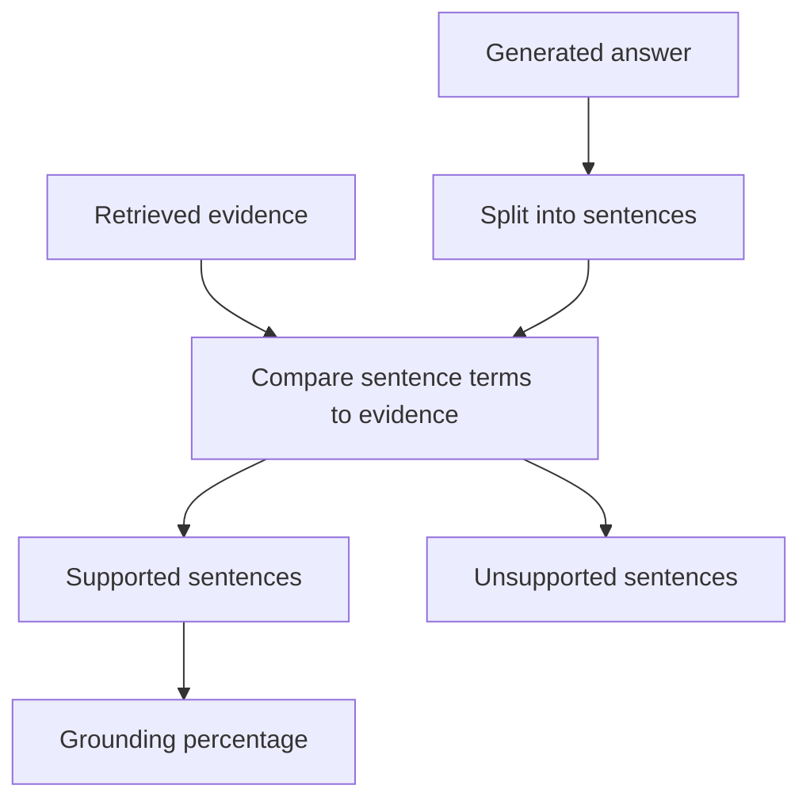

Interview answer:

```text
AcadAI computes grounding by checking how many answer sentences have enough lexical support in the retrieved evidence.
```

Important limitation:

```text
Grounding is not perfect truth verification. It is a support check based on overlap with evidence.
```

---

## 35. Sentence Support Logic

Code idea:

```python
overlap = keyword_overlap(sent, evidence_text)
support_ratio = evidence_hits / number_of_sentence_terms
if overlap >= 0.18 or support_ratio >= 0.28:
    supported += 1
```

Meaning:

A sentence is supported if:

```text
keyword overlap is at least 0.18
OR
support ratio is at least 0.28
```

Easy explanation:

If enough important words from the answer sentence appear in the evidence, the sentence is counted as supported.

Interview answer:

```text
AcadAI marks a sentence as supported when it has enough token overlap with the retrieved evidence, using threshold-based lexical checks.
```

---

## 36. Grounding Status Thresholds

Code:

```python
status = "Strongly grounded" if score >= 75 else "Partially grounded" if score >= 45 else "Weakly grounded"
```

Thresholds:

| Score | Status |
|---:|---|
| >= 75 | Strongly grounded |
| 45 to 74.9 | Partially grounded |
| < 45 | Weakly grounded |

Interview answer:

```text
AcadAI converts grounding percentage into an easy label: strongly, partially, or weakly grounded.
```

---

## 37. Critic Agent Scoring

Critic dimensions:

```text
relevance
completeness
accuracy
clarity
overall
```

When Mistral works:

The Critic Agent asks Mistral to return JSON scores.

Fallback math:

```python
rel = min(10.0, 5 + keyword_overlap(query, answer) * 10)
comp = min(10.0, 4 + words / 80)
acc = 7.5
cla = 7.0 + example_bonus + citation_bonus
overall = average(rel, comp, acc, cla)
```

Interview answer:

```text
The Critic Agent uses Mistral scoring when available, and falls back to heuristic scoring based on overlap, answer length, examples, and citations.
```

Important:

Critic score is not a human evaluation. It is an automated quality estimate.

---

## 38. Worked Critic Fallback Example

Suppose:

```text
relevance = 8
completeness = 7
accuracy = 7.5
clarity = 8
```

Formula:

```text
overall = (8 + 7 + 7.5 + 8) / 4
overall = 30.5 / 4
overall = 7.6
```

If overall >= 7:

```text
satisfactory = true
```

Interview answer:

```text
The fallback overall score is the average of relevance, completeness, accuracy, and clarity.
```

---

## 39. Refinement Loop

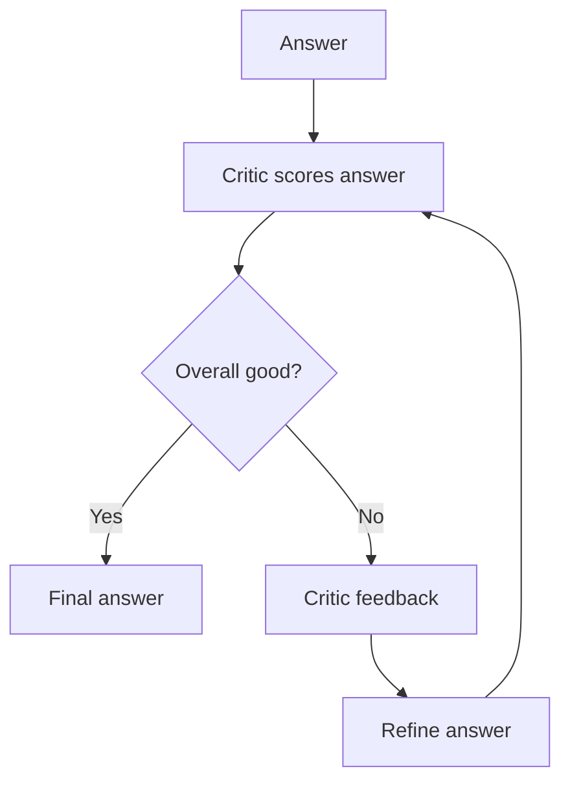

Stop conditions:

```text
Stop if satisfactory.
Stop if max_refine reached.
Stop if no feedback exists.
```

Interview answer:

```text
AcadAI uses a bounded refinement loop, so the answer can improve based on critic feedback without risking infinite retries.
```

---

## 40. Retrieval Evaluation Hit Rate

Code:

```python
hit_rate = round((df_eval["Hit"] == "Yes").mean() * 100, 1)
```

Formula:

```text
hit_rate = correct_queries / total_queries * 100
```

Example:

```text
10 test queries
8 top results match expected subject
hit_rate = 8 / 10 * 100 = 80%
```

Interview answer:

```text
The Evaluation tab checks whether the top retrieved chunk matches the expected subject and reports hit rate.
```

Important:

This is not a full production benchmark. It is an interactive retrieval sanity check.

---

## 41. Precision@K, Recall@K, MRR, nDCG

These are not fully implemented as formulas in the current app, but interviewers may ask.

```mermaid
flowchart TD
    EvalMetrics[Retrieval Metrics] --> Precision[Precision@K]
    EvalMetrics --> Recall[Recall@K]
    EvalMetrics --> MRR[MRR]
    EvalMetrics --> NDCG[nDCG]
```

Precision@K:

```text
Precision@K = relevant_results_in_top_k / k
```

Recall@K:

```text
Recall@K = relevant_results_in_top_k / total_relevant_results
```

MRR:

```text
MRR = average(1 / rank_of_first_relevant_result)
```

nDCG:

```text
nDCG measures whether highly relevant results appear near the top.
```

Safe answer:

```text
The current app implements a simple hit-rate dashboard. For production evaluation, I would add Precision@K, Recall@K, MRR, and nDCG over a labeled query set.
```

---

## 42. Adaptive Difficulty

Code:

```python
avg = sum(scores) / len(scores)
if avg >= 8:
    return "advanced"
if avg <= 5:
    return "beginner"
return "intermediate"
```

Formula:

```text
average_score = sum(last_quiz_scores) / number_of_scores
```

Rule:

| Average score | Difficulty |
|---:|---|
| >= 8 | advanced |
| <= 5 | beginner |
| otherwise | intermediate |

Interview answer:

```text
AcadAI uses recent quiz scores to recommend difficulty: high average moves to advanced, low average moves to beginner, otherwise intermediate.
```

---

## 43. Weak Topic Tracking

Code:

```python
weak[topic] = int(weak.get(topic, 0)) + amount
```

Meaning:

Every time the user struggles with a topic, its count increases.

When it updates:

- Low grounding score
- Low viva score

Interview answer:

```text
Weak topic tracking is a simple counter-based personalization method stored in session state.
```

Important:

This is not machine learning. It is rule-based tracking.

---

## 44. Web Search Scoring

Web fallback does not use mathematical vector ranking in AcadAI.

Flow:

```mermaid
flowchart TD
    Query --> DuckDuckGo[DuckDuckGo HTML search]
    DuckDuckGo --> Results[Parsed result snippets]
    Results --> Enough{Enough results?}
    Enough -->|No| Wikipedia[Wikipedia search API]
    Enough -->|Yes| Return[Return top snippets]
```

Interview answer:

```text
Web fallback is not vector search. It scrapes DuckDuckGo result snippets and falls back to Wikipedia search results when needed.
```

---

## 45. RAG Prompt Math: Why Evidence Reduces Hallucination

RAG does not use a single mathematical formula, but the reasoning is:

```text
LLM answer quality depends on prompt context.
Better retrieved context -> more grounded answer.
```

Diagram:

```mermaid
flowchart LR
    NoEvidence[Question only] --> HigherRisk[Higher hallucination risk]
    Evidence[Question + retrieved evidence] --> LowerRisk[Lower hallucination risk]
```

Interview answer:

```text
RAG reduces hallucination by conditioning the LLM on retrieved evidence, but it does not eliminate hallucination, so AcadAI adds critic and grounding checks.
```

---

## 46. Why Hybrid Search Is Better Than Only Semantic Search

Semantic search strength:

```text
Understands meaning.
```

Semantic search weakness:

```text
May retrieve conceptually related but wrong-subject chunks.
```

TF-IDF strength:

```text
Good for exact academic terms.
```

TF-IDF weakness:

```text
Misses synonyms and paraphrases.
```

Hybrid solution:

```text
Use both.
```

Interview answer:

```text
AcadAI uses hybrid search because dense retrieval captures meaning while TF-IDF and keyword overlap preserve exact academic terms.
```

---

## 47. Complete Math Flow for One Query

```mermaid
sequenceDiagram
    participant User
    participant TFIDF as TF-IDF/Cosine
    participant Embed as SentenceTransformer
    participant FAISS
    participant Hybrid
    participant LLM as Mistral
    participant Ground as Grounding
    User->>Embed: encode expanded query
    Embed->>FAISS: search nearest vectors
    FAISS-->>Hybrid: dense candidates
    User->>TFIDF: lexical score over candidates
    TFIDF-->>Hybrid: lexical similarity
    Hybrid->>Hybrid: dense + lexical + overlap + boosts
    Hybrid-->>LLM: top-k evidence
    LLM-->>Ground: generated answer
    Ground-->>User: grounding score + answer
```

Simple explanation:

1. Query is cleaned and expanded.
2. Query becomes an embedding.
3. FAISS finds candidate chunks.
4. TF-IDF checks lexical similarity.
5. Keyword overlap checks direct term coverage.
6. Hybrid formula ranks candidates.
7. Top-k evidence goes to Mistral.
8. Grounding score checks answer support.

Interview answer:

```text
The query flows through semantic retrieval, lexical reranking, hybrid scoring, LLM generation, and grounding validation.
```

---

## 48. Whiteboard Formula Sheet

Use this if asked to write formulas.

```text
TF(term, doc) = count(term in doc) / total terms in doc

IDF(term) = log(total_docs / docs_containing_term)

TF-IDF = TF * IDF

cosine(A, B) = (A dot B) / (||A|| * ||B||)

A dot B = sum(Ai * Bi)

||A|| = sqrt(sum(Ai^2))

normalized = (score - min) / (max - min + epsilon)

keyword_overlap = matching_query_terms / total_query_terms

hybrid_score = 0.45*dense + 0.40*lexical + 0.15*overlap + boosts

grounding_score = supported_sentences / total_sentences * 100

hit_rate = correct_top_subject_matches / total_queries * 100

average_quiz_score = sum(scores) / number_of_scores
```

Interview answer:

```text
These are the core formulas behind AcadAI retrieval, reranking, grounding, and evaluation.
```

---

## 49. Super Simple Explanations to Memorize

```mermaid
flowchart TD
    Simple[Simple Memory Map] --> TFIDF[TF-IDF: important words]
    Simple --> Cosine[Cosine: vector direction similarity]
    Simple --> Embedding[Embedding: meaning as numbers]
    Simple --> FAISS[FAISS: fast nearest vectors]
    Simple --> Hybrid[Hybrid: combine signals]
    Simple --> Grounding[Grounding: answer supported by evidence]
```

Memorize these one-liners:

1. TF-IDF finds important words in chunks.
2. Cosine similarity compares vector direction.
3. Embeddings convert meaning into numbers.
4. Semantic search compares meaning, not just exact words.
5. FAISS quickly finds nearest stored vectors.
6. Top-k means return the best k chunks.
7. Hybrid search combines semantic and keyword relevance.
8. Keyword overlap is a simple evidence relevance check.
9. Grounding score measures how much of the answer is supported by evidence.
10. Hit rate measures how often the top result matches the expected subject.

---

## 50. Interview Q&A: Ground-Level Techniques

| Question | Simple Answer |
|---|---|
| What is TF-IDF? | A way to give high weight to words important in one chunk but rare across all chunks. |
| Why use TF-IDF? | It is strong for exact academic terms and works without embeddings. |
| What is cosine similarity? | A measure of how similar two vectors are by comparing their direction. |
| Why cosine similarity? | It compares meaning/term pattern without being dominated by vector length. |
| What is semantic search? | Search by meaning using embeddings. |
| What is an embedding? | A dense numeric vector representing text meaning. |
| What is FAISS? | A fast local library for nearest-neighbor vector search. |
| What is top-k? | The best k results after ranking. |
| What is candidate-k? | A larger pool retrieved before reranking. |
| What is hybrid search? | Combining dense semantic score, lexical score, overlap, and boosts. |
| Why hybrid search? | Dense search captures meaning; lexical search protects exact academic terms. |
| What is keyword overlap? | Fraction of query terms found in a chunk. |
| What is grounding? | Checking whether generated answer sentences are supported by evidence. |
| Is grounding perfect? | No, it is a lexical support check, not human fact verification. |
| What is CrossEncoder reranking? | A model that scores query and chunk together for better relevance. |
| Why optional CrossEncoder? | It improves ranking but uses more compute. |
| What is score normalization? | Converting scores to comparable ranges before combining them. |
| What is hit rate? | Percentage of test queries where top result matches expected subject. |
| Did you implement BM25? | No. TF-IDF is implemented; BM25 would be a future improvement. |
| Did you train embeddings? | No. AcadAI uses pretrained SentenceTransformer embeddings. |

---

## 51. Questions That Try to Trap You

```mermaid
flowchart TD
    Trap[Trap Questions] --> Overclaim[Do not overclaim]
    Trap --> Honest[State current implementation]
    Trap --> Future[Then say future improvement]
```

| Trap Question | Safe Answer |
|---|---|
| Did you use BM25? | No, the app uses TF-IDF. BM25 would be a good future upgrade. |
| Did you train the embedding model? | No, it uses a pretrained SentenceTransformer model. |
| Are uploaded PDFs inserted into FAISS? | No, uploaded PDFs are chunked and searched with TF-IDF in the current app. |
| Is grounding the same as truth verification? | No, it checks evidence support using lexical overlap. |
| Is the hybrid score learned? | No, it is a heuristic weighted formula. |
| Does RAG eliminate hallucination? | No, it reduces hallucination risk and grounding checks help detect weak support. |
| Is CrossEncoder always on? | No, it is optional because it costs more compute. |
| Does FAISS store metadata? | FAISS stores vectors; metadata is stored separately in `index.pkl`. |
| Is ChromaDB used? | No, FAISS is the implemented vector store. |
| Is MongoDB used for memory? | No, memory is stored in Streamlit session state. |

---

## 52. Final 30-Second Math Explanation

```mermaid
flowchart LR
    Text --> Numbers[Vectors]
    Numbers --> Compare[Similarity]
    Compare --> Rank[Rank chunks]
    Rank --> Evidence[Top evidence]
    Evidence --> Answer[Grounded answer]
```

Say this:

```text
The math behind AcadAI is simple. Text is converted into vectors. TF-IDF creates sparse keyword vectors, and SentenceTransformers creates dense semantic vectors. Cosine similarity and FAISS compare the query with document chunks. Then AcadAI combines dense similarity, lexical similarity, keyword overlap, and subject boosts into a hybrid score. The top chunks are passed to Mistral, and the final answer is checked using a grounding score based on sentence-level evidence support.
```

That answer is enough for most interviewers.

