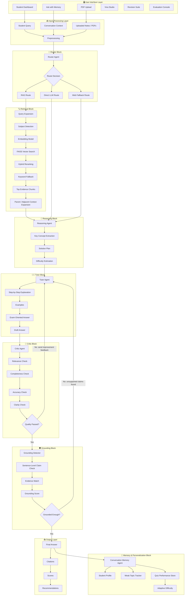
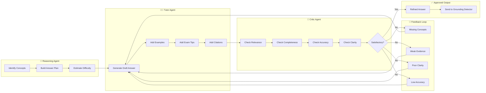
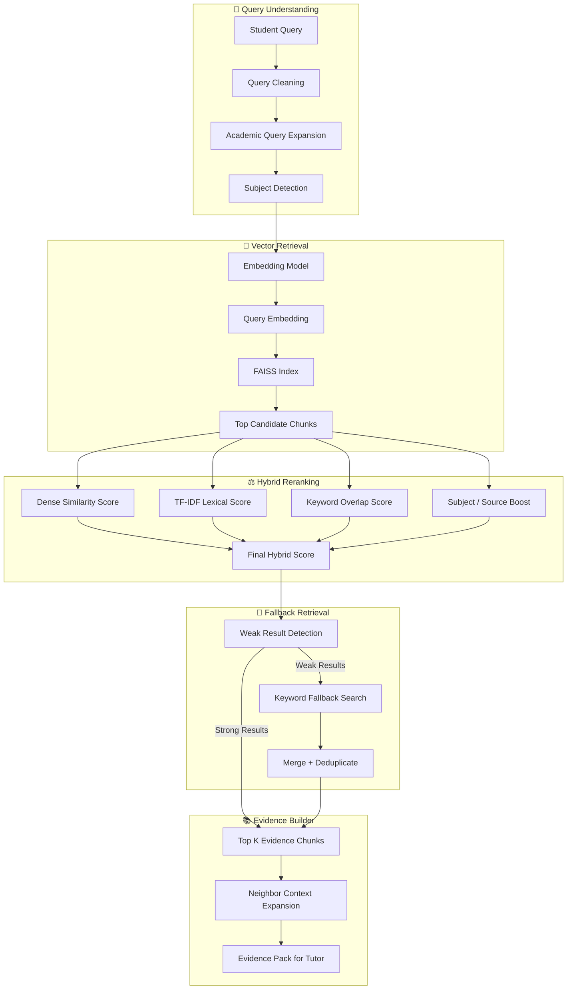
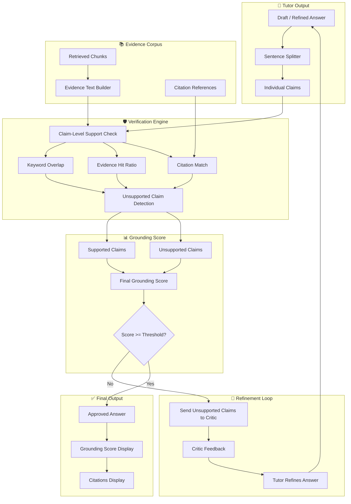
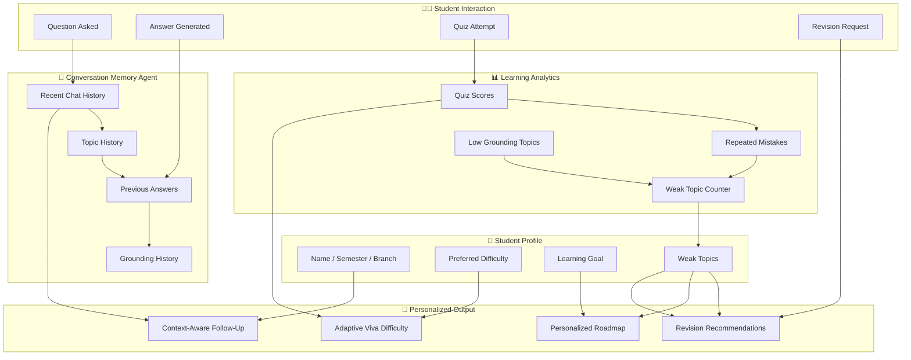
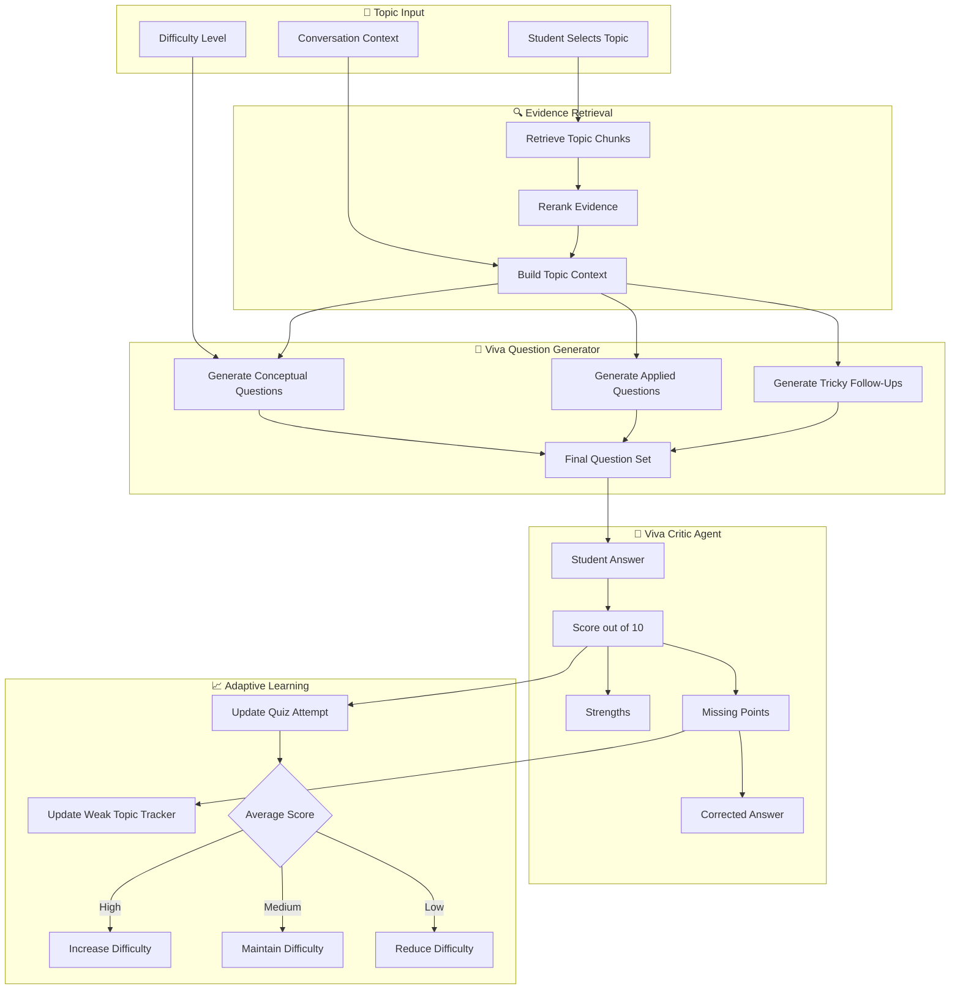
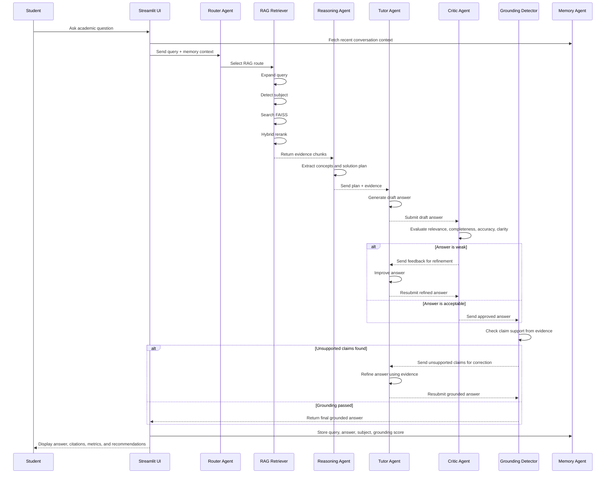
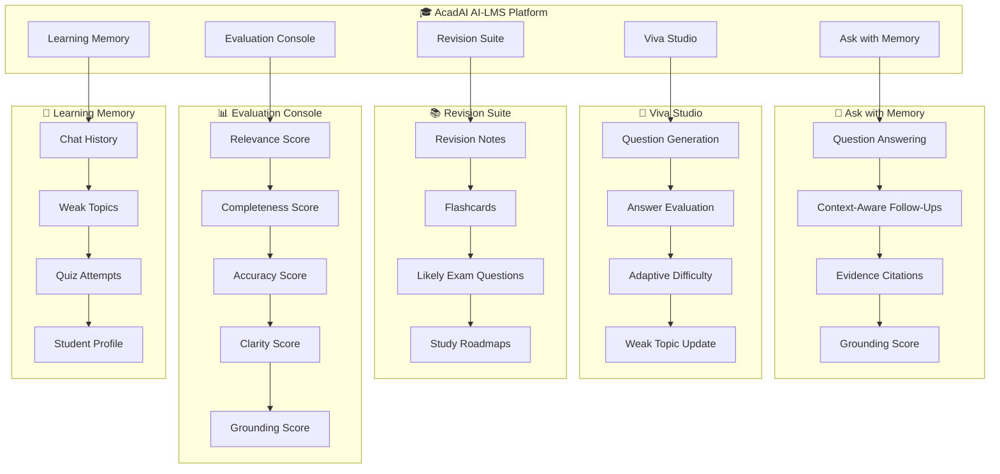

# 🎓 AcadAI  
## Multi-Agent System for Personalized Academic Learning & Assistance


---

## 📌 Project Summary

**AcadAI** is a multi-agent AI learning platform that helps students learn from their own academic material. It combines **Large Language Models**, **Retrieval-Augmented Generation**, **FAISS vector search**, **conversation memory**, **viva/quiz evaluation**, and **hallucination detection** to produce syllabus-aligned, evidence-grounded, exam-oriented academic answers.

Unlike a generic chatbot, AcadAI retrieves relevant content from uploaded notes, evaluates answer quality through a critic loop, verifies grounding against evidence, and adapts learning support using student memory and weak-topic tracking.

---

## 🚀 Why AcadAI?

Most AI tools are powerful but not optimized for college learning.

They often:

- Generate generic answers
- Ignore syllabus and lecture notes
- Hallucinate unsupported facts
- Lack exam-oriented structure
- Do not track student progress
- Do not provide viva-style evaluation

AcadAI solves these issues by using a **multi-agent academic workflow** where every answer is retrieved, reasoned, taught, reviewed, verified, and stored for personalization.

---

## 🎯 Objectives

- Build a personalized AI academic assistant for B.Tech students
- Ground answers using syllabus, notes, PDFs, and scanned documents
- Implement a multi-agent pipeline with Router, Reasoning, Tutor, Critic, and Memory agents
- Reduce hallucination using evidence verification and grounding score
- Support viva preparation, quiz evaluation, flashcards, revision notes, and roadmaps
- Provide a professional AI-LMS experience using Streamlit

---

## ✨ Key Features

| Feature | Description |
|---|---|
| 📚 Notes-Based Q&A | Answers questions using uploaded academic notes |
| 🔍 RAG Retrieval | Retrieves relevant chunks using FAISS vector search |
| 🤖 Multi-Agent Pipeline | Router, Reasoning, Tutor, Critic, Grounding, and Memory agents |
| 🧠 Conversation Memory | Supports follow-up questions using previous context |
| 🛡 Hallucination Detection | Checks whether answer claims are supported by evidence |
| 🎤 Viva / Quiz Mode | Generates viva questions and evaluates student answers |
| 📈 Weak Topic Tracker | Tracks weak topics based on quiz and answer quality |
| 📝 Revision Suite | Generates revision notes, flashcards, likely exam questions, and roadmaps |
| 📊 Evaluation Dashboard | Shows relevance, completeness, accuracy, clarity, and grounding |
| ⚡ Lightweight Retrieval | Uses local FAISS + hybrid reranking for practical laptop use |

---

# 🏗 System Architecture

## 1. Complete Block-Level Architecture



---

## 2. Multi-Agent Refinement Loop

The **Critic Agent does not simply approve or reject the answer**. If the answer is incomplete, unclear, unsupported, or inaccurate, the Critic sends feedback back to the Tutor Agent. The Tutor then refines the answer and submits it again for evaluation.



---

## 3. RAG Retrieval Pipeline

AcadAI uses a hybrid retrieval system. It does not rely only on vector similarity. It combines semantic search, lexical matching, keyword overlap, subject boosting, and fallback retrieval.



---

## 4. Grounding & Hallucination Detection Flow

The grounding layer checks whether the generated answer is supported by retrieved evidence. If unsupported claims are found, the answer goes back to the Tutor Agent for refinement.



---

## 5. Memory & Personalization Architecture

AcadAI stores learning context so that future answers become more personalized.



---

## 6. Viva / Quiz Mode Architecture

The Viva Studio generates questions from retrieved evidence, evaluates student answers, tracks weak topics, and adapts difficulty.



---

## 7. End-to-End Sequence Diagram



---

## 8. Full AI-LMS Feature Map



---

# ⚙️ Tech Stack

| Layer | Technology |
|---|---|
| UI | Streamlit |
| Language | Python |
| LLM | Mistral API |
| Vector Store | FAISS |
| Embeddings | Sentence Transformers |
| Retrieval | Dense + Lexical + Keyword Hybrid Retrieval |
| Reranking | Lightweight Cross Encoder |
| PDF Parsing | PyPDF |
| Web Fallback | DuckDuckGo / Wikipedia fallback |
| Data Processing | NumPy, Pandas, Scikit-learn |
| Environment | `.env` configuration |

---

# 📂Project Structure

```text
AcadAI/
├── acadai_app.py
├── AcadAI_FAISS_STORE/
│   ├── index.faiss
│   └── index.pkl
├── assets/
│   ├── workflow.png
│   ├── architecture.png
│   └── screenshots/
├── requirements.txt
├── .env.example
├── README.md
└── docs/
    ├── architecture.md
    ├── retrieval.md
    └── agents.md
```

---

# 🚀 Installation

```bash
git clone https://github.com/your-username/AcadAI.git
cd AcadAI
```

```bash
python -m venv .venv
```

```bash
.venv\Scripts\activate
```

```bash
pip install -r requirements.txt
```

Create a `.env` file:

```env
MISTRAL_API_KEY=your_mistral_api_key_here
MISTRAL_MODEL=mistral-large-latest
FAISS_STORE_DIR=./AcadAI_FAISS_STORE
```

Run the app:

```bash
streamlit run acadai_app.py
```

---

# 📊 Evaluation Metrics

AcadAI evaluates every answer using:

| Metric | Purpose |
|---|---|
| Relevance | Checks whether answer matches the question |
| Completeness | Checks whether answer covers required concepts |
| Accuracy | Checks factual correctness |
| Clarity | Checks explanation quality |
| Grounding Score | Checks support from retrieved evidence |
| Evidence Used | Number of retrieved chunks used |
| Response Time | Time taken by the pipeline |

---

# 🔮 Future Enhancements

- OCR pipeline for handwritten/scanned notes
- Diagram understanding
- Voice-based viva mode
- Subject-wise knowledge graph
- LangGraph-based agent orchestration
- Multi-modal learning with images and diagrams
- YouTube lecture grounding
- Offline local LLM support
- Student dashboard with long-term progress analytics

---

# ⭐ Project Vision

AcadAI aims to become a personalized academic intelligence platform that helps students learn from their own material, prepare for exams, practice viva, revise efficiently, and trust AI-generated answers through evidence-grounded learning.
